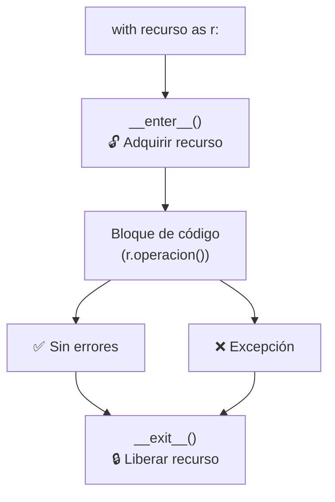
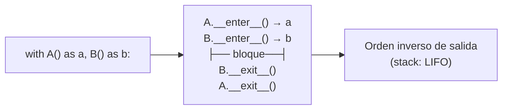
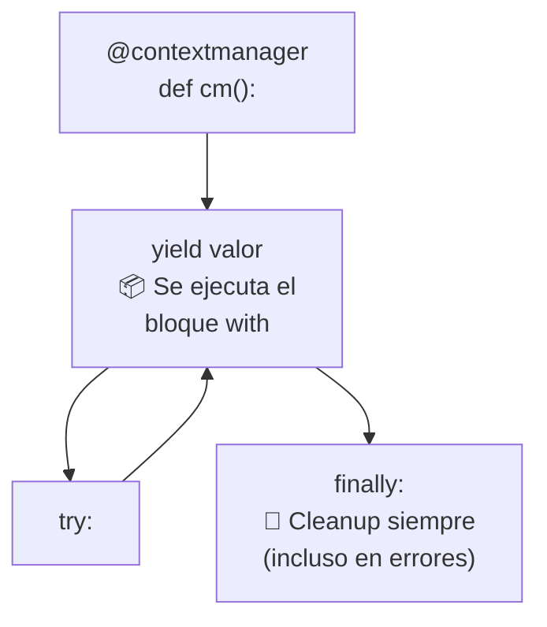
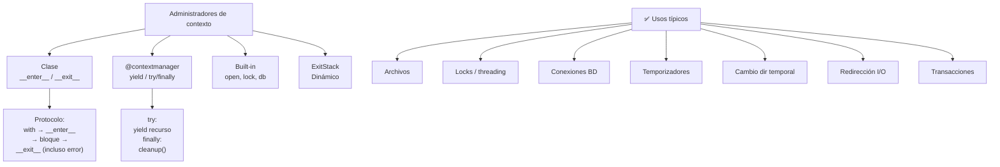

# Administradores de contexto (Context Manager)

Los **administradores de contexto** permiten gestionar recursos (archivos, conexiones, locks) de forma segura, asegurando que se liberen automáticamente al salir del bloque `with`.



**Sin context manager:**
```python
archivo = open("datos.txt", "w")
archivo.write("hola")
archivo.close()  # ❌ Si falla antes, el archivo queda abierto
```

**Con context manager:**
```python
with open("datos.txt", "w") as archivo:
    archivo.write("hola")
# ✅ Se cierra automáticamente, incluso si hay error
```

---

## La sentencia `with`

Sintaxis básica:

```python
with expresion_contexto as variable:
    # bloque de código
    pass
# → variable ya no está disponible aquí
```

Múltiples contextos en paralelo:

```python
# Varios recursos
with open("entrada.txt") as entrada, open("salida.txt", "w") as salida:
    salida.write(entrada.read())

# Equivalente anidado (más legible para 2+):
with open("entrada.txt") as entrada:
    with open("salida.txt", "w") as salida:
        salida.write(entrada.read())
```



---

## Protocolo de context manager

Un objeto se vuelve context manager implementando `__enter__` y `__exit__`.

```python
class MiArchivo:
    def __init__(self, nombre, modo):
        self.nombre = nombre
        self.modo = modo
        self.archivo = None

    def __enter__(self):
        print(f"→ Abriendo {self.nombre}")
        self.archivo = open(self.nombre, self.modo)
        return self.archivo  # lo que se asigna a `as`

    def __exit__(self, exc_type, exc_val, exc_tb):
        print(f"← Cerrando {self.nombre}")
        if self.archivo:
            self.archivo.close()
        # Retornar False → propaga excepciones
        # Retornar True  → suprime excepciones
        return False

with MiArchivo("test.txt", "w") as f:
    f.write("contenido")

# Salida:
# → Abriendo test.txt
# ← Cerrando test.txt
```

### Parámetros de `__exit__`

```python
def __exit__(self, exc_type, exc_val, exc_tb):
    """
    exc_type: clase de la excepción (o None)
    exc_val: instancia de la excepción (o None)
    exc_tb: traceback (o None)
    """
    if exc_type is ValueError:
        print(f"Error manejado: {exc_val}")
        return True   # ✅ suprime la excepción
    return False       # ❌ propaga la excepción
```

| Valor retornado | Comportamiento |
|---|---|
| `False` (default) | Propaga la excepción al llamador |
| `True` | Suprime la excepción (no se propaga) |

---

## Administradores de contexto built-in

### Archivos

```python
with open("archivo.txt", "r") as f:
    contenido = f.read()
# f.close() llamado automáticamente
```

### Locks (threading)

```python
from threading import Lock

lock = Lock()
with lock:
    # sección crítica
    pass
# lock.release() llamado automáticamente
```

### Conexiones (base de datos)

```python
import sqlite3

with sqlite3.connect("db.sqlite") as conn:
    cursor = conn.cursor()
    cursor.execute("SELECT 1")
# conn.close() llamado automáticamente
```

### Redirección de stdout

```python
from contextlib import redirect_stdout
import io

buffer = io.StringIO()
with redirect_stdout(buffer):
    print("Esto va al buffer")
print(buffer.getvalue())  # "Esto va al buffer\n"
```

### Decimal context

```python
from decimal import Decimal, localcontext

with localcontext() as ctx:
    ctx.prec = 50  # precisión de 50 dígitos
    resultado = Decimal(1) / Decimal(7)
print(resultado)  # 0.1428571428571428571428571429... (50 dígitos)
```

---

## `contextlib` — herramientas para context managers

```python
from contextlib import contextmanager, closing, suppress, ExitStack
```

### `@contextmanager` (generador)

La forma más fácil de crear un context manager: decorar un generador con un `try/finally`.

```python
from contextlib import contextmanager

@contextmanager
def abrir_archivo(nombre, modo):
    print("→ Setup: abriendo archivo")
    archivo = open(nombre, modo)
    try:
        yield archivo  # esto corre dentro del bloque with
    finally:
        print("← Cleanup: cerrando archivo")
        archivo.close()

with abrir_archivo("test.txt", "w") as f:
    f.write("datos")

# Salida:
# → Setup: abriendo archivo
# ← Cleanup: cerrando archivo
```



### Manejo de excepciones con `@contextmanager`

```python
@contextmanager
def tolerar_error(tipo_error):
    try:
        yield
    except tipo_error:
        print(f"Error ignorado: {tipo_error.__name__}")

with tolerar_error(ValueError):
    raise ValueError("este error se ignora")
print("✅ Continuamos aquí")
```

### `closing`

Asegura que un objeto con método `close()` se cierre al salir.

```python
from contextlib import closing
from urllib.request import urlopen

with closing(urlopen("https://python.org")) as pagina:
    contenido = pagina.read()
# pagina.close() llamado automáticamente
```

### `suppress`

Ignora tipos específicos de excepción.

```python
from contextlib import suppress

with suppress(FileNotFoundError):
    os.remove("archivo_que_no_existe.txt")
# ✅ No lanza error, simplemente no hace nada
```

### `ExitStack`

Maneja un número dinámico de context managers.

```python
from contextlib import ExitStack

archivos = ["a.txt", "b.txt", "c.txt"]

with ExitStack() as stack:
    handles = [stack.enter_context(open(f, "w")) for f in archivos]
    handles[0].write("contenido")
# Todos los archivos se cierran al salir, incluso si hay errores
```

---

## Casos de uso comunes

### Temporizador

```python
import time
from contextlib import contextmanager

@contextmanager
def temporizador(nombre=""):
    inicio = time.time()
    try:
        yield
    finally:
        duracion = time.time() - inicio
        print(f"⏱ {nombre}: {duracion:.4f}s")

with temporizador("operación lenta"):
    sum(range(10_000_000))
# ⏱ operación lenta: 0.3521s
```

### Cambio temporal de directorio

```python
import os
from contextlib import contextmanager

@contextmanager
def cambiar_dir(ruta):
    cwd = os.getcwd()
    os.chdir(ruta)
    try:
        yield
    finally:
        os.chdir(cwd)

print(os.getcwd())  # /home/user
with cambiar_dir("/tmp"):
    print(os.getcwd())  # /tmp
print(os.getcwd())  # /home/user
```

### Base de datos con transacción

```python
@contextmanager
def transaccion(conn):
    try:
        yield
        conn.commit()
    except:
        conn.rollback()
        raise

conn = sqlite3.connect("db.sqlite")
with transaccion(conn):
    conn.execute("INSERT INTO usuarios VALUES (1, 'Ana')")
# ✅ commit automático si éxito, rollback si error
```

### Redirigir stderr

```python
import sys
from contextlib import contextmanager

@contextmanager
def silenciar_stderr():
    devnull = open(os.devnull, "w")
    stderr_original = sys.stderr
    sys.stderr = devnull
    try:
        yield
    finally:
        sys.stderr = stderr_original
        devnull.close()

with silenciar_stderr():
    print("Este error no se ve", file=sys.stderr)  # silenciado
```

---

## Nesting de context managers

```python
# Anidado (explícito)
with open("origen.txt") as src:
    with open("destino.txt", "w") as dst:
        dst.write(src.read())

# Múltiple (plano)
with open("origen.txt") as src, open("destino.txt", "w") as dst:
    dst.write(src.read())

# Dinámico (ExitStack)
from contextlib import ExitStack
paths = ["a.txt", "b.txt", "c.txt"]
with ExitStack() as stack:
    files = [stack.enter_context(open(p)) for p in paths]
    contenidos = [f.read() for f in files]
```

---

## Async context managers (`__aenter__` / `__aexit__`)

Para uso con `async with` en código asíncrono.

```python
import asyncio

class AsyncRecurso:
    async def __aenter__(self):
        print("→ Adquiriendo recurso asíncrono")
        await asyncio.sleep(0.1)
        return self

    async def __aexit__(self, exc_type, exc_val, exc_tb):
        print("← Liberando recurso asíncrono")
        await asyncio.sleep(0.1)

# Uso
async def main():
    async with AsyncRecurso() as recurso:
        print("Trabajando con el recurso")

asyncio.run(main())
```

También con `@asynccontextmanager`:

```python
from contextlib import asynccontextmanager

@asynccontextmanager
async def conectar_redis():
    print("Conectando...")
    conn = {"host": "localhost", "puerto": 6379}
    try:
        yield conn
    finally:
        print("Desconectando...")

async def main():
    async with conectar_redis() as redis:
        print(f"Conectado a {redis['host']}")
```

---

## Tabla comparativa

| Método | Pros | Contras |
|---|---|---|
| **Clase con `__enter__`/`__exit__`** | Control total, reutilizable | Más boilerplate |
| **`@contextmanager` decorador** | Mínimo código, legible | Sin acceso directo al generador |
| **ExitStack** | Contextos dinámicos, flexible | Más complejo |
| **`closing`** | Simple para objetos con `close()` | Limitado |
| **`suppress`** | Ignorar errores sin try/except | Solo suprimir, no manejar |

---

## Buenas prácticas

```python
# ✅ Usar with para recursos (archivos, conexiones, locks)
with open("datos.txt") as f:
    datos = f.read()

# ✅ Usar @contextmanager para simplificar
@contextmanager
def recurso():
    setup()
    try:
        yield
    finally:
        cleanup()

# ✅ Manejar excepciones explícitamente
@contextmanager
def manejar_errores():
    try:
        yield
    except ValueError:
        print("ValueError manejado")
    # Otros errores se propagan

# ❌ No propagar None de __exit__
def __exit__(self, *args):
    pass  # retorna None → equivale a False → propaga errores ✅

# ❌ No hacer cleanup manual con try/finally si usas with
# archivo = open("f.txt")
# try:
#     ...
# finally:
#     archivo.close()
# ✅ Mejor:
with open("f.txt") as archivo:
    ...
```

---

## Resumen visual


