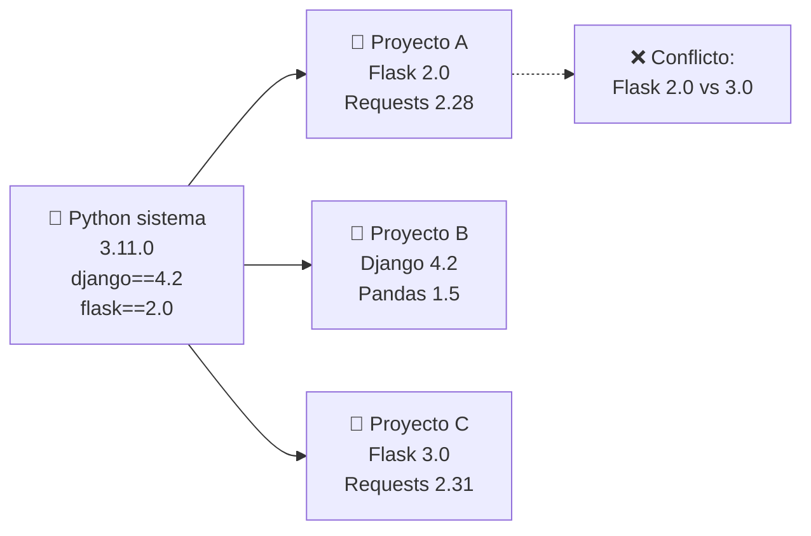
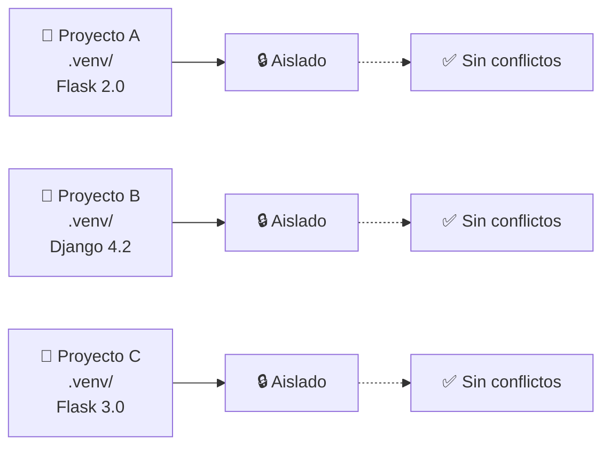
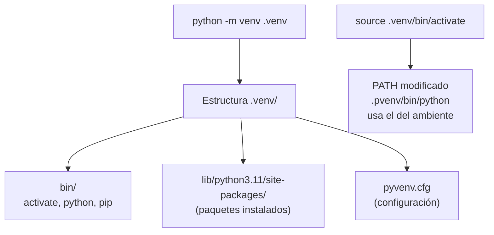
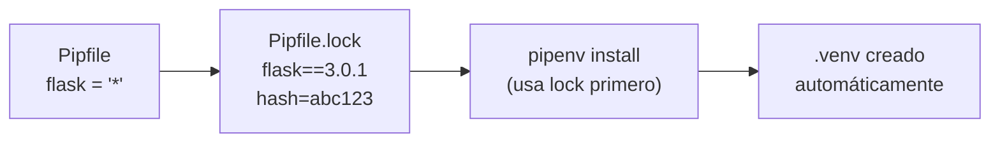
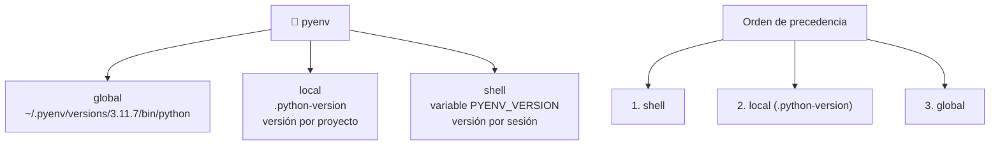
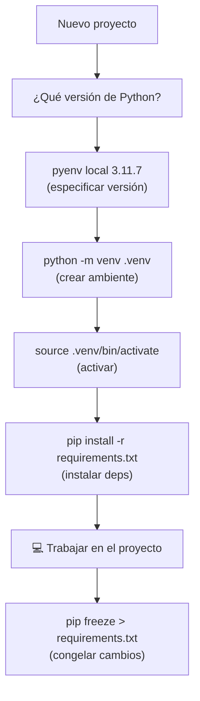
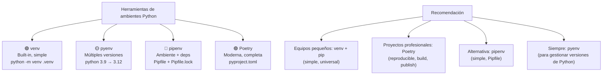

# Ambientes (Environments)

Los **ambientes virtuales** aíslan las dependencias de cada proyecto, evitando conflictos entre versiones.





---

## Virtualenv / venv

`venv` es el módulo built-in de Python (v3.3+) para crear ambientes virtuales.

```bash
# Crear ambiente
python -m venv .venv

# Activar (Linux/Mac)
source .venv/bin/activate

# Activar (Windows)
.venv\Scripts\activate

# Desactivar
deactivate

# Eliminar (solo borrar directorio)
rm -rf .venv
```

**Flujo de trabajo:**

```bash
# 1. Crear proyecto
mkdir mi-proyecto && cd mi-proyecto

# 2. Crear ambiente
python -m venv .venv

# 3. Activar
source .venv/bin/activate

# 4. Instalar dependencias
pip install flask requests

# 5. Congelar dependencias
pip freeze > requirements.txt

# 6. En otro equipo / CI
python -m venv .venv
source .venv/bin/activate
pip install -r requirements.txt
```



---

## Pipenv

Combina `pip` + `virtualenv` + `Pipfile`. Gestiona dependencias y el ambiente automáticamente.

```bash
# Instalar
pip install pipenv

# Crear proyecto e instalar
pipenv install flask        # instala + crea .venv automático
pipenv install --dev pytest # dependencia de desarrollo

# Activar ambiente
pipenv shell

# Ejecutar comando en el ambiente sin activar
pipenv run python main.py

# Instalar desde Pipfile.lock (reproducible)
pipenv install --deploy

# Gráfico de dependencias
pipenv graph
```

**Archivos generados:**
- `Pipfile` — dependencias (como requirements.txt)
- `Pipfile.lock` — versiones exactas + hashes (reproducible)

```toml
# Pipfile
[[source]]
url = "https://pypi.org/simple"
verify_ssl = true

[packages]
flask = "*"
requests = ">=2.28"

[dev-packages]
pytest = "*"
black = "*"

[requires]
python_version = "3.11"
```



---

## pyenv

Gestiona **múltiples versiones de Python** en el sistema, permitiendo cambiar entre 3.9, 3.10, 3.11, etc.

```bash
# Instalar pyenv
curl https://pyenv.run | bash

# Listar versiones disponibles
pyenv install --list

# Instalar versiones específicas
pyenv install 3.9.18
pyenv install 3.11.7
pyenv install 3.12.1

# Ver instaladas
pyenv versions

# Global (default)
pyenv global 3.11.7

# Local (proyecto actual → crea .python-version)
cd mi-proyecto
pyenv local 3.9.18   # .python-version contiene "3.9.18"

# Shell (sesión actual)
pyenv shell 3.12.1

# Dónde está el ejecutable
pyenv which python
```



### pyenv + virtualenv

El plugin `pyenv-virtualenv` permite crear ambientes virtuales nombrados con diferentes versiones de Python.

```bash
# Instalar pyenv-virtualenv (plugin incluido en pyenv-installer)

# Crear ambiente con Python específico
pyenv virtualenv 3.11.7 mi-proyecto-311

# Activar
pyenv activate mi-proyecto-311

# Listar ambientes
pyenv virtualenvs

# Eliminar
pyenv uninstall mi-proyecto-311
```

---

## Tabla comparativa

| Herramienta | Propósito | Archivos | Activación |
|---|---|---|---|
| **venv** | Ambiente aislado (built-in) | `.venv/` | `source .venv/bin/activate` |
| **virtualenv** | Ambiente aislado (terceros) | `venv/` | `source venv/bin/activate` |
| **pipenv** | Ambiente + dependencias | `Pipfile`, `Pipfile.lock` | `pipenv shell` |
| **pyenv** | Múltiples versiones Python | `.python-version` | `pyenv local 3.11` |
| **pyenv-virtualenv** | Ambientes + versiones | `~/.pyenv/versions/` | `pyenv activate nombre` |
| **Poetry** | Ambiente + deps + build | `pyproject.toml`, `poetry.lock` | `poetry shell` |
| **PDM** | Ambiente + deps (PEP 582) | `pyproject.toml`, `__pypackages__/` | Auto (sin activate) |

---

## Flujo de trabajo completo



### Script rápido (setup.sh)

```bash
#!/bin/bash
# setup.sh - Configurar proyecto Python

PROYECTO=${1:-.}

cd "$PROYECTO"

# Crear ambiente
python -m venv .venv

# Activar
source .venv/bin/activate

# Actualizar pip
pip install --upgrade pip

# Instalar dependencias si existe requirements.txt
if [ -f requirements.txt ]; then
    pip install -r requirements.txt
fi

# Instalar dev extras si existe requirements-dev.txt
if [ -f requirements-dev.txt ]; then
    pip install -r requirements-dev.txt
fi

echo "✅ Ambiente listo en .venv/"
echo "📌 Activar con: source .venv/bin/activate"
```

---

## Buenas prácticas

```bash
# ✅ .gitignore: ignorar ambientes
echo ".venv/" >> .gitignore
echo ".python-version" >> .gitignore

# ✅ requirements.txt: siempre actualizado
pip freeze > requirements.txt

# ✅ Usar versión explícita de Python
pyenv local 3.11.7
echo "3.11.7" > .python-version

# ✅ Desactivar antes de borrar
deactivate
rm -rf .venv

# ❌ No instalar paquetes globalmente (contamina el sistema)
# pip install flask  ← si no estás en ambiente

# ❌ No commitear el directorio .venv/
```

### requirements.txt vs pyproject.toml

```text
# requirements.txt (simple, plano)
flask==3.0.1
requests>=2.28.0
pytest; extra == "dev"
```

```toml
# pyproject.toml (moderno, estructurado)
[project]
name = "mi-proyecto"
version = "0.1.0"
dependencies = [
    "flask>=3.0",
    "requests>=2.28",
]

[project.optional-dependencies]
dev = ["pytest", "black"]
```

---

## Resumen


