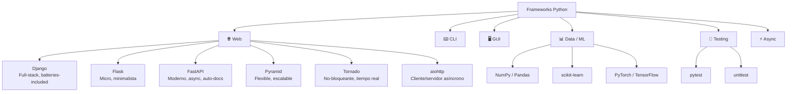
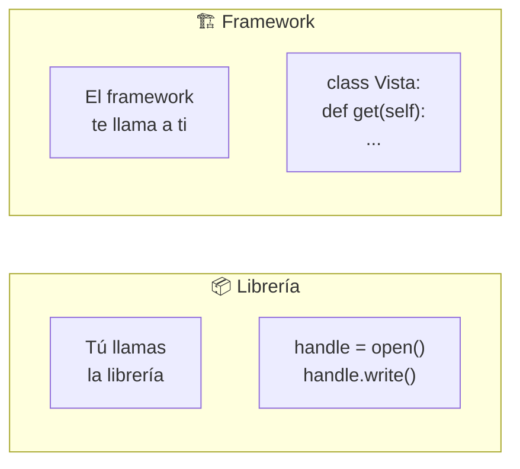
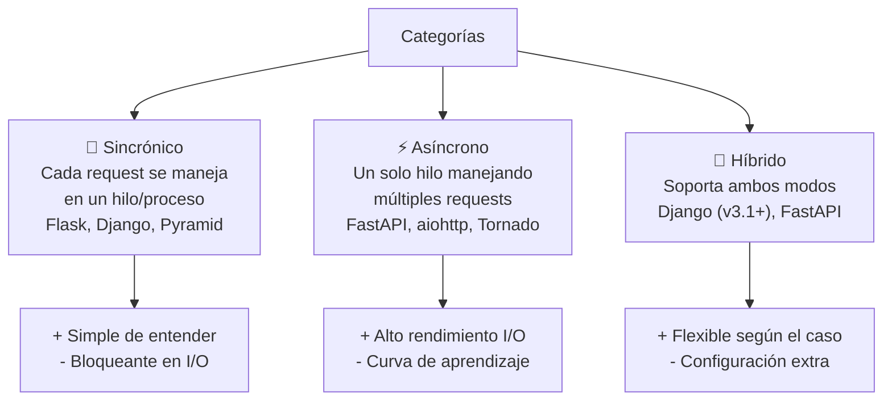
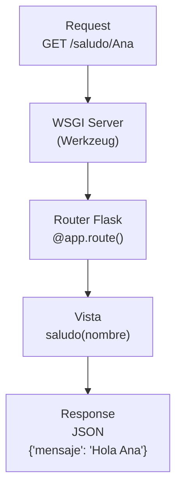
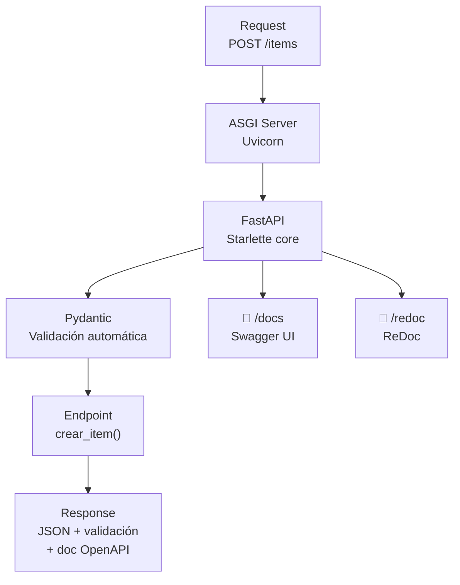
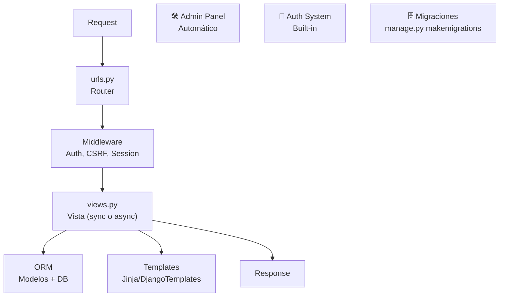
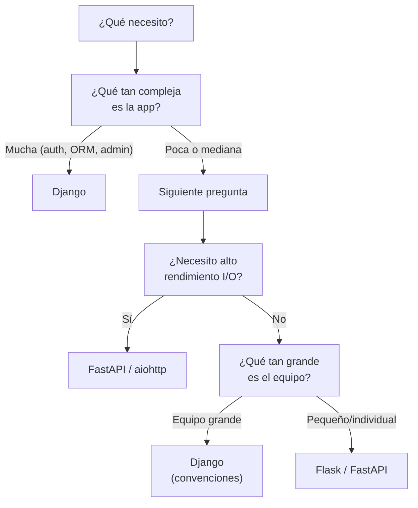
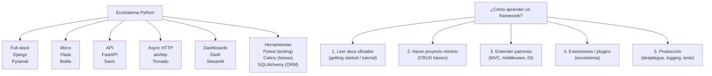

# Aprender un Framework

Un **framework** es una plataforma estructurada que proporciona arquitectura, herramientas y convenciones para desarrollar aplicaciones. En Python existen frameworks para web, CLI, GUI, testing, data science, etc.



---

## Framework vs Librería



| Aspecto | Librería | Framework |
|---|---|---|
| **Control** | Tú controlas el flujo | El framework controla el flujo |
| **Inversión de control** | ❌ No | ✅ Sí (IoC) |
| **Extensión** | Llamas funciones | Heredas/implementas |
| **Ejemplo** | `requests`, `numpy` | `Django`, `FastAPI` |
| **Tamaño** | Específica | Abarca múltiples componentes |

---

## Categorías de frameworks



---

## Sincrónico

### Flask

Micro-framework minimalista. Ideal para APIs pequeñas, prototipos, microservicios.

```python
from flask import Flask, jsonify, request

app = Flask(__name__)

@app.route("/saludo/<nombre>")
def saludo(nombre):
    return jsonify({"mensaje": f"Hola {nombre}"})

@app.route("/echo", methods=["POST"])
def echo():
    datos = request.get_json()
    return jsonify(datos), 201

if __name__ == "__main__":
    app.run(debug=True)
```



**Características:**
- Ligero (micro-framework)
- Jinja2 para templates
- SQLAlchemy para ORM (externo)
- Extensible con blueprints
- WSGI (sincrónico)

### Pyramid

Framework flexible que escala desde scripts pequeños hasta grandes aplicaciones.

```python
from pyramid.config import Configurator
from pyramid.response import Response
from pyramid.view import view_config

@view_config(route_name="home", renderer="json")
def home_view(request):
    return {"mensaje": "Hola desde Pyramid"}

if __name__ == "__main__":
    config = Configurator()
    config.add_route("home", "/")
    config.scan()
    app = config.make_wsgi_app()
```

### Plotly Dash

Framework para aplicaciones web de data visualization (analítica interactiva).

```python
import dash
from dash import html, dcc, Input, Output
import plotly.express as px

app = dash.Dash(__name__)

app.layout = html.Div([
    dcc.Dropdown(
        id="dropdown",
        options=[{"label": x, "value": x} for x in ["gdpPercap", "lifeExp", "pop"]],
        value="gdpPercap"
    ),
    dcc.Graph(id="graph")
])

@app.callback(
    Output("graph", "figure"),
    Input("dropdown", "value")
)
def update_graph(columna):
    df = px.data.gapminder()
    fig = px.scatter(df, x="year", y=columna, color="continent")
    return fig

if __name__ == "__main__":
    app.run(debug=True)
```

---

## Asincrónico

### FastAPI

Framework moderno basado en Starlette + Pydantic. Soporta async/await nativo, validación automática, OpenAPI docs.

```python
from fastapi import FastAPI, HTTPException
from pydantic import BaseModel
from typing import Optional

app = FastAPI()

class Item(BaseModel):
    nombre: str
    precio: float
    disponible: Optional[bool] = True

items_db = {}

@app.get("/items/{item_id}")
async def leer_item(item_id: int):
    if item_id not in items_db:
        raise HTTPException(status_code=404, detail="Item no encontrado")
    return items_db[item_id]

@app.post("/items", status_code=201)
async def crear_item(item: Item):
    item_id = len(items_db) + 1
    items_db[item_id] = item
    return {"id": item_id, **item.model_dump()}

# Correr: uvicorn main:app --reload
# Docs automáticas: /docs, /redoc
```



**Características:**
- Async nativo (ASGI)
- Validación con Pydantic
- Documentación OpenAPI automática
- Inyección de dependencias
- Rendimiento comparable a Node/Go

### aiohttp

Cliente y servidor HTTP asíncrono. Bajo nivel, máximo control.

```python
from aiohttp import web

async def saludo(request):
    nombre = request.match_info.get("nombre", "Mundo")
    return web.json_response({"mensaje": f"Hola {nombre}"})

async def echo(request):
    datos = await request.json()
    return web.json_response(datos, status=201)

app = web.Application()
app.router.add_get("/{nombre}", saludo)
app.router.add_post("/echo", echo)

web.run_app(app, port=8080)
```

### Tornado

Framework asíncrono para aplicaciones en tiempo real (WebSockets, long-polling).

```python
import tornado.ioloop
import tornado.web

class MainHandler(tornado.web.RequestHandler):
    def get(self):
        self.write({"mensaje": "Hola desde Tornado"})

    def post(self):
        datos = tornado.escape.json_decode(self.request.body)
        self.write(datos)

class EchoWebSocket(tornado.websocket.WebSocketHandler):
    def open(self):
        print("Cliente conectado")

    def on_message(self, message):
        self.write_message(f"Echo: {message}")

    def on_close(self):
        print("Cliente desconectado")

app = tornado.web.Application([
    (r"/", MainHandler),
    (r"/ws", EchoWebSocket),
])

if __name__ == "__main__":
    app.listen(8888)
    tornado.ioloop.IOLoop.current().start()
```

### gevent

Librería para corrutinas basadas en greenlets (no async/await). Parchea sockets para hacerlos no-bloqueantes.

```python
from gevent import monkey; monkey.patch_all()
import requests
import gevent

urls = [
    "https://httpbin.org/delay/1",
    "https://httpbin.org/delay/2",
    "https://httpbin.org/delay/3",
]

def fetch(url):
    print(f"GET {url}")
    resp = requests.get(url)
    print(f"{url}: {resp.status_code}")

# Sincrónico (~6s)
# for url in urls:
#     fetch(url)

# Asíncrono con gevent (~3s)
jobs = [gevent.spawn(fetch, url) for url in urls]
gevent.joinall(jobs)
```

### Sonic

*(Nota: Sonic no es un framework web Python. Posible confusión con Sonic Message Broker o bibliotecas de audio. Los frameworks consolidados para async son FastAPI, aiohttp, Tornado, Sanic.)*

**Sanic** (similar a Sonic en nombre):

```python
from sanic import Sanic
from sanic.response import json

app = Sanic("MiApp")

@app.get("/")
async def saludo(request):
    return json({"mensaje": "Hola desde Sanic"})

if __name__ == "__main__":
    app.run(host="0.0.0.0", port=8000)
```

---

## Híbrido (Sincrónico + Asincrónico)

### Django

Full-stack framework: ORM, admin panel, auth, templates, migrations, etc.

```python
# views.py (sincrónico)
from django.http import JsonResponse
from django.views import View

class SaludoView(View):
    def get(self, request, nombre):
        return JsonResponse({"mensaje": f"Hola {nombre}"})

# Django 3.1+ soporta async views
import asyncio
from django.http import JsonResponse

async def saludo_async(request, nombre):
    await asyncio.sleep(0.1)
    return JsonResponse({"mensaje": f"Hola {nombre}"})
```

```python
# urls.py
from django.urls import path
from . import views

urlpatterns = [
    path("saludo/<str:nombre>/", views.SaludoView.as_view()),
    path("saludo-async/<str:nombre>/", views.saludo_async),
]
```



**Características:**
- "Batteries included" (todo integrado)
- ORM potente con migraciones
- Admin panel automático
- Sistema de templates
- Django REST Framework (DRF) para APIs
- Async views desde v3.1+

### Flask (híbrido con extensiones)

Flask es sincrónico por naturaleza pero puede usarse con async:

```python
from flask import Flask

app = Flask(__name__)

@app.route("/sync")
def sync_view():
    return "Sincrónico"

# Flask 2.0+ soporta async views
@app.route("/async")
async def async_view():
    await asyncio.sleep(0.1)
    return "Asíncrono"
```

---

## Comparativa de frameworks

| Framework | Tipo | Async | ORM | Admin | Docs Auto | Ideal para |
|---|---|---|---|---|---|---|
| **Django** | Full-stack | ✅ (v3.1+) | ✅ Built-in | ✅ Built-in | ❌ | Apps complejas, CMS, e-commerce |
| **Flask** | Micro | ✅ (v2.0+) | ❌ (SQLAlchemy) | ❌ | ❌ | APIs pequeñas, prototipos |
| **FastAPI** | API | ✅ Nativo | ❌ (SQLAlchemy) | ❌ | ✅ OpenAPI | APIs modernas, microservicios |
| **Pyramid** | Full-stack | ❌ | ✅ (SQLAlchemy) | ❌ | ❌ | Apps escalables, personalización |
| **aiohttp** | Async HTTP | ✅ Nativo | ❌ | ❌ | ❌ | Alto rendimiento, WebSockets |
| **Tornado** | Async HTTP | ✅ Nativo | ❌ | ❌ | ❌ | Tiempo real, WebSockets |
| **Sanic** | Async API | ✅ Nativo | ❌ | ❌ | ❌ | APIs rápidas |
| **Dash** | Data viz | ❌ | ❌ | ❌ | ❌ | Dashboards interactivos |

---

## Cómo elegir un framework



### Recomendaciones prácticas

| Escenario | Framework |
|---|---|
| API REST rápida con docs automáticas | **FastAPI** |
| App web completa con admin y ORM | **Django** |
| Microservicio mínimo | **Flask** |
| WebSockets / tiempo real | **FastAPI** o **aiohttp** |
| Dashboard interactivo (Plotly) | **Dash** |
| Prototipo en 5 minutos | **Flask** |
| App corporativa grande | **Django** o **Pyramid** |
| Alta concurrencia I/O | **aiohttp** o **Sanic** |

---

## Buenas prácticas al usar frameworks

```python
# ✅ Usar variables de entorno para configuración
import os

SECRET_KEY = os.getenv("SECRET_KEY", "dev-key")
DATABASE_URL = os.getenv("DATABASE_URL", "sqlite:///db.sqlite")

# ✅ Separar responsabilidades (MVC / MVT)
# models/    → modelos de datos
# views/     → lógica de presentación
# services/  → lógica de negocio
# tests/     → tests

# ✅ Usar inyección de dependencias (FastAPI)
from fastapi import Depends

def get_db():
    db = Session()
    try:
        yield db
    finally:
        db.close()

@app.get("/items")
async def leer_items(db=Depends(get_db)):
    return db.query(Item).all()

# ✅ Versionar APIs
@app.get("/api/v1/items")
async def items_v1(): ...

@app.get("/api/v2/items")
async def items_v2(): ...
```

---

## Resumen visual


