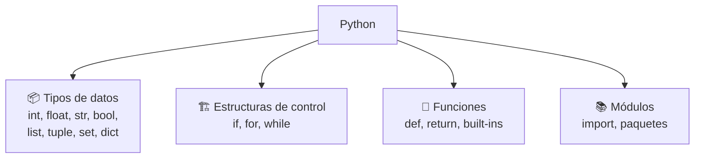
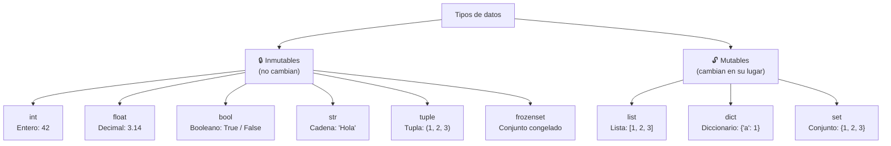
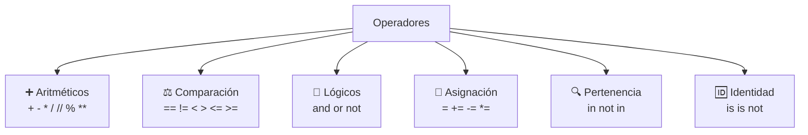
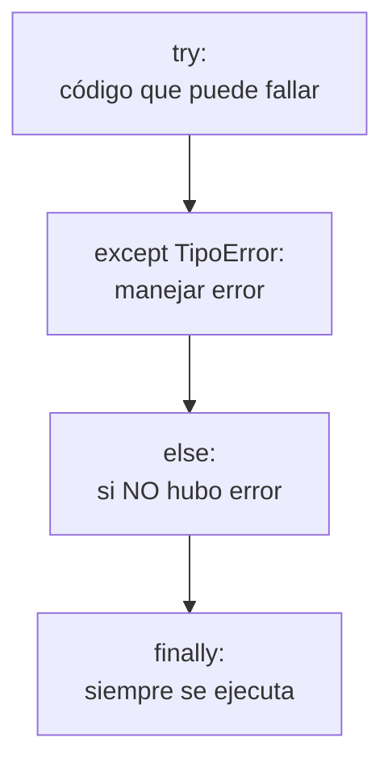
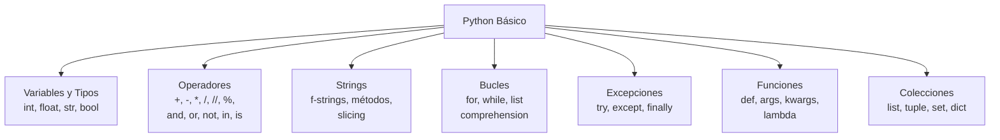

# Aprendiendo las bases

Python es un lenguaje de **alto nivel**, **interpretado** y **multipropósito** conocido por su sintaxis limpia y legible.



---

## Sintaxis básica

Python se caracteriza por usar **indentación** en lugar de llaves `{}` para definir bloques.

```python
# Esto es un comentario

# Variables (sin tipo explícito)
nombre = "Ana"
edad = 25

# Condicional
if edad >= 18:
    print(f"{nombre} es mayor de edad")
else:
    print(f"{nombre} es menor de edad")

# La indentación (4 espacios) define los bloques
```

### Reglas de sintaxis

| Regla | Python | Otros lenguajes |
|---|---|---|
| **Bloques** | Indentación (4 espacios) | Llaves `{}` |
| **Fin de línea** | Nueva línea | `;` (opcional en Python) |
| **Variables** | `nombre = valor` | `tipo nombre = valor` |
| **Comentarios** | `# comentario` | `//` o `/* */` |

> 💡 **PEP 8:** La indentación estándar es **4 espacios**. No mezcles tabs con espacios.

---

## Variables y tipos de datos

Python es **dinámicamente tipado**: no necesitas declarar el tipo, el intérprete lo infiere.



### Variables

```python
# Asignación básica
nombre = "Ana"
edad = 25
altura = 1.68
es_estudiante = True

# Múltiples asignaciones
x, y, z = 1, 2, 3

# Misma variable, diferentes tipos
valor = 42       # int
valor = "hola"   # str (cambia de tipo)

# Convención de nombres
mi_variable = "snake_case"  # ✅ Python
nombreUsuario = "camelCase"  # ❌ No es Pythonico
```

### Tipos básicos

| Tipo | Ejemplo | ¿Mutable? |
|---|---|---|
| `int` | `42`, `-5`, `1_000_000` | ❌ |
| `float` | `3.14`, `1.5e10` | ❌ |
| `bool` | `True`, `False` | ❌ |
| `str` | `'hola'`, `"mundo"` | ❌ |
| `NoneType` | `None` | ❌ |

```python
# Verificar el tipo de una variable
print(type(42))        # <class 'int'>
print(type(3.14))      # <class 'float'>
print(type("hola"))    # <class 'str'>
print(type(True))      # <class 'bool'>
print(type(None))      # <class 'NoneType'>

# isinstance: verificar tipo
print(isinstance(42, int))      # True
print(isinstance("hola", str))  # True
```

### Números

```python
# Enteros (int)
edad = 25
poblacion = 8_000_000_000  # los _ mejoran legibilidad
hexadecimal = 0xFF         # 255
binario = 0b1010           # 10

# Flotantes (float)
pi = 3.1416
cientifico = 1.5e10  # 15000000000.0

# Operaciones
suma = 10 + 3       # 13
resta = 10 - 3      # 7
multiplicacion = 10 * 3   # 30
division = 10 / 3         # 3.333... (float)
division_entera = 10 // 3 # 3 (entero)
modulo = 10 % 3           # 1 (residuo)
potencia = 10 ** 3        # 1000
```

### Booleanos

```python
# True / False
activo = True
terminado = False

# Operadores lógicos
print(True and False)  # False
print(True or False)   # True
print(not True)        # False

# Valores "truthy" y "falsy"
# Falsy: False, 0, 0.0, "", [], (), {}, None, set()
# Truthy: todo lo demás

if 0:       # False (no ejecuta)
    print("no se ejecuta")
if "hola":  # True (ejecuta)
    print("se ejecuta")
```

---

## Operadores



```python
# Aritméticos
print(10 + 3)    # 13
print(10 - 3)    # 7
print(10 * 3)    # 30
print(10 / 3)    # 3.333...
print(10 // 3)   # 3
print(10 % 3)    # 1
print(10 ** 3)   # 1000

# Comparación
print(5 == 5)    # True
print(5 != 3)    # True
print(5 > 3)     # True
print(5 <= 5)    # True

# Lógicos
print(True and False)  # False
print(True or False)   # True
print(not True)        # False

# Pertenencia
print("a" in "hola")       # True
print("x" not in "hola")   # True
print(3 in [1, 2, 3])      # True

# Identidad (comparan si son el mismo objeto en memoria)
a = [1, 2, 3]
b = [1, 2, 3]
c = a
print(a == b)   # True (mismo valor)
print(a is b)   # False (diferentes objetos)
print(a is c)   # True (mismo objeto)

# Asignación compuesta
x = 5
x += 3   # x = 8
x -= 2   # x = 6
x *= 2   # x = 12
x /= 3   # x = 4.0
```

### Precedencia de operadores

```python
# De mayor a menor prioridad:
# 1. () paréntesis
# 2. ** exponente
# 3. * / // % multiplicación/división
# 4. + - suma/resta
# 5. == != < > <= >= comparación
# 6. not
# 7. and
# 8. or

resultado = 5 + 3 * 2     # 11 (multiplica primero)
resultado = (5 + 3) * 2   # 16 (paréntesis primero)
```

---

## Trabajando con Strings

```python
# Creación
s1 = 'comillas simples'
s2 = "comillas dobles"
s3 = '''multilínea
puede tener
varias líneas'''

# Concatenación
saludo = "Hola" + " " + "Mundo"  # "Hola Mundo"

# Repetición
eco = "Ja" * 3  # "JaJaJa"

# Formateo
nombre = "Ana"
edad = 25

# f-strings (recomendado)
print(f"Hola, soy {nombre} y tengo {edad} años")

# .format()
print("Hola, soy {} y tengo {} años".format(nombre, edad))

# %-formatting (antiguo)
print("Hola, soy %s y tengo %d años" % (nombre, edad))
```

### Métodos de strings

```python
texto = "  Hola Mundo  "

# Limpiar
print(texto.strip())     # "Hola Mundo" (sin espacios)
print(texto.lstrip())    # "Hola Mundo  "
print(texto.rstrip())    # "  Hola Mundo"

# Mayúsculas / minúsculas
print(texto.upper())     # "  HOLA MUNDO  "
print(texto.lower())     # "  hola mundo  "
print(texto.title())     # "  Hola Mundo  "
print(texto.swapcase())  # "  hOLA mUNDO  "

# Búsqueda
print(texto.find("Mundo"))  # 7 (índice donde empieza)
print(texto.count("o"))     # 2
print("Mundo" in texto)     # True

# Validación
print("123".isdigit())  # True
print("abc".isalpha())  # True
print("abc123".isalnum())  # True

# División y unión
print(texto.split())        # ['Hola', 'Mundo']
print(" ".join(["Hola", "Mundo"]))  # "Hola Mundo"

# Reemplazo
print(texto.replace("Mundo", "Python"))  # "  Hola Python  "
```

### Indexación y slicing

```python
texto = "Python"

# Indexación (0-indexed)
#  P  y  t  h  o  n
#  0  1  2  3  4  5
# -6 -5 -4 -3 -2 -1

print(texto[0])    # "P"
print(texto[-1])   # "n" (último carácter)
print(texto[2])    # "t"

# Slicing [inicio:fin:paso]
print(texto[0:3])    # "Pyt" (del 0 al 2)
print(texto[:3])     # "Pyt" (desde inicio)
print(texto[3:])     # "hon" (hasta el final)
print(texto[::-1])   # "nohtyP" (invertido)
print(texto[::2])    # "Pto" (cada 2)
```

> 💡 **Los strings son inmutables.** No puedes hacer `texto[0] = "p"`. Crea uno nuevo.

---

## Bucles

### for

```python
# Iterar sobre una secuencia
for letra in "Python":
    print(letra)  # P, y, t, h, o, n

# range(inicio, fin, paso)
for i in range(5):          # 0, 1, 2, 3, 4
    print(i)

for i in range(2, 7):       # 2, 3, 4, 5, 6
    print(i)

for i in range(0, 10, 2):   # 0, 2, 4, 6, 8
    print(i)

# enumerate: índice y valor
colores = ["rojo", "verde", "azul"]
for idx, color in enumerate(colores):
    print(f"{idx}: {color}")
# 0: rojo
# 1: verde
# 2: azul
```

### while

```python
# Mientras se cumpla la condición
contador = 0
while contador < 5:
    print(contador)
    contador += 1

# break: salir del bucle
for i in range(10):
    if i == 5:
        break  # sale del bucle
    print(i)   # 0, 1, 2, 3, 4

# continue: saltar a la siguiente iteración
for i in range(5):
    if i == 2:
        continue  # salta el 2
    print(i)      # 0, 1, 3, 4

# else en bucles (se ejecuta si NO hubo break)
for i in range(5):
    print(i)
else:
    print("Bucle completado sin break")
```

### Comprensión de listas (list comprehension)

```python
# [expresión for elemento in iterable if condición]

# Cuadrados de números
cuadrados = [x**2 for x in range(10)]
# [0, 1, 4, 9, 16, 25, 36, 49, 64, 81]

# Con filtro
pares = [x for x in range(20) if x % 2 == 0]
# [0, 2, 4, 6, 8, 10, 12, 14, 16, 18]

# Transformación
mayusculas = [nombre.upper() for nombre in ["ana", "luis", "maría"]]
# ['ANA', 'LUIS', 'MARÍA']

# Anidada
pares = [(x, y) for x in range(3) for y in range(3)]
# [(0,0), (0,1), (0,2), (1,0), (1,1), (1,2), (2,0), (2,1), (2,2)]

# Equivalente con bucle normal:
pares = []
for x in range(3):
    for y in range(3):
        pares.append((x, y))
```

---

## Casteo de tipos

Convertir un tipo de dato a otro.

```python
# A entero (int)
print(int(3.14))        # 3 (trunca decimales)
print(int("42"))        # 42
print(int(True))        # 1
print(int(False))       # 0

# A flotante (float)
print(float(3))         # 3.0
print(float("3.14"))    # 3.14
print(float("1e3"))     # 1000.0

# A string (str)
print(str(42))          # "42"
print(str(3.14))        # "3.14"
print(str(True))        # "True"

# A booleano (bool)
print(bool(1))          # True
print(bool(0))          # False
print(bool(""))         # False
print(bool("hola"))     # True
print(bool([]))         # False
print(bool([1, 2]))     # True

# A lista
print(list("hola"))     # ['h', 'o', 'l', 'a']
print(list((1, 2, 3)))  # [1, 2, 3]

# A tupla
print(tuple([1, 2, 3])) # (1, 2, 3)

# A set (elimina duplicados)
print(set([1, 2, 2, 3]))  # {1, 2, 3}

# Manejo de errores en casteo
try:
    numero = int("hola")  # ValueError
except ValueError:
    print("No se puede convertir")
```

---

## Excepciones

Manejo de errores para evitar que el programa termine abruptamente.



```python
# Básico
try:
    resultado = 10 / 0
except ZeroDivisionError:
    print("No se puede dividir entre cero")

# Capturar el error como variable
try:
    numero = int("hola")
except ValueError as e:
    print(f"Error: {e}")

# Múltiples except
try:
    valor = int(input("Número: "))
    resultado = 10 / valor
except ValueError:
    print("Eso no es un número")
except ZeroDivisionError:
    print("No se puede dividir entre cero")
except Exception as e:
    print(f"Error inesperado: {e}")

# else y finally
try:
    archivo = open("datos.txt", "r")
    contenido = archivo.read()
except FileNotFoundError:
    print("Archivo no encontrado")
else:
    print("Archivo leído exitosamente")
finally:
    print("Esto siempre se ejecuta")
    archivo.close()  # cerrar recurso

# finally es útil para liberar recursos
```

### Tipos de excepciones comunes

| Excepción | Cuándo ocurre |
|---|---|
| `ValueError` | Valor incorrecto (int("hola")) |
| `TypeError` | Tipo incorrecto ("a" + 5) |
| `ZeroDivisionError` | División entre cero |
| `IndexError` | Índice fuera de rango |
| `KeyError` | Llave no encontrada en dict |
| `FileNotFoundError` | Archivo no existe |
| `AttributeError` | Atributo no existe en objeto |

### Levantar excepciones

```python
def dividir(a, b):
    if b == 0:
        raise ValueError("No se puede dividir entre cero")
    return a / b
```

---

## Funciones y Built-in Functions

### Definir funciones

```python
# Función básica
def saludar():
    print("¡Hola!")

saludar()  # ¡Hola!

# Con parámetros
def saludar(nombre):
    print(f"¡Hola, {nombre}!")

saludar("Ana")  # ¡Hola, Ana!

# Con valor de retorno
def suma(a, b):
    return a + b

resultado = suma(5, 3)  # 8

# Parámetros por defecto
def saludar(nombre="Invitado"):
    print(f"¡Hola, {nombre}!")

saludar()          # ¡Hola, Invitado!
saludar("Ana")     # ¡Hola, Ana!

# Parámetros nombrados (keyword arguments)
def info(nombre, edad, ciudad):
    print(f"{nombre}, {edad} años, {ciudad}")

info(edad=25, ciudad="Madrid", nombre="Ana")
```

### Args y kwargs

```python
# *args: número variable de argumentos posicionales
def sumar(*numeros):
    return sum(numeros)

print(sumar(1, 2, 3))      # 6
print(sumar(1, 2, 3, 4, 5))  # 15

# **kwargs: número variable de argumentos nombrados
def mostrar_info(**datos):
    for clave, valor in datos.items():
        print(f"{clave}: {valor}")

mostrar_info(nombre="Ana", edad=25, ciudad="Madrid")
# nombre: Ana
# edad: 25
# ciudad: Madrid

# Combinación
def funcion(a, b, *args, **kwargs):
    print(a, b, args, kwargs)

funcion(1, 2, 3, 4, x=5, y=6)
# 1, 2, (3, 4), {'x': 5, 'y': 6}
```

### Built-in Functions esenciales

```python
# print: mostrar en consola
print("Hola", "Mundo", sep="-", end="!\n")  # Hola-Mundo!

# len: longitud de secuencias
print(len("Python"))    # 6
print(len([1, 2, 3]))  # 3

# type: tipo de un valor
print(type(42))  # <class 'int'>

# input: entrada del usuario
# nombre = input("¿Cómo te llamas? ")

# range: secuencia de números
print(list(range(5)))  # [0, 1, 2, 3, 4]

# enumerate: índice + valor
for i, v in enumerate(["a", "b", "c"]):
    print(i, v)  # 0 a, 1 b, 2 c

# zip: combina iterables
nombres = ["Ana", "Luis", "María"]
edades = [25, 30, 28]
for nombre, edad in zip(nombres, edades):
    print(f"{nombre}: {edad}")

# map: aplicar función a cada elemento
numeros = [1, 2, 3, 4]
cuadrados = list(map(lambda x: x**2, numeros))  # [1, 4, 9, 16]

# filter: filtrar elementos
pares = list(filter(lambda x: x % 2 == 0, numeros))  # [2, 4]

# sorted: ordenar
print(sorted([3, 1, 4, 1, 5]))          # [1, 1, 3, 4, 5]
print(sorted([3, 1, 4], reverse=True))  # [4, 3, 1]

# sum, max, min
print(sum([1, 2, 3, 4]))   # 10
print(max([1, 2, 3, 4]))   # 4
print(min([1, 2, 3, 4]))   # 1

# any, all
print(any([False, True, False]))  # True (al menos uno True)
print(all([True, True, True]))   # True (todos True)
```

### Funciones lambda

```python
# lambda argumentos: expresión

# Función normal
def cuadrado(x):
    return x**2

# Equivalente lambda
cuadrado = lambda x: x**2

print(cuadrado(5))  # 25

# Lambda con map/filter
numeros = [1, 2, 3, 4, 5]
dobles = list(map(lambda x: x * 2, numeros))     # [2, 4, 6, 8, 10]
mayores = list(filter(lambda x: x > 3, numeros)) # [4, 5]

# Ordenar por criterio
personas = [("Ana", 25), ("Luis", 30), ("María", 20)]
ordenadas = sorted(personas, key=lambda p: p[1])  # por edad
print(ordenadas)  # [('María', 20), ('Ana', 25), ('Luis', 30)]
```

---

## Listas

Secuencia **mutable** y **ordenada** de elementos.

```python
# Creación
frutas = ["manzana", "pera", "uva"]
mixta = [1, "hola", 3.14, True]
vacia = []
lista_concatenada = [1, 2] + [3, 4]  # [1, 2, 3, 4]
repetida = [0] * 5  # [0, 0, 0, 0, 0]

# Índices y slicing (igual que strings)
print(frutas[0])      # "manzana"
print(frutas[-1])     # "uva"
print(frutas[1:3])    # ["pera", "uva"]
print(frutas[::-1])   # ["uva", "pera", "manzana"]

# Modificar elementos
frutas[0] = "naranja"
frutas[1:3] = ["kiwi", "mango"]

# Métodos principales
frutas.append("fresa")       # Añade al final
frutas.insert(0, "plátano") # Inserta en posición
frutas.extend(["cereza", "limón"])  # Añade varios

frutas.remove("kiwi")        # Elimina por valor
elemento = frutas.pop()      # Elimina y devuelve el último
elemento = frutas.pop(0)     # Elimina y devuelve el primero
del frutas[2]                # Elimina por índice
frutas.clear()               # Vacía la lista

# Búsqueda
print(frutas.index("pera"))  # Índice de un elemento
print(frutas.count("uva"))   # Cuenta ocurrencias
print("pera" in frutas)      # True / False

# Ordenación
frutas.sort()                # Orden ascendente (in-place)
frutas.sort(reverse=True)    # Orden descendente
frutas.reverse()             # Invierte el orden
ordenada = sorted(frutas)    # Devuelve nueva lista ordenada

# Copia
frutas_copia = frutas.copy()           # Copia superficial
frutas_copia = list(frutas)            # Otra forma
frutas_copia = frutas[:]               # Otra forma

# Comprensión de listas
cuadrados = [x**2 for x in range(10) if x % 2 == 0]
```

### Listas anidadas

```python
matriz = [
    [1, 2, 3],
    [4, 5, 6],
    [7, 8, 9]
]

print(matriz[0][1])  # 2
print(matriz[2][2])  # 9

# Aplanar con comprensión
plana = [num for fila in matriz for num in fila]
# [1, 2, 3, 4, 5, 6, 7, 8, 9]
```

---

## Tuplas

Secuencia **inmutable** y **ordenada**.

```python
# Creación
punto = (3, 4)
colores = "rojo", "verde", "azul"  # paréntesis opcionales
un_elemento = (5,)  # coma necesaria
vacia = ()

# Acceso (igual que listas)
print(punto[0])     # 3
print(punto[-1])    # 4
print(punto[0:1])   # (3,)

# Inmutable
# punto[0] = 5  # ❌ TypeError

# Desempaquetado
x, y = punto
print(x, y)  # 3 4

a, *b, c = (1, 2, 3, 4, 5)
print(a, b, c)  # 1 [2, 3, 4] 5

# Métodos
print(punto.count(3))  # 1
print(punto.index(4))  # 1

# Conversiones
tupla = tuple([1, 2, 3])  # (1, 2, 3)
lista = list(punto)       # [3, 4]

# ¿Cuándo usar tuplas?
# - Datos que no deben cambiar (coordenadas, config)
# - Como claves de diccionario
# - Más rápidas que listas
# - Retornar múltiples valores
```

### Tuplas vs Listas

| Característica | Lista | Tupla |
|---|---|---|
| **Mutable** | ✅ Sí | ❌ No |
| **Rendimiento** | Más lenta | Más rápida |
| **Memory** | Más peso | Menos peso |
| **Usos** | Colecciones variables | Datos fijos, claves dict |
| **Métodos** | `append, sort, remove` | `count, index` |

---

## Sets

Colección **no ordenada**, **mutable** y **sin duplicados**.

```python
# Creación
frutas = {"manzana", "pera", "uva", "manzana"}  # {"manzana", "pera", "uva"}
vacio = set()  # {} es un dict vacío
numeros = set([1, 2, 2, 3, 3, 3])  # {1, 2, 3}

# Añadir y eliminar
frutas.add("naranja")
frutas.remove("pera")     # Error si no existe
frutas.discard("kiwi")    # No error si no existe
frutas.pop()              # Elimina y devuelve un elemento aleatorio
frutas.clear()

# Búsqueda (rápida O(1))
print("manzana" in frutas)  # True

# Operaciones de conjunto
a = {1, 2, 3, 4}
b = {3, 4, 5, 6}

print(a | b)  # Unión: {1, 2, 3, 4, 5, 6}
print(a & b)  # Intersección: {3, 4}
print(a - b)  # Diferencia: {1, 2}
print(a ^ b)  # Diferencia simétrica: {1, 2, 5, 6}

# Comparación
print({1, 2}.issubset({1, 2, 3}))    # True
print({1, 2, 3}.issuperset({1, 2}))  # True
print(a.isdisjoint(b))               # False (tienen elementos en común)
```

---

## Diccionarios

Colección **mutable** de pares **clave: valor**.

```python
# Creación
usuario = {
    "nombre": "Ana",
    "edad": 25,
    "email": "ana@email.com"
}

vacio = {}
otro = dict(clave="valor")
pares = dict([("a", 1), ("b", 2)])  # {"a": 1, "b": 2}

# Acceso
print(usuario["nombre"])      # "Ana"
print(usuario.get("edad"))    # 25
print(usuario.get("telefono", "No disponible"))  # "No disponible"

# usuario["inexistente"]  # KeyError
# usuario.get("inexistente")  # None

# Modificar
usuario["edad"] = 26
usuario["telefono"] = "555-1234"  # Nueva clave

# Eliminar
del usuario["telefono"]
edad = usuario.pop("edad")     # Elimina y devuelve
usuario.clear()                # Vacía

# Recorrer
for clave in usuario:
    print(clave, usuario[clave])

for clave, valor in usuario.items():
    print(f"{clave}: {valor}")

for clave in usuario.keys():
    print(clave)

for valor in usuario.values():
    print(valor)

# Métodos
claves = list(usuario.keys())
valores = list(usuario.values())
items = list(usuario.items())

# Actualizar con otro diccionario
usuario.update({"edad": 26, "ciudad": "Madrid"})

# Copia
copia = usuario.copy()
```

### Diccionarios anidados

```python
estudiantes = {
    "ana": {  # ← dict dentro de dict con listas dentro
        "edad": 25,
        "cursos": ["Python", "SQL", "JavaScript"],
        "notas": {"Python": 95, "SQL": 88}
    },
    "luis": {
        "edad": 30,
        "cursos": ["Java", "Python"],
        "notas": {"Java": 82, "Python": 90}
    }
}

print(estudiantes["ana"]["notas"]["Python"])  # 95
print(estudiantes["luis"]["cursos"])  # ["Java", "Python"]

# Añadir nueva nota
estudiantes["ana"]["notas"]["SQL"] = 92
```

### Comprensión de diccionarios

```python
cuadrados = {x: x**2 for x in range(5)}
# {0: 0, 1: 1, 2: 4, 3: 9, 4: 16}

pares = {x: x**2 for x in range(10) if x % 2 == 0}
# {0: 0, 2: 4, 4: 16, 6: 36, 8: 64}
```

---

## Resumen visual



### ¿Cuándo usar cada estructura?

| Estructura | ¿Ordenada? | ¿Mutable? | ¿Duplicados? | Uso típico |
|---|---|---|---|---|
| **list** | ✅ | ✅ | ✅ | Secuencia de elementos variables |
| **tuple** | ✅ | ❌ | ✅ | Datos fijos, coordenadas |
| **set** | ❌ | ✅ | ❌ | Sin duplicados, operaciones conjuntos |
| **dict** | ❌ (3.6+: orden inserción) | ✅ | Claves: ❌, Valores: ✅ | Pares clave-valor |
| **str** | ✅ | ❌ | ✅ | Texto |
