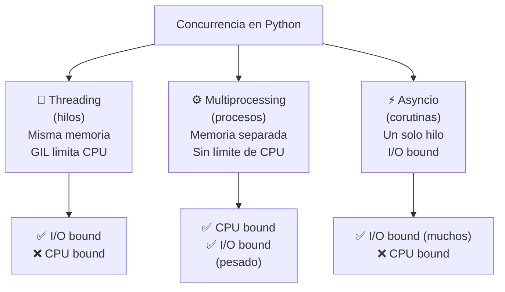
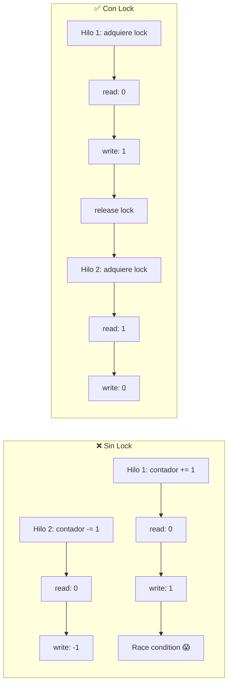
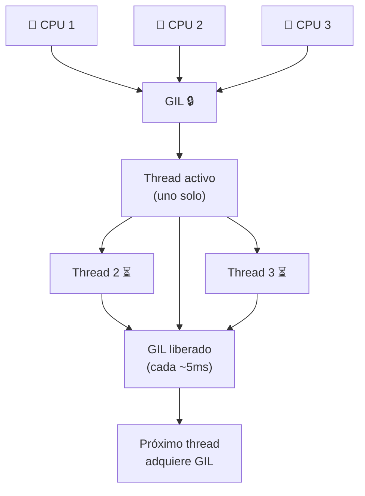
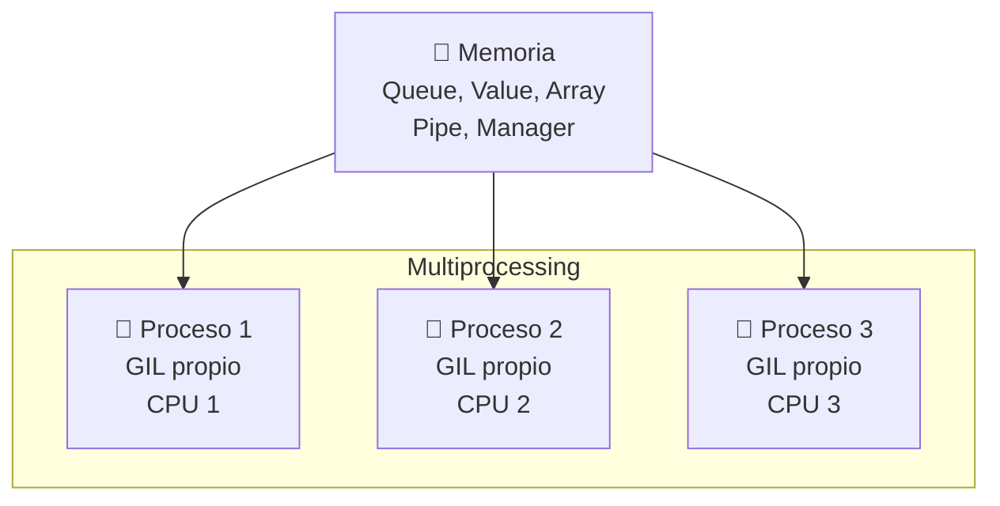
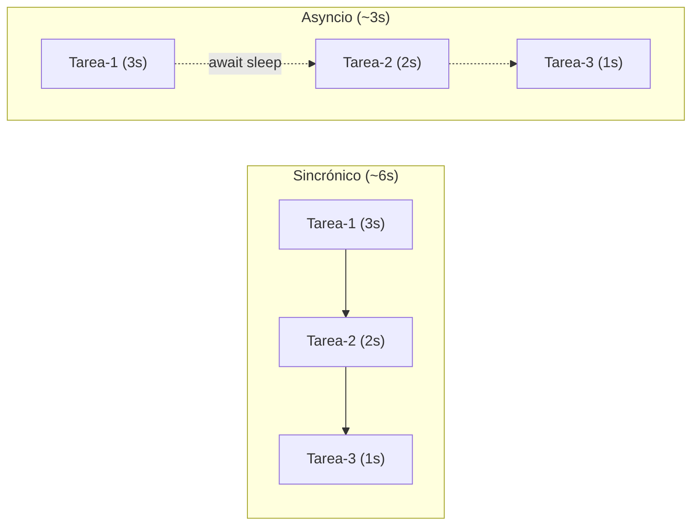
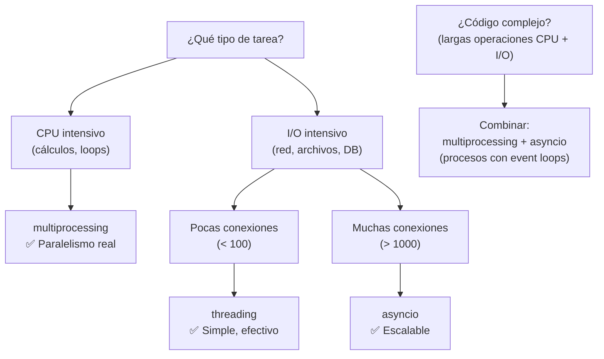
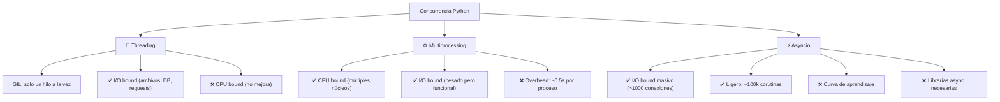

# Concurrencia

Python ofrece **tres modelos** de concurrencia, cada uno con casos de uso específicos.



| Modelo | Ejecución | Memoria | CPU bound | I/O bound |
|---|---|---|---|---|
| **Threading** | Hilos (OS) | Compartida | ❌ (GIL) | ✅ |
| **Multiprocessing** | Procesos (OS) | Separada | ✅ | ✅ |
| **Asyncio** | Corutinas (1 hilo) | Compartida | ❌ | ✅ (muchos) |

---

## Hilos (Threading)

Los **hilos** comparten memoria dentro de un mismo proceso. El **GIL** (Global Interpreter Lock) limita la ejecución de bytecode a un hilo a la vez.

```python
import threading
import time

def tarea(nombre, segundos):
    print(f"{nombre} comenzando...")
    time.sleep(segundos)
    print(f"{nombre} terminó después de {segundos}s")

# Crear hilos
hilo1 = threading.Thread(target=tarea, args=("Hilo-1", 2))
hilo2 = threading.Thread(target=tarea, args=("Hilo-2", 3))

# Iniciar
hilo1.start()
hilo2.start()

# Esperar que terminen
hilo1.join()
hilo2.join()

print("✅ Todos los hilos terminaron")
```

### Compartir datos entre hilos

```python
import threading

contador = 0
lock = threading.Lock()
VEZES = 100000

def incrementar():
    global contador
    for _ in range(VEZES):
        with lock:  # sección crítica
            contador += 1

def decrementar():
    global contador
    for _ in range(VEZES):
        with lock:
            contador -= 1

hilos = [
    threading.Thread(target=incrementar),
    threading.Thread(target=decrementar),
]

for h in hilos:
    h.start()
for h in hilos:
    h.join()

print(f"Contador: {contador}")  # 0 ✅ (sin lock daría cualquier valor)
```



### ThreadPoolExecutor

```python
from concurrent.futures import ThreadPoolExecutor
import requests

urls = [
    "https://httpbin.org/delay/1",
    "https://httpbin.org/delay/2",
    "https://httpbin.org/delay/3",
]

def fetch(url):
    resp = requests.get(url)
    return len(resp.content)

# Pool de 3 hilos
with ThreadPoolExecutor(max_workers=3) as executor:
    resultados = list(executor.map(fetch, urls))

print(resultados)  # [286, 286, 286]
```

---

## GIL (Global Interpreter Lock)

El GIL es un **mutex** que protege el acceso al intérprete de Python, permitiendo que solo **un hilo** ejecute bytecode a la vez.



### Impacto del GIL

```python
import time
import threading

def tarea_cpu(n):
    """Cálculo intensivo (CPU bound)"""
    total = 0
    for i in range(n):
        total += i ** 2
    return total

N = 50_000_000

# Sincrónico (~3s)
inicio = time.time()
tarea_cpu(N)
tarea_cpu(N)
print(f"Sincrónico: {time.time() - inicio:.2f}s")

# Con threads (~3s también ❌ GIL)
inicio = time.time()
hilos = [
    threading.Thread(target=tarea_cpu, args=(N,)),
    threading.Thread(target=tarea_cpu, args=(N,)),
]
for h in hilos:
    h.start()
for h in hilos:
    h.join()
print(f"Threads: {time.time() - inicio:.2f}s")  # ~igual que sincrónico

# Con multiprocessing (~1.5s ✅)
from multiprocessing import Process

inicio = time.time()
procesos = [
    Process(target=tarea_cpu, args=(N,)),
    Process(target=tarea_cpu, args=(N,)),
]
for p in procesos:
    p.start()
for p in procesos:
    p.join()
print(f"Multiprocessing: {time.time() - inicio:.2f}s")
```

| Operación | GIL afecta | Alternativa |
|---|---|---|
| CPU intensivo (cálculos) | ❌ Sí | `multiprocessing` |
| I/O (archivos, red, DB) | ✅ No | `threading` o `asyncio` |
| NumPy/Pandas | ✅ No (libera GIL en C) | Threads funcionan |
| Cython / C extensions | ✅ Pueden liberar GIL | `with nogil:` |

> **Resumen del GIL:** para código CPU-bound en Python puro, usa `multiprocessing`. Para I/O-bound, usa `threading` o `asyncio` (el GIL se libera durante operaciones I/O).

---

## Multiprocesamiento

Cada **proceso** tiene su propio intérprete Python, memoria y GIL. Aprovecha **múltiples núcleos** de CPU.

```python
from multiprocessing import Process, Queue, Pool

def cuadrado(n, cola):
    cola.put(n ** 2)

if __name__ == "__main__":
    cola = Queue()
    procesos = [
        Process(target=cuadrado, args=(i, cola))
        for i in range(5)
    ]

    for p in procesos:
        p.start()
    for p in procesos:
        p.join()

    resultados = [cola.get() for _ in range(5)]
    print(resultados)  # [0, 1, 4, 9, 16] (orden variable)
```

### Pool (map/reduce)

```python
from multiprocessing import Pool

def tarea_pesada(x):
    return sum(i ** 2 for i in range(x * 1_000_000))

if __name__ == "__main__":
    with Pool(processes=4) as pool:  # 4 procesos
        resultados = pool.map(tarea_pesada, range(5))
    print(resultados)
```

### Compartir memoria

```python
from multiprocessing import Process, Value, Array

def incrementar(contador):
    for _ in range(10000):
        with contador.get_lock():
            contador.value += 1

if __name__ == "__main__":
    contador = Value("i", 0)  # entero compartido
    procesos = [
        Process(target=incrementar, args=(contador,))
        for _ in range(4)
    ]

    for p in procesos:
        p.start()
    for p in procesos:
        p.join()

    print(contador.value)  # 40000
```



---

## Asyncio (asincronía)

**Corutinas** que cooperan en un solo hilo. Ideales para I/O concurrente masivo.

```python
import asyncio
import time

async def tarea(nombre, segundos):
    print(f"{nombre} comenzando...")
    await asyncio.sleep(segundos)  # cede el control
    print(f"{nombre} terminó después de {segundos}s")
    return segundos

async def main():
    # Ejecutar concurrentemente (~3s total)
    resultados = await asyncio.gather(
        tarea("Tarea-1", 3),
        tarea("Tarea-2", 2),
        tarea("Tarea-3", 1),
    )
    print(f"Resultados: {resultados}")  # [3, 2, 1]

# Python 3.7+
inicio = time.time()
asyncio.run(main())
print(f"Total: {time.time() - inicio:.2f}s")  # ~3s
```



### async / await

```python
# Función asíncrona (corutina)
async def fetch_url(url):
    async with aiohttp.ClientSession() as session:
        async with session.get(url) as resp:
            return await resp.text()

# await: espera sin bloquear el hilo
# async def: define una corutina
# async with: context manager asíncrono
# async for: iteración asíncrona
```

### Asyncio en la práctica

```python
import asyncio
import aiohttp
import time

async def descargar(url, session):
    async with session.get(url) as resp:
        contenido = await resp.text()
        return len(contenido)

async def main():
    urls = [
        "https://httpbin.org/delay/1",
        "https://httpbin.org/delay/2",
        "https://httpbin.org/delay/3",
    ]

    async with aiohttp.ClientSession() as session:
        tareas = [descargar(url, session) for url in urls]
        resultados = await asyncio.gather(*tareas)

    print(f"Total descargado: {sum(resultados)} bytes")

inicio = time.time()
asyncio.run(main())
print(f"Tiempo: {time.time() - inicio:.2f}s")  # ~3s (vs ~6s sincrónico)
```

### await vs bloqueante

```python
import asyncio
import time

async def demo():
    print("Inicio")

    # ❌ No hacer: time.sleep() bloquea TODO
    # time.sleep(2)

    # ✅ Hacer: await asyncio.sleep() cede el control
    await asyncio.sleep(2)

    print("Fin")

asyncio.run(demo())
```

### Semáforos (límite de concurrencia)

```python
import asyncio

sem = asyncio.Semaphore(5)  # máximo 5 concurrentes

async def tarea_limitada(i):
    async with sem:
        print(f"Tarea {i} iniciada")
        await asyncio.sleep(1)
        print(f"Tarea {i} terminada")

async def main():
    await asyncio.gather(*[tarea_limitada(i) for i in range(20)])

asyncio.run(main())
```

---

## Comparativa detallada

| Aspecto | Threading | Multiprocessing | Asyncio |
|---|---|---|---|
| **Unidad** | Hilo OS | Proceso OS | Corutina |
| **Paralelismo real** | ❌ (GIL) | ✅ | ❌ |
| **Memoria** | Compartida | Separada | Compartida |
| **Creación** | Ligera | Pesada | Muy ligera |
| **Límite** | ~1000 hilos | ~100 procesos | ~100k corutinas |
| **Sincronización** | Lock, Semaphore | Queue, Lock | await, Semaphore |
| **Útil para** | I/O bound | CPU bound | I/O bound masivo |
| **Curva de aprendizaje** | Baja | Media | Media-Alta |

---

## ¿Cuál usar?



### Resumen práctico

```python
# ✅ Threading: I/O con librerías bloqueantes (requests, archivos)
import threading
t = threading.Thread(target=requests.get, args=("https://api.com",))
t.start()

# ✅ Multiprocessing: CPU intensivo (cálculos, ML)
from multiprocessing import Pool
with Pool() as pool:
    resultados = pool.map(funcion_pesada, datos)

# ✅ Asyncio: I/O masivo con librerías async (aiohttp, asyncpg)
import asyncio
async def main():
    async with aiohttp.ClientSession() as s:
        async with s.get(url) as r:
            return await r.json()
asyncio.run(main())

# ❌ Threading para CPU (no gana nada por el GIL)
# ❌ Asyncio para CPU (bloquea el event loop)
# ❌ Multiprocesamiento para tareas triviales (overhead innecesario)
```

---

## Conceptos clave adicionales

### Race condition

```python
# ⚠️ Ocurre cuando múltiples hilos/procesos acceden a datos compartidos sin sincronización
import threading

saldo = 1000

def retirar(monto):
    global saldo
    saldo -= monto  # ❌ No atómico: read → sub → write

# Si dos hilos retiran $500 simultáneamente:
t1 = threading.Thread(target=retirar, args=(500,))
t2 = threading.Thread(target=retirar, args=(500,))
t1.start(); t2.start()
t1.join(); t2.join()
print(saldo)  # Podría ser 0, 500, o 1000 😱
```

### Deadlock

```python
import threading

lock_a = threading.Lock()
lock_b = threading.Lock()

def tarea1():
    with lock_a:
        with lock_b:
            print("Tarea 1")

def tarea2():
    with lock_b:
        with lock_a:  # ❌ Orden inverso → deadlock
            print("Tarea 2")

# ✅ Solución: siempre adquirir locks en el mismo orden
```

### Procesamiento paralelo con `concurrent.futures`

```python
from concurrent.futures import ProcessPoolExecutor, ThreadPoolExecutor, as_completed

def tarea(n):
    return n ** 2

# Fácil cambiar entre threads y procesos
with ProcessPoolExecutor() as executor:  # o ThreadPoolExecutor
    futuros = {executor.submit(tarea, i): i for i in range(10)}
    for futuro in as_completed(futuros):
        print(futuro.result())
```

---

## Resumen visual


