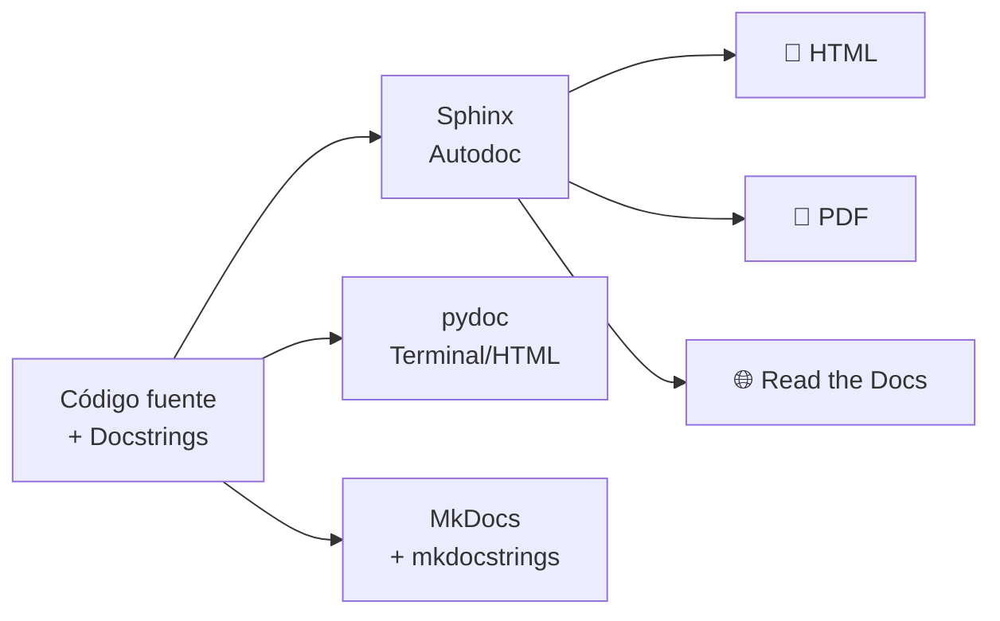
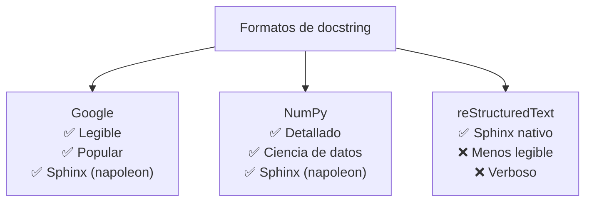
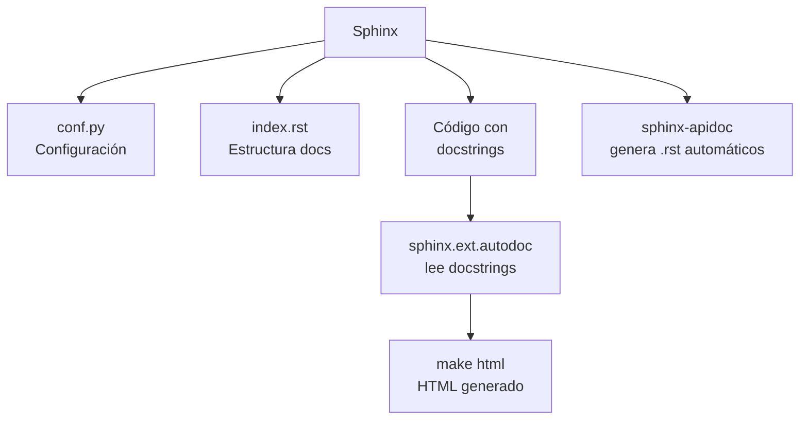
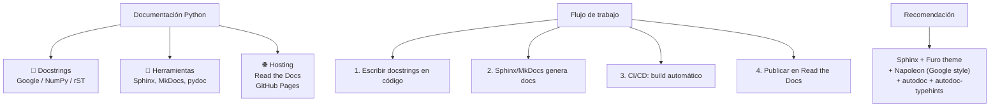

# Documentación

Python ofrece múltiples herramientas para generar documentación a partir de **docstrings** en el código.



---

## Docstrings

Documentación **inline** dentro del código que describe qué hace cada módulo, clase o función.

### Formatos de docstring

```python
# Google Style (recomendado)
def suma(a: int, b: int) -> int:
    """Suma dos números enteros.

    Args:
        a: Primer sumando.
        b: Segundo sumando.

    Returns:
        La suma de a y b.

    Raises:
        TypeError: Si algún argumento no es entero.
    """
    return a + b
```

```python
# NumPy/SciPy Style (popular en data science)
def suma(a: int, b: int) -> int:
    """Suma dos números enteros.

    Parameters
    ----------
    a : int
        Primer sumando.
    b : int
        Segundo sumando.

    Returns
    -------
    int
        La suma de a y b.

    Raises
    ------
    TypeError
        Si algún argumento no es entero.
    """
    return a + b
```

```python
# reStructuredText (Sphinx default)
def suma(a: int, b: int) -> int:
    """Suma dos números enteros.

    :param a: Primer sumando.
    :type a: int
    :param b: Segundo sumando.
    :type b: int
    :returns: La suma de a y b.
    :rtype: int
    :raises TypeError: Si algún argumento no es entero.
    """
    return a + b
```



### Docstrings de módulo y clase

```python
"""Módulo de operaciones matemáticas.

Este módulo contiene funciones básicas
y avanzadas para operaciones aritméticas.

Typical usage example:
    resultado = suma(3, 4)
    print(resultado)  # 7
"""

class Calculadora:
    """Calculadora básica con operaciones aritméticas.

    La calculadora mantiene un historial de operaciones
    y puede realizar sumas, restas, multiplicaciones y divisiones.

    Attributes:
        historial: Lista de operaciones realizadas.
    """

    def __init__(self):
        self.historial: list[str] = []
```

---

## Sphinx

Herramienta principal para generar documentación de proyectos Python.

```bash
# Instalar
pip install sphinx
pip install sphinx-autodoc-typehints
pip install furo  # tema moderno

# Inicializar
mkdir docs && cd docs
sphinx-quickstart
# Responde preguntas → genera conf.py, index.rst

# Configurar autodoc (conf.py)
# extensions = ['sphinx.ext.autodoc', 'sphinx.ext.napoleon', 'sphinx_autodoc_typehints']
# html_theme = 'furo'

# Generar documentación desde docstrings
sphinx-apidoc -o . ../src/

# Build
make html
# → docs/_build/html/index.html
```



### conf.py básico

```python
# docs/conf.py
import os
import sys
sys.path.insert(0, os.path.abspath("../src"))

project = "Mi Proyecto"
author = "Tu Nombre"
release = "0.1.0"

extensions = [
    "sphinx.ext.autodoc",       # documentación desde docstrings
    "sphinx.ext.napoleon",       # soporte Google/NumPy style
    "sphinx_autodoc_typehints", # type hints automáticos
    "sphinx.ext.viewcode",      # enlace al código fuente
]

templates_path = ["_templates"]
html_theme = "furo"
html_static_path = ["_static"]
```

### index.rst

```rst
Bienvenido a Mi Proyecto
========================

.. toctree::
   :maxdepth: 2
   :caption: Contenido:

   modules

Indices and tables
==================

* :ref:`genindex`
* :ref:`modindex`
* :ref:`search`
```

### Documentar con autodoc

```rst
.. automodule:: calculadora
   :members:
   :undoc-members:
   :show-inheritance:
```

---

## pydoc

Documentación desde la terminal (built-in).

```bash
# Ver docstrings en terminal
pydoc math
pydoc str
pydoc mi_modulo

# Servidor web local
pydoc -p 8080
# → http://localhost:8080

# Generar HTML
pydoc -w mi_modulo
# → mi_modulo.html
```

---

## MkDocs + mkdocstrings

Alternativa moderna a Sphinx (usa Markdown en vez de reStructuredText).

```bash
# Instalar
pip install mkdocs mkdocstrings

# Inicializar
mkdocs new .
# → mkdocs.yml, docs/index.md

# Configurar (mkdocs.yml)
# site_name: Mi Proyecto
# theme: material
# plugins:
#   - mkdocstrings

# Escribir docs
# docs/index.md
# ### `calculadora.suma`
# ::: calculadora.suma

# Servir local
mkdocs serve

# Build
mkdocs build
# → site/index.html
```

---

## Buenas prácticas

```python
# ✅ Documentar siempre: módulos, clases, funciones públicas
def crear_usuario(nombre: str, email: str) -> Usuario:
    """Crea un nuevo usuario en el sistema.

    Args:
        nombre: Nombre completo del usuario.
        email: Correo electrónico (debe ser único).

    Returns:
        El objeto Usuario creado.

    Raises:
        ValueError: Si el email ya existe.
    """
    ...

# ✅ Incluir ejemplos en docstrings
def duplicar(n: int) -> int:
    """Duplica un número.

    Example:
        >>> duplicar(5)
        10
        >>> duplicar(-3)
        -6
    """
    return n * 2

# ✅ Documentar atributos de clase
class Usuario:
    """Representa un usuario del sistema.

    Attributes:
        id: Identificador único.
        nombre: Nombre del usuario.
        email: Correo electrónico.
    """
    def __init__(self, id: int, nombre: str, email: str):
        self.id = id
        self.nombre = nombre
        self.email = email

# ❌ No documentar obviedades
def get_nombre(self) -> str:
    """Retorna el nombre."""  # innecesario
    return self.nombre

# ✅ Mejor: omitir docstring en getters/setters simples
def get_nombre(self) -> str:
    return self.nombre
```

---

## Tabla de herramientas

| Herramienta | Formato | Estilo docstring | Salida | Ideal para |
|---|---|---|---|---|
| **Sphinx** | reStructuredText | Google/NumPy/rST | HTML, PDF, ePub | Proyectos grandes, librerías |
| **MkDocs** | Markdown | Google/NumPy | HTML | Proyectos medianos, APIs |
| **pydoc** | Docstrings | Cualquiera | Terminal, HTML | Documentación rápida |
| **Read the Docs** | Sphinx/MkDocs | Cualquiera | Hosting automático | Open source, docs públicas |

---

## Resumen visual


