# Estructuras de datos y algoritmos

Las **estructuras de datos** son formas de organizar y almacenar datos. Los **algoritmos** son pasos para manipular esos datos. Elegir la estructura adecuada puede hacer que un programa sea **miles de veces más rápido**.

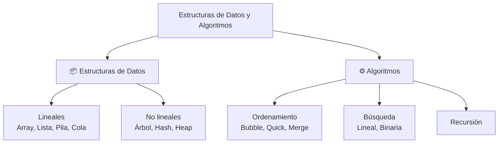

### Complejidad algorítmica (Big O)

Mide cómo crece el tiempo de ejecución según el tamaño de la entrada.

| Notación | Nombre | Ejemplo |
|---|---|---|
| **O(1)** | Constante | Acceder a un elemento de un array por índice |
| **O(log n)** | Logarítmico | Búsqueda binaria |
| **O(n)** | Lineal | Recorrer un array |
| **O(n log n)** | Linealítmico | Merge Sort, Quick Sort |
| **O(n²)** | Cuadrático | Bubble Sort, bucles anidados |
| **O(2ⁿ)** | Exponencial | Fibonacci recursivo sin memoización |

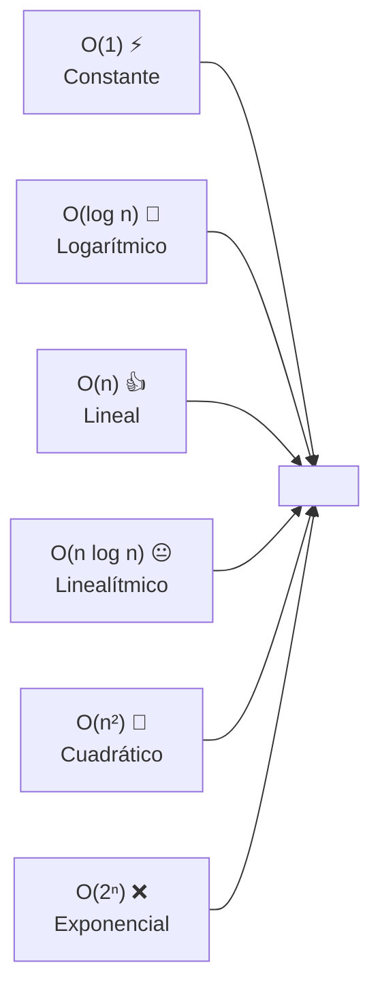

---

## Arrays y listas vinculadas

### Arrays (listas en Python)

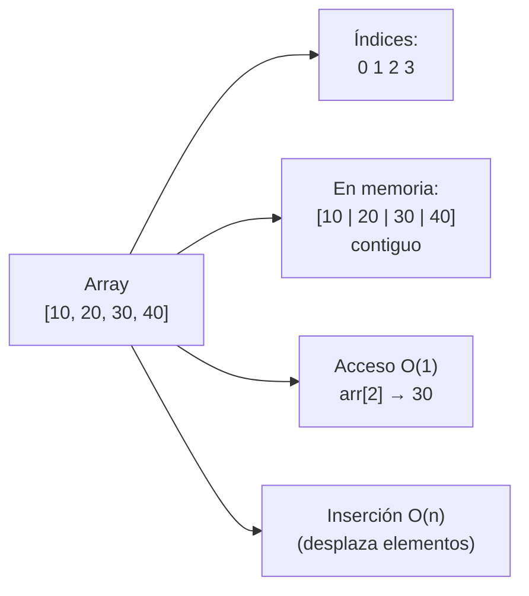

```python
# Array en Python = lista
arr = [10, 20, 30, 40]

# Acceso O(1)
print(arr[2])  # 30

# Búsqueda O(n)
print(30 in arr)  # True

# Inserción al final O(1)
arr.append(50)

# Inserción al inicio O(n)
arr.insert(0, 5)  # desplaza todos

# Eliminación O(n)
arr.remove(30)  # desplaza

# Recorrido O(n)
for elemento in arr:
    print(elemento)
```

| Operación | Array (Python list) | Complejidad |
|---|---|---|
| Acceso por índice | `arr[i]` | **O(1)** |
| Inserción al final | `arr.append(x)` | **O(1)*** |
| Inserción al inicio | `arr.insert(0, x)` | O(n) |
| Eliminación | `arr.remove(x)` | O(n) |
| Búsqueda | `x in arr` | O(n) |

### Listas vinculadas (Linked List)

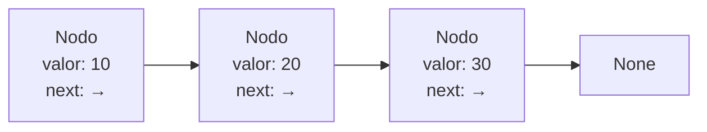

```python
class Nodo:
    def __init__(self, valor):
        self.valor = valor
        self.siguiente = None

class LinkedList:
    def __init__(self):
        self.cabeza = None

    def insertar_al_inicio(self, valor):
        nodo = Nodo(valor)
        nodo.siguiente = self.cabeza
        self.cabeza = nodo

    def insertar_al_final(self, valor):
        nodo = Nodo(valor)
        if not self.cabeza:
            self.cabeza = nodo
            return
        actual = self.cabeza
        while actual.siguiente:
            actual = actual.siguiente
        actual.siguiente = nodo

    def eliminar(self, valor):
        if not self.cabeza:
            return
        if self.cabeza.valor == valor:
            self.cabeza = self.cabeza.siguiente
            return
        actual = self.cabeza
        while actual.siguiente and actual.siguiente.valor != valor:
            actual = actual.siguiente
        if actual.siguiente:
            actual.siguiente = actual.siguiente.siguiente

    def buscar(self, valor):
        actual = self.cabeza
        while actual:
            if actual.valor == valor:
                return True
            actual = actual.siguiente
        return False

    def __str__(self):
        valores = []
        actual = self.cabeza
        while actual:
            valores.append(str(actual.valor))
            actual = actual.siguiente
        return " → ".join(valores) + " → None"

# Uso
lista = LinkedList()
lista.insertar_al_final(10)
lista.insertar_al_final(20)
lista.insertar_al_inicio(5)
print(lista)  # 5 → 10 → 20 → None
print(lista.buscar(10))  # True
lista.eliminar(10)
print(lista)  # 5 → 20 → None
```

### Array vs Linked List

| Operación | Array | Linked List |
|---|---|---|
| Acceso por índice | **O(1)** ✅ | O(n) ❌ |
| Inserción al inicio | O(n) | **O(1)** ✅ |
| Inserción al final | O(1)* | O(n) o O(1)** |
| Eliminación | O(n) | O(n) |
| Memoria | Contigua | Dispersa (extra por punteros) |

*\* O(1) amortizado en array. \*\* O(1) si se guarda referencia al final.*

---

## HashMaps

Estructura que mapea **claves únicas** a **valores** usando una función hash.

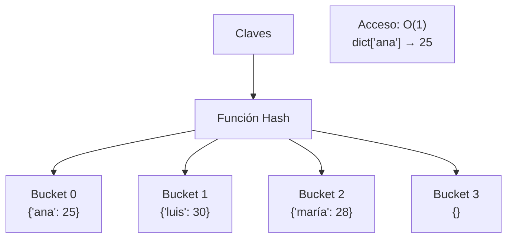

```python
# HashMap en Python = dict
edades = {
    "ana": 25,
    "luis": 30,
    "maría": 28
}

# Acceso O(1)
print(edades["ana"])       # 25
print(edades.get("pedro", "no existe"))  # "no existe"

# Inserción / actualización O(1)
edades["pedro"] = 35
edades["ana"] = 26

# Eliminación O(1)
del edades["luis"]
edad = edades.pop("maría")

# Búsqueda O(1)
print("ana" in edades)  # True

# Las claves deben ser inmutables (str, int, tuple)
# Los valores pueden ser cualquier cosa

# Colisiones: dos claves → mismo hash
# Python resuelve con open addressing
```

| Operación | HashMap (dict) | Complejidad |
|---|---|---|
| Acceso | `d["clave"]` | **O(1)** |
| Inserción | `d["clave"] = valor` | **O(1)** |
| Eliminación | `del d["clave"]` | **O(1)** |
| Búsqueda | `"clave" in d` | **O(1)** |

### HashSet

```python
# HashSet = set (solo claves, sin valores)
numeros = {1, 2, 3, 4, 5}

# Búsqueda O(1)
print(3 in numeros)  # True

# Sin duplicados
numeros.add(3)
print(numeros)  # {1, 2, 3, 4, 5}
```

### Ejemplo práctico: contar frecuencias

```python
# Contar frecuencia de palabras
texto = "el gato y el perro y el gato"
frecuencias = {}

for palabra in texto.split():
    frecuencias[palabra] = frecuencias.get(palabra, 0) + 1

print(frecuencias)
# {'el': 3, 'gato': 2, 'y': 2, 'perro': 1}

# Con Counter (built-in)
from collections import Counter
counter = Counter(texto.split())
print(counter)  # Counter({'el': 3, 'gato': 2, 'y': 2, 'perro': 1})
```

---

## Heaps, Pilas y Colas

### Pila (Stack) — LIFO

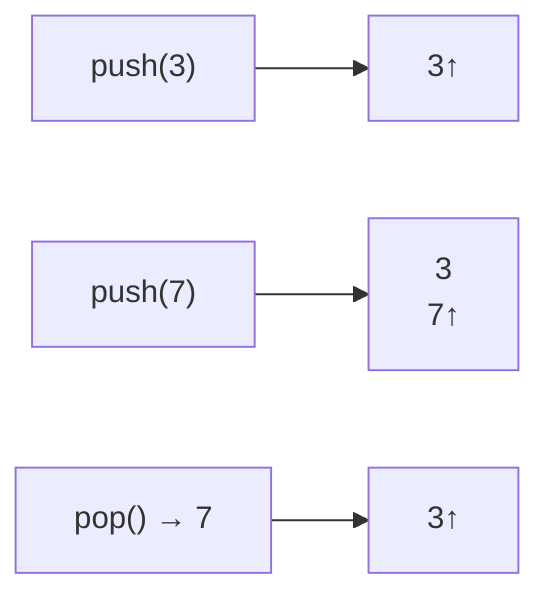

```python
# Pila como lista
pila = []

# Apilar (push)
pila.append(10)
pila.append(20)
pila.append(30)

# Desapilar (pop) — LIFO
print(pila.pop())  # 30
print(pila.pop())  # 20
print(pila)        # [10]

# Ver el tope sin sacarlo
print(pila[-1])    # 10
```

### Cola (Queue) — FIFO

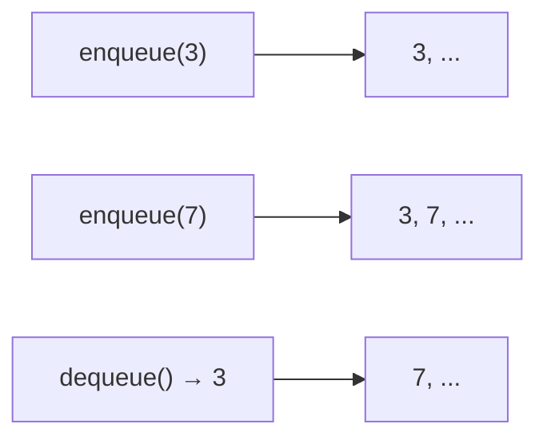

```python
# Cola con collections.deque (eficiente)
from collections import deque

cola = deque()

# Encolar
cola.append(10)   # derecha
cola.append(20)
cola.appendleft(5)  # izquierda

# Desencolar
print(cola.popleft())  # 5 (FIFO)
print(cola.popleft())  # 10
print(cola)            # deque([20])

# Como lista (ineficiente para inserción/eliminación al inicio)
cola_lista = []
cola_lista.append(10)    # O(1)
cola_lista.append(20)
cola_lista.pop(0)        # O(n) ❌
```

### Heap (Cola de prioridad)

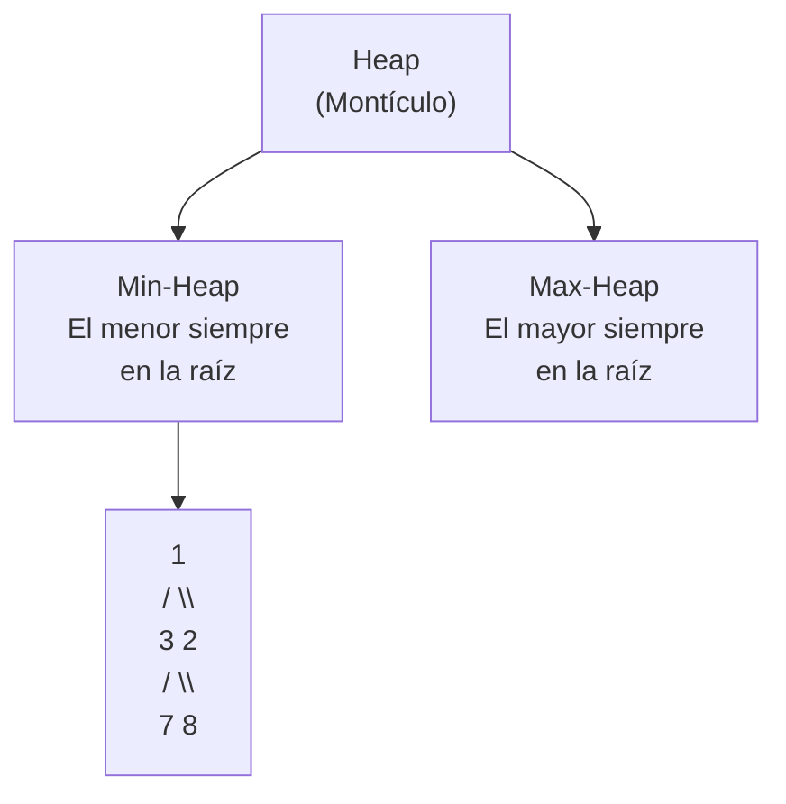

```python
import heapq

# Min-Heap (por defecto)
heap = []
heapq.heappush(heap, 5)
heapq.heappush(heap, 1)
heapq.heappush(heap, 8)
heapq.heappush(heap, 3)

print(heap)  # [1, 3, 8, 5] (el 1 es la raíz)

menor = heapq.heappop(heap)  # 1 (siempre el menor)
print(heap)  # [3, 5, 8]

# Max-Heap (invertir signos)
max_heap = []
heapq.heappush(max_heap, -5)
heapq.heappush(max_heap, -1)
heapq.heappush(max_heap, -8)
print(-heapq.heappop(max_heap))  # 8

# Obtener los n más pequeños/grandes
numeros = [3, 1, 4, 1, 5, 9, 2]
print(heapq.nsmallest(3, numeros))  # [1, 1, 2]
print(heapq.nlargest(3, numeros))   # [9, 5, 4]
```

| Operación | Pila (Stack) | Cola (Queue) | Heap |
|---|---|---|---|
| **Inserción** | `push` O(1) | `enqueue` O(1) | `heappush` O(log n) |
| **Eliminación** | `pop` O(1) | `popleft` O(1) | `heappop` O(log n) |
| **Acceso al tope** | `[-1]` O(1) | `[0]` O(1) | `[0]` O(1) |
| **Orden** | LIFO | FIFO | Por prioridad |

### Ejemplos prácticos

```python
# Validar paréntesis balanceados (Stack)
def parentesis_balanceados(s: str) -> bool:
    pares = {')': '(', '}': '{', ']': '['}
    pila = []

    for c in s:
        if c in pares.values():  # apertura
            pila.append(c)
        elif c in pares:         # cierre
            if not pila or pila.pop() != pares[c]:
                return False

    return len(pila) == 0

print(parentesis_balanceados("({[]})"))  # True
print(parentesis_balanceados("({[})"))   # False

# Cola de impresión (Queue)
tareas = deque(["doc1", "doc2", "doc3"])
while tareas:
    tarea = tareas.popleft()
    print(f"Imprimiendo {tarea}")

# Top K elementos más frecuentes (Heap)
from collections import Counter
def top_k_frecuentes(nums, k):
    counter = Counter(nums)
    return heapq.nlargest(k, counter.keys(), key=counter.get)

print(top_k_frecuentes([1, 1, 1, 2, 2, 3], 2))  # [1, 2]
```

---

## Árboles de búsqueda binaria (BST)

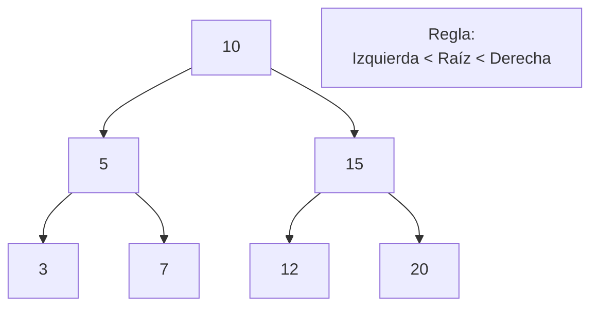

```python
class NodoBST:
    def __init__(self, valor):
        self.valor = valor
        self.izquierdo = None
        self.derecho = None

class BST:
    def __init__(self):
        self.raiz = None

    def insertar(self, valor):
        if not self.raiz:
            self.raiz = NodoBST(valor)
        else:
            self._insertar(self.raiz, valor)

    def _insertar(self, nodo, valor):
        if valor < nodo.valor:
            if nodo.izquierdo:
                self._insertar(nodo.izquierdo, valor)
            else:
                nodo.izquierdo = NodoBST(valor)
        elif valor > nodo.valor:
            if nodo.derecho:
                self._insertar(nodo.derecho, valor)
            else:
                nodo.derecho = NodoBST(valor)

    def buscar(self, valor):
        return self._buscar(self.raiz, valor)

    def _buscar(self, nodo, valor):
        if not nodo:
            return False
        if valor == nodo.valor:
            return True
        elif valor < nodo.valor:
            return self._buscar(nodo.izquierdo, valor)
        else:
            return self._buscar(nodo.derecho, valor)

    # Recorridos
    def inorder(self):
        """Ascendente: 3, 5, 7, 10, 12, 15, 20"""
        resultado = []
        self._inorder(self.raiz, resultado)
        return resultado

    def _inorder(self, nodo, resultado):
        if nodo:
            self._inorder(nodo.izquierdo, resultado)
            resultado.append(nodo.valor)
            self._inorder(nodo.derecho, resultado)

    def preorder(self):
        """Raíz primero: 10, 5, 3, 7, 15, 12, 20"""
        resultado = []
        self._preorder(self.raiz, resultado)
        return resultado

    def _preorder(self, nodo, resultado):
        if nodo:
            resultado.append(nodo.valor)
            self._preorder(nodo.izquierdo, resultado)
            self._preorder(nodo.derecho, resultado)

    def postorder(self):
        """Raíz al final: 3, 7, 5, 12, 20, 15, 10"""
        resultado = []
        self._postorder(self.raiz, resultado)
        return resultado

    def _postorder(self, nodo, resultado):
        if nodo:
            self._postorder(nodo.izquierdo, resultado)
            self._postorder(nodo.derecho, resultado)
            resultado.append(nodo.valor)

# Uso
bst = BST()
for valor in [10, 5, 15, 3, 7, 12, 20]:
    bst.insertar(valor)

print(bst.buscar(7))    # True
print(bst.buscar(99))   # False
print(bst.inorder())    # [3, 5, 7, 10, 12, 15, 20]
```

### Recorridos

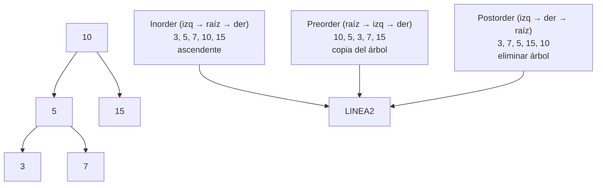

### Complejidad BST

| Operación | Promedio | Peor caso |
|---|---|---|
| **Búsqueda** | O(log n) | O(n) |
| **Inserción** | O(log n) | O(n) |
| **Eliminación** | O(log n) | O(n) |

> ⚡ El peor caso O(n) ocurre cuando el árbol está desbalanceado (ej: insertar 1, 2, 3, 4, 5 → parece una lista vinculada). Para evitarlo se usan árboles balanceados (AVL, Red-Black).

---

## Recursión

Una función se llama a sí misma para resolver un problema dividiéndolo en subproblemas más pequeños.

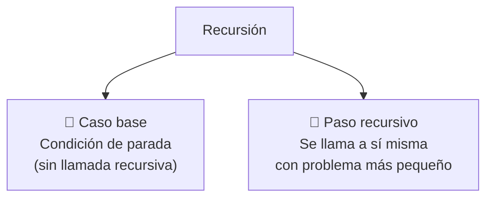

```python
# Factorial: n! = n * (n-1)!
def factorial(n):
    # Caso base
    if n <= 1:
        return 1
    # Paso recursivo
    return n * factorial(n - 1)

print(factorial(5))  # 120

# Fibonacci
def fibonacci(n):
    if n <= 1:
        return n
    return fibonacci(n - 1) + fibonacci(n - 2)

print(fibonacci(7))  # 13

# ** MUY lento sin memoización **
```

### Recursión con memoización

```python
from functools import lru_cache

@lru_cache(maxsize=None)
def fibonacci_memo(n):
    if n <= 1:
        return n
    return fibonacci_memo(n - 1) + fibonacci_memo(n - 2)

print(fibonacci_memo(50))  # 12586269025 (instantáneo)

# Sin memoización, fibonacci(50) tardaría años
```

### Recursión vs Iteración

```python
# Factorial recursivo
def factorial_rec(n):
    return 1 if n <= 1 else n * factorial_rec(n - 1)

# Factorial iterativo
def factorial_iter(n):
    resultado = 1
    for i in range(2, n + 1):
        resultado *= i
    return resultado

# Recorrer árbol binario (recursivo es más natural)
def inorder_rec(nodo):
    if nodo:
        inorder_rec(nodo.izquierdo)
        print(nodo.valor)
        inorder_rec(nodo.derecho)
```

### Problemas clásicos de recursión

```python
# Torres de Hanoi
def hanoi(n, origen, destino, auxiliar):
    if n == 1:
        print(f"Mover disco 1 de {origen} a {destino}")
        return
    hanoi(n - 1, origen, auxiliar, destino)
    print(f"Mover disco {n} de {origen} a {destino}")
    hanoi(n - 1, auxiliar, destino, origen)

hanoi(3, "A", "C", "B")

# Sumar dígitos recursivamente
def suma_digitos(n):
    if n < 10:
        return n
    return n % 10 + suma_digitos(n // 10)

print(suma_digitos(1234))  # 10

# Invertir string recursivamente
def invertir(s):
    if len(s) <= 1:
        return s
    return invertir(s[1:]) + s[0]

print(invertir("Python"))  # "nohtyP"
```

| Aspecto | Recursión | Iteración |
|---|---|---|
| **Código** | Más limpio y expresivo | A veces más verboso |
| **Memoria** | Stack (riesgo de desbordamiento) | Heap (más eficiente) |
| **Rendimiento** | Más lento (llamadas de función) | Más rápido |
| **Problemas** | Árboles, divide y vencerás | Bucles simples |

---

## Algoritmos de ordenamiento

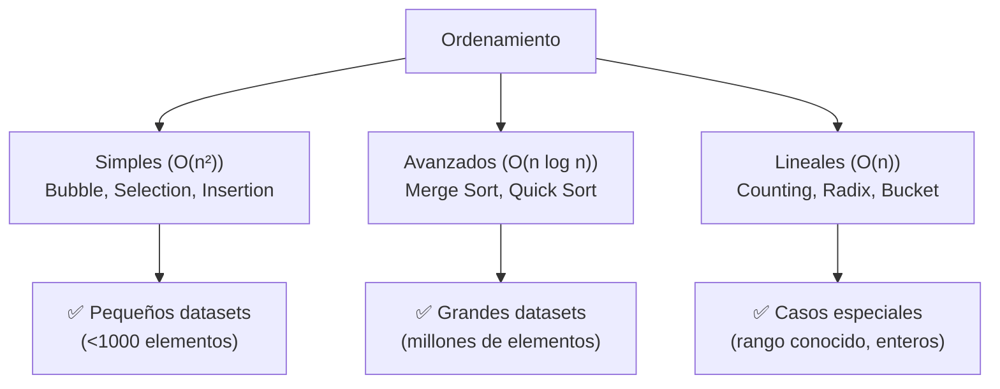

### Bubble Sort

```python
def bubble_sort(arr):
    n = len(arr)
    for i in range(n):
        intercambiado = False
        for j in range(0, n - i - 1):
            if arr[j] > arr[j + 1]:
                arr[j], arr[j + 1] = arr[j + 1], arr[j]
                intercambiado = True
        if not intercambiado:
            break  # Ya está ordenado
    return arr

print(bubble_sort([64, 34, 25, 12, 22, 11, 90]))
```

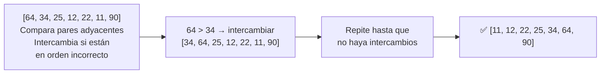

### Selection Sort

```python
def selection_sort(arr):
    n = len(arr)
    for i in range(n):
        min_idx = i
        for j in range(i + 1, n):
            if arr[j] < arr[min_idx]:
                min_idx = j
        arr[i], arr[min_idx] = arr[min_idx], arr[i]
    return arr
```

### Insertion Sort

```python
def insertion_sort(arr):
    for i in range(1, len(arr)):
        llave = arr[i]
        j = i - 1
        while j >= 0 and arr[j] > llave:
            arr[j + 1] = arr[j]
            j -= 1
        arr[j + 1] = llave
    return arr
```

### Merge Sort

```python
def merge_sort(arr):
    if len(arr) <= 1:
        return arr

    mid = len(arr) // 2
    izq = merge_sort(arr[:mid])
    der = merge_sort(arr[mid:])

    return merge(izq, der)

def merge(izq, der):
    resultado = []
    i = j = 0

    while i < len(izq) and j < len(der):
        if izq[i] <= der[j]:
            resultado.append(izq[i])
            i += 1
        else:
            resultado.append(der[j])
            j += 1

    resultado.extend(izq[i:])
    resultado.extend(der[j:])
    return resultado

print(merge_sort([38, 27, 43, 3, 9, 82, 10]))
```

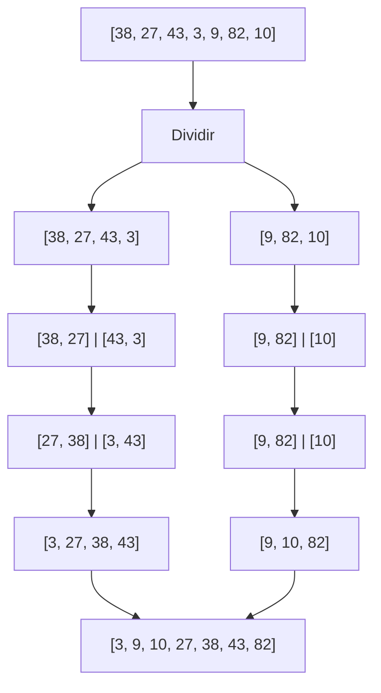

### Quick Sort

```python
def quick_sort(arr):
    if len(arr) <= 1:
        return arr

    pivote = arr[len(arr) // 2]
    izquierda = [x for x in arr if x < pivote]
    medio = [x for x in arr if x == pivote]
    derecha = [x for x in arr if x > pivote]

    return quick_sort(izquierda) + medio + quick_sort(derecha)

print(quick_sort([3, 6, 8, 10, 1, 2, 1]))
```

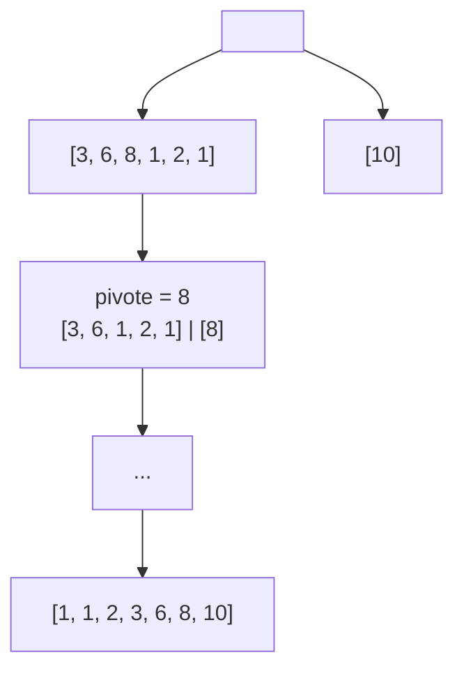

### Comparación de algoritmos

| Algoritmo | Mejor caso | Promedio | Peor caso | Espacio | Estable |
|---|---|---|---|---|---|
| **Bubble Sort** | O(n) | O(n²) | O(n²) | O(1) | ✅ |
| **Selection Sort** | O(n²) | O(n²) | O(n²) | O(1) | ❌ |
| **Insertion Sort** | O(n) | O(n²) | O(n²) | O(1) | ✅ |
| **Merge Sort** | O(n log n) | O(n log n) | O(n log n) | O(n) | ✅ |
| **Quick Sort** | O(n log n) | O(n log n) | O(n²) | O(log n) | ❌ |
| **Python sort** | O(n log n) | O(n log n) | O(n log n) | — | ✅ |

### Python Built-in Sort (Timsort)

```python
# Python usa Timsort (mezcla de Merge + Insertion Sort)
# Muy estable y rápido

arr = [64, 34, 25, 12, 22, 11, 90]
arr.sort()  # in-place
print(arr)  # [11, 12, 22, 25, 34, 64, 90]

# sorted() devuelve nueva lista
ordenada = sorted([64, 34, 25, 12, 22, 11, 90])  # [11, 12, 22, 25, 34, 64, 90]

# Orden personalizado
personas = [("Ana", 25), ("Luis", 30), ("María", 20)]
personas.sort(key=lambda p: p[1])  # por edad
print(personas)  # [('María', 20), ('Ana', 25), ('Luis', 30)]
```

---

## Resumen visual

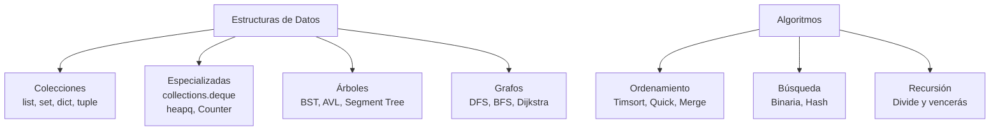

### Guía: ¿Qué estructura usar?

| Necesidad | Estructura recomendada |
|---|---|
| Acceder por índice rápidamente | `list` (array) |
| Búsqueda rápida por clave | `dict` (HashMap) |
| Sin duplicados y búsqueda rápida | `set` (HashSet) |
| FIFO (primero en entrar, primero en salir) | `collections.deque` |
| LIFO (último en entrar, primero en salir) | `list` como pila |
| Prioridad dinámica | `heapq` |
| Datos jerárquicos | BST, Árbol |
| Ordenar muchos datos | `sorted()` o `.sort()` |
