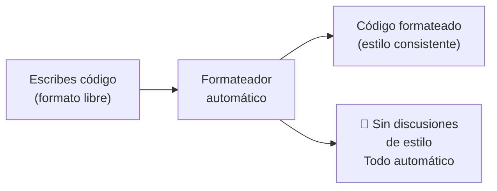
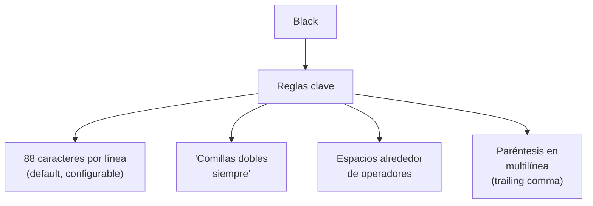
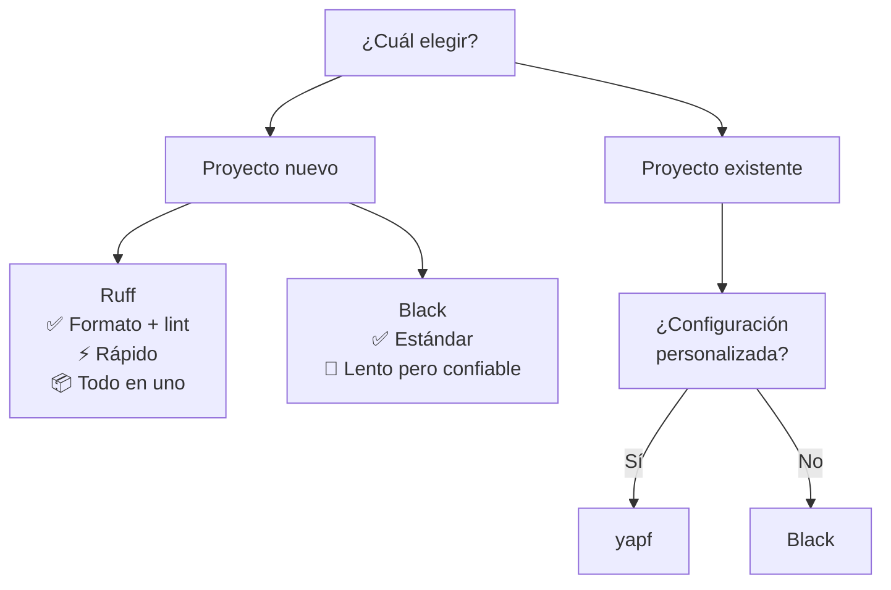
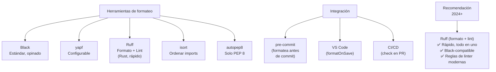

# Formateo de código

Las herramientas de **formateo automático** mantienen un estilo consistente en todo el código sin discusiones humanas.



---

## Black

El formateador más popular. "Opinionado" — no configurables (casi). Formato determinista.

```bash
# Instalar
pip install black

# Formatear archivo(s)
black main.py

# Formatear directorio
black .

# Verificar sin modificar (CI)
black --check .

# Ver diferencia
black --diff main.py

# Configuración (pyproject.toml)
# [tool.black]
# line-length = 88
# target-version = ["py311"]
# include = '\.pyi?$'
# exclude = '''
# /(
#     \.venv
#   | \.git
# )/
# '''
```

### Ejemplo Black

```python
# Antes
def funcion(a,b,c,d=None,e=None,f=None):
    resultado = a+b+c+d+e+f if all([a,b,c]) else None
    return resultado

# Después de Black
def funcion(
    a, b, c, d=None, e=None, f=None
):
    resultado = (
        a + b + c + d + e + f
        if all([a, b, c])
        else None
    )
    return resultado
```



### Black en CI

```yaml
# .github/workflows/lint.yml
name: Lint
on: [push]
jobs:
  black:
    runs-on: ubuntu-latest
    steps:
      - uses: actions/checkout@v4
      - uses: actions/setup-python@v5
      - run: pip install black
      - run: black --check --diff .
```

---

## yapf

Formateador de Google. Más configurable que Black.

```bash
# Instalar
pip install yapf

# Formatear
yapf -i main.py

# Verificar
yapf -d main.py

# Estilos predefinidos
yapf --style=google main.py
yapf --style=facebook main.py
yapf --style=pep8 main.py

# Configuración (.style.yapf)
# [style]
# based_on_style = pep8
# column_limit = 100
# indent_width = 4
# spaces_before_comment = 2
```

### Ejemplo yapf (Google style)

```python
# Antes
def funcion(a,b,c,d=None,e=None,f=None):
    resultado = a+b+c+d+e+f if all([a,b,c]) else None
    return resultado

# Después de yapf --style=google
def funcion(a, b, c, d=None, e=None, f=None):
    resultado = a + b + c + d + e + f if all([a, b, c]) else None
    return resultado
```

---

## Ruff

Herramienta moderna (Rust) que combina **formateo** + **linting**. Extremadamente rápida.

```bash
# Instalar
pip install ruff

# Formatear (v0.0.289+)
ruff format .

# Lint + fix
ruff check --fix .

# Formatear y lint en un paso
ruff format . && ruff check --fix .

# Configuración (pyproject.toml)
# [tool.ruff]
# line-length = 88
# target-version = "py311"
#
# [tool.ruff.format]
# quote-style = "double"
# indent-style = "space"
#
# [tool.ruff.lint]
# select = ["E", "F", "I", "N", "W"]
# ignore = ["E501"]
```

### Ruff vs Black (formateo)

Ruff `format` es compatible con Black en ~99% de los casos, pero **10-100x más rápido**.

```bash
# Benchmark
time black .    # ~5s (Python)
time ruff format .  # ~0.05s (Rust)
```

---

## Tabla comparativa

| Herramienta | Lenguaje | Velocidad | Configurable | Linter | Función principal |
|---|---|---|---|---|---|
| **Black** | Python | 🐢 Lento | ❌ Poco | ❌ No | Formatear |
| **yapf** | Python | 🐢 Lento | ✅ Mucho | ❌ No | Formatear |
| **Ruff** | Rust | ⚡ Muy rápido | ✅ Medio | ✅ Sí | Formatear + Lint |
| **autopep8** | Python | 🐢 Lento | ✅ Medio | ❌ No | Formatear (PEP 8) |
| **isort** | Python | 🐢 Lento | ✅ Medio | ❌ No | Ordenar imports |



---

## isort (ordenar imports)

```bash
pip install isort

# Formatear
isort main.py

# Verificar
isort --check main.py

# Black compatible
isort --profile black main.py
```

```python
# Antes
import sys
import os
from flask import Flask
import json

# Después de isort
import json
import os
import sys

from flask import Flask
```

---

## Integración en el flujo de trabajo

### Pre-commit hooks (automático antes de commit)

```yaml
# .pre-commit-config.yaml
repos:
  - repo: https://github.com/astral-sh/ruff-pre-commit
    rev: v0.3.0
    hooks:
      - id: ruff
        args: [--fix]
      - id: ruff-format

  - repo: https://github.com/pycqa/isort
    rev: 5.13.2
    hooks:
      - id: isort
        args: ["--profile", "black"]
```

```bash
pip install pre-commit
pre-commit install
# Ahora cada `git commit` formatea automáticamente
```

### VS Code (settings.json)

```json
{
  "[python]": {
    "editor.formatOnSave": true,
    "editor.defaultFormatter": "charliermarsh.ruff",
    "editor.codeActionsOnSave": {
      "source.organizeImports": "explicit"
    }
  }
}
```

### Makefile

```makefile
.PHONY: format lint

format:
	ruff format .
	ruff check --fix .

lint:
	ruff check .
	mypy .
```

---

## Configuración recomendada (pyproject.toml)

```toml
[project]
name = "mi-proyecto"
version = "0.1.0"

[tool.ruff]
line-length = 88
target-version = "py311"

[tool.ruff.format]
quote-style = "double"

[tool.ruff.lint]
select = [
    "E",   # pycodestyle errors
    "F",   # pyflakes
    "I",   # isort
    "N",   # pep8-naming
    "W",   # pycodestyle warnings
    "UP",  # pyupgrade
    "B",   # flake8-bugbear
]
ignore = [
    "E501",  # línea muy larga (ruff format se encarga)
]

[tool.ruff.lint.per-file-ignores]
"__init__.py" = ["F401"]  # import no usado en __init__
"tests/*" = ["N"]         # no verificar naming en tests

[tool.ruff.lint.mccabe]
max-complexity = 10
```

---

## Resumen visual


