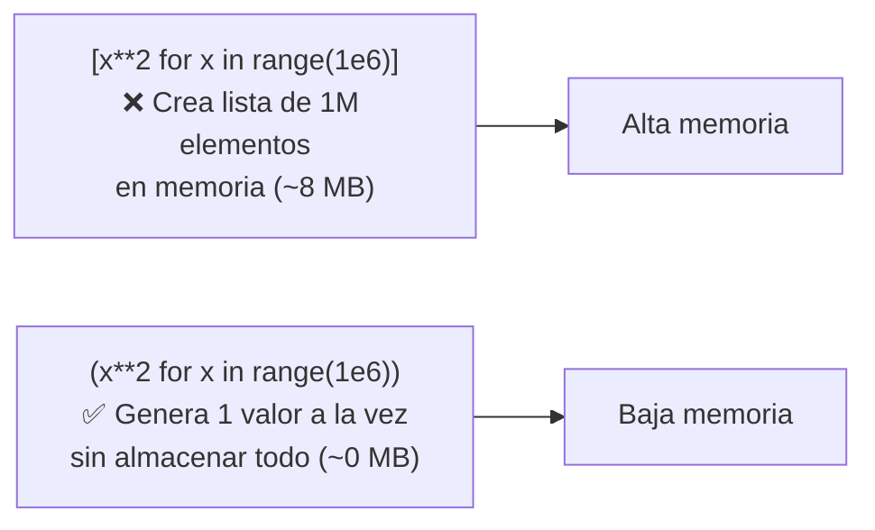
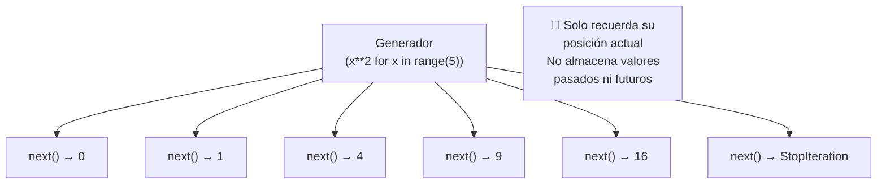
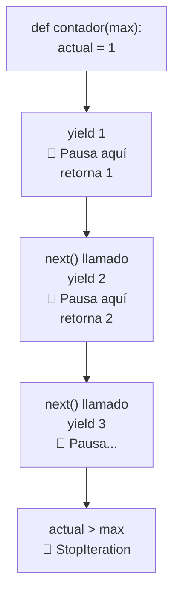
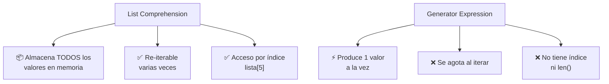
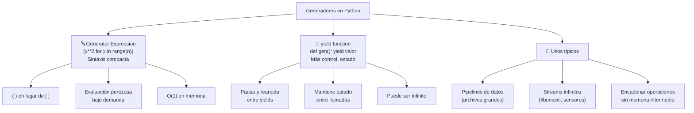

# Generador de Expresiones (Generator Expressions)

Los **generadores** son una forma de crear iteradores de manera simple y eficiente. Producen valores **bajo demanda** en lugar de almacenarlos todos en memoria.



---

## Sintaxis básica

Usan paréntesis `()` en lugar de corchetes `[]` (como list comprehension pero perezosa).

```python
# List comprehension (carga todo en memoria)
cuadrados_lista = [x ** 2 for x in range(10)]
print(type(cuadrados_lista))  # <class 'list'>
print(cuadrados_lista)        # [0, 1, 4, 9, 16, 25, 36, 49, 64, 81]

# Generator expression (bajo demanda)
cuadrados_gen = (x ** 2 for x in range(10))
print(type(cuadrados_gen))    # <class 'generator'>
print(cuadrados_gen)          # <generator object <genexpr> at 0x...>
```

### Iterar sobre un generador

```python
# Usar en un for (el generador produce un valor a la vez)
gen = (x ** 2 for x in range(5))
for valor in gen:
    print(valor)  # 0, 1, 4, 9, 16

# El generador se agota después de iterarlo
print(list(gen))  # [] (vacío, ya se consumió)

# Convertir a lista (consume el generador)
gen = (x ** 2 for x in range(5))
lista = list(gen)
print(lista)  # [0, 1, 4, 9, 16]
```



---

## La palabra clave `yield`

Los generadores también se crean con funciones que usan `yield` en lugar de `return`.

```python
def contador(maximo):
    actual = 1
    while actual <= maximo:
        yield actual  # produce un valor y pausa la función
        actual += 1

gen = contador(5)
print(next(gen))  # 1 (la función se pausa aquí)
print(next(gen))  # 2 (continúa desde donde se pausó)

# O recorrerlo con for
for num in contador(5):
    print(num)  # 1, 2, 3, 4, 5
```



### return vs yield

```python
# return: termina la función, devuelve un valor
def cuadrados_lista(n):
    resultado = []
    for x in range(n):
        resultado.append(x ** 2)
    return resultado  # todo de golpe

# yield: produce un valor y pausa
def cuadrados_gen(n):
    for x in range(n):
        yield x ** 2  # uno a la vez
```

| Aspecto | return | yield |
|---|---|---|
| **Estado** | Termina la función | Pausa y reanuda |
| **Memoria** | Acumula resultados | Produce bajo demanda |
| **Re-iterable** | ✅ Sí (devuelve lista) | ❌ No (se agota) |
| **Uso** | Valores finitos conocidos | Streams, secuencias grandes |

---

## Generator Expression vs List Comprehension

```python
import sys

# Memoria
lista = [x for x in range(1_000_000)]
gen = (x for x in range(1_000_000))

print(sys.getsizeof(lista))  # ~8,000,056 bytes (~8 MB)
print(sys.getsizeof(gen))    # ~112 bytes (SIEMPRE el mismo tamaño)

# Velocidad de creación
import timeit

t_lista = timeit.timeit('[x**2 for x in range(1000)]', number=10000)
t_gen = timeit.timeit('(x**2 for x in range(1000))', number=10000)

print(f"List comprehension: {t_lista:.4f}s")  # ~0.3s
print(f"Generator expression: {t_gen:.4f}s")  # ~0.0001s (casi instantáneo)
```



### ¿Cuándo usar qué?

```python
# ✅ Usa GENERADOR cuando:
# 1. Trabajas con muchos datos (no caben en memoria)
suma = sum(x ** 2 for x in range(10_000_000))  # sin ocupar memoria

# 2. Solo necesitas iterar una vez
for linea in (line.strip() for line in open("archivo_grande.txt")):
    procesar(linea)

# 3. Pipe de operaciones
datos = (x for x in range(100))
datos = (x * 2 for x in datos)
datos = (x for x in datos if x > 10)

# ✅ Usa LISTA cuando:
# 1. Necesitas re-iterar varias veces
cuadrados = [x ** 2 for x in range(100)]
print(sum(cuadrados))
print(max(cuadrados))

# 2. Necesitas acceso por índice
print(cuadrados[5])  # 25

# 3. Necesitas modificar la lista
cuadrados.append(10000)
```

---

## Funciones generadoras avanzadas

### yield from (delegar a otro generador)

```python
def cadena_generadores():
    yield from range(3)      # 0, 1, 2
    yield from "ABC"         # 'A', 'B', 'C'
    yield from [10, 20]      # 10, 20

print(list(cadena_generadores()))
# [0, 1, 2, 'A', 'B', 'C', 10, 20]

# Equivalente sin yield from:
def cadena_generadores():
    for x in range(3):
        yield x
    for c in "ABC":
        yield c
    for n in [10, 20]:
        yield n
```

### Generador infinito

```python
def fibonacci():
    a, b = 0, 1
    while True:          # infinito
        yield a
        a, b = b, a + b

fib = fibonacci()
for _ in range(10):
    print(next(fib), end=" ")  # 0 1 1 2 3 5 8 13 21 34

# Obtener el fib(50)
fib = fibonacci()
for _ in range(51):
    valor = next(fib)
print(fib(50))  # 12586269025
```

### Pipeline con generadores

```python
# Pipeline de procesamiento (cada paso es un generador)
def leer_archivo(ruta):
    with open(ruta) as f:
        for linea in f:
            yield linea

def limpiar_lineas(lineas):
    for linea in lineas:
        linea = linea.strip()
        if linea and not linea.startswith("#"):  # ignorar vacías y comentarios
            yield linea

def parsear_csv(lineas):
    for linea in lineas:
        yield linea.split(",")

def filtrar_por_pais(datos, pais):
    for fila in datos:
        if fila[2] == pais:  # columna pais
            yield fila

# Pipeline completo (sin cargar nada en memoria)
pipeline = filtrar_por_pais(
    parsear_csv(
        limpiar_lineas(
            leer_archivo("datos.csv")
        )
    ),
    "México"
)

for fila in pipeline:
    print(fila)
```

### stateful generator

```python
# Generador con estado (mantiene variables entre yields)
def promedio_movil():
    total = 0
    count = 0
    promedio = None
    while True:
        valor = yield promedio  # recibe valor con send()
        if valor is not None:
            total += valor
            count += 1
            promedio = total / count

gen = promedio_movil()
next(gen)  # avanzar al primer yield (o gen.send(None))

print(gen.send(10))  # 10.0
print(gen.send(20))  # 15.0
print(gen.send(30))  # 20.0

gen.close()  # cerrar generador
```

---

## Expresiones generadoras en funciones built-in

```python
# sum: suma de generador (sin crear lista intermedia)
suma = sum(x ** 2 for x in range(1_000_000))
print(suma)  # 333332833333500

# min / max
nums = [3, 1, 4, 1, 5, 9, 2, 6]
min_cuad = min(x ** 2 for x in nums)
print(min_cuad)  # 1

# any / all
print(any(x > 5 for x in nums))   # True (alguno > 5)
print(all(x < 10 for x in nums))  # True (todos < 10)

# map / filter
cuadrados = map(lambda x: x ** 2, range(10))     # iterador
pares = filter(lambda x: x % 2 == 0, range(20))  # iterador

# Sin paréntesis extra (el generador no necesita doble paréntesis)
suma = sum(x ** 2 for x in range(100))         # ✅ correcto
suma = sum((x ** 2 for x in range(100)))        # ✅ también (innecesario)
```

---

## Patrones comunes con generadores

### Chunking (procesar en lotes)

```python
def chunks(iterable, tamano):
    """Divide un iterable en lotes de tamaño fijo"""
    batch = []
    for elem in iterable:
        batch.append(elem)
        if len(batch) == tamano:
            yield batch
            batch = []
    if batch:
        yield batch

numeros = range(10)
for lote in chunks(numeros, 3):
    print(lote)
# [0, 1, 2]
# [3, 4, 5]
# [6, 7, 8]
# [9]
```

### Take (primeros N elementos)

```python
from itertools import islice

def primeros_n(iterable, n):
    """Toma los primeros n elementos de cualquier iterable"""
    return islice(iterable, n)

# Primeros 10 de Fibonacci
fib = fibonacci()
print(list(primeros_n(fib, 10)))  # [0, 1, 1, 2, 3, 5, 8, 13, 21, 34]

# Primeros 5 números pares al cuadrado
nums = (x ** 2 for x in range(100) if x % 2 == 0)
print(list(primeros_n(nums, 5)))  # [0, 4, 16, 36, 64]
```

### Generador como iterador circular

```python
def circular(iterable):
    """Itera infinitamente sobre un iterable"""
    while True:
        for elemento in iterable:
            yield elemento

colores = circular(["rojo", "verde", "azul"])
for _ in range(7):
    print(next(colores))  # rojo, verde, azul, rojo, verde, azul, rojo
```

---

## Rendimiento y buenas prácticas

```python
# ✅ BUENO: usar generador para datos grandes
def procesar_grande():
    with open("archivo_100gb.txt") as f:
        for linea in f:
            yield procesar(linea)

# ❌ MALO: cargar todo en memoria
def procesar_grande():
    with open("archivo_100gb.txt") as f:
        return [procesar(linea) for linea in f.readlines()]
        # 100 GB en memoria 😱

# ✅ BUENO: pipeline eficiente
ventas = (
    float(precio) * cantidad
    for linea in open("ventas.csv")
    for _, precio, cantidad in [linea.strip().split(",")]
)
total = sum(ventas)  # procesa línea por línea

# ✅ BUENO: evitar paréntesis extra
sum(x**2 for x in range(100))       # ✅
sum((x**2 for x in range(100)))      # ✅ (innecesario)

# ✅ BUENO: itertools consume generadores eficientemente
from itertools import chain, product
pares = ((x, y) for x in range(100) for y in range(100))
primeros = list(islice(pares, 10))
```

### Comparación final

| Aspecto | List Comprehension | Generator Expression |
|---|---|---|
| **Sintaxis** | `[expr for x in it]` | `(expr for x in it)` |
| **Evaluación** | Inmediata (todo en memoria) | Perezosa (bajo demanda) |
| **Memoria** | O(n) | O(1) |
| **Velocidad creación** | Más lenta | Instantánea |
| **Velocidad iteración** | Más rápida | Similar |
| **Re-iterable** | ✅ Sí | ❌ No |
| **Índice** | ✅ Sí | ❌ No |
| **len()** | ✅ Sí | ❌ No |
| **Cuándo usar** | Pocos datos, re-iterar | Muchos datos, un solo pase |

---

## Resumen visual



### Guía rápida

```python
# Creación
gen = (x**2 for x in range(10))          # expression
def gen(): yield from range(10)          # función

# Consumo
for valor in gen: ...
next(gen)
list(gen), sum(gen), max(gen), min(gen)

# Herramientas útiles
from itertools import islice, chain, cycle
next(gen)
gen.send(valor)    # enviar valor (generadores bidireccionales)
gen.close()        # cerrar generador
```
