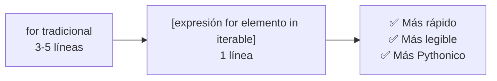
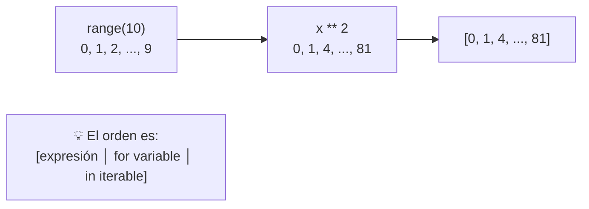
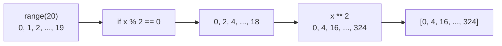
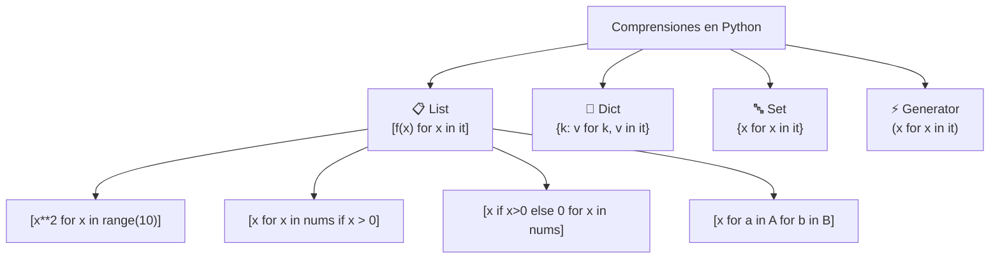

# List Comprehensions

Las **list comprehensions** (comprensiones de listas) son una forma concisa y elegante de crear listas en Python. Son más rápidas y legibles que los bucles tradicionales para muchos casos.



---

## Sintaxis básica

```python
# Sintaxis general:
[expresión for elemento in iterable]

# Equivalente con for:
resultado = []
for elemento in iterable:
    resultado.append(expresión)
```

### Ejemplo básico

```python
# Cuadrados de números (con for)
cuadrados = []
for x in range(10):
    cuadrados.append(x ** 2)
print(cuadrados)  # [0, 1, 4, 9, 16, 25, 36, 49, 64, 81]

# Con list comprehension
cuadrados = [x ** 2 for x in range(10)]
print(cuadrados)  # [0, 1, 4, 9, 16, 25, 36, 49, 64, 81]
```



### Con filtro (if)

```python
# Solo pares (con for)
pares = []
for x in range(20):
    if x % 2 == 0:
        pares.append(x)
print(pares)  # [0, 2, 4, 6, 8, 10, 12, 14, 16, 18]

# Con list comprehension
pares = [x for x in range(20) if x % 2 == 0]
print(pares)  # [0, 2, 4, 6, 8, 10, 12, 14, 16, 18]

# Números pares al cuadrado
pares_cuad = [x ** 2 for x in range(20) if x % 2 == 0]
print(pares_cuad)  # [0, 4, 16, 36, 64, 100, 144, 196, 256, 324]
```



### Con if-else (expresión condicional)

```python
# if-else va ANTES del for (en la expresión)
resultado = ["par" if x % 2 == 0 else "impar" for x in range(10)]
print(resultado)
# ['par', 'impar', 'par', 'impar', 'par', 'impar', 'par', 'impar', 'par', 'impar']

# Números: el doble si es par, el triple si es impar
nums = [x * 2 if x % 2 == 0 else x * 3 for x in range(10)]
print(nums)  # [0, 3, 4, 9, 8, 15, 12, 21, 16, 27]
```

### Anidadas (bucles múltiples)

```python
# Producto cartesiano
pares = [(x, y) for x in range(3) for y in range(3)]
print(pares)
# [(0, 0), (0, 1), (0, 2), (1, 0), (1, 1), (1, 2), (2, 0), (2, 1), (2, 2)]

# Equivalente con for anidado
pares = []
for x in range(3):
    for y in range(3):
        pares.append((x, y))

# Tabla de multiplicar
tabla = [f"{i} x {j} = {i * j}" for i in range(1, 4) for j in range(1, 4)]
print(tabla)
# ['1 x 1 = 1', '1 x 2 = 2', '1 x 3 = 3', '2 x 1 = 2', ...]
```

---

## Casos de uso comunes

### Transformar datos

```python
# Strings a mayúsculas
nombres = ["ana", "luis", "maría"]
mayusculas = [n.upper() for n in nombres]
print(mayusculas)  # ['ANA', 'LUIS', 'MARÍA']

# Extraer información
usuarios = [
    {"nombre": "Ana", "email": "ana@mail.com"},
    {"nombre": "Luis", "email": "luis@mail.com"},
    {"nombre": "María", "email": "maria@mail.com"},
]
emails = [u["email"] for u in usuarios]
print(emails)  # ['ana@mail.com', 'luis@mail.com', 'maria@mail.com']
```

### Filtrar datos

```python
# Strings de más de 3 caracteres
palabras = ["sol", "luna", "mar", "estrella", "azul"]
largas = [p for p in palabras if len(p) > 3]
print(largas)  # ['luna', 'estrella', 'azul']

# Filtrar por tipo
mixto = [1, "hola", 3.14, True, "mundo", 42]
solo_strings = [x for x in mixto if isinstance(x, str)]
print(solo_strings)  # ['hola', 'mundo']

# Filtrar None
datos = [1, None, 3, None, 5, None]
limpios = [x for x in datos if x is not None]
print(limpios)  # [1, 3, 5]
```

### Aplanar listas

```python
# Matriz 2D → lista plana
matriz = [
    [1, 2, 3],
    [4, 5, 6],
    [7, 8, 9]
]
plana = [num for fila in matriz for num in fila]
print(plana)  # [1, 2, 3, 4, 5, 6, 7, 8, 9]

# Aplanar lista de listas
lista_de_listas = [[1, 2], [3, 4, 5], [6], [7, 8, 9]]
plana = [x for sublista in lista_de_listas for x in sublista]
print(plana)  # [1, 2, 3, 4, 5, 6, 7, 8, 9]
```

### Clasificar datos

```python
# Separar en pares e impares
numeros = range(1, 21)
pares = [n for n in numeros if n % 2 == 0]
impares = [n for n in numeros if n % 2 != 0]
print(pares)    # [2, 4, 6, 8, 10, 12, 14, 16, 18, 20]
print(impares)  # [1, 3, 5, 7, 9, 11, 13, 15, 17, 19]

# Clasificar por categoría (strings)
frutas = ["manzana", "pera", "mango", "mandarina", "uva", "melón"]
con_m = [f for f in frutas if f.startswith("m")]
print(con_m)  # ['manzana', 'mango', 'mandarina', 'melón']
sin_m = [f for f in frutas if not f.startswith("m")]
print(sin_m)  # ['pera', 'uva']
```

---

## Comprensiones anidadas con if

```python
# Múltiples condiciones
nums = [x for x in range(50) if x % 2 == 0 if x % 5 == 0]
print(nums)  # [0, 10, 20, 30, 40]
# Equivalente: if x % 2 == 0 and x % 5 == 0

# if en bucle interno
pares = [(x, y) for x in range(5) for y in range(5) if x < y]
print(pares)
# [(0, 1), (0, 2), (0, 3), (0, 4), (1, 2), (1, 3), (1, 4), (2, 3), (2, 4), (3, 4)]
```

---

## Comprensiones para otras estructuras

### Dict comprehension

```python
# {clave: valor for elemento in iterable}
cuadrados = {x: x ** 2 for x in range(5)}
print(cuadrados)  # {0: 0, 1: 1, 2: 4, 3: 9, 4: 16}

# Con filtro
pares_cuad = {x: x ** 2 for x in range(10) if x % 2 == 0}
print(pares_cuad)  # {0: 0, 2: 4, 4: 16, 6: 36, 8: 64}

# Invertir clave/valor
original = {"a": 1, "b": 2, "c": 3}
invertido = {v: k for k, v in original.items()}
print(invertido)  # {1: 'a', 2: 'b', 3: 'c'}

# Transformar valores
nombres = ["ana", "luis", "maría"]
longitudes = {n: len(n) for n in nombres}
print(longitudes)  # {'ana': 3, 'luis': 4, 'maría': 5}
```

### Set comprehension

```python
# {expresión for elemento in iterable}
numeros = [1, 2, 2, 3, 3, 3, 4, 4, 4, 4]
unicos = {x for x in numeros}
print(unicos)  # {1, 2, 3, 4} (sin duplicados)

# Set con filtro
pares_unicos = {x for x in range(10) if x % 2 == 0}
print(pares_unicos)  # {0, 2, 4, 6, 8}

# Strings únicas (primera letra)
nombres = ["Ana", "Alberto", "Luis", "María", "Andrés"]
primeras = {n[0] for n in nombres}
print(primeras)  # {'M', 'L', 'A'}
```

### Generator comprehension (tupla perezosa)

```python
# (expresión for elemento in iterable) → genera bajo demanda
cuadrados = (x ** 2 for x in range(10_000_000))
print(type(cuadrados))  # <class 'generator'>

# No ocupa memoria (genera bajo demanda)
for i, val in enumerate(cuadrados):
    if i > 5:
        break
    print(val)  # 0, 1, 4, 9, 16, 25

# Convertir a lista cuando se necesita
lista = list(cuadrados)  # consume el generador

# Suma con generator (sin crear lista)
suma = sum(x ** 2 for x in range(1_000_000))
print(suma)  # 333332833333500 (sin ocupar memoria de la lista)
```

---

## Anidadas complejas

```python
# Transponer matriz
matriz = [
    [1, 2, 3],
    [4, 5, 6],
    [7, 8, 9]
]
transpuesta = [[fila[i] for fila in matriz] for i in range(3)]
print(transpuesta)
# [[1, 4, 7], [2, 5, 8], [3, 6, 9]]

# Matriz identidad 3x3
identidad = [[1 if i == j else 0 for j in range(3)] for i in range(3)]
print(identidad)
# [[1, 0, 0], [0, 1, 0], [0, 0, 1]]

# Triángulo de Pascal
def pascal(n):
    fila = [1]
    yield fila
    for _ in range(n - 1):
        fila = [1] + [fila[i] + fila[i + 1] for i in range(len(fila) - 1)] + [1]
        yield fila

print(list(pascal(5)))
# [[1], [1, 1], [1, 2, 1], [1, 3, 3, 1], [1, 4, 6, 4, 1]]

# Producto cartesiano con comprensión anidada
colores = ["rojo", "azul"]
tallas = ["S", "M", "L"]
combinaciones = [(c, t) for c in colores for t in tallas]
print(combinaciones)
# [('rojo', 'S'), ('rojo', 'M'), ('rojo', 'L'), ('azul', 'S'), ('azul', 'M'), ('azul', 'L')]
```

---

## Rendimiento

```python
import timeit

# List comprehension es más rápido que for loop
def con_for():
    resultado = []
    for i in range(1000):
        resultado.append(i ** 2)
    return resultado

def con_comprehension():
    return [i ** 2 for i in range(1000)]

# Tiempo de ejecución (generalmente 30-50% más rápido con comprehension)
print(timeit.timeit(con_for, number=10000))           # ~0.5s
print(timeit.timeit(con_comprehension, number=10000)) # ~0.3s 🚀
```

| Operación | For tradicional | List comprehension | Diferencia |
|---|---|---|---|
| Cuadrados (1000 elem) | ~0.5s | ~0.3s | 40% más rápido |
| Filtrar pares (1000 elem) | ~0.4s | ~0.2s | 50% más rápido |
| Anidado (100x100) | ~0.6s | ~0.4s | 33% más rápido |

---

## Errores comunes

```python
# ❌ Error común: if-else en posición incorrecta
# [x for x in range(10) if x % 2 == 0 else x * 2]
# SyntaxError: if-else va en la expresión, no en el filtro

# ✅ if-else correcto
resultado1 = [x * 2 if x % 2 == 0 else x for x in range(10)]

# ✅ if solo (filtro) correcto
resultado2 = [x for x in range(10) if x % 2 == 0]

# ❌ Demasiado complejo (ilegible)
# flat = [x for xs in a for ys in b for zs in c for x in xs for y in ys for z in zs if x > y if y > z]

# ✅ Mejor: dividir en pasos o usar for normal
# La legibilidad importa más que la brevedad

# ❌ No uses list comprehension por副作用 (side effects)
# [print(x) for x in range(5)]  # funciona, pero es mala práctica
# ✅ Mejor: for x in range(5): print(x)
```

---

## Resumen visual



### Guía rápida

| Estructura | Sintaxis | Ejemplo | Resultado |
|---|---|---|---|
| **Lista** | `[expr for x in it]` | `[x**2 for x in range(5)]` | `[0, 1, 4, 9, 16]` |
| **Lista c/filtro** | `[expr for x in it if cond]` | `[x for x in range(10) if x%2==0]` | `[0, 2, 4, 6, 8]` |
| **Lista c/if-else** | `[expr1 if c else expr2 for x in it]` | `["par" if x%2==0 else "impar" for x in range(3)]` | `['par', 'impar', 'par']` |
| **Diccionario** | `{k: v for k, v in it}` | `{x: x**2 for x in range(3)}` | `{0: 0, 1: 1, 2: 4}` |
| **Set** | `{expr for x in it}` | `{x%3 for x in range(10)}` | `{0, 1, 2}` |
| **Generator** | `(expr for x in it)` | `(x**2 for x in range(1e6))` | `generator object` |
