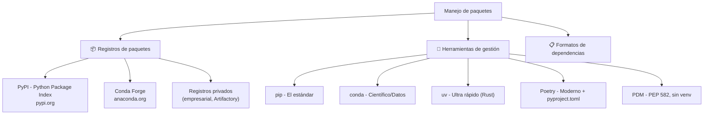
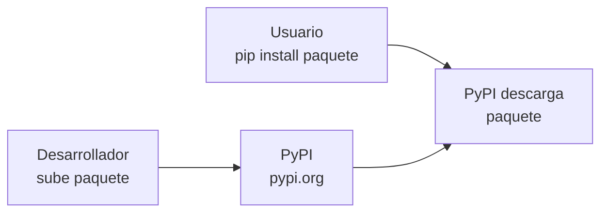
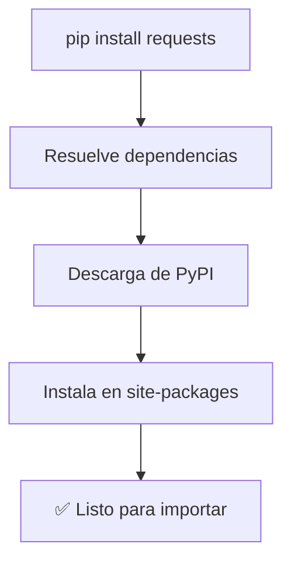
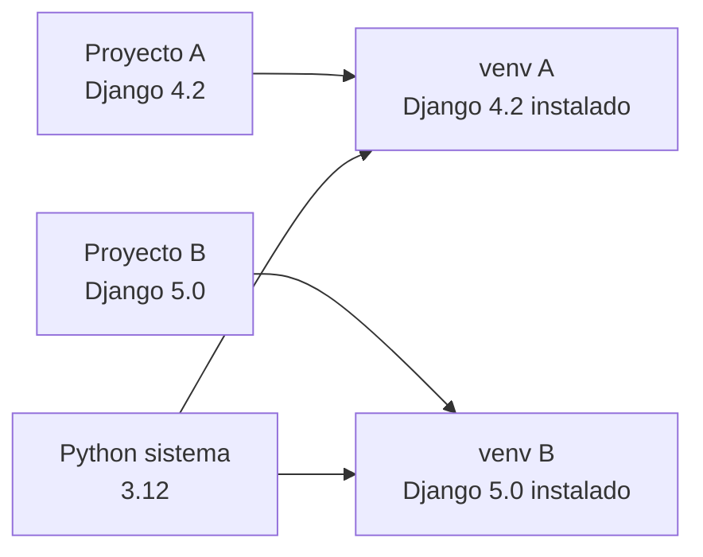
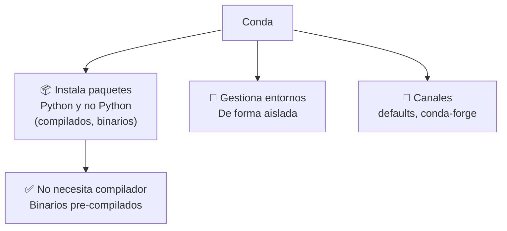
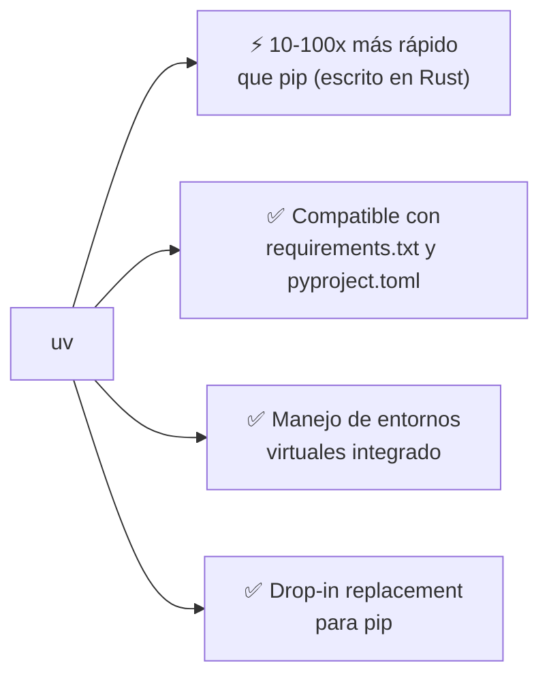
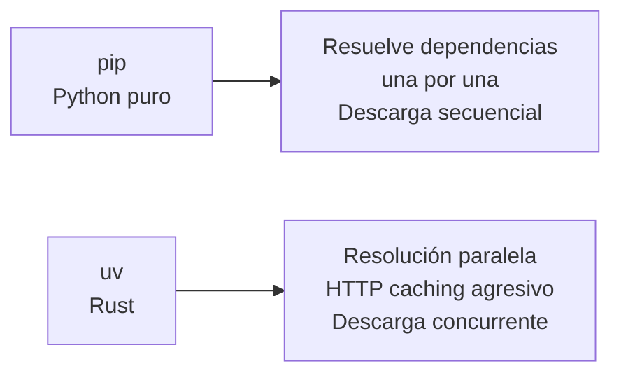
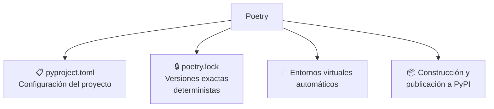
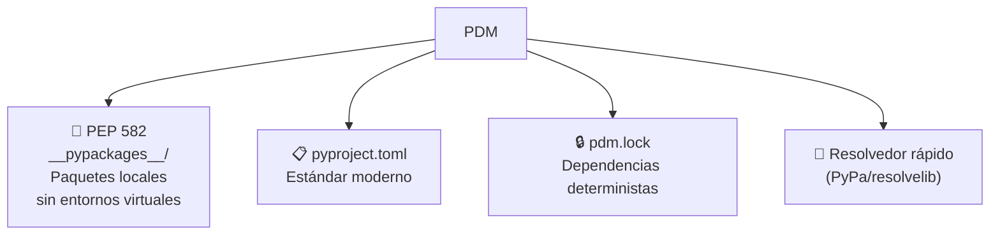
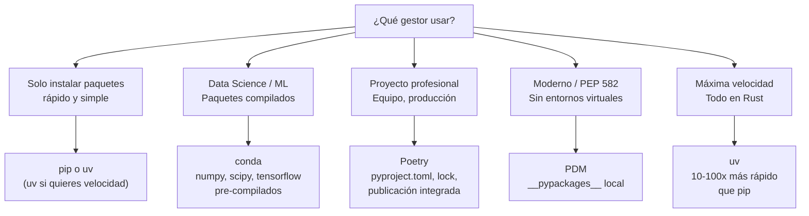

# Manejo de paquetería

La gestión de paquetes en Python permite instalar, actualizar y gestionar bibliotecas de terceros de forma sencilla.



---

## PyPI

**PyPI** (Python Package Index) es el repositorio oficial de paquetes Python. Alberga más de 500,000 proyectos.



```bash
# PyPI es el lugar de donde pip descarga paquetes por defecto
# pip install requests  → busca en https://pypi.org/simple/requests
```

### Publicar en PyPI

```bash
# 1. Crear estructura del paquete
mi_paquete/
    pyproject.toml
    src/
        mi_paquete/
            __init__.py
            modulo.py

# 2. Instalar herramientas de publicación
pip install build twine

# 3. Construir el paquete
python -m build

# 4. Subir a PyPI
twine upload dist/*
```

---

## Pip

**pip** (Pip Installs Packages) es el gestor de paquetes oficial de Python.



### Comandos esenciales

```bash
# Instalar paquetes
pip install requests                      # última versión
pip install requests==2.28.0              # versión específica
pip install requests>=2.0,<3.0            # rango de versiones
pip install requests[security]            # extras
pip install -r requirements.txt           # desde archivo

# Instalar desde diferentes fuentes
pip install git+https://github.com/user/repo.git  # desde git
pip install ./paquete_local               # desde local
pip install -e ./paquete_local            # modo editable (desarrollo)

# Desinstalar
pip uninstall requests

# Listar paquetes
pip list                                  # paquetes instalados
pip list --outdated                        # paquetes desactualizados

# Información
pip show requests                         # detalles del paquete
pip check                                 # verificar dependencias

# Congelar (guardar dependencias)
pip freeze > requirements.txt             # guarda todo
pip list --format=freeze > requirements.txt

# Búsqueda
pip search termino                        # buscar en PyPI (obsoleto en algunos)
```

### requirements.txt

```txt
# requirements.txt
requests==2.28.0
numpy>=1.21.0,<2.0.0
pandas
# Esto es un comentario
flask~=2.3.0  # compatible: >=2.3.0, <2.4.0
```

```bash
# Instalar dependencias
pip install -r requirements.txt

# Generar desde entorno actual
pip freeze > requirements.txt
```

### Entornos virtuales



```bash
# Crear entorno virtual
python -m venv .venv

# Activar (Linux/Mac)
source .venv/bin/activate

# Activar (Windows)
.venv\Scripts\activate

# Desactivar
deactivate

# Con virtualenvwrapper (alternativa)
mkvirtualenv mi_proyecto
workon mi_proyecto
deactivate
```

---

## Conda

**Conda** es un gestor de paquetes y entornos multiplataforma, popular en data science y machine learning.



### Comandos esenciales

```bash
# Instalar conda (Miniconda o Anaconda)
# Descargar de https://docs.conda.io/en/latest/miniconda.html

# Gestionar paquetes
conda install numpy pandas matplotlib
conda install -c conda-forge opencv   # desde canal específico
conda update numpy
conda remove numpy

# Gestionar entornos
conda create -n mi_proyecto python=3.12
conda activate mi_proyecto
conda deactivate
conda env list                        # listar entornos
conda env remove -n mi_proyecto

# Exportar/Importar entornos
conda env export > environment.yml    # exportar
conda env create -f environment.yml   # importar

# Información
conda list                            # paquetes instalados
conda info                            # info de conda
conda search numpy                    # buscar versiones
```

### Conda vs pip

| Característica | pip | conda |
|---|---|---|
| **Paquetes** | Solo Python | Python + C, R, binarios |
| **Dependencias** | Resuelve Python | Resuelve cualquier dependencia |
| **Entornos** | Con venv/venv | Integrado nativamente |
| **Canales** | PyPI | conda-forge, defaults |
| **Binarios** | Compila en instalación | Pre-compilados |
| **Científico** | Manual (numpy, scipy) | Optimizado (MKL, Intel) |
| **Espacio** | Ligero | Más pesado |

### Cuándo usar qué

```bash
# ✅ Usa pip para:
pip install flask requests pytest  # paquetes Python puros

# ✅ Usa conda para:
conda install numpy scipy pandas tensorflow  # data science

# ⚠️ Mezclar pip y conda:
# 1. Instalar con conda primero
# 2. pip después (solo si no está en conda-forge)
# 3. No hacer pip install después de conda install si evitarlo
```

---

## uv

**uv** es un gestor de paquetes Python escrito en **Rust**, extremadamente rápido (10-100x más rápido que pip).



### Comandos esenciales

```bash
# Instalar uv
curl -LsSf https://astral.sh/uv/install.sh | sh
# o con pip
pip install uv

# Como reemplazo de pip (mucho más rápido)
uv pip install requests
uv pip install -r requirements.txt
uv pip freeze > requirements.txt

# Gestión de proyectos (uv 0.1+)
uv init mi_proyecto        # crea proyecto con pyproject.toml
uv add requests            # añade dependencia
uv remove requests         # elimina dependencia
uv sync                    # instala todas las dependencias
uv lock                    # genera uv.lock

# Entornos virtuales
uv venv                    # crea .venv (similar a python -m venv)
uv venv activate           # activar

# Compilar requirements
uv pip compile requirements.in > requirements.txt
uv pip sync requirements.txt

# Ejecutar sin instalar
uvx ruff check .           # como npx, ejecuta sin instalar
```

### Por qué uv es más rápido



```bash
# Comparación de velocidad
time pip install requests    # ~2-5 segundos
time uv pip install requests # ~0.2-0.5 segundos (10x más rápido)
```

---

## Poetry

**Poetry** es un gestor de paquetes moderno que usa `pyproject.toml` y resuelve dependencias de forma determinista.



### Comandos esenciales

```bash
# Instalar Poetry
curl -sSL https://install.python-poetry.org | python3 -

# Crear proyecto
poetry new mi_proyecto
# o desde carpeta existente
poetry init

# Añadir/eliminar dependencias
poetry add requests
poetry add numpy --group dev        # dependencias de desarrollo
poetry remove requests

# Instalar dependencias
poetry install                       # instala todo
poetry install --without dev         # solo producción
poetry install --with dev            # incluyendo dev

# Entorno virtual
poetry env use python3.12            # usar versión específica
poetry env info                      # info del entorno
poetry shell                         # activar entorno

# Ejecutar
poetry run python script.py
poetry run pytest

# Construir y publicar
poetry build                         # genera wheel + tar.gz
poetry publish                        # publica en PyPI

# Exportar requirements.txt
poetry export -f requirements.txt > requirements.txt
```

### pyproject.toml con Poetry

```toml
[tool.poetry]
name = "mi-proyecto"
version = "0.1.0"
description = "Descripción del proyecto"
authors = ["Tu Nombre <email@ejemplo.com>"]

[tool.poetry.dependencies]
python = "^3.11"
requests = "^2.28.0"
flask = ">=2.3.0,<3.0.0"
numpy = {version = "^1.24", optional = true}

[tool.poetry.group.dev.dependencies]
pytest = "^7.0"
black = "^23.0"
ruff = "^0.1.0"

[tool.poetry.scripts]
mi-script = "mi_proyecto.cli:main"

[build-system]
requires = ["poetry-core"]
build-backend = "poetry.core.masonry.api"
```

---

## PDM

**PDM** (Python Development Manager) implementa PEP 582 (gestión de paquetes local sin entornos virtuales).



### Comandos esenciales

```bash
# Instalar PDM
curl -sSL https://pdm.fming.dev/install-pdm.py | python3 -
# o con pip
pip install pdm

# Iniciar proyecto
pdm init                          # crea pyproject.toml interactivo
pdm new mi_proyecto               # crea proyecto completo

# Añadir/eliminar dependencias
pdm add requests
pdm add pytest --dev              # dependencia de desarrollo
pdm remove requests

# Instalar
pdm install                       # instala todas las dependencias
pdm install --prod                # solo producción

# Ejecutar
pdm run python script.py
pdm run pytest

# Entorno (PEP 582: no necesita venv, usa __pypackages__)
pdm use python3.12                # seleccionar versión
pdm info                          # info del proyecto

# Publicar
pdm publish                       # publicar en PyPI

# Exportar
pdm export -f requirements > requirements.txt
pdm export -f poetry > pyproject-poetry.toml
```

---

## Comparativa de herramientas

| Herramienta | Velocidad | Formato | Entornos | Resolución | Año |
|---|---|---|---|---|---|
| **pip** | 🐢 Lento | requirements.txt | Manual (venv) | Básica | 2011 |
| **conda** | 🐢 Lento | environment.yml | Integrado | Completa | 2012 |
| **uv** | ⚡ Ultra rápido | requirements / pyproject | Integrado | Avanzada | 2023 |
| **Poetry** | 😐 Medio | pyproject.toml | Automático | Avanzada | 2018 |
| **PDM** | 😐 Medio | pyproject.toml | PEP 582 | Avanzada | 2020 |

### ¿Cuál elegir?



### Ejemplo de flujo de trabajo

```bash
# 1. Con pip + venv (tradicional)
python -m venv .venv
source .venv/bin/activate
pip install -r requirements.txt
pip freeze > requirements.txt

# 2. Con uv (moderno y rápido)
uv venv
source .venv/bin/activate
uv pip install -r requirements.txt

# 3. Con Poetry (profesional)
poetry new mi_app
poetry add flask requests
poetry install
poetry run flask run

# 4. Con conda (data science)
conda create -n data_sci python=3.12 numpy pandas
conda activate data_sci
```
