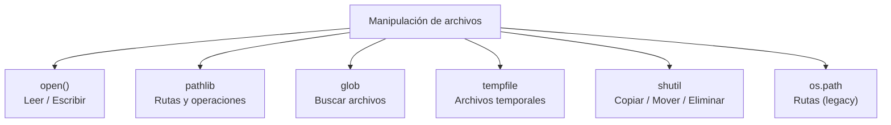
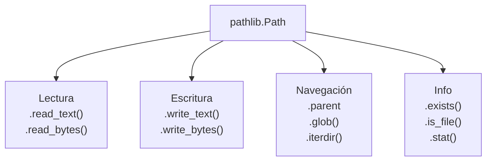
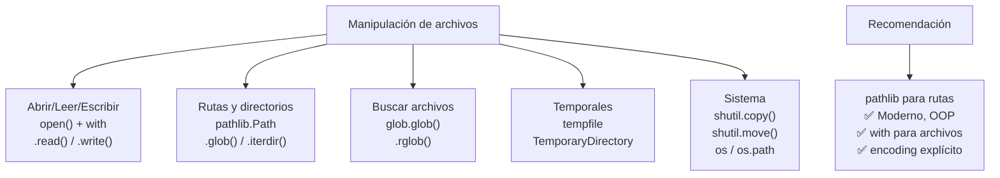

# Manipulación de archivos

Python ofrece múltiples módulos para leer, escribir y manipular archivos y directorios.



---

## open() — Leer y escribir archivos

La función `open()` es la base para la manipulación de archivos.

### Modos de apertura

| Modo | Descripción | Posición inicial |
|---|---|---|
| `"r"` | Lectura (texto, default) | Inicio |
| `"w"` | Escritura (sobrescribe) | Inicio |
| `"a"` | Agregar (append) | Final |
| `"x"` | Crear exclusivo (falla si existe) | Inicio |
| `"rb"` | Lectura binaria | Inicio |
| `"wb"` | Escritura binaria | Inicio |
| `"r+"` | Lectura y escritura | Inicio |
| `"w+"` | Lectura y escritura (sobrescribe) | Inicio |
| `"a+"` | Lectura y escritura (append) | Final |

```python
# Escritura
with open("datos.txt", "w", encoding="utf-8") as f:
    f.write("Hola mundo\n")
    f.writelines(["línea 2\n", "línea 3\n"])

# Lectura completa
with open("datos.txt", "r", encoding="utf-8") as f:
    contenido = f.read()
    print(contenido)

# Lectura línea por línea
with open("datos.txt", "r") as f:
    for linea in f:
        print(linea.strip())

# Leer todo como lista
with open("datos.txt") as f:
    lineas = f.readlines()  # ["Hola mundo\n", "línea 2\n", ...]

# Append
with open("datos.txt", "a") as f:
    f.write("nueva línea al final\n")
```

### Archivos binarios

```python
# Escribir binario
with open("imagen.jpg", "rb") as src:
    datos = src.read()

with open("copia.jpg", "wb") as dst:
    dst.write(datos)

# Buffer grande (evitar cargar todo en memoria)
with open("archivo_grande.bin", "rb") as f:
    while chunk := f.read(8192):  # leer en chunks de 8KB
        procesar(chunk)
```

---

## pathlib (Python 3.4+)

Módulo moderno para manejar rutas de forma **orientada a objetos**.

```python
from pathlib import Path

# Crear ruta
ruta = Path("/home/user/docs/archivo.txt")
ruta = Path("docs/archivo.txt")  # relativa
ruta = Path.home() / "docs" / "archivo.txt"  # con /

# Propiedades
print(ruta.name)       # "archivo.txt"
print(ruta.stem)       # "archivo"
print(ruta.suffix)     # ".txt"
print(ruta.parent)     # /home/user/docs
print(ruta.parts)      # ("/", "home", "user", "docs", "archivo.txt")

# Normalizar
ruta = Path("./docs/../docs/archivo.txt").resolve()
print(ruta)  # /home/user/docs/archivo.txt
```

### Operaciones con pathlib

```python
from pathlib import Path

ruta = Path("datos.txt")

# Existe
ruta.exists()           # True / False
ruta.is_file()          # es archivo?
ruta.is_dir()           # es directorio?

# Crear directorios
Path("a/b/c").mkdir(parents=True, exist_ok=True)

# Listar directorio
for item in Path(".").iterdir():
    print(item.name, "📁" if item.is_dir() else "📄")

# Filtrar por extensión
for py in Path(".").glob("*.py"):
    print(py)

# Recursivo
for py in Path(".").rglob("*.py"):
    print(py)

# Leer/escribir texto (métodos directos)
Path("saludo.txt").write_text("Hola mundo", encoding="utf-8")
contenido = Path("saludo.txt").read_text(encoding="utf-8")

# Leer/escribir binario
Path("imagen.jpg").write_bytes(data)
datos = Path("imagen.jpg").read_bytes()

# Renombrar
Path("viejo.txt").rename("nuevo.txt")

# Eliminar
Path("temporal.txt").unlink(missing_ok=True)  # Python 3.8+

# Eliminar directorio vacío
Path("dir_vacio").rmdir()

# Eliminar directorio con contenido (Python 3.12+)
import shutil
shutil.rmtree(Path("directorio"))
```



---

## glob — Buscar archivos con patrones

Busca archivos usando patrones tipo shell (wildcards).

```python
import glob

# Todos los .py en directorio actual
py_files = glob.glob("*.py")
print(py_files)  # ["main.py", "utils.py", ...]

# Recursivo (**)
todos = glob.glob("**/*.py", recursive=True)

# pathlib equivalente (recomendado)
todos = list(Path(".").rglob("*.py"))
```

### Patrones glob

| Patrón | Significado |
|---|---|
| `*` | Cualquier número de caracteres |
| `?` | Un solo carácter |
| `[abc]` | Un carácter del conjunto |
| `[!abc]` | Un carácter NO del conjunto |
| `[a-z]` | Rango de caracteres |
| `**` | Cualquier nivel de subdirectorios |

```python
glob.glob("data/*.csv")          # data/a.csv, data/b.csv
glob.glob("data/??.csv")         # data/01.csv, data/ab.csv
glob.glob("data/[abc]*.csv")     # data/a_data.csv
glob.glob("**/*.txt", recursive=True)  # todos los .txt en subdirectorios
```

---

## tempfile — Archivos temporales

```python
import tempfile
from pathlib import Path

# Archivo temporal (se elimina al cerrar)
with tempfile.NamedTemporaryFile(mode="w", suffix=".txt", delete=True) as f:
    f.write("contenido temporal")
    print(f.name)  # /tmp/tmpXXXXX.txt
    # se elimina al salir del with

# Directorio temporal
with tempfile.TemporaryDirectory() as tmpdir:
    path = Path(tmpdir) / "archivo.txt"
    path.write_text("temporal")
    print(path.read_text())  # "temporal"
    # se elimina al salir del with

# Archivo temporal permanente (no se elimina)
f = tempfile.NamedTemporaryFile(delete=False)
print(f.name)
f.close()
# luego hay que eliminarlo manualmente
Path(f.name).unlink()
```

---

## shutil — Operaciones de alto nivel

```python
import shutil
from pathlib import Path

# Copiar archivo
shutil.copy("origen.txt", "destino.txt")          # copia contenido + permisos
shutil.copy2("origen.txt", "destino.txt")          # copia contenido + metadatos
shutil.copyfile("origen.txt", "destino.txt")       # solo contenido

# Copiar directorio
shutil.copytree("src/", "backup/", dirs_exist_ok=True)

# Mover / Renombrar
shutil.move("origen.txt", "backup/origen.txt")

# Eliminar directorio con contenido
shutil.rmtree("dir_no_deseado/")

# Archivar (zip, tar)
shutil.make_archive("backup", "zip", "mi_directorio/")
shutil.unpack_archive("backup.zip", "extraido/")
```

---

## os.path — Módulo legacy (aún usado)

```python
import os.path

# Rutas
os.path.join("dir", "sub", "archivo.txt")   # "dir/sub/archivo.txt"
os.path.basename("/a/b/c.txt")              # "c.txt"
os.path.dirname("/a/b/c.txt")               # "/a/b"
os.path.splitext("archivo.txt")             # ("archivo", ".txt")
os.path.abspath("archivo.txt")              # "/home/user/archivo.txt"

# Existencia
os.path.exists("archivo.txt")
os.path.isfile("archivo.txt")
os.path.isdir("directorio")
```

> **Nota:** Prefiere `pathlib` sobre `os.path` en código nuevo. `pathlib` es más legible y consistente.

---

## Casos de uso comunes

### Leer CSV

```python
import csv

# Leer
with open("datos.csv", newline="", encoding="utf-8") as f:
    reader = csv.DictReader(f)
    for fila in reader:
        print(fila["nombre"], fila["edad"])

# Escribir
with open("salida.csv", "w", newline="", encoding="utf-8") as f:
    writer = csv.DictWriter(f, fieldnames=["nombre", "edad"])
    writer.writeheader()
    writer.writerow({"nombre": "Ana", "edad": "25"})
```

### Leer JSON

```python
import json

# Leer
with open("datos.json", encoding="utf-8") as f:
    data = json.load(f)

# Escribir
with open("salida.json", "w", encoding="utf-8") as f:
    json.dump(data, f, indent=2, ensure_ascii=False)
```

### Procesar archivo grande (streaming)

```python
# Sin cargar todo en memoria
with open("archivo_grande.txt", encoding="utf-8") as f:
    for linea in f:
        procesar(linea)

# Con generador
def lineas_del_archivo(ruta):
    with open(ruta, encoding="utf-8") as f:
        yield from f

for linea in lineas_del_archivo("grande.txt"):
    procesar(linea)
```

### Leer las últimas N líneas

```python
from collections import deque

def ultimas_lineas(ruta, n=10):
    with open(ruta) as f:
        return deque(f, maxlen=n)

lineas = ultimas_lineas("archivo_grande.log", n=5)
for linea in lineas:
    print(linea.strip())
```

---

## Resumen visual



### Guía rápida

```python
# Leer archivo
with open("f.txt") as f:
    datos = f.read()

# Escribir archivo
with open("f.txt", "w") as f:
    f.write("contenido")

# Pathlib (recomendado)
from pathlib import Path
Path("f.txt").write_text("contenido")
datos = Path("f.txt").read_text()

# Buscar archivos
list(Path(".").glob("*.py"))
list(Path(".").rglob("**/*.py"))

# Copiar / Mover
import shutil
shutil.copy("origen.txt", "destino.txt")
shutil.move("origen.txt", "destino.txt")
```
