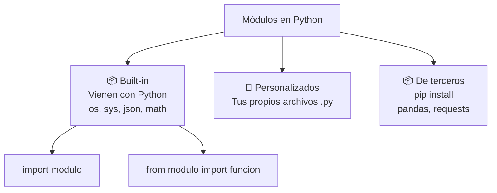
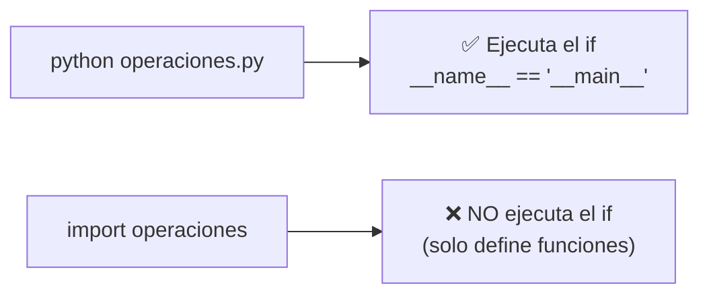
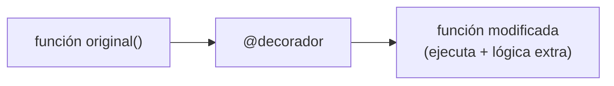
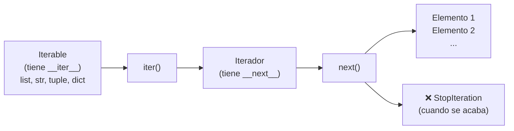
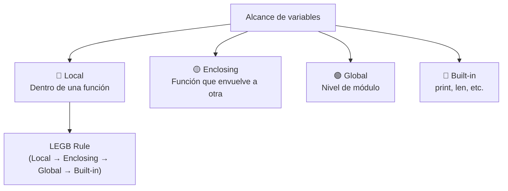
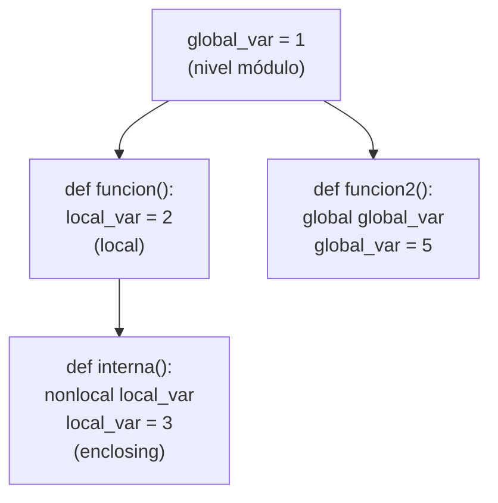

# Módulos

Un **módulo** es un archivo `.py` que contiene código Python (funciones, clases, variables) que puede reutilizarse en otros programas.



---

## Modulos Built-in (nativos)

Vienen incluidos con Python. No necesitas instalarlos.

### Importar módulos

```python
# Importar todo el módulo
import math
print(math.sqrt(16))  # 4.0
print(math.pi)        # 3.14159...

# Importar funciones específicas
from math import sqrt, pi
print(sqrt(25))  # 5.0
print(pi)        # 3.14159...

# Importar con alias
import math as m
print(m.sqrt(36))  # 6.0

# Importar todas las funciones (no recomendado)
from math import *
# Puede causar conflictos de nombres
```

### Módulos built-in esenciales

| Módulo | ¿Qué hace? | Ejemplo |
|---|---|---|
| `math` | Funciones matemáticas | `sqrt()`, `ceil()`, `floor()`, `pi` |
| `random` | Números aleatorios | `randint()`, `choice()`, `shuffle()` |
| `datetime` | Fechas y horas | `date()`, `datetime()`, `timedelta()` |
| `json` | Trabajar con JSON | `dumps()`, `loads()` |
| `os` | Sistema operativo | `listdir()`, `getcwd()`, `path.join()` |
| `sys` | Intérprete de Python | `argv`, `exit()`, `path` |
| `re` | Expresiones regulares | `search()`, `findall()`, `sub()` |
| `collections` | Estructuras de datos | `deque`, `Counter`, `defaultdict` |
| `itertools` | Iteradores avanzados | `chain()`, `product()`, `groupby()` |
| `functools` | Funciones de orden superior | `lru_cache`, `reduce`, `partial` |
| `os.path` | Rutas de archivos | `join()`, `exists()`, `basename()` |

```python
# math - funciones matemáticas
import math
print(math.ceil(4.2))     # 5
print(math.floor(4.8))    # 4
print(math.factorial(5))  # 120
print(math.gcd(12, 8))    # 4

# random - números aleatorios
import random
print(random.randint(1, 10))      # entero aleatorio entre 1 y 10
print(random.choice(['rojo', 'verde', 'azul']))  # elige uno
print(random.sample(range(100), 5))  # 5 únicos
lista = [1, 2, 3, 4, 5]
random.shuffle(lista)  # baraja in-place

# datetime - fechas
from datetime import datetime, date, timedelta
ahora = datetime.now()
print(ahora.year, ahora.month, ahora.day)
print(ahora.strftime("%d/%m/%Y %H:%M"))  # formato

ayer = date.today() - timedelta(days=1)
diferencia = date(2024, 12, 31) - date.today()

# json - serialización
import json
datos = {"nombre": "Ana", "edad": 25, "activo": True}
json_string = json.dumps(datos)  # Python → JSON
print(json_string)  # '{"nombre": "Ana", "edad": 25, "activo": true}'

recuperado = json.loads(json_string)  # JSON → Python
print(recuperado["nombre"])  # Ana

# os - sistema operativo
import os
print(os.getcwd())        # directorio actual
print(os.listdir('.'))    # archivos en directorio
print(os.path.exists('archivo.txt'))  # True/False
print(os.path.join('carpeta', 'sub', 'archivo.txt'))

# sys - intérprete
import sys
print(sys.version)    # versión de Python
print(sys.platform)   # 'linux', 'darwin', 'win32'
# sys.argv  # argumentos de línea de comandos

# collections - estructuras de datos
from collections import Counter, defaultdict, deque

# Counter: contar elementos
frecuencias = Counter("mississippi")
print(frecuencias)  # Counter({'i': 4, 's': 4, 'p': 2, 'm': 1})

# defaultdict: valor por defecto
d = defaultdict(list)  # si la clave no existe, crea lista vacía
d["usuarios"].append("Ana")
d["usuarios"].append("Luis")
print(d)  # {'usuarios': ['Ana', 'Luis']}

# itertools - iteradores avanzados
from itertools import chain, product, groupby
print(list(chain([1, 2], [3, 4])))  # [1, 2, 3, 4]
print(list(product([1, 2], ['a', 'b'])))  # [(1,'a'), (1,'b'), (2,'a'), (2,'b')]

# functools - funciones de orden superior
from functools import lru_cache, reduce

@lru_cache(maxsize=128)
def fibonacci(n):
    if n <= 1:
        return n
    return fibonacci(n - 1) + fibonacci(n - 2)

suma_total = reduce(lambda a, b: a + b, [1, 2, 3, 4])  # 10
```

---

## Módulos personalizados

Crea tus propios módulos para organizar y reutilizar código.

### Estructura

```python
# archivo: operaciones.py
def suma(a, b):
    return a + b

def resta(a, b):
    return a - b

PI = 3.1416
```

```python
# archivo: main.py (misma carpeta)
import operaciones

print(operaciones.suma(5, 3))   # 8
print(operaciones.resta(5, 3))  # 2
print(operaciones.PI)           # 3.1416
```

### if __name__ == "__main__"

```python
# operaciones.py
def suma(a, b):
    return a + b

# Este código solo se ejecuta si ejecutamos operaciones.py directamente
if __name__ == "__main__":
    print("Prueba:", suma(5, 3))
```



### Paquetes (carpetas con módulos)

```python
# Estructura de directorios:
# mi_paquete/
#   __init__.py   → convierte la carpeta en paquete
#   operaciones.py
#   strings.py

# __init__.py (puede estar vacío o importar sub-módulos)
from .operaciones import suma, resta
from .strings import mayusculas

# Uso desde otro archivo:
import mi_paquete
print(mi_paquete.suma(5, 3))

# O importando específico
from mi_paquete.operaciones import suma
```

---

## Lambda

Funciones **anónimas** de una sola expresión.

```python
# Sintaxis: lambda argumentos: expresión

# Función normal
def cuadrado(x):
    return x ** 2

# Lambda equivalente
cuadrado = lambda x: x ** 2

print(cuadrado(5))  # 25

# Lambda sin asignar (in-line)
print((lambda x, y: x + y)(5, 3))  # 8
```

### Usos comunes de lambda

```python
# Con map - aplicar función a cada elemento
numeros = [1, 2, 3, 4, 5]
dobles = list(map(lambda x: x * 2, numeros))  # [2, 4, 6, 8, 10]

# Con filter - filtrar elementos
pares = list(filter(lambda x: x % 2 == 0, numeros))  # [2, 4]

# Con sorted - orden personalizado
personas = [("Ana", 25), ("Luis", 30), ("María", 20)]
ordenado = sorted(personas, key=lambda p: p[1])  # por edad
print(ordenado)  # [('María', 20), ('Ana', 25), ('Luis', 30)]

# Con max/min - según criterio
print(max(personas, key=lambda p: p[1]))  # ('Luis', 30)

# Lambda con condicional
es_par = lambda x: "par" if x % 2 == 0 else "impar"
print(es_par(4))  # par
print(es_par(5))  # impar
```

### Lambda vs función normal

| Aspecto | Lambda | def |
|---|---|---|
| **Sintaxis** | `lambda x: expr` | `def f(x): return expr` |
| **Líneas** | Una sola expresión | Múltiples líneas |
| **Nombre** | Anónima | Tiene nombre |
| **Usos** | Funciones simples, callbacks | Funciones complejas |
| **Documentación** | No puede tener docstring | Puede tener docstring |

---

## Decoradores

Los **decoradores** son funciones que modifican el comportamiento de otra función sin cambiar su código.



### Decorador básico

```python
def mi_decorador(funcion):
    def wrapper():
        print("Antes de ejecutar la función")
        funcion()
        print("Después de ejecutar la función")
    return wrapper

@mi_decorador
def saludar():
    print("¡Hola!")

saludar()
# Antes de ejecutar la función
# ¡Hola!
# Después de ejecutar la función
```

### Decorador con argumentos

```python
def mi_decorador(funcion):
    def wrapper(*args, **kwargs):
        print("Antes")
        resultado = funcion(*args, **kwargs)
        print("Después")
        return resultado
    return wrapper

@mi_decorador
def suma(a, b):
    return a + b

print(suma(5, 3))
# Antes
# Después
# 8
```

### Decoradores útiles

```python
import time

# Medir tiempo de ejecución
def medir_tiempo(funcion):
    def wrapper(*args, **kwargs):
        inicio = time.time()
        resultado = funcion(*args, **kwargs)
        fin = time.time()
        print(f"{funcion.__name__} tardó {fin - inicio:.4f}s")
        return resultado
    return wrapper

@medir_tiempo
def calcular_mucho():
    total = sum(range(10_000_000))
    return total

calcular_mucho()  # calcular_mucho tardó 0.2345s

# Verificar permisos/autorización
def requiere_autenticacion(funcion):
    def wrapper(usuario, *args, **kwargs):
        if not usuario.get("autenticado"):
            raise PermissionError("Usuario no autenticado")
        return funcion(usuario, *args, **kwargs)
    return wrapper

@requiere_autenticacion
def ver_perfil(usuario):
    return f"Perfil de {usuario['nombre']}"

# print(ver_perfil({"nombre": "Ana"}))  # Error
print(ver_perfil({"nombre": "Ana", "autenticado": True}))  # Perfil de Ana

# Cache simple
def cache(funcion):
    memoria = {}
    def wrapper(*args):
        if args not in memoria:
            memoria[args] = funcion(*args)
        return memoria[args]
    return wrapper

@cache
def fibonacci(n):
    if n <= 1:
        return n
    return fibonacci(n - 1) + fibonacci(n - 2)

print(fibonacci(50))  # 12586269025 (rápido gracias al cache)
```

### Decoradores built-in

```python
# @staticmethod - método sin acceso a instancia
# @classmethod - método con acceso a clase
# @property - método que se accede como atributo

class Circulo:
    def __init__(self, radio):
        self._radio = radio

    @property
    def area(self):
        return 3.1416 * self._radio ** 2

    @staticmethod
    def es_valido(radio):
        return radio > 0

    @classmethod
    def desde_diametro(cls, diametro):
        return cls(diametro / 2)

c = Circulo(5)
print(c.area)  # 78.54 (accedido como atributo, no método)
print(Circulo.es_valido(3))  # True

from functools import lru_cache

# @lru_cache - memoización automática
@lru_cache(maxsize=128)
def factorial(n):
    return n * factorial(n - 1) if n else 1
```

---

## Iteradores

Objetos que permiten recorrer una secuencia de elementos uno por uno.



### Iterables vs Iteradores

```python
# Iterable: se puede recorrer (list, str, tuple, dict, set)
lista = [1, 2, 3]
for x in lista:  # funciona porque es iterable
    print(x)

# Iterador: objeto que produce valores uno a uno
iterador = iter(lista)  # obtiene un iterador
print(next(iterador))   # 1
print(next(iterador))   # 2
print(next(iterador))   # 3
# print(next(iterador))  # StopIteration
```

### Crear un iterador personalizado

```python
class Contador:
    def __init__(self, maximo):
        self.maximo = maximo
        self.actual = 0

    def __iter__(self):
        return self

    def __next__(self):
        if self.actual >= self.maximo:
            raise StopIteration
        self.actual += 1
        return self.actual

contador = Contador(5)
for num in contador:
    print(num)  # 1, 2, 3, 4, 5

# Con generador (más fácil)
def contador_gen(maximo):
    actual = 1
    while actual <= maximo:
        yield actual
        actual += 1

for num in contador_gen(5):
    print(num)  # 1, 2, 3, 4, 5
```

### Generadores (yield)

Los generadores son una forma sencilla de crear iteradores usando `yield`.

```python
def fibonacci_gen():
    a, b = 0, 1
    while True:
        yield a
        a, b = b, a + b

fib = fibonacci_gen()
print(next(fib))  # 0
print(next(fib))  # 1
print(next(fib))  # 1
print(next(fib))  # 2
print(next(fib))  # 3

# Generador con límite
def pares(maximo):
    for i in range(0, maximo + 1, 2):
        yield i

for p in pares(10):
    print(p)  # 0, 2, 4, 6, 8, 10
```

### Itertools: herramientas para iteradores

```python
from itertools import count, cycle, repeat, islice, chain, product

# count: cuenta infinitamente
for i in islice(count(10), 5):
    print(i)  # 10, 11, 12, 13, 14

# cycle: cicla infinitamente
colores = cycle(["rojo", "verde", "azul"])
for _ in range(6):
    print(next(colores))  # rojo, verde, azul, rojo, verde, azul

# chain: encadena iterables
print(list(chain([1, 2], [3, 4], [5])))  # [1, 2, 3, 4, 5]

# product: producto cartesiano
print(list(product([1, 2], ['a', 'b'])))
# [(1, 'a'), (1, 'b'), (2, 'a'), (2, 'b')]
```

### Iteradores vs Generadores vs Listas

| Aspecto | Lista | Iterador | Generador |
|---|---|---|---|
| **Memoria** | Toda en memoria | Bajo demanda | Bajo demanda |
| **Re-recorrer** | ✅ Sí | ❌ No (se agota) | ❌ No |
| **Acceso índice** | ✅ Sí | ❌ No | ❌ No |
| **Creación** | `[1, 2, 3]` | `iter(lista)` | `yield valor` |
| **Uso típico** | Pocos datos | Grandes datos | Streams, infinitos |

---

## Expresiones regulares (re)

Patrones para buscar, validar y manipular texto.

```python
import re
```

### Funciones principales

```python
texto = "Mi email es ana@email.com y el de luis es luis@mail.com"

# search - primera coincidencia
match = re.search(r'\w+@\w+\.\w+', texto)
if match:
    print(match.group())  # ana@email.com

# findall - todas las coincidencias
emails = re.findall(r'\w+@\w+\.\w+', texto)
print(emails)  # ['ana@email.com', 'luis@mail.com']

# finditer - iterador de coincidencias
for match in re.finditer(r'\w+@\w+\.\w+', texto):
    print(match.group(), match.start(), match.end())

# sub - reemplazar
resultado = re.sub(r'\w+@\w+\.\w+', '[OCULTO]', texto)
print(resultado)  # Mi email es [OCULTO] y el de luis es [OCULTO]

# split - dividir
partes = re.split(r'\s+', texto)
print(partes)  # palabras separadas por espacios

# match - coincide desde el inicio
print(re.match(r'Mi', texto))  # Match
print(re.match(r'email', texto))  # None
```

### Caracteres especiales

| Patrón | Significado | Ejemplo |
|---|---|---|
| `.` | Cualquier carácter excepto nueva línea | `h.t` → "hat", "hot" |
| `\d` | Dígito (0-9) | `\d{3}` → "123" |
| `\w` | Letra, dígito o `_` | `\w+` → "Hola123" |
| `\s` | Espacio en blanco | `\s+` → "  ", "\t" |
| `^` | Inicio de línea | `^Hola` → "Hola..." |
| `$` | Fin de línea | `...$` → "mundo" |
| `*` | 0 o más | `a*` → "", "a", "aaa" |
| `+` | 1 o más | `a+` → "a", "aaa" |
| `?` | 0 o 1 | `a?` → "", "a" |
| `{n}` | Exactamente n | `\d{3}` → "123" |
| `{n,}` | n o más | `\d{2,}` → "12", "1234" |
| `{n,m}` | Entre n y m | `\d{2,4}` → "12", "1234" |
| `[abc]` | Uno de los caracteres | `[aeiou]` → vocal |
| `[^abc]` | NO uno de esos | `[^0-9]` → no dígito |
| `(a|b)` | a o b | `rojo|verde` → "rojo" o "verde" |
| `()` | Grupo de captura | `(\w+)@(\w+)` → grupos |

### Compilación de patrones

```python
# Compilar para reutilizar (más rápido)
patron_email = re.compile(r'(\w+)@(\w+)\.(\w+)')

textos = [
    "Contacto: ana@email.com",
    "Otro: luis@gmail.com",
    "Sin email"
]

for texto in textos:
    match = patron_email.search(texto)
    if match:
        print(f"Usuario: {match.group(1)}, Dominio: {match.group(2)}.{match.group(3)}")
    else:
        print("No encontró email")
```

### Flags

```python
# re.IGNORECASE (re.I) - ignorar mayúsculas/minúsculas
print(re.findall(r'python', 'Python PYTHON python', re.I))
# ['Python', 'PYTHON', 'python']

# re.MULTILINE (re.M) - ^ y $ por línea
texto = "linea1\nlinea2\nlinea3"
print(re.findall(r'^\w+', texto, re.MULTILINE))
# ['linea1', 'linea2', 'linea3']

# re.DOTALL (re.S) - . incluye nueva línea
print(re.findall(r'h.+\n', "hola\n", re.DOTALL))  # ['hola\n']
```

### Ejemplos prácticos

```python
# Validar email
def email_valido(email):
    patron = r'^[\w.-]+@[\w.-]+\.\w{2,}$'
    return bool(re.match(patron, email))

print(email_valido("ana@email.com"))    # True
print(email_valido("email-invalido"))   # False

# Extraer números de teléfono
texto = "Llama al 555-1234 o al (55) 1234-5678"
telefonos = re.findall(r'\(?\d{2,3}\)?[\s-]?\d{3,4}[\s-]?\d{4}', texto)
print(telefonos)  # ['555-1234', '(55) 1234-5678']

# Validar contraseña (mín 8 chars, 1 may, 1 min, 1 dígito)
def password_valida(password):
    patron = r'^(?=.*[A-Z])(?=.*[a-z])(?=.*\d).{8,}$'
    return bool(re.match(patron, password))

print(password_valida("Hola1234"))  # True
print(password_valida("hola1234"))  # False (sin mayúscula)

# Limpiar texto (eliminar etiquetas HTML)
html = "<p>Hola <b>Mundo</b></p>"
limpio = re.sub(r'<[^>]+>', '', html)
print(limpio)  # "Hola Mundo"
```

---

# Alcance de variables (Scope)

Define **dónde** existe y puede usarse una variable.



### Regla LEGB

Python busca variables en este orden:
1. **L**ocal: dentro de la función actual
2. **E**nclosing: funciones que envuelven la actual
3. **G**lobal: nivel del módulo
4. **B**uilt-in: nombres incorporados de Python

```python
# Variable global
x = 10

def funcion_externa():
    # Enclosing
    y = 20

    def funcion_interna():
        # Local
        z = 30
        print(x, y, z)  # 10 20 30 (LEGB encuentra todas)

    funcion_interna()

funcion_externa()
```

### Variables globales

```python
contador = 0

def incrementar():
    global contador  # sin esto, crearía una local
    contador += 1

incrementar()
incrementar()
print(contador)  # 2
```

```python
# Sin global: crea variable local
x = 10
def modificar():
    x = 20  # ❌ variable LOCAL, no modifica la global
modificar()
print(x)  # 10

# Con global: modifica variable global
x = 10
def modificar():
    global x
    x = 20  # ✅ modifica la global
modificar()
print(x)  # 20
```

### Variables no locales (nonlocal)

Para modificar variables de la función envolvente (enclosing).

```python
def externa():
    mensaje = "Hola"

    def interna():
        nonlocal mensaje  # modifica la de externa, no crea local
        mensaje = "Mundo"

    interna()
    print(mensaje)  # "Mundo"

externa()
```

```python
# Contador con closure
def crear_contador():
    cuenta = 0

    def incrementar():
        nonlocal cuenta
        cuenta += 1
        return cuenta

    return incrementar

contador = crear_contador()
print(contador())  # 1
print(contador())  # 2
print(contador())  # 3
```

### Alcance en diferentes estructuras

```python
# Las variables de función no son accesibles fuera
def funcion():
    variable_local = "solo aquí"

# print(variable_local)  # NameError

# Los bucles NO crean su propio scope (a diferencia de otros lenguajes)
for i in range(5):
    pass
print(i)  # 4 (i sigue existiendo fuera del for)

# Las comprensiones de listas (Python 3) SÍ tienen su propio scope
# [x for x in range(5)]
# print(x)  # NameError (en Python 3)
```

### Resumen de alcance

| Palabra clave | ¿Qué hace? |
|---|---|
| `global` | Accede/modifica variable del módulo |
| `nonlocal` | Accede/modifica variable de función envolvente |
| `sin palabra` | Crea/modifica variable local |



### Buenas prácticas

```python
# ✅ USAR: parámetros y valores de retorno
def procesar(datos):
    resultado = datos * 2
    return resultado

datos_procesados = procesar(10)

# ❌ EVITAR: variables globales mutables
contador_global = 0  # difícil de debuggear

# ✅ MEJOR: encapsular en clase o closure
class Contador:
    def __init__(self):
        self.cuenta = 0
    def incrementar(self):
        self.cuenta += 1
        return self.cuenta
```
