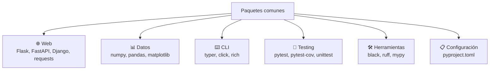
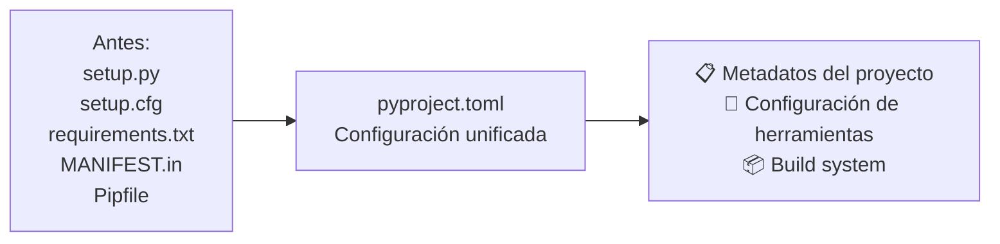
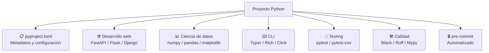

# Paquetes comunes

Python tiene un ecosistema masivo de paquetes. Conocer los más importantes te ahorra tiempo y evita reinventar la rueda.



---

## pyproject.toml

Es el archivo de configuración **estándar** para proyectos Python modernos (PEP 517/518/621). Reemplaza a `setup.py`, `setup.cfg`, `requirements.txt` y `MANIFEST.in`.



### Estructura básica

```toml
[project]
name = "mi-paquete"
version = "0.1.0"
description = "Descripción corta del proyecto"
readme = "README.md"
authors = [
    {name = "Tu Nombre", email = "email@ejemplo.com"}
]
license = {text = "MIT"}
requires-python = ">=3.11"

dependencies = [
    "requests>=2.28.0",
    "flask>=2.3.0",
]

[project.optional-dependencies]
dev = [
    "pytest>=7.0",
    "black>=23.0",
    "ruff>=0.1.0",
]

[project.urls]
homepage = "https://github.com/usuario/mi-paquete"
repository = "https://github.com/usuario/mi-paquete.git"

[project.scripts]
mi-script = "mi_paquete.cli:main"

[build-system]
requires = ["setuptools>=68.0", "wheel"]
build-backend = "setuptools.backends._legacy:_Backend"
```

### Configuración de herramientas en pyproject.toml

```toml
[project]
name = "mi-proyecto"
version = "0.1.0"
requires-python = ">=3.11"
dependencies = [
    "typer>=0.9.0",
    "httpx>=0.25.0",
]

[build-system]
requires = ["hatchling"]
build-backend = "hatchling.build"

# ─── Herramientas de calidad ───

[tool.black]
line-length = 100
target-version = ["py311"]
include = '\.pyi?$'
extend-exclude = '''
/(
    \.eggs
  | \.git
  | \.mypy_cache
  | \.venv
)/
'''

[tool.ruff]
line-length = 100
target-version = "py311"

[tool.ruff.lint]
select = ["E", "F", "I", "N", "W", "UP"]

[tool.ruff.format]
quote-style = "double"

[tool.mypy]
python_version = "3.11"
strict = true
ignore_missing_imports = true

[tool.pytest.ini_options]
minversion = "7.0"
testpaths = ["tests"]
python_files = ["test_*.py"]
addopts = "-v --tb=short"

[tool.coverage.run]
source = ["src"]
omit = ["*/tests/*"]
```

---

## Paquetes web

### requests

El estándar de facto para hacer peticiones HTTP.

```python
import requests

# GET
respuesta = requests.get("https://api.github.com/users/python")
print(respuesta.status_code)   # 200
print(respuesta.json())        # dict con respuesta

# POST con JSON
respuesta = requests.post(
    "https://api.ejemplo.com/login",
    json={"usuario": "admin", "password": "1234"},
    headers={"Authorization": "Bearer token"}
)

# Parámetros
respuesta = requests.get(
    "https://api.ejemplo.com/search",
    params={"q": "python", "page": 1}
)

# Manejo de errores
try:
    respuesta = requests.get("https://api.ejemplo.com", timeout=5)
    respuesta.raise_for_status()  # lanza excepción si 4xx/5xx
except requests.exceptions.RequestException as e:
    print(f"Error: {e}")
```

### Flask

Microframework web minimalista.

```python
from flask import Flask, jsonify, request

app = Flask(__name__)

@app.route("/")
def inicio():
    return jsonify({"mensaje": "Hola Mundo"})

@app.route("/usuarios/<int:user_id>")
def obtener_usuario(user_id):
    return jsonify({"id": user_id, "nombre": "Ana"})

@app.route("/login", methods=["POST"])
def login():
    datos = request.get_json()
    usuario = datos.get("usuario")
    password = datos.get("password")
    return jsonify({"mensaje": f"Bienvenido {usuario}"})

if __name__ == "__main__":
    app.run(debug=True)
```

### FastAPI

Framework web moderno y rápido con validación automática.

```python
from fastapi import FastAPI
from pydantic import BaseModel

app = FastAPI()

class Usuario(BaseModel):
    nombre: str
    email: str
    edad: int

@app.get("/")
def inicio():
    return {"mensaje": "Hola Mundo"}

@app.post("/usuarios")
def crear_usuario(usuario: Usuario):
    return {"mensaje": f"Usuario {usuario.nombre} creado"}

@app.get("/usuarios/{user_id}")
def obtener_usuario(user_id: int):
    return {"id": user_id, "nombre": "Ana"}
```

| Paquete | Caso de uso | Popularidad |
|---|---|---|
| **requests** | Cliente HTTP | ✅ Estándar |
| **httpx** | Cliente HTTP async | ✅ Moderno |
| **Flask** | Microframework web | ✅ Sencillo |
| **FastAPI** | API REST moderna | ✅ Rendimiento |
| **Django** | Framework completo | ✅ Grandes proyectos |
| **aiohttp** | Servidor/cliente async | ✅ Async |

---

## Paquetes de datos

### numpy

Operaciones numéricas y arrays multidimensionales.

```python
import numpy as np

# Arrays
arr = np.array([1, 2, 3, 4, 5])
print(arr * 2)         # [2, 4, 6, 8, 10]
print(arr.mean())      # 3.0
print(arr.sum())       # 15

# Arrays 2D
matriz = np.array([[1, 2], [3, 4]])
print(matriz.shape)    # (2, 2)

# Operaciones vectorizadas (rápidas)
a = np.random.rand(1_000_000)
b = np.random.rand(1_000_000)
resultado = a + b      # mucho más rápido que list comprehension
```

### pandas

Manipulación y análisis de datos estructurados.

```python
import pandas as pd

# Crear DataFrame
df = pd.DataFrame({
    "nombre": ["Ana", "Luis", "María"],
    "edad": [25, 30, 28],
    "ciudad": ["Madrid", "Buenos Aires", "México"]
})

print(df)
print(df.describe())       # estadísticas
print(df["edad"].mean())   # 27.67
print(df[df["edad"] > 26]) # filtro
print(df.groupby("ciudad")["edad"].mean())  # agrupación

# Leer archivos
df_csv = pd.read_csv("datos.csv")
df_excel = pd.read_excel("datos.xlsx")
df_json = pd.read_json("datos.json")

# Exportar
df.to_csv("salida.csv", index=False)
```

### matplotlib

Visualización de datos.

```python
import matplotlib.pyplot as plt
import numpy as np

# Gráfico de líneas
x = np.linspace(0, 10, 100)
y = np.sin(x)
plt.plot(x, y, label="seno")
plt.plot(x, np.cos(x), label="coseno")
plt.xlabel("x")
plt.ylabel("y")
plt.title("Funciones trigonométricas")
plt.legend()

# Guardar
plt.savefig("grafico.png")
plt.show()

# Subplots
fig, axes = plt.subplots(2, 2, figsize=(10, 8))
axes[0, 0].plot(x, y)
axes[0, 1].hist(np.random.randn(1000), bins=30)
axes[1, 0].scatter(np.random.randn(100), np.random.randn(100))
```

| Paquete | Caso de uso | Alternativas |
|---|---|---|
| **numpy** | Arrays, álgebra lineal | torch, jax |
| **pandas** | DataFrames, análisis | polars (más rápido) |
| **matplotlib** | Gráficos básicos | seaborn (stats), plotly (interactivo) |
| **scipy** | Ciencia, optimización | — |
| **scikit-learn** | Machine learning | pytorch, tensorflow |

---

## Paquetes de CLI

### typer

Crear CLI modernas con tipado.

```python
import typer

app = typer.Typer()

@app.command()
def saludar(nombre: str, edad: int = 0, mayusculas: bool = False):
    """Saluda a alguien opcionalmente con su edad"""
    mensaje = f"Hola {nombre}"
    if edad:
        mensaje += f", tienes {edad} años"
    if mayusculas:
        mensaje = mensaje.upper()
    typer.echo(mensaje)

@app.command()
def despedir(nombre: str):
    """Despide a alguien"""
    typer.echo(f"Adiós {nombre}")

if __name__ == "__main__":
    app()
```

```bash
python app.py saludar "Ana" --edad 25 --mayusculas
# HOLA ANA, TIENES 25 AÑOS

python app.py despedir "Luis"
# Adiós Luis
```

### rich

Terminal con colores, tablas y formato.

```python
from rich.console import Console
from rich.table import Table
from rich.progress import track
from rich.panel import Panel
import time

console = Console()

# Texto con estilo
console.print("Hola [bold red]Mundo[/bold red]!", style="green")

# Tabla
tabla = Table(title="Usuarios")
tabla.add_column("Nombre", style="cyan")
tabla.add_column("Edad", style="magenta")
tabla.add_row("Ana", "25")
tabla.add_row("Luis", "30")
tabla.add_row("María", "28")
console.print(tabla)

# Panel
console.print(Panel("Este es un panel con texto", title="Info"))

# Barra de progreso
for i in track(range(100), description="Procesando..."):
    time.sleep(0.02)
```

### click (alternativa)

```python
import click

@click.command()
@click.option("--nombre", prompt="Tu nombre", help="Nombre del usuario")
@click.option("--edad", default=0, type=int)
@click.option("--verbose", is_flag=True)
def cli(nombre, edad, verbose):
    """Programa CLI de ejemplo"""
    click.echo(f"Hola {nombre}")
    if edad:
        click.echo(f"Edad: {edad}")
    if verbose:
        click.echo("Modo verbose activado")

if __name__ == "__main__":
    cli()
```

| Paquete | Caso de uso |
|---|---|
| **typer** | CLI moderna con tipado (recomendado) |
| **click** | CLI tradicional, muy usado |
| **argparse** | Built-in, sin dependencias |
| **rich** | Terminal con estilo, tablas, progreso |
| **questionary** | Prompts interactivos |

---

## Paquetes de testing

### pytest

El framework de testing más popular.

```python
# archivo: test_calculadora.py
import pytest

def suma(a, b):
    return a + b

def dividir(a, b):
    if b == 0:
        raise ValueError("No dividir entre cero")
    return a / b

# Test simple
def test_suma():
    assert suma(2, 3) == 5
    assert suma(-1, 1) == 0
    assert suma(0, 0) == 0

# Test con excepción
def test_dividir_por_cero():
    with pytest.raises(ValueError):
        dividir(10, 0)

# Parametrización
@pytest.mark.parametrize("a, b, esperado", [
    (1, 2, 3),
    (10, 20, 30),
    (-5, 5, 0),
])
def test_suma_parametrizada(a, b, esperado):
    assert suma(a, b) == esperado

# Fixtures
@pytest.fixture
def datos_usuario():
    return {"nombre": "Ana", "edad": 25}

def test_usuario(datos_usuario):
    assert datos_usuario["nombre"] == "Ana"
    assert datos_usuario["edad"] == 25
```

```bash
# Ejecutar tests
pytest                       # todos los tests
pytest -v                    # verbose
pytest test_calculadora.py   # archivo específico
pytest -k "suma"             # filtrar por nombre
pytest --cov=src             # cobertura
pytest -x                    # parar en primer fallo
```

### Paquetes de testing adicionales

```python
# pytest-cov: cobertura de código
# pytest-mock: mocking simplificado
# pytest-xdist: tests en paralelo
# factory_boy: fábricas de datos de prueba
# faker: datos falsos realistas

from faker import Faker

fake = Faker("es_MX")

for _ in range(3):
    print(fake.name())      # nombres mexicanos
    print(fake.email())     # emails falsos
    print(fake.address())   # direcciones falsas
```

---

## Paquetes de herramientas

### black (formateador)

```bash
# Formatear archivos automáticamente
black script.py
black .                      # todos los archivos
black --check .              # solo verificar (no modificar)
black --diff .               # mostrar diferencias
```

### ruff (linter + formateador rápido)

```bash
# Ruff es 10-100x más rápido que flake8, pylint, etc. (escrito en Rust)
ruff check .                 # linting
ruff check . --fix           # auto-fix
ruff format .                # formateo (como black)
```

### mypy (type checker)

```python
# Con tipado, mypy detecta errores antes de ejecutar
def sumar(a: int, b: int) -> int:
    return a + b

# mypy detecta:
# sumar("hola", 5)    → error de tipo
# sumar(1, 2, 3)      → demasiados argumentos
```

```bash
mypy src/                    # checkear tipos
mypy --strict src/           # modo estricto
```

### pre-commit

Ejecuta verificaciones automáticas antes de cada commit.

```yaml
# .pre-commit-config.yaml
repos:
  - repo: https://github.com/astral-sh/ruff-pre-commit
    rev: v0.1.0
    hooks:
      - id: ruff
      - id: ruff-format

  - repo: https://github.com/pre-commit/mirrors-mypy
    rev: v1.7.0
    hooks:
      - id: mypy

  - repo: https://github.com/pre-commit/pre-commit-hooks
    rev: v4.5.0
    hooks:
      - id: trailing-whitespace
      - id: end-of-file-fixer
```

```bash
pip install pre-commit
pre-commit install            # instalar hook
pre-commit run --all-files    # ejecutar en todos los archivos
```

---

## pyproject.toml completo (ejemplo)

```toml
[project]
name = "mi-proyecto"
version = "0.1.0"
description = "Un proyecto Python moderno"
readme = "README.md"
requires-python = ">=3.11"
authors = [
    {name = "Tu Nombre"},
]
license = {text = "MIT"}

dependencies = [
    "typer>=0.9.0",
    "httpx>=0.25.0",
    "rich>=13.0.0",
]

[project.optional-dependencies]
dev = [
    "pytest>=7.0",
    "pytest-cov>=4.0",
    "black>=23.0",
    "ruff>=0.1.0",
    "mypy>=1.7.0",
    "pre-commit>=3.0",
]

[project.urls]
repository = "https://github.com/usuario/mi-proyecto"

[build-system]
requires = ["hatchling"]
build-backend = "hatchling.build"

[tool.black]
line-length = 100

[tool.ruff]
line-length = 100
target-version = "py311"

[tool.ruff.lint]
select = ["E", "F", "I", "N", "UP", "B"]

[tool.mypy]
python_version = "3.11"
strict = true

[tool.pytest.ini_options]
testpaths = ["tests"]
```

---

## Resumen visual



### Instalación rápida

```bash
# Web
pip install fastapi uvicorn  # o flask, django
pip install requests httpx

# Datos
pip install numpy pandas matplotlib

# CLI
pip install typer rich

# Testing
pip install pytest pytest-cov pytest-mock

# Calidad
pip install black ruff mypy pre-commit

# Todo junto
pip install fastapi uvicorn requests numpy pandas typer rich pytest black ruff mypy
```
