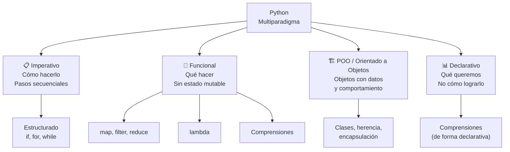
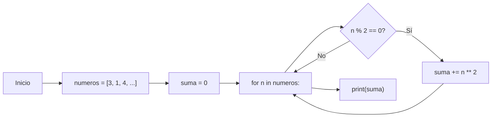
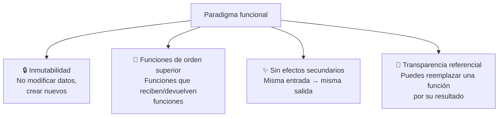
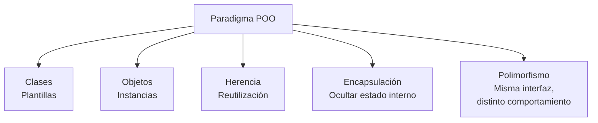
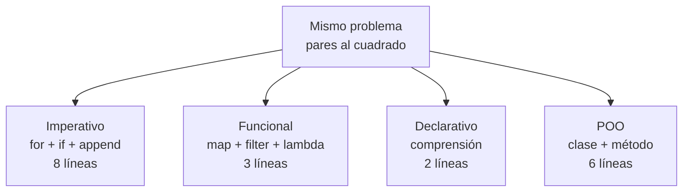
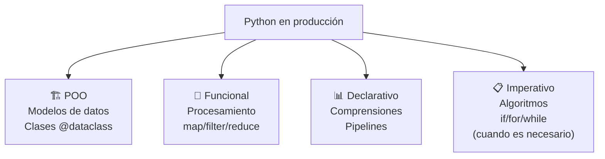
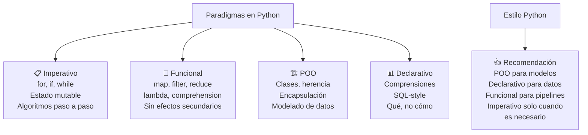

# Paradigmas de programación en Python

Python es un lenguaje **multiparadigma**: soporta múltiples estilos de programación, permitiendo elegir el más adecuado para cada problema.



---

## Paradigma imperativo

El más básico: el programa es una secuencia de instrucciones que modifican el estado.

```python
# Paradigma imperativo puro
numeros = [3, 1, 4, 1, 5, 9, 2, 6]

# Calcular suma de cuadrados de pares
suma = 0
for n in numeros:
    if n % 2 == 0:
        suma += n ** 2

print(suma)  # 56 (4² + 2² + 6²)
```



### Estructurado (subparadigma imperativo)

Usa estructuras de control (`if`, `for`, `while`) y funciones para organizar el código.

```python
# Programación estructurada
def es_par(n):
    return n % 2 == 0

def cuadrado(n):
    return n ** 2

def suma_pares_al_cuadrado(numeros):
    suma = 0
    for n in numeros:
        if es_par(n):
            suma += cuadrado(n)
    return suma

resultado = suma_pares_al_cuadrado([3, 1, 4, 1, 5, 9, 2, 6])
print(resultado)  # 56
```

---

## Paradigma funcional

Trata la computación como la evaluación de **funciones matemáticas**, evitando el estado mutable y los efectos secundarios.



### Funciones puras

```python
# ❌ Impura: depende de estado externo y lo modifica
total = 0
def agregar_impuro(x):
    global total
    total += x
    return total

print(agregar_impuro(5))  # 5
print(agregar_impuro(5))  # 10 (diferente resultado con misma entrada)

# ✅ Pura: misma entrada → misma salida, sin efectos secundarios
def agregar_puro(total, x):
    return total + x

print(agregar_puro(0, 5))  # 5
print(agregar_puro(0, 5))  # 5 (siempre el mismo resultado)
```

### Funciones de orden superior

```python
# map: aplicar función a cada elemento
numeros = [1, 2, 3, 4, 5]
cuadrados = list(map(lambda x: x ** 2, numeros))
print(cuadrados)  # [1, 4, 9, 16, 25]

# filter: mantener elementos que cumplen condición
pares = list(filter(lambda x: x % 2 == 0, numeros))
print(pares)  # [2, 4]

# reduce: acumular valores
from functools import reduce
suma = reduce(lambda a, b: a + b, numeros)
print(suma)  # 15

# reduce con valor inicial
producto = reduce(lambda a, b: a * b, numeros, 1)
print(producto)  # 120
```

### Lambda (función anónima)

```python
# lambda parámetros: expresión
cuadrado = lambda x: x ** 2
print(cuadrado(5))  # 25

# Útil con map/filter/sorted
personas = [("Ana", 25), ("Luis", 30), ("María", 20)]
ordenadas = sorted(personas, key=lambda p: p[1])  # por edad
print(ordenadas)  # [('María', 20), ('Ana', 25), ('Luis', 30)]
```

### Comprensiones (estilo declarativo-funcional)

```python
# List comprehension (estilo más Pythonico que map/filter)
numeros = [1, 2, 3, 4, 5]
cuadrados = [x ** 2 for x in numeros]
pares = [x for x in numeros if x % 2 == 0]

# Equivalente funcional con map/filter:
cuadrados = list(map(lambda x: x ** 2, numeros))
pares = list(filter(lambda x: x % 2 == 0, numeros))

# Las comprensiones son más legibles → Python prefiere comprensiones
```

### Inmutabilidad

```python
# ❌ Malo (funcional): modificar lista existente
def agregar_elemento_malo(lista, elemento):
    lista.append(elemento)
    return lista

original = [1, 2, 3]
modificada = agregar_elemento_malo(original, 4)
print(original)    # [1, 2, 3, 4] (modificó la original 😱)

# ✅ Bueno (funcional): crear nueva lista
def agregar_elemento_bueno(lista, elemento):
    return [*lista, elemento]  # nueva lista

original = [1, 2, 3]
modificada = agregar_elemento_bueno(original, 4)
print(original)    # [1, 2, 3] (intacta ✅)
print(modificada)  # [1, 2, 3, 4] (nueva)
```

### Funciones funcionales built-in

```python
from functools import reduce, partial
from operator import add, mul

# partial: fijar argumentos de una función
def potencia(base, exponente):
    return base ** exponente

cuadrado = partial(potencia, exponente=2)
cubo = partial(potencia, exponente=3)

print(cuadrado(5))  # 25
print(cubo(3))      # 27

# zip: combinar iterables
nombres = ["Ana", "Luis", "María"]
edades = [25, 30, 28]
pares = list(zip(nombres, edades))
print(pares)  # [('Ana', 25), ('Luis', 30), ('María', 28)]

# enumerate: índice + valor
for i, nombre in enumerate(nombres, start=1):
    print(f"{i}. {nombre}")
# 1. Ana
# 2. Luis
# 3. María
```

---

## Paradigma orientado a objetos

Organiza el código en **objetos** que combinan datos (atributos) y comportamiento (métodos).



```python
class Animal:
    def __init__(self, nombre):
        self.nombre = nombre

    def hacer_sonido(self):
        raise NotImplementedError

class Perro(Animal):
    def hacer_sonido(self):
        return f"{self.nombre} dice: ¡Guau!"

class Gato(Animal):
    def hacer_sonido(self):
        return f"{self.nombre} dice: ¡Miau!"

# Polimorfismo
animales = [Perro("Max"), Gato("Luna"), Perro("Rex")]
for animal in animales:
    print(animal.hacer_sonido())
```

---

## Comparación de paradigmas

```python
numeros = [1, 2, 3, 4, 5, 6, 7, 8, 9, 10]

# 🔵 Imperativo (cómo)
def imperativo(numeros):
    resultado = []
    for n in numeros:
        if n % 2 == 0:
            resultado.append(n ** 2)
    return resultado

# 🟢 Funcional (qué)
def funcional(numeros):
    return list(map(lambda x: x ** 2, filter(lambda x: x % 2 == 0, numeros)))

# 🟡 Declarativo (comprensión)
def declarativo(numeros):
    return [n ** 2 for n in numeros if n % 2 == 0]

# 🔴 POO
class Procesador:
    def __init__(self, numeros):
        self.numeros = numeros

    def pares_cuadrados(self):
        return [n ** 2 for n in self.numeros if n % 2 == 0]

print(imperativo(numeros))   # [4, 16, 36, 64, 100]
print(funcional(numeros))    # [4, 16, 36, 64, 100]
print(declarativo(numeros))  # [4, 16, 36, 64, 100]
print(Procesador(numeros).pares_cuadrados())  # [4, 16, 36, 64, 100]
```



### Tabla comparativa

| Aspecto | Imperativo | Funcional | POO | Declarativo |
|---|---|---|---|---|
| **Estado** | ✅ Mutable | ❌ Inmutable | ✅ Mutable (objetos) | ❌ No importa |
| **Organización** | Funciones/bloques | Funciones puras | Clases/objetos | Expresiones |
| **Reutilización** | Funciones | Funciones H.O. | Herencia | Pipelines |
| **Legibilidad** | 😐 Media | 😵 Curva alta | 🙂 Buena | 🙂 Buena |
| **Paralelismo** | ❌ Difícil | ✅ Fácil | 😐 Medio | ✅ Fácil |
| **Testing** | 😐 Medio | ✅ Fácil | 😐 Medio | ✅ Fácil |

---

## Python: multiparadigma en la práctica

Python no force un paradigma. Puedes combinarlos según convenga.

```python
# Mezcla de paradigmas (lo más común en Python real)
from dataclasses import dataclass
from typing import List

# POO: modelo de datos
@dataclass
class Producto:
    nombre: str
    precio: float
    categoria: str

# Funcional + Declarativo: procesamiento
class Carrito:
    def __init__(self):
        self._productos: List[Producto] = []

    def agregar(self, producto: Producto):
        self._productos.append(producto)

    # Funcional (map/filter/reduce)
    @property
    def total(self) -> float:
        return sum(p.precio for p in self._productos)  # declarativo

    # Declarativo (comprensión)
    @property
    def por_categoria(self) -> dict:
        return {
            cat: [p for p in self._productos if p.categoria == cat]
            for cat in set(p.categoria for p in self._productos)
        }

    # Imperativo (ordenar)
    def mas_caros(self, n: int) -> List[Producto]:
        return sorted(self._productos, key=lambda p: p.precio, reverse=True)[:n]

# Uso
carrito = Carrito()
carrito.agregar(Producto("Laptop", 15000, "Electrónicos"))
carrito.agregar(Producto("Mouse", 250, "Electrónicos"))
carrito.agregar(Producto("Camiseta", 350, "Ropa"))

print(f"Total: ${carrito.total}")           # $15600
print(carrito.mas_caros(2))                 # Laptop, Mouse
```



---

## Resumen



### ¿Cuándo usar qué?

| Problema | Paradigma recomendado |
|---|---|
| Modelar datos del mundo real (cliente, producto) | POO |
| Procesar colecciones (transformar, filtrar) | Declarativo / Funcional |
| Algoritmos complejos (ordenar, buscar) | Imperativo / Funcional |
| Pipelines de datos (ETL, archivos) | Funcional / Declarativo |
| Scripts pequeños y rápidos | Imperativo |
| Grandes sistemas con equipo | POO + Funcional |
| Ciencia de datos, análisis | Declarativo (pandas) + Funcional |
