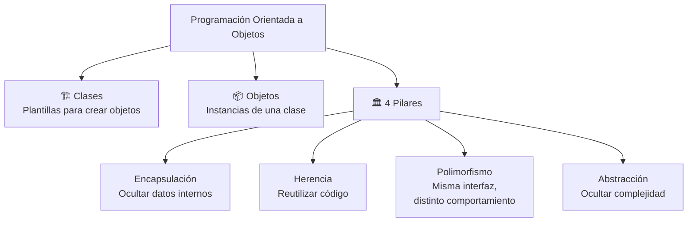
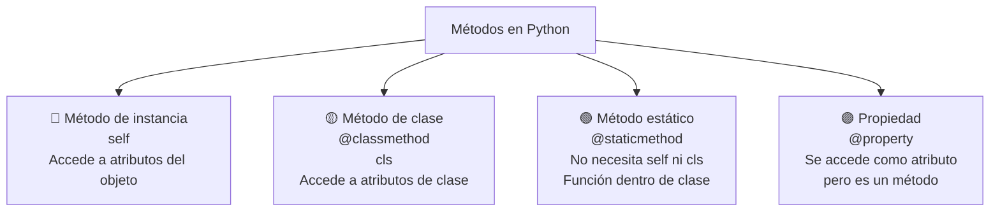
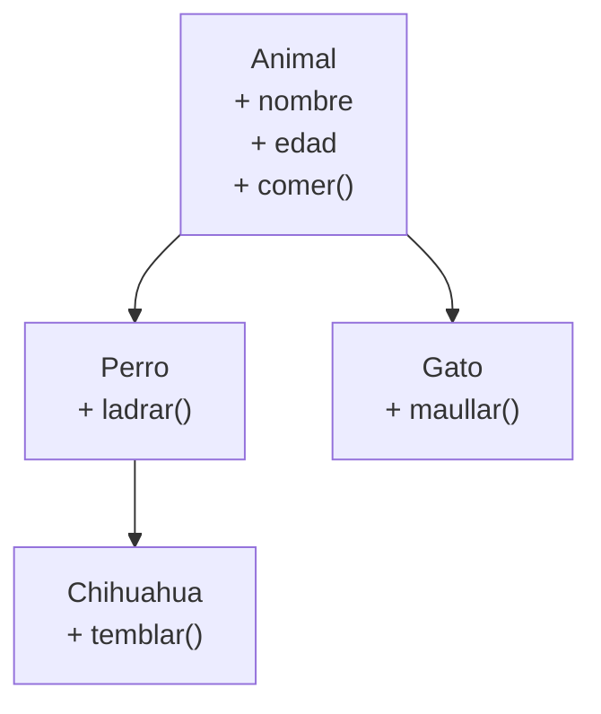
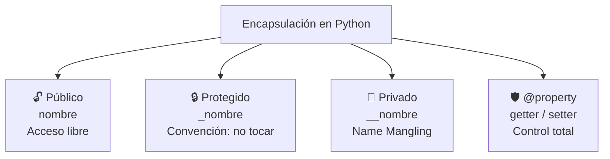
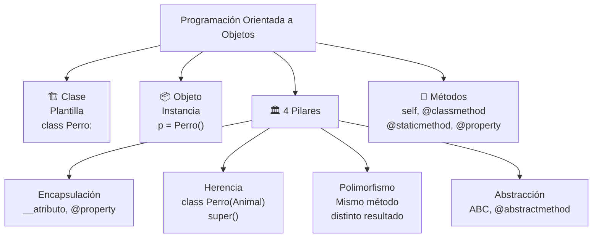

# Programación orientada a objetos

La **POO** (OOP) es un paradigma que organiza el código en **objetos** que combinan datos (atributos) y comportamiento (métodos).



---

## Clases

Una **clase** es una plantilla para crear objetos. Define los atributos (datos) y métodos (comportamiento) que tendrán los objetos.

```python
# Definir una clase
class Perro:
    # Constructor: se ejecuta al crear un objeto
    def __init__(self, nombre, raza):
        self.nombre = nombre  # atributo
        self.raza = raza

    # Método
    def ladrar(self):
        return f"{self.nombre} dice: ¡Guau!"

    def presentarse(self):
        return f"Soy {self.nombre}, un {self.raza}"

# Crear objetos (instancias)
perro1 = Perro("Max", "Labrador")
perro2 = Perro("Luna", "Chihuahua")

# Usar objetos
print(perro1.ladrar())       # Max dice: ¡Guau!
print(perro2.presentarse())  # Soy Luna, un Chihuahua
print(perro1.nombre)         # Max (acceder a atributo)
```

### El constructor __init__

```python
class Usuario:
    def __init__(self, nombre, email):
        self.nombre = nombre
        self.email = email
        self.activo = True  # valor por defecto

    def __str__(self):
        return f"Usuario: {self.nombre} ({self.email})"

    def __repr__(self):
        return f"Usuario('{self.nombre}', '{self.email}')"

usuario = Usuario("Ana", "ana@email.com")
print(usuario)            # Usuario: Ana (ana@email.com)  ← __str__
print(repr(usuario))      # Usuario('Ana', 'ana@email.com')  ← __repr__
```

### Métodos especiales (dunder methods)

```python
class Vector:
    def __init__(self, x, y):
        self.x = x
        self.y = y

    def __str__(self):
        return f"Vector({self.x}, {self.y})"

    def __add__(self, otro):          # v1 + v2
        return Vector(self.x + otro.x, self.y + otro.y)

    def __sub__(self, otro):          # v1 - v2
        return Vector(self.x - otro.x, self.y - otro.y)

    def __mul__(self, escalar):       # v * 3
        return Vector(self.x * escalar, self.y * escalar)

    def __eq__(self, otro):           # v1 == v2
        return self.x == otro.x and self.y == otro.y

    def __len__(self):                # len(v)
        return int((self.x**2 + self.y**2) ** 0.5)

v1 = Vector(3, 4)
v2 = Vector(1, 2)

print(v1 + v2)       # Vector(4, 6)
print(v1 - v2)       # Vector(2, 2)
print(v1 * 3)        # Vector(9, 12)
print(v1 == Vector(3, 4))  # True
print(len(v1))       # 5
```

| Método | Operador | Uso |
|---|---|---|
| `__init__` | — | Constructor |
| `__str__` | — | `print(obj)`, `str(obj)` |
| `__repr__` | — | `repr(obj)`, debug |
| `__len__` | — | `len(obj)` |
| `__add__` | `+` | `obj1 + obj2` |
| `__sub__` | `-` | `obj1 - obj2` |
| `__mul__` | `*` | `obj * n` |
| `__eq__` | `==` | `obj1 == obj2` |
| `__lt__` | `<` | `obj1 < obj2` |
| `__getitem__` | `[]` | `obj[key]` |
| `__call__` | `()` | `obj()` |

---

## Métodos

Tipos de métodos según cómo acceden a los datos.



```python
class Circulo:
    pi = 3.1416  # atributo de clase (compartido)

    def __init__(self, radio):
        self.radio = radio  # atributo de instancia

    # Método de instancia (necesita self)
    def area(self):
        return self.pi * self.radio ** 2

    # Método de clase (necesita cls)
    @classmethod
    def desde_diametro(cls, diametro):
        return cls(diametro / 2)

    # Método estático (no necesita self ni cls)
    @staticmethod
    def es_valido(radio):
        return radio > 0

    # Propiedad (se accede como atributo)
    @property
    def diametro(self):
        return self.radio * 2

    @property
    def circunferencia(self):
        return 2 * self.pi * self.radio

# Uso
c = Circulo(5)

# Método de instancia
print(c.area())  # 78.54

# Método de clase (se llama en la clase)
c2 = Circulo.desde_diametro(10)
print(c2.radio)  # 5.0

# Método estático
print(Circulo.es_valido(5))   # True
print(Circulo.es_valido(-3))  # False

# Propiedad (sin paréntesis)
print(c.diametro)        # 10
print(c.circunferencia)  # 31.416
```

### Métodos de instancia vs clase vs estáticos

```python
class Ejemplo:
    contador = 0  # atributo de clase

    def __init__(self, nombre):
        self.nombre = nombre  # atributo de instancia
        Ejemplo.contador += 1

    def metodo_instancia(self):
        """Accede a self (instancia) y a la clase"""
        return f"Instancia: {self.nombre}, Total creados: {Ejemplo.contador}"

    @classmethod
    def metodo_clase(cls):
        """Accede a cls (clase), no a instancia"""
        return f"Total de instancias creadas: {cls.contador}"

    @staticmethod
    def metodo_estatico():
        """No accede ni a clase ni a instancia. Función utilitaria."""
        return "Soy útil pero no necesito datos de la clase"

e1 = Ejemplo("A")
e2 = Ejemplo("B")

print(e1.metodo_instancia())  # Instancia: A, Total creados: 2
print(Ejemplo.metodo_clase())  # Total de instancias creadas: 2
print(Ejemplo.metodo_estatico())  # Soy útil pero no necesito datos
```

| Tipo | Decorador | Primer parámetro | Acceso a datos |
|---|---|---|---|
| **Instancia** | — | `self` | Atributos de instancia y clase |
| **Clase** | `@classmethod` | `cls` | Solo atributos de clase |
| **Estático** | `@staticmethod` | ninguno | No accede a la clase |
| **Propiedad** | `@property` | `self` | Se accede como atributo |

---

## Herencia

Permite que una clase (hija) herede atributos y métodos de otra clase (padre).



### Herencia simple

```python
# Clase padre (superclase)
class Animal:
    def __init__(self, nombre):
        self.nombre = nombre

    def hacer_sonido(self):
        return "..."

    def __str__(self):
        return self.nombre

# Clase hija (subclase)
class Perro(Animal):
    def hacer_sonido(self):  # sobreescribe el método
        return "¡Guau!"

class Gato(Animal):
    def hacer_sonido(self):
        return "¡Miau!"

# Uso
perro = Perro("Max")
gato = Gato("Luna")

print(perro.nombre)        # Max (heredado)
print(perro.hacer_sonido()) # ¡Guau! (sobrescrito)
print(gato.hacer_sonido())  # ¡Miau!
```

### super() - llamar al método del padre

```python
class Animal:
    def __init__(self, nombre, especie):
        self.nombre = nombre
        self.especie = especie

    def descripcion(self):
        return f"{self.nombre} es un {self.especie}"

class Perro(Animal):
    def __init__(self, nombre, raza):
        super().__init__(nombre, "Perro")  # llama al __init__ de Animal
        self.raza = raza

    def descripcion(self):
        base = super().descripcion()  # llama al método del padre
        return f"{base} de raza {self.raza}"

perro = Perro("Max", "Labrador")
print(perro.descripcion())  # Max es un Perro de raza Labrador
```

### Herencia múltiple

```python
class Volador:
    def volar(self):
        return "Volando..."

class Nadador:
    def nadar(self):
        return "Nadando..."

class Pato(Volador, Nadador):
    def __init__(self, nombre):
        self.nombre = nombre

pato = Pato("Donald")
print(pato.volar())  # Volando...
print(pato.nadar())  # Nadando...

# MRO (Method Resolution Order)
print(Pato.__mro__)
# (<class 'Pato'>, <class 'Volador'>, <class 'Nadador'>, <class 'object'>)
```

### isinstance y issubclass

```python
class Animal: pass
class Perro(Animal): pass
class Gato(Animal): pass

perro = Perro()
gato = Gato()

# isinstance: objeto es instancia de clase?
print(isinstance(perro, Perro))   # True
print(isinstance(perro, Animal))  # True (herencia)
print(isinstance(perro, Gato))    # False

# issubclass: clase es subclase de otra?
print(issubclass(Perro, Animal))  # True
print(issubclass(Gato, Animal))   # True
print(issubclass(Perro, Gato))    # False
```

---

## Encapsulación

Controla el acceso a los atributos de un objeto.



```python
class CuentaBancaria:
    def __init__(self, titular, saldo_inicial):
        self.titular = titular          # 🔓 Público
        self._tipo = "ahorro"           # 🔒 Protegido (convención)
        self.__saldo = saldo_inicial    # 🔐 Privado (name mangling)

    # Getter (leer con control)
    @property
    def saldo(self):
        return self.__saldo

    # Setter (modificar con control)
    @saldo.setter
    def saldo(self, nuevo_saldo):
        if nuevo_saldo < 0:
            raise ValueError("El saldo no puede ser negativo")
        self.__saldo = nuevo_saldo

    # Método público con validación
    def depositar(self, cantidad):
        if cantidad <= 0:
            raise ValueError("La cantidad debe ser positiva")
        self.__saldo += cantidad

    def retirar(self, cantidad):
        if cantidad <= 0:
            raise ValueError("La cantidad debe ser positiva")
        if cantidad > self.__saldo:
            raise ValueError("Saldo insuficiente")
        self.__saldo -= cantidad

cuenta = CuentaBancaria("Ana", 1000)

# Atributo público
print(cuenta.titular)  # Ana

# Atributo protegido (accesible pero por convención no se toca)
print(cuenta._tipo)    # ahorro

# Atributo privado (name mangling)
# print(cuenta.__saldo)  # AttributeError
print(cuenta._CuentaBancaria__saldo)  # 1000 (pero no lo hagas)

# Property getter
print(cuenta.saldo)  # 1000

# Property setter
cuenta.saldo = 2000
# cuenta.saldo = -500  # ValueError

# Métodos con validación
cuenta.depositar(500)
cuenta.retirar(200)
print(cuenta.saldo)  # 2300
```

### Propiedades (@property) avanzadas

```python
class Temperatura:
    def __init__(self, celsius=0):
        self._celsius = celsius

    @property
    def celsius(self):
        """Getter: leer temperatura en Celsius"""
        return self._celsius

    @celsius.setter
    def celsius(self, valor):
        """Setter: validar y asignar"""
        if valor < -273.15:
            raise ValueError("Temperatura por debajo del cero absoluto")
        self._celsius = valor

    @property
    def fahrenheit(self):
        """Getter calculado (solo lectura)"""
        return (self._celsius * 9/5) + 32

    @fahrenheit.setter
    def fahrenheit(self, valor):
        """Setter: convertir Fahrenheit a Celsius"""
        self._celsius = (valor - 32) * 5/9

    @property
    def kelvin(self):
        return self._celsius + 273.15

temp = Temperatura(25)
print(temp.celsius)     # 25
print(temp.fahrenheit)  # 77.0
print(temp.kelvin)      # 298.15

temp.fahrenheit = 100
print(temp.celsius)     # 37.78
```

### Niveles de encapsulación

| Nivel | Sintaxis | Acceso |
|---|---|---|
| **Público** | `atributo` | Desde cualquier lugar |
| **Protegido** | `_atributo` | Convención: interno, no tocar fuera |
| **Privado** | `__atributo` | Name mangling: `_Clase__atributo` |
| **Property** | `@property` | Control total con getter/setter |

---

## Polimorfismo

Misma interfaz, diferente comportamiento.

```python
# Polimorfismo por herencia
class Animal:
    def hacer_sonido(self):
        raise NotImplementedError

class Perro(Animal):
    def hacer_sonido(self):
        return "¡Guau!"

class Gato(Animal):
    def hacer_sonido(self):
        return "¡Miau!"

class Vaca(Animal):
    def hacer_sonido(self):
        return "¡Muu!"

# Misma función, diferentes comportamientos
def sonido_del_animal(animal):
    print(animal.hacer_sonido())

animales = [Perro(), Gato(), Vaca()]
for animal in animales:
    sonido_del_animal(animal)
# ¡Guau!
# ¡Miau!
# ¡Muu!

# Duck typing: "si camina como pato y suena como pato, es un pato"
class Pato:
    def hacer_sonido(self):
        return "¡Cuac!"

sonido_del_animal(Pato())  # ¡Cuac! (no hereda de Animal, pero funciona)
```

### Abstracción (ABC)

```python
from abc import ABC, abstractmethod

class Forma(ABC):
    @abstractmethod
    def area(self):
        pass

    @abstractmethod
    def perimetro(self):
        pass

class Rectangulo(Forma):
    def __init__(self, base, altura):
        self.base = base
        self.altura = altura

    def area(self):
        return self.base * self.altura

    def perimetro(self):
        return 2 * (self.base + self.altura)

class Circulo(Forma):
    def __init__(self, radio):
        self.radio = radio

    def area(self):
        return 3.1416 * self.radio ** 2

    def perimetro(self):
        return 2 * 3.1416 * self.radio

# forma = Forma()  # TypeError (no se puede instanciar clase abstracta)

rectangulo = Rectangulo(5, 3)
circulo = Circulo(5)

print(rectangulo.area())      # 15
print(rectangulo.perimetro()) # 16
print(circulo.area())         # 78.54
```

---

## Resumen visual



### ¿Cuándo usar POO vs funciones?

| Situación | Paradigma |
|---|---|
| Programa simple, pocos datos | ✅ Funciones |
| Agrupar datos + comportamiento | ✅ Clases |
| Reutilizar lógica con variaciones | ✅ Herencia |
| Necesitas ocultar implementación | ✅ Encapsulación |
| Scripts rápidos, data science | ✅ Funciones |
| Sistemas grandes, equipos múltiples | ✅ POO |

### Buenas prácticas

```python
# ✅ Nombres de clase en CamelCase
class ClienteVIP:
    pass

# ✅ Atributos privados con __ para datos sensibles
class Cuenta:
    def __init__(self):
        self.__saldo = 0  # privado

    @property
    def saldo(self):
        return self.__saldo

# ✅ Métodos de clase para fábricas alternativas
class Punto:
    def __init__(self, x, y):
        self.x = x
        self.y = y

    @classmethod
    def desde_polar(cls, radio, angulo):
        return cls(radio * math.cos(angulo), radio * math.sin(angulo))

# ✅ Composición sobre herencia
class Motor:
    def encender(self):
        return "Motor encendido"

class Auto:
    def __init__(self):
        self.motor = Motor()  # composición

    def encender(self):
        return self.motor.encender()

# ❌ Abuso de herencia (jerarquía muy profunda)
# Animal → Mamífero → Cánido → Perro → Labrador → ...
# Mejor: composición con atributos
```
