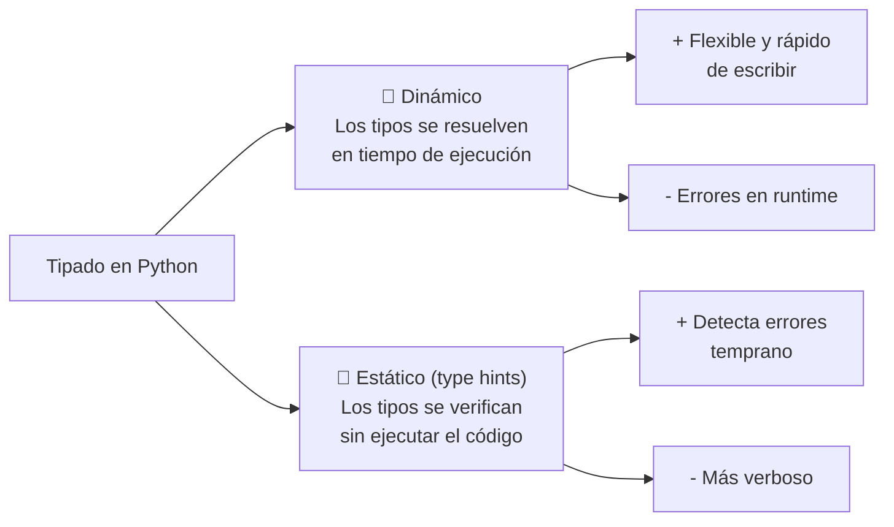
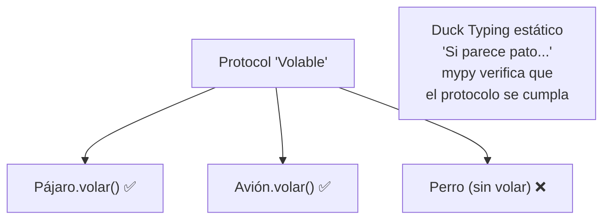
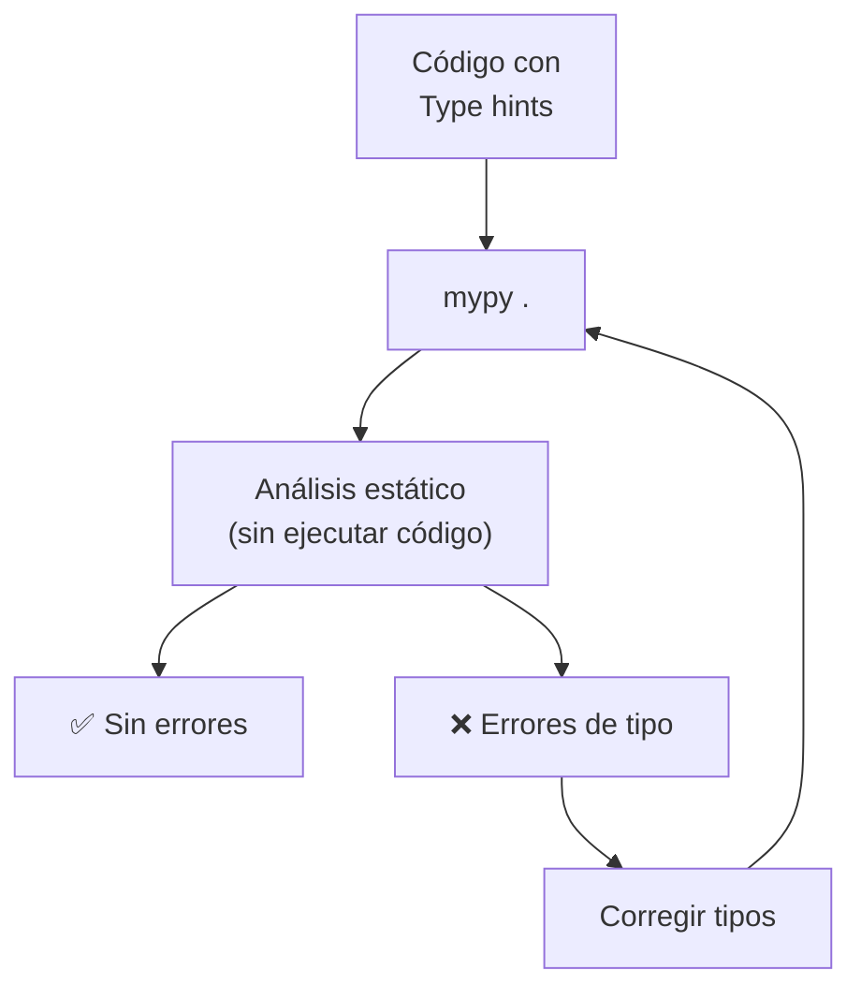
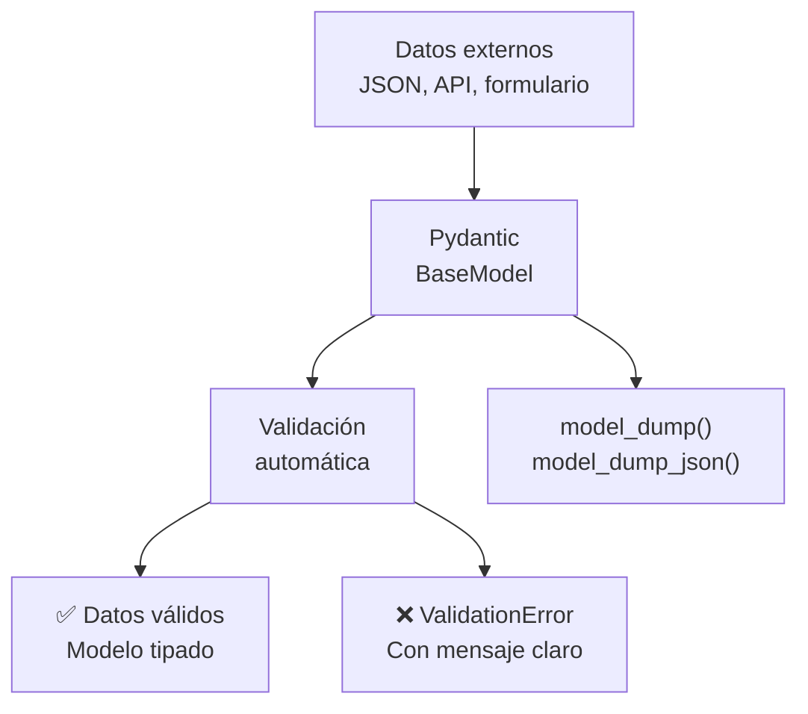
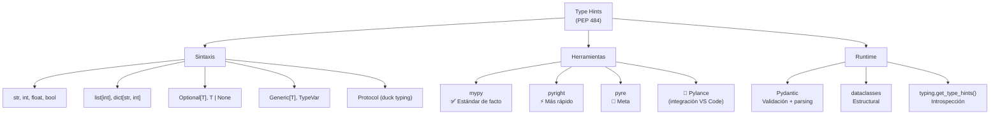

# Tipeo estático (Static Typing)

Python es **dinámicamente tipado**, pero desde PEP 484 (Python 3.5+) soporta **type hints** (anotaciones opcionales). Herramientas como `mypy` verifican los tipos **estáticamente**.



```python
# Sin tipado (dinámico)
def saludar(nombre):
    return f"Hola {nombre}"

# Con tipado (estático)
def saludar(nombre: str) -> str:
    return f"Hola {nombre}"
```

---

## Sintaxis de tipos

### Tipos básicos

```python
nombre: str = "Ana"
edad: int = 25
altura: float = 1.65
activo: bool = True

def procesar(n: int) -> str:
    return str(n)
```

### Colecciones

```python
from typing import List, Dict, Tuple, Set, Optional

# Python 3.9+ (built-in)
numeros: list[int] = [1, 2, 3]
edades: dict[str, int] = {"Ana": 25, "Luis": 30}
coords: tuple[float, float] = (10.5, 20.3)
tags: set[str] = {"python", "typing"}

# Python 3.8 y anteriores (typing)
from typing import List, Dict, Tuple, Set
numeros: List[int] = [1, 2, 3]
edades: Dict[str, int] = {"Ana": 25}
```

### Optional y Union

```python
from typing import Optional, Union, Any

# Optional[X] = X | None
def buscar(id: int) -> Optional[str]:
    if id == 1:
        return "encontrado"
    return None  # ✅ permitido

# Union[X, Y] = X | Y
def formatear(valor: Union[int, float]) -> str:
    return f"${valor:.2f}"

# Python 3.10+: X | Y
def formatear2(valor: int | float) -> str:
    return f"${valor:.2f}"

# Any: cualquier tipo (desactiva verificación)
def debug(valor: Any) -> None:
    print(valor)
```

### Callable

```python
from typing import Callable

# Callable[[param_types], return_type]
def aplicar(fn: Callable[[int], str], valor: int) -> str:
    return fn(valor)

resultado = aplicar(str, 42)  # "42"

# Sin parámetros: Callable[[], str]
def obtener_version() -> str:
    return "1.0"
```

### Tipos definidos por el usuario

```python
from typing import NewType, TypeAlias

# NewType: crea un tipo distinto (para IDs, etc.)
UserId = NewType("UserId", int)
ProductId = NewType("ProductId", int)

def get_user(id: UserId) -> str:
    return f"Usuario {id}"

user_id = UserId(42)
print(get_user(user_id))

# NO: get_user(42)  # ❌ 42 no es UserId (mypy error)

# TypeAlias (Python 3.10+)
Vector: TypeAlias = list[float]

def suma_vector(a: Vector, b: Vector) -> Vector:
    return [x + y for x, y in zip(a, b)]
```

---

## Typing en funciones

```python
from typing import Optional, overload

# Parámetros opcionales
def saludar(nombre: str, titulo: Optional[str] = None) -> str:
    if titulo:
        return f"Hola {titulo} {nombre}"
    return f"Hola {nombre}"

# Múltiples tipos de retorno
def procesar(valor: int | str) -> str:
    if isinstance(valor, int):
        return f"Número: {valor}"
    return f"Texto: {valor}"

# *args y **kwargs
def log(mensaje: str, *args: int, **kwargs: float) -> None:
    print(mensaje, args, kwargs)

# @overload: diferentes firmas para misma función
@overload
def duplicar(valor: int) -> int: ...

@overload
def duplicar(valor: str) -> str: ...

def duplicar(valor: int | str) -> int | str:
    if isinstance(valor, int):
        return valor * 2
    return valor * 2
```

---

## Clases y tipado

```python
from typing import Self, ClassVar

class Usuario:
    # ClassVar: variable de clase
    contador: ClassVar[int] = 0

    def __init__(self, nombre: str, edad: int) -> None:
        self.nombre = nombre
        self.edad = edad
        Usuario.contador += 1

    # Self: retorna la misma clase (Python 3.11+)
    def copiar(self) -> Self:
        nuevo = self.__class__(self.nombre, self.edad)
        return nuevo

    @classmethod
    def desde_dict(cls, datos: dict[str, str]) -> Self:
        return cls(nombre=datos["nombre"], edad=int(datos["edad"]))
```

### Protocol (duck typing estático)

```python
from typing import Protocol

class Volable(Protocol):
    def volar(self) -> str: ...

class Pajaro:
    def volar(self) -> str:
        return "Volando con alas"

class Avion:
    def volar(self) -> str:
        return "Volando con motores"

# Cualquier objeto que implemente volar() es aceptado
def lanzar(cosa: Volable) -> None:
    print(cosa.volar())

lanzar(Pajaro())  # ✅
lanzar(Avion())   # ✅
```



### Generic (Genéricos)

```python
from typing import Generic, TypeVar

T = TypeVar("T")       # cualquier tipo
U = TypeVar("U", int, float)  # solo int o float
V = TypeVar("V", bound=Comparable)  # subtipos de Comparable

class Pila(Generic[T]):
    def __init__(self) -> None:
        self.items: list[T] = []

    def push(self, item: T) -> None:
        self.items.append(item)

    def pop(self) -> T:
        return self.items.pop()

pila_int = Pila[int]()
pila_int.push(1)
pila_int.push(2)
x: int = pila_int.pop()

pila_str = Pila[str]()
pila_str.push("hola")

# TypeVar con restricciones
def sumar_dos(a: U, b: U) -> U:
    return a + b  # solo int o float
```

---

## Herramientas de verificación

### mypy

Verificador de tipos estático más usado.

```bash
# Instalar
pip install mypy

# Verificar un archivo
mypy main.py

# Verificar proyecto completo
mypy .

# Configuración (pyproject.toml)
# [tool.mypy]
# python_version = "3.11"
# strict = True
# ignore_missing_imports = True

# Modo estricto
mypy --strict main.py
```

```python
# main.py
def duplicar(x: int) -> int:
    return x * 2

duplicar("hola")  # ❌ mypy: Argument 1 to "duplicar" has incompatible type "str"; expected "int"
```



### pyright

Verificador rápido de Microsoft (usado por Pylance en VS Code).

```bash
# Instalar
npm install -g pyright
# o
pip install pyright

# Verificar
pyright main.py

# Configuración (pyproject.toml)
# [tool.pyright]
# pythonVersion = "3.11"
# typeCheckingMode = "strict"
```

### pyre

Verificador de Meta (Facebook).

```bash
# Instalar
pip install pyre-check

# Inicializar
pyre init

# Verificar
pyre check
```

### Tabla comparativa

| Herramienta | Desarrollador | Velocidad | Modo estricto | Integración |
|---|---|---|---|---|
| **mypy** |社区 | 🐢 Media | ✅ `--strict` | VS Code, PyCharm |
| **pyright** | Microsoft | ⚡ Rápida | ✅ `strict` | VS Code (Pylance) |
| **pyre** | Meta | ⚡ Rápida | ✅ | VS Code, Emacs |
| **Pydantic** | Samuel Colvin | 🐢 Runtime | N/A | FastAPI, Django |

---

## Pydantic

Validación de datos en **tiempo de ejecución** usando type hints.

```python
from pydantic import BaseModel, Field, EmailStr
from datetime import datetime

class Usuario(BaseModel):
    id: int
    nombre: str = Field(min_length=2, max_length=50)
    email: EmailStr
    edad: int = Field(ge=0, le=150)
    creado: datetime = Field(default_factory=datetime.now)
    tags: list[str] = []

# ✅ Válido
user = Usuario(
    id=1,
    nombre="Ana",
    email="ana@example.com",
    edad=25,
    tags=["python", "typing"],
)
print(user.model_dump())

# ❌ Inválido (lanza ValidationError)
try:
    user = Usuario(
        id=2,
        nombre="A",    # muy corto
        email="no-es-email",
        edad=200,       # > 150
    )
except Exception as e:
    print(e)
```



### Pydantic + FastAPI (integración natural)

```python
from fastapi import FastAPI
from pydantic import BaseModel

app = FastAPI()

class Item(BaseModel):
    nombre: str
    precio: float
    disponible: bool = True

@app.post("/items/")
async def crear_item(item: Item) -> Item:
    # item ya está validado por Pydantic
    return item
```

---

## Gradual typing

Python permite **adoptar tipos gradualmente** — puedes tipar solo partes del código.

```python
# Sin tipos (código legacy)
def calcular(data):
    return [x * 2 for x in data]

# Parcialmente tipado
def calcular(data: list[int]) -> list[int]:
    return [x * 2 for x in data]

# mypy: ignore (saltar verificación)
def funcion_sin_tipos(x):  # type: ignore
    return x + 1

# Archivo entero sin verificar
# mypy: disable-error-code
```

---

## Buenas prácticas

```python
# ✅ Tipar parámetros y retorno de funciones
def sumar(a: int, b: int) -> int:
    return a + b

# ✅ Usar Optional en vez de None sin tipo
def buscar(id: int) -> Optional[str]:
    ...

# ✅ Usar type hints en variables de instancia
class Config:
    host: str
    port: int = 8080

# ✅ Usar Any cuando el tipo es realmente dinámico
def cargar_json(ruta: str) -> Any:
    ...

# ❌ No tipar variables obvias
x: int = 5  # innecesario, 5 ya es int

# ❌ No usar List en vez de list en Python 3.9+
# from typing import List  # obsoleto

# ✅ Preferir tipos built-in (list, dict, tuple) sobre typing
numeros: list[int] = []
```

### Configuración recomendada

```toml
# pyproject.toml
[tool.mypy]
python_version = "3.11"
strict = true
check_untyped_defs = true
disallow_untyped_defs = true
ignore_missing_imports = true
warn_return_any = true
warn_unused_configs = true
```

---

## Resumen visual


