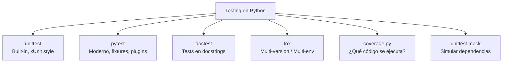
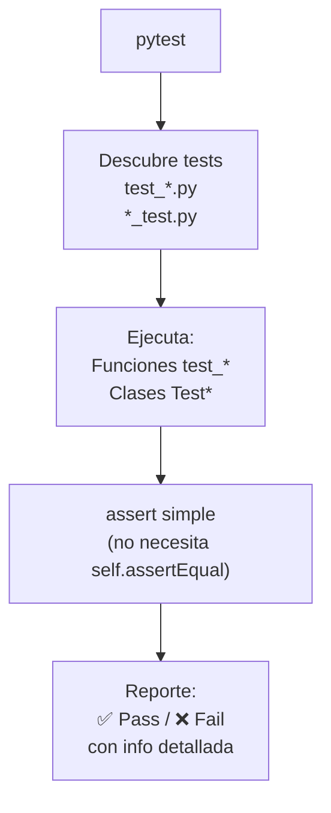
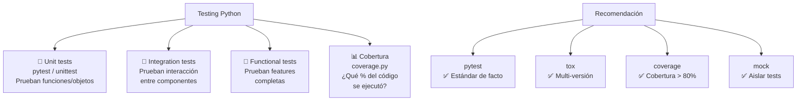

# Testeo

Python tiene un ecosistema maduro de herramientas para testing: desde el built-in `unittest` hasta frameworks modernos como `pytest`.



---

## pytest

Framework de testing más popular. Simple, potente, con miles de plugins.

```bash
pip install pytest pytest-cov

# Ejecutar tests
pytest
pytest tests/
pytest tests/test_calculadora.py
pytest -k "suma"        # filtrar por nombre
pytest -x                # parar en primer error
pytest -v                # verbose
pytest --cov=.           # cobertura
pytest --cov-report=html # reporte HTML
```



### Tests básicos

```python
# test_calculadora.py
def suma(a, b):
    return a + b

def test_suma_positivos():
    assert suma(2, 3) == 5

def test_suma_negativos():
    assert suma(-1, 1) == 0
    assert suma(-5, -3) == -8

def test_suma_floats():
    assert suma(0.1, 0.2) == 0.3  # ❌ puede fallar
    assert abs(suma(0.1, 0.2) - 0.3) < 1e-9  # ✅
```

### Fixtures

```python
import pytest

@pytest.fixture
def usuario():
    """Prepara datos para tests."""
    return {"nombre": "Ana", "edad": 25}

@pytest.fixture
def db():
    """Setup y teardown con yield."""
    conn = conectar_db(":memory:")
    yield conn  # test usa esto
    conn.close()  # cleanup

def test_usuario_nombre(usuario):
    assert usuario["nombre"] == "Ana"

def test_usuario_edad(usuario):
    assert usuario["edad"] == 25
```

### Fixtures con scope

```python
import pytest

@pytest.fixture(scope="session")  # una sola vez por sesión
def db_conn():
    return conectar_db()

@pytest.fixture(scope="module")   # una vez por módulo
def datos():
    return cargar_datos()

@pytest.fixture(scope="function")  # cada test (default)
def usuario_temp():
    return crear_usuario()
```

### Parametrización

```python
import pytest

@pytest.mark.parametrize("a,b,esperado", [
    (2, 3, 5),
    (0, 0, 0),
    (-1, 1, 0),
    (100, -50, 50),
])
def test_suma(a, b, esperado):
    assert suma(a, b) == esperado

# Combinatoria
@pytest.mark.parametrize("x", [1, 2])
@pytest.mark.parametrize("y", [10, 20])
def test_combinar(x, y):
    assert x < y  # se ejecuta 4 veces
```

### Tests con excepciones

```python
import pytest

def dividir(a, b):
    if b == 0:
        raise ValueError("No se puede dividir por cero")
    return a / b

def test_dividir_ok():
    assert dividir(10, 2) == 5.0

def test_dividir_error():
    with pytest.raises(ValueError, match="No se puede dividir"):
        dividir(10, 0)
```

### Marcadores (markers)

```python
import pytest

@pytest.mark.slow
def test_procesamiento_pesado():
    ...

@pytest.mark.skip(reason="No implementado aún")
def test_futuro():
    ...

@pytest.mark.skipif(sys.version_info < (3, 10), reason="Requiere Python 3.10+")
def test_nueva_funcionalidad():
    ...

# Ejecutar solo tests marcados
# pytest -m slow
# pytest -m "not slow"  # excluir
```

### Monkeypatch

```python
import pytest

def test_leer_config(monkeypatch):
    monkeypatch.setenv("DB_URL", "sqlite:///test.db")
    monkeypatch.setattr("os.path.exists", lambda x: True)

    assert os.getenv("DB_URL") == "sqlite:///test.db"
```

---

## unittest / PyUnit

Framework built-in (xUnit style). Similar a JUnit.

```python
import unittest

class TestCalculadora(unittest.TestCase):
    def setUp(self):
        """Setup antes de cada test."""
        self.calc = Calculadora()

    def tearDown(self):
        """Cleanup después de cada test."""
        pass

    def test_suma(self):
        self.assertEqual(self.calc.suma(2, 3), 5)
        self.assertNotEqual(self.calc.suma(2, 2), 5)

    def test_division_por_cero(self):
        with self.assertRaises(ValueError):
            self.calc.dividir(10, 0)

if __name__ == "__main__":
    unittest.main()
```

### Principales assert

| Método | Comprueba que |
|---|---|
| `assertEqual(a, b)` | `a == b` |
| `assertNotEqual(a, b)` | `a != b` |
| `assertTrue(x)` | `x is True` |
| `assertFalse(x)` | `x is False` |
| `assertIs(a, b)` | `a is b` |
| `assertIsNone(x)` | `x is None` |
| `assertIn(a, b)` | `a in b` |
| `assertRaises(Exc)` | Lanza excepción |
| `assertAlmostEqual(a, b)` | `abs(a-b) < delta` |

---

## doctest

Tests escritos en los **docstrings** que se verifican automáticamente.

```python
def suma(a, b):
    """Suma dos números.

    >>> suma(2, 3)
    5
    >>> suma(-1, 1)
    0
    >>> suma(0.1, 0.2)  # doctest: +ELLIPSIS
    0.300...
    """
    return a + b

def dividir(a, b):
    """Divide a entre b.

    >>> dividir(10, 2)
    5.0
    >>> dividir(10, 0)
    Traceback (most recent call last):
    ValueError: No se puede dividir por cero
    """
    if b == 0:
        raise ValueError("No se puede dividir por cero")
    return a / b

if __name__ == "__main__":
    import doctest
    doctest.testmod(verbose=True)
```

```bash
# Ejecutar doctests
python -m doctest modulo.py -v
```

---

## unittest.mock — Simular dependencias

```python
from unittest.mock import Mock, patch, MagicMock

# Mock simple
mocker = Mock()
mocker.return_value = 42
print(mocker())  # 42

# Simular método
api = Mock()
api.get_users.return_value = ["Ana", "Luis"]
api.get_users.side_effect = [["Ana"], Exception("Error")]

print(api.get_users())  # ["Ana"]
# api.get_users()  # raise Exception("Error")

# patch: reemplazar durante el test
import requests
from unittest.mock import patch

def obtener_usuario(id):
    resp = requests.get(f"https://api.com/users/{id}")
    return resp.json()

@patch("requests.get")
def test_obtener_usuario(mock_get):
    # Configurar mock
    mock_response = Mock()
    mock_response.json.return_value = {"id": 1, "nombre": "Ana"}
    mock_get.return_value = mock_response

    # Test
    resultado = obtener_usuario(1)
    assert resultado["nombre"] == "Ana"
    mock_get.assert_called_once_with("https://api.com/users/1")
```

```python
# patch como context manager
def test_archivo():
    with patch("builtins.open") as mock_open:
        mock_file = MagicMock()
        mock_file.read.return_value = "contenido simulado"
        mock_open.return_value.__enter__.return_value = mock_file

        with open("datos.txt") as f:
            contenido = f.read()

        assert contenido == "contenido simulado"
```

---

## tox — Probar en múltiples entornos

```bash
pip install tox
```

```ini
# tox.ini
[tox]
envlist = py39, py310, py311, py312

[testenv]
deps =
    pytest
    pytest-cov
commands =
    pytest --cov=src tests/

[testenv:lint]
deps =
    ruff
commands =
    ruff check .
```

```toml
# pyproject.toml (alternativa)
[tool.tox]
legacy_tox_ini = """
[tox]
envlist = py39, py310, py311

[testenv]
deps = pytest
commands = pytest
"""
```

```bash
tox                    # ejecutar en todos los entornos
tox -e py311           # solo Python 3.11
tox -e lint            # solo lint
tox -- --verbose       # pasar args a pytest
```

---

## coverage.py — Cobertura de código

```bash
pip install coverage

# Medir cobertura
coverage run -m pytest
coverage report          # terminal
coverage html            # reporte HTML (htmlcov/)
coverage xml             # reporte XML (CI)
```

```ini
# .coveragerc
[run]
source = src
omit = */tests/*,*/migrations/*

[report]
exclude_lines =
    pragma: no cover
    def __repr__
    raise AssertionError
```

---

## Estructura de proyecto con tests

```
mi-proyecto/
├── src/
│   └── calculadora.py
├── tests/
│   ├── __init__.py
│   ├── conftest.py          # fixtures compartidos
│   ├── test_calculadora.py
│   └── test_utils.py
├── pyproject.toml
└── tox.ini
```

```python
# tests/conftest.py (fixtures compartidos)
import pytest

@pytest.fixture
def calculadora():
    from src.calculadora import Calculadora
    return Calculadora()
```

---

## Tabla comparativa

| Herramienta | Propósito | Sintaxis | Plugins | Velocidad |
|---|---|---|---|---|
| **pytest** | Testing general | `assert` | ✅ 1000+ | ⚡ Rápido |
| **unittest** | Testing built-in | `self.assertEqual` | ❌ Poco | 🐢 Lento |
| **doctest** | Tests en docstrings | `>>> comando` | ❌ No | ⚡ Rápido |
| **tox** | Multi-entorno | Config `tox.ini` | ✅ | 🐢 Lento |
| **coverage.py** | Cobertura | `coverage run` | ✅ | 🐢 Lento |
| **mock** | Simular dependencias | `Mock / patch` | N/A | ⚡ Rápido |

---

## Buenas prácticas

```python
# ✅ Tests atómicos (cada test prueba UNA cosa)
def test_suma_positivos():
    assert suma(2, 3) == 5

def test_suma_negativos():
    assert suma(-1, 1) == 0

# ✅ Nombres descriptivos
def test_usuario_no_puede_tener_email_vacio():
    ...

# ✅ Fixtures para setup repetitivo
@pytest.fixture
def usuario_valido():
    return crear_usuario(nombre="Ana", email="ana@test.com")

# ✅ Parametrizar en vez de copiar tests
@pytest.mark.parametrize("input,esperado", [
    ([3, 1, 2], [1, 2, 3]),
    ([], []),
    ([1], [1]),
])
def test_ordenar(input, esperado):
    assert ordenar(input) == esperado

# ✅ Mockear I/O (archivos, red, DB)
@patch("requests.get")
def test_api(mock_get):
    ...

# ✅ Cobertura mínima 80%+
# pytest --cov=src --cov-fail-under=80
```

---

## Resumen visual


