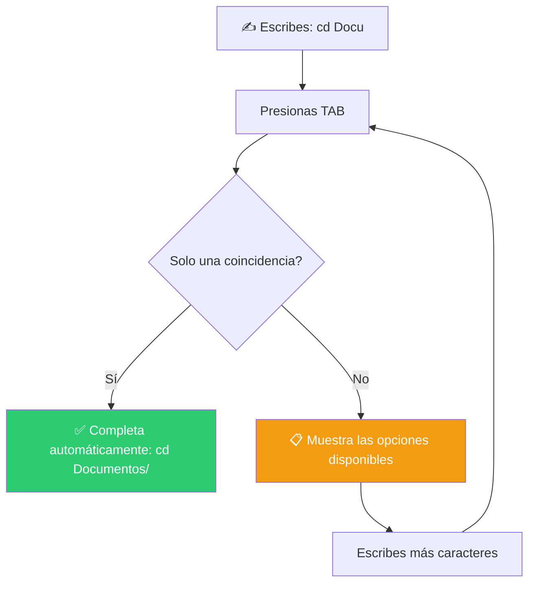
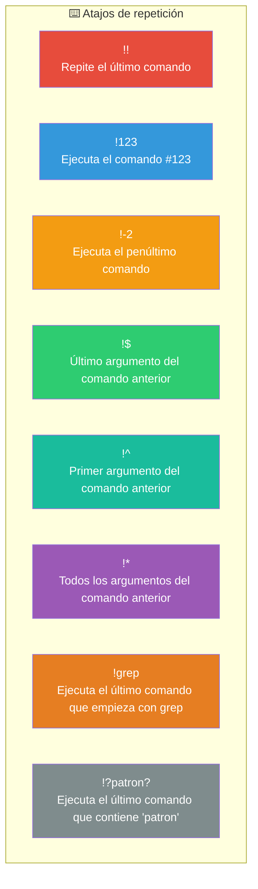
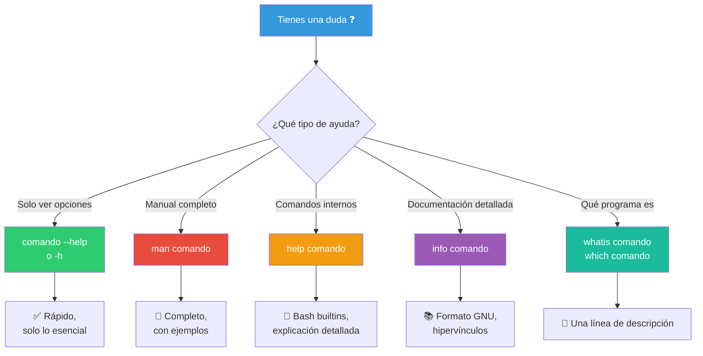
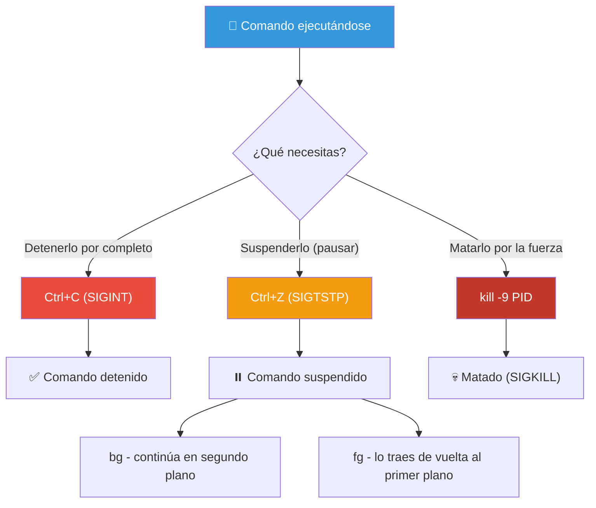
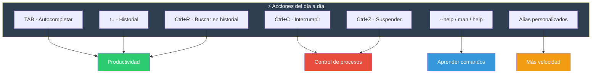

# Acciones comunes

La shell ofrece atajos y trucos para trabajar más rápido. Estos son los que usarás a diario.

## Autocompletado de tabulador

Bash puede completar automáticamente comandos, rutas, nombres de archivo, variables y opciones.

### Cómo funciona

Presiona **`TAB`** (una o dos veces) mientras escribes:



### Ejemplos prácticos

```bash
# Autocompletado de comandos
ec[TAB]        → echo        (único match)
gre[TAB]       → grep        (único match)
c[TAB][TAB]    → muestra: cal, cat, cd, chmod, clear, cp, ... (múltiples)

# Autocompletado de rutas y archivos
cd Docu[TAB]   → cd Documentos/
ls ~/Do[TAB]   → ls ~/Documentos/
cat /etc/ho[TAB] → cat /etc/hostname (o /etc/hosts)

# Autocompletado de variables
echo $HOM[TAB] → echo $HOME
echo $PAT[TAB] → echo $PATH

# Autocompletado de opciones de comandos
ls --[TAB][TAB] → muestra todas las opciones de ls
grep --i[TAB]   → grep --ignore-case (en algunos sistemas)

# Autocompletado de usuario
ls /home/[TAB]  → lista usuarios
```

### Consejos

| Truco | Efecto |
|-------|--------|
| `TAB` | Completa si hay una opción única |
| `TAB TAB` | Muestra todas las opciones disponibles |
| `Alt+*` | Expande el patrón glob a todos los matches |
| `Alt+.` | Inserta el último argumento del comando anterior |

```bash
# Ejemplo de Alt+*
# Si tienes archivos: a.txt, b.txt, c.txt
# Escribe: cat *.txt
# Alt+* lo expande a: cat a.txt b.txt c.txt
```

---

## Repetir comandos

Bash guarda un historial de todos los comandos que ejecutas. Puedes repetirlos de varias formas.

### El historial

```bash
history              # Muestra el historial numerado
history 20           # Muestra los últimos 20 comandos
history -c           # Limpia el historial
history -d 123       # Elimina la entrada 123 del historial
```

### Atajos del historial



```bash
# Ejemplos
ls -la /home/usuario/documentos
!!                 # Repite: ls -la /home/usuario/documentos
sudo !!            # Ejecuta el último comando con sudo
!$                 # /home/usuario/documentos
cd !$              # cd /home/usuario/documentos

echo archivo1 archivo2 archivo3
cat !*             # cat archivo1 archivo2 archivo3

# Búsqueda en el historial
Ctrl+R     # Búsqueda interactiva (escribe parte del comando)
Ctrl+R     # Siguiente coincidencia hacia atrás
Ctrl+S     # Siguiente coincidencia hacia adelante (si está habilitado)
Enter      # Ejecuta el comando encontrado
Ctrl+G     # Sale de la búsqueda
```

### Modificación del último comando

```bash
ls /home/usuario/documentos
^documentos^Descargas^  # Cambia: ls /home/usuario/Descargas

# Equivalente a:
!!:s/documentos/Descargas/
```

### Atajos de teclado para navegar el historial

| Atajo | Acción |
|-------|--------|
| `↑` (flecha arriba) | Comando anterior |
| `↓` (flecha abajo) | Comando siguiente |
| `Ctrl+P` | Comando anterior (como ↑) |
| `Ctrl+N` | Comando siguiente (como ↓) |
| `Ctrl+R` | Búsqueda hacia atrás |
| `Alt+<` | Primer comando del historial |
| `Alt+>` | Último comando del historial |

---

## Comandos de ayuda

Bash ofrece varias formas de obtener ayuda sobre cualquier comando.



### `comando --help` o `comando -h`

La mayoría de comandos aceptan `--help` para una ayuda rápida:

```bash
ls --help        # Muestra opciones de ls
grep --help      # Muestra opciones de grep
cp --help        # Muestra opciones de cp
```

### `man` — Manual

El manual completo del sistema. Está organizado en **secciones**:

```bash
man ls           # Manual de ls
man man          # Manual del manual
man -k buscar    # Busca páginas que contengan "buscar"
man -f comando   # Muestra todas las secciones disponibles para el comando
```

#### Secciones del manual

| Sección | Contenido |
|---------|-----------|
| 1 | Comandos de usuario (programas ejecutables) |
| 2 | Llamadas al sistema (funciones del kernel) |
| 3 | Funciones de biblioteca (libc, etc.) |
| 4 | Archivos especiales (dispositivos en `/dev`) |
| 5 | Formatos de archivo (`/etc/passwd`, etc.) |
| 6 | Juegos |
| 7 | Miscelánea (convenciones, paquetes) |
| 8 | Comandos de administración (`root`) |

```bash
man 5 crontab    # Formato del archivo crontab
man 7 hier       # Estructura del sistema de archivos
man 8 fdisk      # Comando de administración fdisk
```

#### Navegación en `man`

| Tecla | Acción |
|-------|--------|
| `q` | Salir |
| `Enter` | Bajar una línea |
| `Espacio` | Bajar una página |
| `b` | Subir una página |
| `/palabra` | Buscar "palabra" hacia adelante |
| `?palabra` | Buscar "palabra" hacia atrás |
| `n` | Siguiente resultado de búsqueda |
| `N` | Resultado anterior |
| `g` | Ir al inicio |
| `G` | Ir al final |
| `h` | Ayuda del manual |

### `help` — Ayuda para builtins

Los comandos internos de Bash (builtins) no tienen página man propia. Usa `help`:

```bash
help             # Lista todos los builtins disponibles
help cd          # Ayuda detallada del comando cd
help set         # Opciones de set
help export      # Cómo funciona export
help source      # Cómo funciona source (.)
help trap        # Manejo de señales
```

### `info` — Documentación GNU

Formato de documentación más rico que man, con hipervínculos:

```bash
info ls          # Documentación de ls en formato info
info bash        # Manual completo de Bash
info --help      # Ayuda de info
```

```bash
# Navegación en info
n   # Siguiente nodo
p   # Nodo anterior
u   # Subir un nivel
l   # Último nodo visitado
TAB # Siguiente enlace
q   # Salir
```

### `whatis` y `which`

```bash
whatis ls        # Una línea: "list directory contents"
whatis cp        # Una línea: "copy files and directories"
whatis bash      # "GNU Bourne-Again SHell"

which ls         # /usr/bin/ls (ruta del ejecutable)
which python3    # /usr/bin/python3
which -a ls      # Todas las ubicaciones de ls en PATH
```

---

## Bash alias

Los **alias** son atajos para comandos largos. Se definen con `alias nombre='comando'`.

> ⚠️ Ya vimos alias en detalle en *Ajustando Bash*. Aquí solo lo esencial para referencia rápida.

### Definir y usar alias

```bash
# Crear alias (en vivo o en ~/.bashrc)
alias ll='ls -laF'
alias gs='git status'
alias update='sudo apt update && sudo apt upgrade'

# Usarlos
ll         # Ejecuta: ls -laF
gs         # Ejecuta: git status
update     # Ejecuta: sudo apt update && sudo apt upgrade
```

### Gestionar alias

```bash
alias              # Lista todos los alias definidos
alias ll           # Muestra qué hace el alias 'll'
unalias ll         # Elimina el alias 'll'
unalias -a         # Elimina todos los alias
```

### Permanencia

Los alias definidos en la terminal solo viven en la sesión actual. Para hacerlos permanentes:

```bash
echo "alias ll='ls -laF'" >> ~/.bashrc
source ~/.bashrc
```

### Alias útiles

```bash
# Navegación
alias ..='cd ..'
alias ...='cd ../..'
alias home='cd ~'

# Listados
alias ll='ls -laF'
alias la='ls -A'
alias l='ls -CF'

# Seguridad
alias rm='rm -i'
alias cp='cp -i'
alias mv='mv -i'

# GIT
alias gs='git status'
alias ga='git add'
alias gc='git commit'
alias gp='git push'
alias gl='git log --oneline --graph'

# Sistema
alias df='df -h'
alias free='free -h'
alias du='du -h'
alias grep='grep --color=auto'
```

---

## Detener ejecución

A veces necesitas interrumpir un comando que se está ejecutando.



### `Ctrl+C` — Interrumpir (SIGINT)

Detiene el comando que se está ejecutando. Es la forma más común y segura.

```bash
tail -f log.txt    # Sigue mostrando el log en tiempo real
# Presiona Ctrl+C para detenerlo
```

### `Ctrl+Z` — Suspender (SIGTSTP)

Pausa el comando y lo deja en segundo plano. Puedes reanudarlo después.

```bash
# Ejemplo: estás en VIM o nano
Ctrl+Z             # Suspende el editor
# ... haces otra cosa en la terminal ...
fg                 # Reanuda el editor (foreground)
jobs               # Lista trabajos suspendidos/en segundo plano
```

```bash
sleep 100          # Comando que dura 100 segundos
Ctrl+Z             # Lo suspendes
[1]+ Detenido     sleep 100
bg                 # Lo pasas a segundo plano
[1]+ sleep 100 &  # Se ejecuta en segundo plano
fg                 # Lo traes de vuelta al primer plano
```

### `Ctrl+D` — EOF (End of File)

Cierra la entrada estándar. Si la línea está vacía, cierra la terminal.

```bash
# En una sesión interactiva
Ctrl+D    # Cierra la terminal (equivale a escribir exit)

# En un comando que espera entrada
cat > archivo.txt
Escribiendo...
Ctrl+D    # Finaliza la entrada y guarda
```

### `kill` — Terminar procesos

Para procesos que no responden a `Ctrl+C`:

```bash
# Obtener el PID (Process ID)
ps aux | grep comando
pgrep comando
pidof comando

# Señales de terminación
kill PID              # SIGTERM (15) - terminación limpia
kill -15 PID          # SIGTERM - igual que arriba
kill -9 PID           # SIGKILL (9) - forzoso, inmediato
kill -2 PID           # SIGINT (2) - como Ctrl+C
kill -1 PID           # SIGHUP (1) - recargar configuración
kill -19 PID          # SIGSTOP (19) - suspender
kill -18 PID          # SIGCONT (18) - reanudar
```

```bash
# Ejemplos
kill 1234             # Termina el proceso 1234
kill -9 1234          # Mata forzosamente el proceso 1234
kill -9 -1            # ⚠️ Mata TODOS los procesos que puedas (peligroso)
pkill firefox         # Mata todos los procesos con "firefox" en el nombre
killall chrome        # Mata todos los procesos chrome
```

### Tabla de señales comunes

| Señal | Número | Comportamiento | Uso típico |
|-------|--------|----------------|------------|
| SIGINT | 2 | Interrumpir | `Ctrl+C` |
| SIGQUIT | 3 | Salir con core dump | `Ctrl+\` |
| SIGKILL | 9 | Matar (no se puede ignorar) | `kill -9 PID` |
| SIGTERM | 15 | Terminar (limpio) | `kill PID` |
| SIGTSTP | 20 | Suspender desde terminal | `Ctrl+Z` |
| SIGCONT | 18 | Reanudar | Continuar proceso detenido |
| SIGHUP | 1 | Colgar | Terminal cerró / recargar config |
| SIGSTOP | 19 | Parar (no se puede ignorar) | Detener proceso |

### `jobs`, `fg`, `bg`

```bash
jobs                 # Lista trabajos: [1]+ Detenido  comando
jobs -l              # Lista con PID
fg %1                # Trae el trabajo 1 al frente
bg %1                # Ejecuta el trabajo 1 en segundo plano
kill %1              # Termina el trabajo 1
```

```bash
# Ejecutar directamente en segundo plano
sleep 100 &
# [1] 12345
# El PID es 12345, se ejecuta en segundo plano
```

---

## Resumen visual



> **💡 Consejo**: Estos atajos parecen pequeños, pero sumados ahorran muchísimo tiempo. El más útil de todos: **`Ctrl+R`** para buscar comandos que ya ejecutaste. El segundo: **`TAB`** para no escribir rutas largas. Apréndetelos y ganarás fluidez rápidamente.

## Relacionados:
- [[archivos-y-directorios]] #anterior 
- [[redirecciones-y-pipelines]] #siguiente 
- [[history]] #related 
- [[man]] #related 