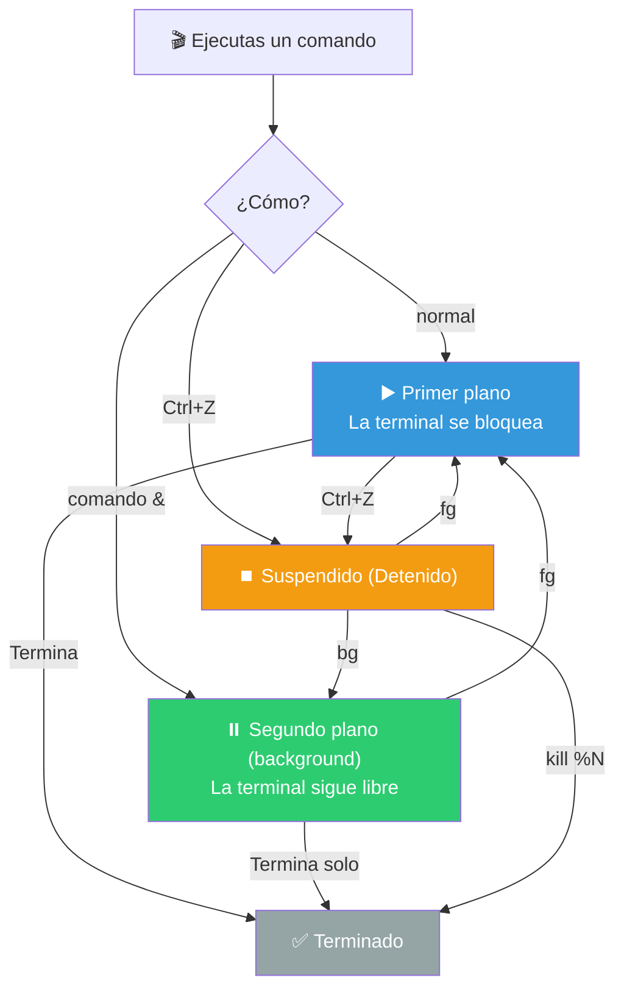
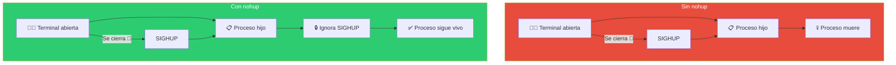
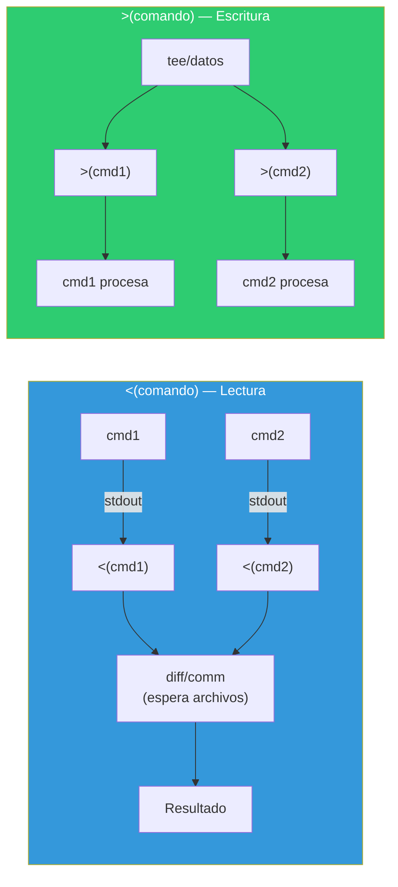

# Administración de procesos

Bash permite gestionar procesos: ejecutarlos en segundo plano, moverlos entre planos, mantenerlos vivos al cerrar la terminal y monitorearlos.

## Ciclo de vida de un proceso



---

## `jobs` — Listar trabajos

`jobs` muestra los procesos en segundo plano y suspendidos de la terminal actual.

```bash
$ sleep 100 &
[1] 12345

$ sleep 200 &
[2] 12346

$ jobs
[1]-  Running     sleep 100 &
[2]+  Running     sleep 200 &
```

### Formato de salida

```bash
[1]   Running     comando &
[2]-  Running     comando &
[3]+  Stopped     comando
```

| Símbolo | Significado |
|---------|-------------|
| `+` | Trabajo por defecto (fg/bg/kill sin número lo afecta) |
| `-` | Segundo trabajo por defecto |
| `Running` | Ejecutándose en segundo plano |
| `Stopped` | Suspendido (Ctrl+Z) |
| `Done` | Terminado (aparece antes de desaparecer) |

### Opciones de jobs

```bash
jobs              # Lista trabajos de la terminal actual
jobs -l           # Incluye PIDs
jobs -p           # Solo PIDs
jobs -r           # Solo trabajos en ejecución
jobs -s           # Solo trabajos detenidos
jobs %1           # Información del trabajo 1
```

---

## `nohup` — No Hang Up

`nohup` ejecuta un comando ignorando la señal `SIGHUP` (que se envía cuando la terminal se cierra). Así el proceso sigue vivo aunque cierres la terminal.

```bash
# Sin nohup: el proceso muere al cerrar la terminal
./script_largo.sh &

# Con nohup: el proceso vive incluso si cierras la terminal
nohup ./script_largo.sh &

# Con salida redirigida (por defecto nohup.out)
nohup ./script_largo.sh > salida.log 2>&1 &

# Ejemplo real: proceso que dure días
nohup python3 entrenar_modelo.py > entrenamiento.log 2>&1 &
```

### Cómo funciona



### Verificar procesos con nohup

```bash
# ps muestra todos los procesos (incluso sin terminal)
ps aux | grep script_largo

# pgrep busca por nombre
pgrep -a script_largo
```

---

## `fg, bg` — Foreground y Background

Mueven trabajos entre primer plano y segundo plano.

### `bg` — Pasar a segundo plano

```bash
# Poner un trabajo detenido a ejecutarse en segundo plano
bg %1              # Trabajo 1
bg                 # Trabajo con + (por defecto)
```

### `fg` — Traer a primer plano

```bash
# Traer un trabajo al primer plano
fg %1              # Trabajo 1
fg                 # Trabajo con + (por defecto)
```

### Ejemplo completo

```bash
# 1. Ejecutar comando largo
sleep 300

# 2. Suspender con Ctrl+Z
# [1]+  Stopped  sleep 300

# 3. Mover a segundo plano
bg
# [1]+ sleep 300 &

# 4. Ver trabajos
jobs -l
# [1]+ 12345 Running  sleep 300 &

# 5. Traer al primer plano
fg
# sleep 300  (la terminal se bloquea otra vez)
```

### Referencia de especificadores de trabajo

```bash
%N              # Trabajo número N
%+ o %%         # Trabajo por defecto (con +)
%-              # Segundo trabajo por defecto (con -)
%comando        # Trabajo cuyo comando empiece con "comando"
%?comando       # Trabajo cuyo comando contenga "comando"
```

---

## `disown` — Desvincular de la terminal

`disown` elimina un trabajo de la tabla de trabajos de la terminal. Después de `disown`, el proceso ya no recibe `SIGHUP` al cerrar la terminal (como `nohup` pero aplicado a procesos ya existentes).

```bash
# Desvincular un trabajo
sleep 100 &
disown %1

# Desvincular el trabajo más reciente
sleep 200 &
disown

# Desvincular todos los trabajos
disown -a

# Desvincular y marcar para que no reciba SIGHUP
disown -h %1
```

### nohup vs disown

```bash
# nohup: antes de ejecutar
nohup ./script.sh > log.txt &

# disown: después de ejecutar
./script.sh > log.txt &
disown

# Resultado: en ambos casos el proceso sobrevive al cierre de la terminal
```

### Ejemplo práctico

```bash
#!/bin/bash
# Proceso largo que debe seguir aunque cierre la terminal

echo "Iniciando proceso largo en segundo plano..."
./proceso_largo.sh > proceso.log 2>&1 &

PID=$!
disown

echo "Proceso lanzado con PID $PID"
echo "Puedes cerrar la terminal, el proceso seguirá vivo."

# Seguimiento
echo "Para monitorear: tail -f proceso.log"
echo "Para matar: kill $PID"
```

---

## Sustitución de procesos

La **sustitución de procesos** (`<(comando)` y `>(comando)`) permite tratar la salida de un comando como si fuera un archivo.

```bash
# Sintaxis
<(comando)   # Trata la salida como archivo (lectura)
>(comando)   # Trata la entrada como archivo (escritura)
```

### `<(comando)` — Salida como archivo

```bash
# diff necesita archivos, no pipes
diff <(ls dir1) <(ls dir2)

# Comparar archivos después de filtros
diff <(grep "ERROR" log1.txt | sort) <(grep "ERROR" log2.txt | sort)

# Pasar múltiples fuentes a un comando
comm <(cut -d: -f1 /etc/passwd | sort) <(cut -d: -f1 /etc/group | sort)

# Comparar salida de comandos
diff <(curl -s http://api.example.com/v1) <(curl -s http://api.example.com/v2)
```

### `>(comando)` — Entrada como archivo

```bash
# Redirigir a múltiples procesos simultáneamente
tee >(gzip > archivo.gz) >(bzip2 > archivo.bz2) < archivo.txt

# Log con timestamp
echo "mensaje" >(while read -r linea; do
    echo "[$(date '+%H:%M:%S')] $linea" >> log.txt
done)

# Backup y procesar al mismo tiempo
cat datos.csv | tee >(gzip > backup.csv.gz) | awk -F',' '{print $1}' > ids.txt
```

### Sustitución de procesos para evitar subshells

```bash
# ❌ Pipe crea subshell — las variables no persisten
contador=0
grep "error" log.txt | while read -r linea; do
    ((contador++))
done
echo "$contador"   # 0 (no se modificó)

# ✅ Process substitution — mismo shell
contador=0
while read -r linea; do
    ((contador++))
done < <(grep "error" log.txt)
echo "$contador"   # N (correcto)
```

### Mapa de sustitución de procesos



---

## Otras herramientas de administración de procesos

### `ps` — Listar procesos

```bash
ps                  # Procesos de la terminal actual
ps aux              # Todos los procesos (formato BSD)
ps -ef              # Todos los procesos (formato estándar)
ps aux --sort=-%mem # Ordenados por uso de memoria
ps aux --sort=-%cpu # Ordenados por uso de CPU
ps -u usuario       # Procesos de un usuario específico
ps -p 1234          # Proceso específico por PID
```

### `pgrep` y `pkill` — Buscar y matar por nombre

```bash
# pgrep: buscar PID por nombre
pgrep firefox                    # PID del proceso firefox
pgrep -a firefox                 # PID y nombre completo
pgrep -u usuario firefox         # Procesos firefox de un usuario
pgrep -f "python.*script"        # Por patrón en la línea de comandos

# pkill: matar por nombre
pkill firefox                    # Mata todos los firefox
pkill -9 firefox                 # Mata forzoso
pkill -f "python script.py"      # Por patrón completo
```

### `top` / `htop` — Monitoreo en tiempo real

```bash
top                 # Monitor interactivo de procesos
htop                # Versión mejorada (instalar por separado)

# Atajos en top:
# q    = salir
# k    = matar proceso (pide PID)
# u    = filtrar por usuario
# M    = ordenar por memoria
# P    = ordenar por CPU
```

### `kill` — Enviar señales

```bash
kill PID            # SIGTERM (15) — terminación limpia
kill -2 PID         # SIGINT (2) — como Ctrl+C
kill -9 PID         # SIGKILL (9) — forzoso
kill -1 PID         # SIGHUP (1) — recargar configuración
kill -0 PID         # Solo verificar si el proceso existe

kill %1             # Matar por número de trabajo
kill -9 %1          # Matar forzoso por número de trabajo

kill -l             # Lista todas las señales
```

### `wait` — Esperar procesos hijos

```bash
#!/bin/bash

# Lanzar procesos en paralelo
sleep 5 &
PID1=$!

sleep 3 &
PID2=$!

echo "Esperando procesos..."

wait $PID1   # Espera a que termine el proceso 1
echo "PID1 terminó"

wait         # Espera TODOS los procesos hijos
echo "Todos los procesos terminaron"
```

---

## Script de ejemplo

```bash
#!/bin/bash
# ============================================
# Script: gestor_procesos.sh
# Descripción: Lanza y gestiona procesos en paralelo
# ============================================

set -euo pipefail

# Directorio de logs
LOG_DIR="/tmp/procesos"
mkdir -p "$LOG_DIR"

# Función para lanzar proceso en bg
lanzar() {
    local nombre="$1"
    local comando="$2"
    local log="$LOG_DIR/${nombre}.log"

    echo "Lanzando $nombre..."
    eval "$comando" > "$log" 2>&1 &
    local pid=$!
    echo "$pid" > "$LOG_DIR/${nombre}.pid"
    echo "  PID: $pid, Log: $log"
}

# Función para monitorear
monitorear() {
    echo "=== Procesos activos ==="
    for pid_file in "$LOG_DIR"/*.pid; do
        local nombre=$(basename "$pid_file" .pid)
        local pid=$(cat "$pid_file")
        if kill -0 "$pid" 2>/dev/null; then
            echo "  ✅ $nombre (PID: $pid)"
        else
            echo "  ❌ $nombre (PID: $pid — terminado)"
        fi
    done
}

# Lanzar procesos
lanzar "tarea1" "sleep 30"
lanzar "tarea2" "sleep 60"
lanzar "tarea3" "ping -c 10 localhost"

monitorear

echo "Procesos en segundo plano. Logs en: $LOG_DIR"
echo "Usa 'jobs' para verlos desde esta terminal."
echo "Usa 'disown' para mantenerlos al cerrar."

# Esperar a que terminen o Ctrl+C
echo "Esperando procesos (Ctrl+C para salir)..."
wait
echo "Todos los procesos terminaron."
```

> **🎯 Resumen**: `comando &` para segundo plano, `jobs` para listar, `fg`/`bg` para mover entre planos, `nohup`/`disown` para sobrevivir al cierre de terminal. La sustitución de procesos `<(cmd)` evita subshells y permite pasar salida de comandos a programas que esperan archivos. `wait` coordina procesos hijos paralelos.

## Relacionados:
- [[expresiones-regulares-bash]] #anterior 
- [[monitoreo-del-sistema]] #siguiente 
- [[ps]] #related 
- [[gestion-de-procesos-en-linux]] #related 