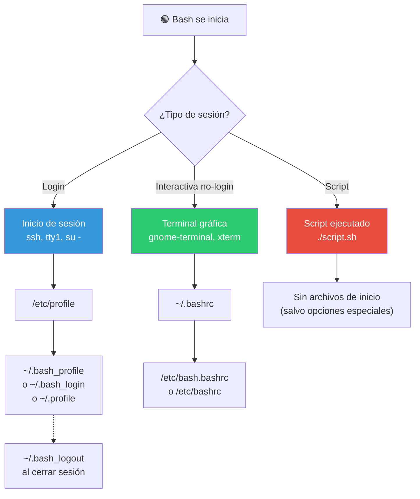
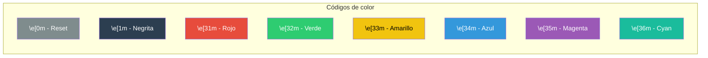
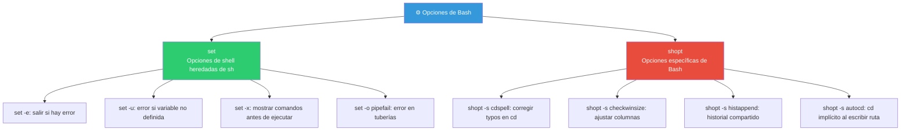
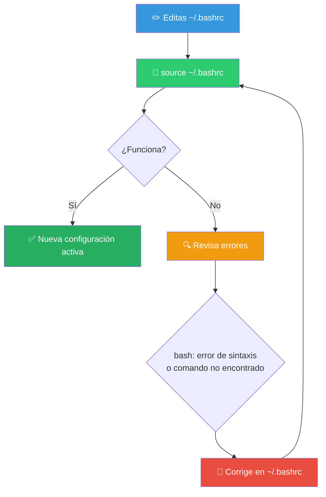

# Ajustando Bash

Bash es altamente personalizable. Puedes cambiar el prompt, agregar alias, definir funciones, ajustar el comportamiento con opciones y mucho más. Todo se configura en **archivos de inicio**.

## Archivos de inicio de Bash

Cuando Bash se inicia, lee archivos de configuración específicos según el **tipo de sesión**:



### ¿Cuál usar?

```bash
# Configuración personal
~/.bashrc       # ✅ Este es el que más editarás
~/.bash_profile # Para login shells (suele hacer source de .bashrc)
~/.bash_logout  # Comandos al cerrar sesión
~/.profile      # Alternativa si .bash_profile no existe

# Configuración global (afecta a todos los usuarios)
/etc/profile
/etc/bash.bashrc
/etc/bashrc
```

### Práctica recomendada

En `~/.bash_profile`:

```bash
# Si existe ~/.bashrc, ejecutarlo
if [ -f ~/.bashrc ]; then
    . ~/.bashrc
fi
```

Así tu configuración principal vive en un solo lugar: `~/.bashrc`.

---

## Personalizando el Prompt (PS1)

El prompt se controla con la variable `PS1`. Puedes incluir colores, el usuario, la ruta, la hora...

### Componentes básicos de PS1

```bash
\d        # Fecha: Sat May 30
\h        # Hostname hasta el primer punto
\H        # Hostname completo
\n        # Nueva línea
\t        # Hora: HH:MM:SS
\u        # Usuario actual
\w        # Directorio actual (ruta completa)
\W        # Directorio actual (solo la última carpeta)
\$        # # si root, $ si usuario normal
\\        # Barra invertida
\nnn      # Carácter ASCII en octal
\[...\]   # Secuencia no imprimible (para colores)
```

### Ejemplos de prompts

```bash
# Prompt simple
PS1='\u@\h:\w\$ '
# Resultado: usuario@host:/ruta/actual$

# Prompt con fecha y hora
PS1='[\d \t] \u@\h:\w\$ '
# Resultado: [Sat May 30 14:30:00] usuario@host:~$

# Prompt en dos líneas
PS1='\u@\h:\w\n\$ '
# Resultado:
# usuario@host:~
# $
```

### Añadiendo colores



```bash
# Prompt con colores
# Formato: \[\e[CODIGOm\]texto\[\e[0m\]
PS1='\[\e[32m\]\u@\h\[\e[0m\]:\[\e[34m\]\w\[\e[0m\]\$ '
# Verde para usuario@host, azul para la ruta

# Prompt con colores 256
PS1='\[\e[38;5;82m\]\u\[\e[0m\]@\[\e[38;5;39m\]\h\[\e[0m\]:\[\e[38;5;11m\]\w\[\e[0m\]\$ '
```

### Prompt avanzado con Git

```bash
# Muestra la rama de Git si estamos en un repo
parse_git_branch() {
    git branch 2>/dev/null | grep '^*' | colrm 1 2
}

PS1='\u@\h:\w \[\e[33m\]$(parse_git_branch)\[\e[0m\]\$ '
```

---

## Alias

Los alias son atajos para comandos largos. Se definen en `~/.bashrc`.

```bash
# Sintaxis
alias nombre='comando'

# Ejemplos útiles
alias ll='ls -laF'
alias la='ls -A'
alias l='ls -CF'
alias ..='cd ..'
alias ...='cd ../..'
alias grep='grep --color=auto'
alias cls='clear'
alias df='df -h'
alias free='free -h'
alias ports='netstat -tulanp'
alias myip='curl ifconfig.me'
```

### Alias con argumentos

Los alias no aceptan argumentos posicionales directamente. Para eso, usa **funciones**:

```bash
# Esto no funciona como esperas:
# alias mkcd='mkdir $1 && cd $1'

# Esto sí:
mkcd() {
    mkdir -p "$1" && cd "$1"
}
```

### Ver y eliminar alias

```bash
alias            # Lista todos los alias
alias nombre     # Muestra qué hace un alias
unalias nombre   # Elimina un alias
unalias -a       # Elimina todos los alias
```

---

## Funciones en Bash

Las funciones son como alias potentes. Pueden tener parámetros, variables locales y lógica:

```bash
# Definición
nombre() {
    # código
}

# Ejemplo: extractor de archivos
extract() {
    if [ -f "$1" ]; then
        case "$1" in
            *.tar.bz2) tar xjf "$1" ;;
            *.tar.gz)  tar xzf "$1" ;;
            *.zip)     unzip "$1" ;;
            *.rar)     unrar x "$1" ;;
            *)         echo "Formato no soportado" ;;
        esac
    else
        echo "'$1' no es un archivo válido"
    fi
}
```

---

## Variables de entorno importantes

```bash
# Directorios
HOME       # /home/usuario
PWD        # Directorio actual (ruta completa)
OLDPWD     # Directorio anterior

# Rutas de búsqueda
PATH       # Directorios donde buscar ejecutables
MANPATH    # Directorios donde buscar páginas man

# Historial
HISTSIZE   # Número de comandos a recordar en memoria
HISTFILE   # Archivo donde se guarda el historial
HISTFILESIZE # Número de líneas en el archivo de historial

# Editor
EDITOR     # Editor por defecto (nano, vim)
VISUAL     # Editor visual
PAGER      # Paginador (less, more)

# Idioma
LANG       # Idioma del sistema
LC_ALL     # Sobreescribe toda la configuración locale
```

### Modificar PATH

```bash
# Añadir al final
export PATH="$PATH:$HOME/bin"

# Añadir al principio
export PATH="$HOME/bin:$PATH"
```

---

## Opciones de Bash (`set` y `shopt`)



### Ejemplos prácticos

```bash
# En scripts: modo estricto
set -euo pipefail

# En ~/.bashrc: corrección de directorios
shopt -s cdspell
shopt -s autocd

# Historial compartido entre terminales
shopt -s histappend
```

---

## Historial de comandos

```bash
# Atajos
Ctrl+R    # Búsqueda incremental en el historial
Ctrl+P    # Comando anterior
Ctrl+N    # Comando siguiente
history   # Lista el historial
!!        # Repite el último comando
!$        # Último argumento del comando anterior
!n        # Ejecuta el comando número n del historial
```

### Configuración del historial

```bash
# En ~/.bashrc
HISTSIZE=10000          # Registros en memoria
HISTFILESIZE=20000      # Registros en archivo
HISTFILE=~/.bash_history
HISTTIMEFORMAT="%F %T " # Con marca de tiempo
HISTCONTROL=ignoredups  # Ignora duplicados consecutivos

# No registrar ciertos comandos
HISTIGNORE="ls:ll:la:cd:pwd:exit:clear:history"
```

---

## Key bindings (atajos de teclado)

Bash usa la biblioteca **Readline**. Puedes personalizar las combinaciones de teclas:

### Atajos por defecto

```bash
# Movimiento
Ctrl+A    # Inicio de línea
Ctrl+E    # Fin de línea
Alt+B     # Palabra anterior
Alt+F     # Palabra siguiente
Ctrl+XX   # Alternar entre posición actual e inicio

# Edición
Ctrl+K    # Borrar hasta fin de línea
Ctrl+U    # Borrar hasta inicio de línea
Ctrl+W    # Borrar palabra anterior
Alt+D     # Borrar palabra siguiente
Alt+.     # Último argumento del comando anterior

# Procesos
Ctrl+C    # Interrumpir (SIGINT)
Ctrl+D    # EOF (salir si la línea está vacía)
Ctrl+Z    # Suspender (SIGTSTP)
Ctrl+L    # Limpiar pantalla
```

### Personalizar con `bind`

```bash
# Ver todas las combinaciones
bind -p

# Asignar tecla a función
bind '"\C-w": backward-kill-word'
bind '"\e[1;5D": backward-word'   # Ctrl+Left
bind '"\e[1;5C": forward-word'    # Ctrl+Right
```

O mediante el archivo `~/.inputrc`:

```inputrc
# ~/.inputrc
"\C-w": backward-kill-word
"\e[1;5D": backward-word
"\e[1;5C": forward-word

# Case-insensitive completion
set completion-ignore-case on
```

---

## Configuración completa de ejemplo

Aquí tienes un `~/.bashrc` completo y comentado:

```bash
# ============================================
# ~/.bashrc - Configuración personal de Bash
# ============================================

# --- Opciones de shell ---
shopt -s cdspell          # Corrige errores tipográficos en cd
shopt -s autocd           # Escribe una ruta y hace cd automático
shopt -s histappend       # Comparte historial entre terminales
shopt -s checkwinsize     # Ajusta columnas/filas al cambiar tamaño

# --- Historial ---
HISTSIZE=10000
HISTFILESIZE=20000
HISTTIMEFORMAT="%F %T "
HISTCONTROL=ignoredups:erasedups
HISTIGNORE="ls:ll:la:cd:pwd:exit:clear:history"

# --- Alias ---
alias ll='ls -laF'
alias la='ls -A'
alias ..='cd ..'
alias grep='grep --color=auto'
alias df='df -h'
alias free='free -h'

# --- Prompt con colores y Git ---
parse_git_branch() {
    git branch 2>/dev/null | grep '^*' | colrm 1 2
}
PS1='\[\e[32m\]\u@\h\[\e[0m\]:\[\e[34m\]\w\[\e[0m\]\[\e[33m\]$(parse_git_branch)\[\e[0m\]\$ '

# --- Variables de entorno ---
export EDITOR=nano
export VISUAL=nano
export PAGER=less

# --- PATH ---
export PATH="$PATH:$HOME/bin"
export PATH="$PATH:$HOME/.local/bin"

# --- Funciones útiles ---
mkcd() {
    mkdir -p "$1" && cd "$1"
}

extract() {
    if [ -f "$1" ]; then
        case "$1" in
            *.tar.bz2) tar xjf "$1" ;;
            *.tar.gz)  tar xzf "$1" ;;
            *.zip)     unzip "$1" ;;
            *.rar)     unrar x "$1" ;;
            *)         echo "Formato desconocido: $1" ;;
        esac
    else
        echo "'$1' no es un archivo válido"
    fi
}
```

---

## Recarga la configuración

```bash
# Después de editar ~/.bashrc, recárgalo:
source ~/.bashrc
# o
. ~/.bashrc
```

---

## Verificación visual



---

> **🎯 En resumen**: Empieza por añadir **alias** a tus comandos más usados, luego personaliza el **prompt** (con Git si trabajas con repos), y cuando te sientas cómodo, explora **funciones** y **bindings**. Cada pequeño ajuste hace que tu terminal sea más productiva.

## Relacionados:
- [[shells-populares]] #anterior 
- [[archivos-y-directorios]] #siguiente 