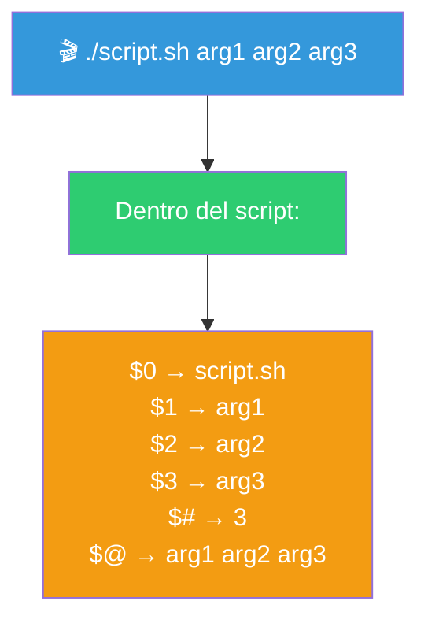
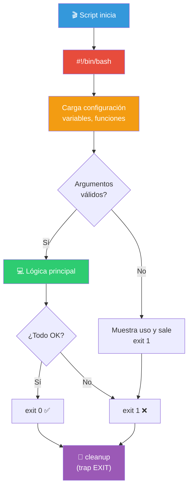

# Anatomía de los Scripts de Bash

Un script de Bash es un archivo de texto con una secuencia de comandos. Sigue una estructura predecible que conviene conocer.

## Estructura general

```mermaid
flowchart TB
    subgraph Script["📜 Script completo"]
        A["1. Shebang<br/>#!/bin/bash"]
        B["2. Comentario inicial<br/>(qué hace, autor, fecha)"]
        C["3. Opciones de shell<br/>set -euo pipefail"]
        D["4. Variables de configuración"]
        E["5. Funciones auxiliares"]
        F["6. Validación de argumentos"]
        G["7. Lógica principal"]
        H["8. Salida / cleanup"]
    end

    A --> B --> C --> D --> E --> F --> G --> H

    style A fill:#E74C3C,color:#fff
    style B fill:#F39C12,color:#fff
    style C fill:#3498DB,color:#fff
    style D fill:#2ECC71,color:#fff
    style E fill:#9B59B6,color:#fff
    style F fill:#1ABC9C,color:#fff
    style G fill:#E67E22,color:#fff
    style H fill:#7F8C8D,color:#fff
```



---

## 1. Shebang (`#!/bin/bash`)

La primera línea indica al sistema qué intérprete usar.

```bash
#!/bin/bash          # Usa Bash (recomendado)
#!/bin/sh            # Usa Bourne Shell (POSIX mínimo)
#!/usr/bin/env bash  # Busca bash en PATH (portátil en scripts con env)
#!/bin/bash -x       # Con debug activado desde el inicio
```

> **⚠️ Importante**: El shebang debe ser la **primera línea** del archivo, sin espacios antes de `#!`.

---

## 2. Comentario inicial

Documenta qué hace el script, quién lo creó y cuándo.

```bash
# ============================================
# Script: backup.sh
# Descripción: Realiza backup de /home en /backup
# Autor: Ana García
# Fecha: 2026-05-30
# Uso: ./backup.sh [directorio_origen]
# ============================================
```

---

## 3. Opciones de shell (`set`)

Configuran el comportamiento del script. El modo **estricto** es la práctica recomendada:

```bash
#!/bin/bash
set -euo pipefail
```

| Opción | Efecto |
|--------|--------|
| `set -e` | Sale inmediatamente si un comando falla (exit code ≠ 0) |
| `set -u` | Error si se usa una variable no definida |
| `set -o pipefail` | Un pipe falla si **cualquier** comando del pipe falla |
| `set -x` | Debug: muestra cada comando antes de ejecutarlo |

```bash
# Modo estricto completo (recomendado para scripts en producción)
set -euo pipefail

# Modo debug (para desarrollo)
set -xeuo pipefail

# Desactivar opciones
set +e   # Vuelve a permitir que los comandos fallen sin detener el script
```

---

## 4. Variables de configuración

Define al inicio del script todo lo que pueda cambiar:

```bash
# ============================================
# Configuración
# ============================================
DIR_BACKUP="/backup"
DIR_ORIGEN="$HOME"
FORMATO_FECHA=$(date +%Y%m%d_%H%M%S)
ARCHIVO_LOG="/var/log/backup.log"
LIMITE_DIAS=30
readonly DIR_BACKUP DIR_ORIGEN   # Evita modificaciones accidentales
```

### Tipos de variables

```bash
# Cadena
nombre="Ana"

# Número (Bash trata todo como string, pero opera numéricamente)
edad=30
echo $((edad + 1))   # 31

# Array
frutas=("manzana" "pera" "uva")
echo "${frutas[0]}"     # manzana
echo "${frutas[@]}"     # todas
echo "${#frutas[@]}"    # longitud: 3

# Array asociativo (Bash 4+)
declare -A capitales
capitales[Chile]="Santiago"
capitales[Peru]="Lima"
echo "${capitales[Chile]}"  # Santiago

# Variable readonly
readonly PI=3.1416
PI=4  # Error: PI is readonly
```

---

## 5. Funciones

Agrupan lógica reutilizable. Se definen **antes** de usarlas.

```bash
# ============================================
# Funciones
# ============================================

# Mostrar mensaje con timestamp
log() {
    local mensaje="$1"
    echo "[$(date '+%Y-%m-%d %H:%M:%S')] $mensaje"
}

# Verificar si un comando existe
comando_existe() {
    command -v "$1" >/dev/null 2>&1
}

# Crear directorio si no existe
crear_directorio() {
    local dir="$1"
    if [ ! -d "$dir" ]; then
        mkdir -p "$dir"
        log "Directorio creado: $dir"
    fi
}

# Manejo de errores
error() {
    local mensaje="$1"
    echo "ERROR: $mensaje" >&2
    exit 1
}
```

### Variables locales

Siempre usa `local` dentro de funciones para no contaminar el ámbito global:

```bash
saludar() {
    local nombre="$1"    # local: solo existe dentro de la función
    echo "Hola, $nombre"
}
```

---

## 6. Validación de argumentos

```bash
# ============================================
# Validación de argumentos
# ============================================

# Verificar que se pasaron argumentos
if [ $# -eq 0 ]; then
    echo "Uso: $0 <directorio_origen> [directorio_destino]"
    exit 1
fi

# Asignar argumentos con valores por defecto
ORIGEN="${1:-$HOME}"
DESTINO="${2:-/backup}"

# Verificar que el directorio de origen existe
if [ ! -d "$ORIGEN" ]; then
    error "El directorio '$ORIGEN' no existe"
fi
```

### Variables de argumentos

```bash
$0        # Nombre del script
$1, $2... # Argumentos posicionales
$#        # Número de argumentos
$@        # Todos los argumentos (como array)
$*        # Todos los argumentos (como string)
$?        # Código de salida del último comando
$$        # PID del script actual
$!        # PID del último proceso en segundo plano
```



---

## 7. Lógica principal

### `if` / `elif` / `else`

```bash
if [ "$edad" -ge 18 ]; then
    echo "Eres mayor de edad"
elif [ "$edad" -ge 13 ]; then
    echo "Eres adolescente"
else
    echo "Eres menor"
fi
```

### Operadores de comparación

| Operador | Números | Strings |
|----------|---------|---------|
| Igual | `-eq` | `=` o `==` |
| Distinto | `-ne` | `!=` |
| Mayor | `-gt` | `>` (en `[[ ]]`) |
| Mayor o igual | `-ge` | — |
| Menor | `-lt` | `<` (en `[[ ]]`) |
| Menor o igual | `-le` | — |
| Vacío | — | `-z` |
| No vacío | — | `-n` |

### Operadores de archivos

| Expresión | Verdad si... |
|-----------|-------------|
| `-f archivo` | Existe y es archivo regular |
| `-d directorio` | Existe y es directorio |
| `-e ruta` | Existe (archivo o directorio) |
| `-s archivo` | Existe y tiene tamaño > 0 |
| `-r archivo` | Tiene permiso de lectura |
| `-w archivo` | Tiene permiso de escritura |
| `-x archivo` | Tiene permiso de ejecución |
| `-L archivo` | Es un enlace simbólico |

### `for` — Bucles

```bash
# Sobre una lista
for fruta in manzana pera uva; do
    echo "Me gusta la $fruta"
done

# Sobre un rango
for i in {1..5}; do
    echo "Iteración $i"
done

# Sobre archivos
for archivo in *.txt; do
    echo "Procesando: $archivo"
    wc -l "$archivo"
done

# Sobre los argumentos del script
for arg in "$@"; do
    echo "Argumento: $arg"
done

# Con índices (array)
frutas=("manzana" "pera" "uva")
for i in "${!frutas[@]}"; do
    echo "frutas[$i] = ${frutas[$i]}"
done
```

### `while` — Bucle condicional

```bash
# Leer archivo línea por línea
while IFS= read -r linea; do
    echo "Línea: $linea"
done < archivo.txt

# Contador
contador=1
while [ "$contador" -le 5 ]; do
    echo "Contador: $contador"
    contador=$((contador + 1))
done

# Bucle infinito (con salida controlada)
while true; do
    read -p "Escribe 'salir' para terminar: " entrada
    [ "$entrada" = "salir" ] && break
    echo "Escribiste: $entrada"
done
```

### `case` — Selección múltiple

```bash
case "$1" in
    start)
        echo "Iniciando servicio..."
        ;;
    stop)
        echo "Deteniendo servicio..."
        ;;
    restart)
        echo "Reiniciando servicio..."
        ;;
    status)
        echo "Estado del servicio..."
        ;;
    *)
        echo "Uso: $0 {start|stop|restart|status}"
        exit 1
        ;;
esac
```

### `select` — Menú interactivo

```bash
echo "Selecciona una opción:"
select opcion in "Listar" "Respaldar" "Salir"; do
    case $opcion in
        "Listar")
            ls -la
            ;;
        "Respaldar")
            tar -czf backup.tar.gz .
            echo "Backup creado"
            ;;
        "Salir")
            break
            ;;
        *)
            echo "Opción inválida"
            ;;
    esac
done
```

---

## 8. Salida y cleanup

```bash
# Códigos de salida
exit 0    # Éxito
exit 1    # Error genérico
exit 127  # Comando no encontrado
exit 130  # Script interrumpido (Ctrl+C)

# Trap: limpiar al salir
cleanup() {
    echo "Limpiando archivos temporales..."
    rm -rf /tmp/miscript_*
    log "Script finalizado"
}
trap cleanup EXIT    # Se ejecuta siempre al salir
trap 'echo "Interrumpido"; exit 130' INT   # Ctrl+C
trap 'echo "Terminado"; exit 0' TERM       # kill PID
```

---

## Script completo de ejemplo

```bash
#!/bin/bash
# ============================================
# Script: respaldo.sh
# Descripción: Respalda un directorio en otro
# Autor: Ana García
# Uso: ./respaldo.sh <origen> [destino]
# ============================================

set -euo pipefail

# --- Configuración ---
FECHA=$(date +%Y%m%d_%H%M%S)
LOG="/tmp/respaldo.log"
readonly FECHA LOG

# --- Funciones ---
log() {
    local msg="$1"
    echo "[$(date '+%H:%M:%S')] $msg" | tee -a "$LOG"
}

error() {
    local msg="$1"
    echo "ERROR: $msg" >&2
    exit 1
}

cleanup() {
    log "Respaldo finalizado"
}
trap cleanup EXIT

# --- Validación ---
[ $# -lt 1 ] && error "Uso: $0 <origen> [destino]"
ORIGEN="${1}"
DESTINO="${2:-/backup}"
[ ! -d "$ORIGEN" ] && error "El directorio '$ORIGEN' no existe"

# --- Lógica principal ---
log "Iniciando respaldo de $ORIGEN → $DESTINO"
mkdir -p "$DESTINO"

ARCHIVO="$DESTINO/respaldo_$FECHA.tar.gz"
tar -czf "$ARCHIVO" -C "$(dirname "$ORIGEN")" "$(basename "$ORIGEN")"

log "Respaldo creado: $ARCHIVO"
echo "Tamaño: $(du -h "$ARCHIVO" | cut -f1)"
```

---

## Diagrama de flujo de un script



---

## Buenas prácticas

| Práctica | Por qué |
|----------|---------|
| `set -euo pipefail` | Evita errores silenciosos |
| Variables en mayúscula | Convención: `PATH`, `DIR_BACKUP` |
| `local` en funciones | No contamina ámbito global |
| Validar argumentos al inicio | Falla rápido, mensajes claros |
| `trap` para cleanup | Limpia incluso si hay error |
| Comentar el "por qué" | No el "qué" (eso lo dice el código) |
| `readonly` para constantes | Evita modificaciones accidentales |
| Usar `[[ ]]` en vez de `[ ]` | Más potente, menos bugs |
| Citar variables con `"` | `"$var"` evita problemas con espacios |
| Preferir `$(comando)` sobre `` `comando` `` | Más legible, anidable |

> **🎯 Resumen**: Un buen script es legible, robusto y falla rápido con mensajes claros. Sigue esta estructura y tendrás scripts que funcionan en producción, no solo en tu máquina.

## Relacionados:
- [[basic-editor-ops]] #anterior 
- [[ejecucion-de-scripts-de-bash]] #siguiente
- [[02-funciones-en-bash]] #related 
- [[03-comentarios-y-documentacion]] #related