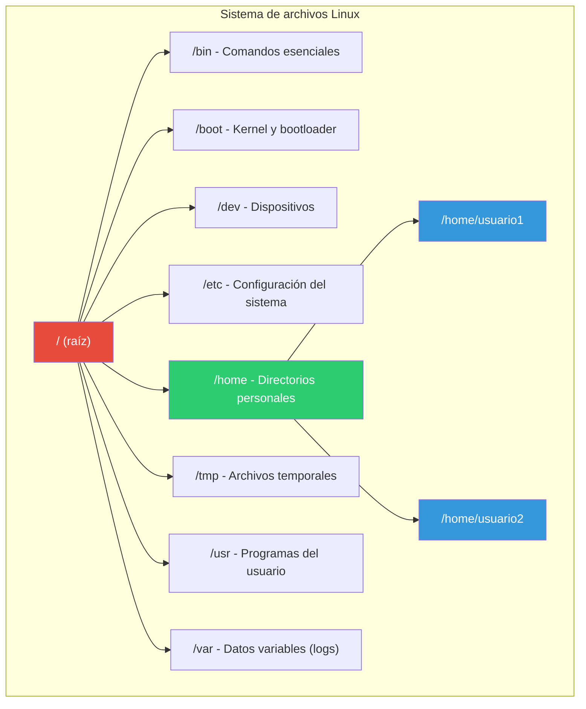
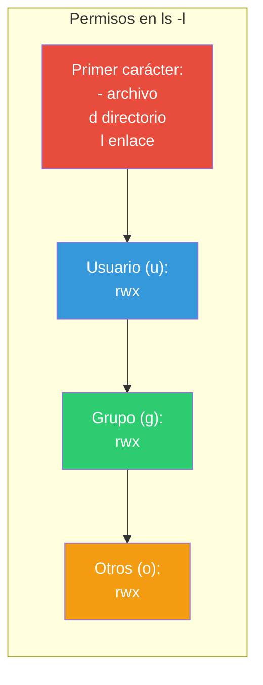
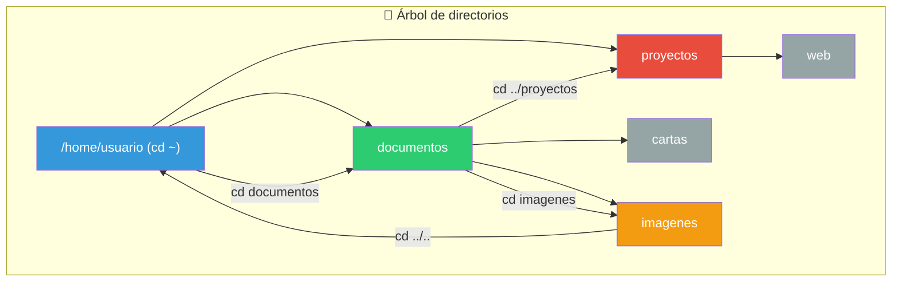
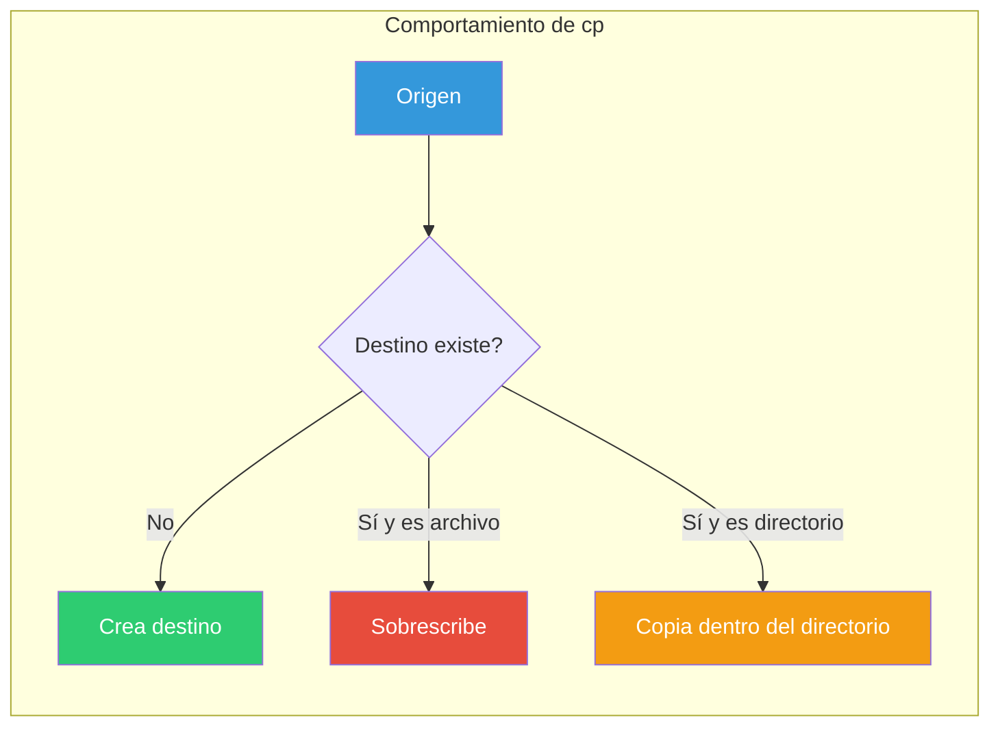
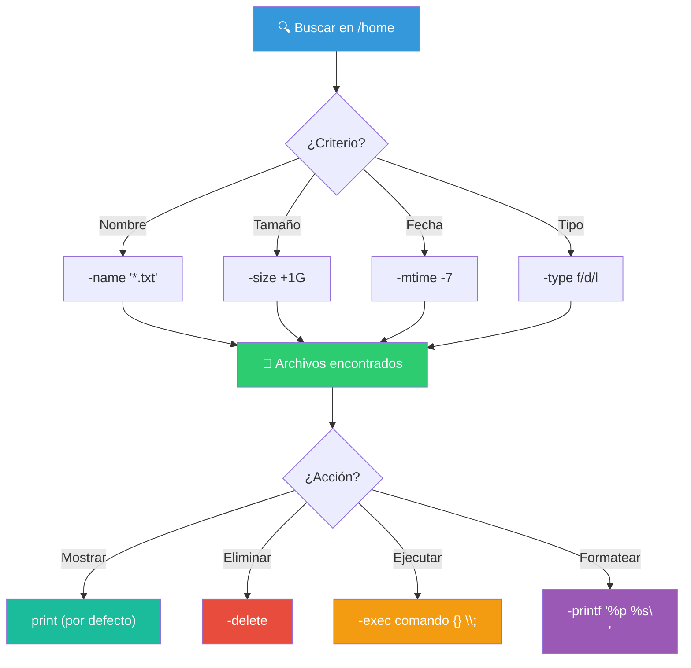
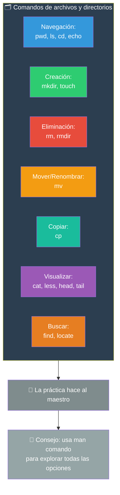

# Archivos y Directorios

La manipulación de archivos y directorios es la tarea más frecuente en la shell. Este capítulo cubre los comandos esenciales.

## El árbol de directorios



### Directorios importantes

| Directorio | Propósito |
|------------|-----------|
| `/` | Raíz del sistema de archivos |
| `/home` | Directorios personales de los usuarios |
| `/etc` | Archivos de configuración del sistema |
| `/tmp` | Archivos temporales (se borran al reiniciar) |
| `/var` | Datos variables: logs, bases de datos, colas |
| `/usr` | Programas y librerías del usuario |
| `/bin` | Ejecutables esenciales |
| `/dev` | Archivos de dispositivo |

---

## Navegación entre directorios

### `pwd` — Print Working Directory

Muestra la **ruta absoluta** del directorio actual.

```bash
pwd
# /home/usuario/proyectos
```


| Variante | Efecto |
|----------|--------|
| `pwd` | Ruta real (sin symlinks) |
| `pwd -L` | Ruta lógica (con symlinks) |
| `pwd -P` | Ruta física (sin symlinks, por defecto) |

---

### `ls` — List Directory Contents

Enumera archivos y directorios.

```bash
ls                  # Listado simple
ls -l               # Formato detallado (largo)
ls -a               # Incluye archivos ocultos (empiezan con .)
ls -la              # Detallado + ocultos
ls -lh              # Tamaños legibles (KB, MB, GB)
ls -lt              # Ordenado por fecha (más reciente primero)
ls -lS              # Ordenado por tamaño
ls -R               # Recursivo (subdirectorios)
ls -d */            # Solo directorios
ls *.txt            # Solo archivos .txt
```

#### Salida de `ls -l` explicada

```bash
-rw-r--r--  1 usuario grupo  2048 May 30 10:00 archivo.txt
^^^^^^^^^^  ^ ^^^^^^ ^^^^^  ^^^^ ^^^^^^^^^^^ ^^^^^^^^^^^^
└───┬───┘   └─┬──┘ └──┬──┘ └─┬─┘ └────┬────┘ └────┬────┘
    │         │     │      │        │           └─ Nombre
    │         │     │      │        └─ Fecha de modificación
    │         │     │      └─ Tamaño en bytes
    │         │     └─ Grupo propietario
    │         └─ Usuario propietario
    └─ Permisos y tipo
```

#### Permisos: significado



```bash
-rw-r--r--   # Archivo regular. Usuario: lectura+escritura. Grupo: solo lectura. Otros: solo lectura.
drwxr-xr-x   # Directorio. Usuario: todo. Grupo: lectura+ejecución. Otros: lectura+ejecución.
```

---

### `cd` — Change Directory

Cambia el directorio actual de trabajo.

```bash
cd /ruta/al/directorio   # Ruta absoluta
cd documentos            # Ruta relativa (desde la posición actual)
cd ..                    # Sube un nivel
cd ../..                 # Sube dos niveles
cd ~                     # Va al directorio personal (/home/usuario)
cd -                     # Va al directorio anterior (OLDPWD)
cd /                     # Va a la raíz del sistema
```



#### Rutas absolutas vs relativas

```bash
# Ruta absoluta: empieza desde /
cd /home/usuario/documentos

# Ruta relativa: desde donde estás
cd documentos              # Si estás en /home/usuario
cd ../usuario/documentos   # Subes y bajas

# Atajos
cd ~   # = cd /home/usuario
cd -   # = cd al último directorio
cd     # = cd ~
```

---

### `echo` — Mostrar texto por pantalla

Muestra texto en la terminal. Muy usado en scripts y para inspeccionar variables.

```bash
echo "Hola, mundo"           # Texto literal
echo Hola mundo              # Sin comillas (funciona, pero no con espacios)
echo "El usuario es: $USER"  # Expansión de variables
echo 'El usuario es: $USER'  # Comillas simples: sin expansión
echo -e "línea1\nlínea2"    # Interpretar secuencias de escape
echo -n "sin salto de línea" # Sin nueva línea al final
```

| Opción | Efecto |
|--------|--------|
| `-n` | No añade salto de línea al final |
| `-e` | Interpreta secuencias de escape: `\n`, `\t`, `\\` |
| `-E` | No interpreta secuencias de escape (por defecto) |

```bash
# Casos de uso frecuentes
echo $PWD              # Muestra la ruta actual
echo $HOME             # Muestra el directorio personal
echo $?                # Código de salida del último comando
echo "Hoy es $(date)"  # Sustitución de comando
```

---

## Creación y manipulación

### `mkdir` — Make Directory

Crea uno o más directorios.

```bash
mkdir carpeta              # Crea una carpeta
mkdir carpeta1 carpeta2    # Crea varias carpetas
mkdir -p a/b/c             # Crea la estructura completa (padres intermedios)
mkdir -m 755 secreta       # Crea con permisos específicos
```

```bash
mkdir -p proyectos/2026/mayo/documentos
# Crea: proyectos/
#         └── 2026/
#               └── mayo/
#                     └── documentos/
```

| Opción | Efecto |
|--------|--------|
| `-p` | Crea directorios padres si no existen. No da error si ya existe. |
| `-v` | Modo verbose: muestra cada directorio creado. |
| `-m` | Establece permisos específicos al crear. |

---

### `touch` — Crear archivos vacíos o actualizar timestamp

Actualiza la fecha de modificación de un archivo. Si no existe, lo crea vacío.

```bash
touch archivo.txt              # Crea archivo vacío o actualiza timestamp
touch archivo1.txt archivo2.txt # Crea varios
touch -a archivo.txt           # Solo actualiza fecha de acceso
touch -m archivo.txt           # Solo actualiza fecha de modificación
touch -t 202605301200 archivo  # Establece fecha específica (YYYYMMDDhhmm)
```

```bash
# Útil para crear archivos rápidamente
touch README.md src/main.py src/utils.py
```

---

### `rm` — Remove (eliminar archivos)

**⚠️ PELIGRO**: Los archivos eliminados con `rm` no van a la papelera. Se borran definitivamente.

```bash
rm archivo.txt               # Elimina un archivo
rm -f archivo.txt            # Forzar (sin preguntar, incluso si no existe)
rm -i archivo.txt            # Modo interactivo: pregunta antes de borrar
rm -v archivo.txt            # Modo verbose: muestra lo que borra
rm -r directorio             # Elimina directorio y su contenido (recursivo)
rm -rf directorio            # ⚠️ Elimina todo sin preguntar
```

| Opción | Efecto |
|--------|--------|
| `-f` | Force: ignora archivos inexistentes, nunca pregunta |
| `-i` | Interactivo: pregunta confirmación |
| `-r` | Recursivo: elimina directorios y su contenido |
| `-v` | Verbose: explica lo que hace |

```bash
# ⚠️ Comandos peligrosos
rm -rf /              # BORRA TODO EL SISTEMA (no lo hagas)
rm -rf *              # Borra todo en el directorio actual
rm -rf .*             # Borra todos los archivos ocultos
```

---

### `rmdir` — Remove Directory

Elimina **directorios vacíos**. Si tiene contenido, falla.

```bash
rmdir carpeta_vacia           # Elimina si está vacía
rmdir -p a/b/c                # Elimina la cadena de directorios vacíos
```

```bash
# Estas líneas hacen lo mismo:
rmdir carpeta_vacia
rm -r carpeta_vacia       # También funciona (rm -r elimina vacíos y no vacíos)
# Pero esto falla:
rmdir carpeta_con_archivos  # rmdir: failed to remove 'carpeta_con_archivos': Directory not empty
```

| Comando | ¿Elimina directorios vacíos? | ¿Elimina directorios con contenido? |
|---------|------------------------------|--------------------------------------|
| `rmdir` | ✅ | ❌ |
| `rm -r` | ✅ | ✅ |
| `rm -rf` | ✅ | ✅ (sin preguntar) |

---

### `mv` — Move (mover o renombrar)

Mueve o renombra archivos y directorios.

```bash
mv origen destino             # Renombra: origen → destino
mv archivo.txt carpeta/       # Mueve archivo.txt dentro de carpeta/
mv archivo.txt carpeta/nuevo.txt  # Mueve y renombra
mv -i origen destino          # Pregunta antes de sobrescribir
mv -u origen destino          # Solo mueve si origen es más nuevo
mv -v origen destino          # Modo verbose
mv *.txt documentos/          # Mueve todos los .txt a documentos/
```

```bash
# Renombrar archivo
mv informe_2025.txt informe_2026.txt

# Mover a subdirectorio
mv fotos/*.jpg imagenes/

# Mover y renombrar en un solo paso
mv ~/Descargas/video.mp4 ~/Videos/clase.mp4
```

| Opción | Efecto |
|--------|--------|
| `-i` | Interactivo: pregunta antes de sobrescribir |
| `-f` | Force: sobrescribe sin preguntar |
| `-u` | Update: solo mueve si el origen es más nuevo |
| `-v` | Verbose: muestra lo que hace |
| `-n` | No sobrescribir archivos existentes |

---

### `cp` — Copy

Copia archivos y directorios.

```bash
cp origen destino                    # Copia archivo
cp -r origen/ destino/               # Copia directorio recursivamente
cp -i origen destino                 # Pregunta antes de sobrescribir
cp -u origen destino                 # Solo copia si origen es más nuevo
cp -p origen destino                 # Preserva atributos (permisos, fechas)
cp -a origen destino                 # Copia preservando todo (archivo + permisos + enlaces)
cp -v origen destino                 # Verbose
cp *.txt backup/                     # Copia todos los .txt a backup/
```

```bash
# Ejemplos prácticos
cp archivo.txt archivo_backup.txt          # Backup simple
cp -r proyectos/ proyectos_backup/         # Backup de directorio
cp -a ~/proyecto /media/usb/               # Copia exacta a USB (preservando todo)
cp /etc/ssh/sshd_config /etc/ssh/sshd_config.bak  # Backup de config antes de editar
```



| Opción | Efecto |
|--------|--------|
| `-r` | Recursivo: necesario para directorios |
| `-i` | Interactivo: pregunta antes de sobrescribir |
| `-f` | Force: sobrescribe sin preguntar |
| `-u` | Update: solo copia si origen es más nuevo |
| `-p` | Preserva modo, propiedad, timestamps |
| `-a` | Archive: preserva todo (equivale a `-dR --preserve=all`) |
| `-v` | Verbose |
| `-n` | No sobrescribir archivos existentes |

---

## Visualización de archivos

### `cat` — Concatenate

Muestra el contenido de uno o varios archivos en la terminal.

```bash
cat archivo.txt              # Muestra el contenido
cat archivo1.txt archivo2.txt # Muestra ambos concatenados
cat -n archivo.txt           # Muestra con números de línea
cat -b archivo.txt           # Números de línea solo en líneas no vacías
cat -s archivo.txt           # Suprime líneas en blanco repetidas
cat -E archivo.txt           # Marca el final de cada línea con $
```

```bash
# Casos de uso
cat README.md                          # Leer un archivo
cat notas.txt | wc -l                  # Contar líneas
cat parte1.txt parte2.txt > completo.txt  # Unir archivos
cat > nuevo.txt                        # Escribe directamente (Ctrl+D para salir)
cat << EOF > config.txt                # Here document
nombre=Ana
edad=30
EOF
```

#### Alternativas a `cat`

| Comando | Cuándo usarlo |
|---------|---------------|
| `cat` | Archivos pequeños (pocas líneas) |
| `less` | Archivos largos (navegación con flechas, `/` para buscar, `q` para salir) |
| `head` | Solo las primeras líneas (`head -n 20 archivo`) |
| `tail` | Solo las últimas líneas (`tail -n 20 archivo`) |
| `nl` | Con números de línea (más opciones que `cat -n`) |

---

## Búsqueda de archivos

### `find` — Find files

Busca archivos y directorios según criterios (nombre, tipo, tamaño, fecha, etc.).

```bash
# Sintaxis básica
find [directorio] [criterios] [acciones]
```

```bash
# Por nombre
find . -name "archivo.txt"              # Nombre exacto
find . -name "*.txt"                    # Todos los .txt (comodín)
find . -iname "README*"                 # Ignorar mayúsculas/minúsculas

# Por tipo
find . -type f                          # Solo archivos regulares
find . -type d                          # Solo directorios
find . -type l                          # Solo enlaces simbólicos

# Por tamaño
find . -size +100M                      # Archivos mayores a 100 MB
find . -size -1k                        # Archivos menores a 1 KB
find . -size 1024c                      # Archivos de exactamente 1024 bytes

# Por fecha
find . -mtime -7                        # Modificados en los últimos 7 días
find . -mtime +30                       # Modificados hace más de 30 días
find . -mmin -60                        # Modificados en la última hora

# Por permisos/usuario
find . -user usuario                    # Archivos de un usuario específico
find . -perm 644                        # Archivos con permisos específicos

# Acciones
find . -name "*.tmp" -delete            # Busca y elimina
find . -name "*.txt" -exec cat {} \;    # Busca y ejecuta comando
find . -name "*.txt" -ok rm {} \;       # Como -exec pero preguntando

# Combinar criterios
find . -name "*.log" -type f -size +10M -mtime +30
# Archivos .log, de más de 10 MB, modificados hace más de 30 días
```

#### Ejemplos prácticos

```bash
# Buscar todos los archivos Python en el proyecto
find . -name "*.py" -type f

# Buscar archivos grandes (> 1 GB)
find / -type f -size +1G 2>/dev/null

# Buscar y contar
find . -name "*.jpg" | wc -l

# Buscar y ejecutar
find . -name "*.bak" -exec rm {} \;

# Buscar directorios vacíos
find . -type d -empty

# Buscar archivos modificados hoy
find . -type f -mtime 0
```



### Comparativa: `find` vs `locate`

| Comando | Ventaja | Desventaja |
|---------|---------|------------|
| `find` | Siempre actualizado. Muchos criterios. | Más lento (recorre el disco). |
| `locate` | Instantáneo (usa base de datos). | La BD puede estar desactualizada. |

```bash
# locate (si está instalado)
locate archivo.txt             # Búsqueda instantánea
sudo updatedb                  # Actualizar la base de datos
```

---

## Resumen de comandos



```bash
# Atajo rápido: --help
pwd --help           # Ayuda resumida de pwd
ls --help            # Ayuda resumida de ls
cp --help            # Ayuda resumida de cp

# Ayuda completa
man pwd              # Manual completo
info ls              # Manual alternativo (Info)
```

> **🚀 Recuerda**: La mayoría de estos comandos aceptan combinarse. `cp -r`, `rm -rf`, `ls -la` son combinaciones que usarás a diario. La opción `-i` (interactivo) es tu amiga cuando empiezas. La opción `-v` (verbose) te ayuda a entender qué está pasando.

## Relacioandos:
- [[ajustando-bash]] #anterior 
- [[acciones-comunes-shells]] #siguiente 
- [[file-commands-cheat-sheet]] #related 
- [[ls]] #related 
- [[pwd]] #related 
- [[cat]] #related 
- [[tac]] #related