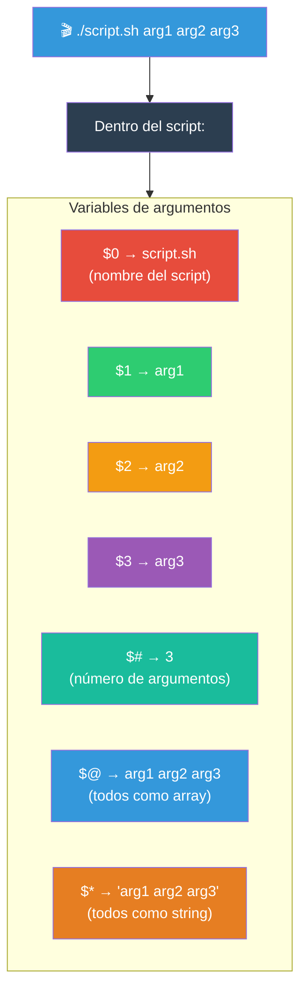
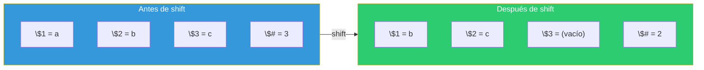

# Argumentos de script

Los argumentos permiten pasar datos a un script desde la línea de comandos. Bash proporciona variables especiales para acceder a ellos.

## Mapa de argumentos



---

## `$1, $2, $3` — Argumentos posicionales

Cada argumento se asigna a una variable numerada: `$1` para el primero, `$2` para el segundo, etc.

```bash
#!/bin/bash
# script: saludar.sh
echo "Hola, $1"
echo "Tu edad es $2"
```

```bash
$ ./saludar.sh "Ana" 25
# Hola, Ana
# Tu edad es 25
```

### Más allá de $9

Para el **décimo argumento en adelante**, usa llaves:

```bash
echo $10     # ❌ Interpreta $1 + "0" = primer argumento + "0"
echo ${10}   # ✅ Décimo argumento
echo ${11}   # ✅ Undécimo argumento
```

### Argumentos con espacios

```bash
$ ./script.sh "Hola Mundo" "segundo argumento"
# $1 = "Hola Mundo"
# $2 = "segundo argumento"

# Sin comillas:
$ ./script.sh Hola Mundo segundo argumento
# $1 = "Hola"
# $2 = "Mundo"
# $3 = "segundo"
# $4 = "argumento"
```

### Valores por defecto

```bash
#!/bin/bash
NOMBRE="${1:-Invitado}"
EDAD="${2:-18}"
echo "Hola $NOMBRE, tienes $EDAD años"
```

```bash
$ ./saludar.sh "Ana" 25    # Hola Ana, tienes 25 años
$ ./saludar.sh "Ana"       # Hola Ana, tienes 18 años
$ ./saludar.sh             # Hola Invitado, tienes 18 años
```

---

## `$0` — Nombre del script

`$0` contiene el nombre del script tal como se invocó.

```bash
#!/bin/bash
echo "Nombre del script: $0"
echo "Uso: $0 <archivo>"
```

```bash
$ ./script.sh
# Nombre del script: ./script.sh

$ bash /ruta/completa/script.sh
# Nombre del script: /ruta/completa/script.sh

$ ~/scripts/mi_script.sh
# Nombre del script: /home/usuario/scripts/mi_script.sh
```

### Usos comunes de `$0`

```bash
# Mostrar uso del script
mostrar_uso() {
    echo "Uso: $(basename "$0") [-v] [-o archivo] <entrada>" >&2
    exit 2
}

# Saber si es el script principal o está siendo sourced
if [[ "${BASH_SOURCE[0]}" == "${0}" ]]; then
    echo "Ejecutado directamente"
    main "$@"
else
    echo "Sourced desde otro script"
fi

# Script auto-destructivo
if [[ "$0" != /* ]]; then
    echo "Ejecuta con ruta absoluta: $(pwd)/$0"
fi
```

---

## `$@` — Todos los argumentos (array)

`$@` expande todos los argumentos como un **array**. Cada argumento se preserva como una palabra separada.

```bash
#!/bin/bash
# script: listar_args.sh

echo "Número de argumentos: $#"
echo "Contenido de \$@:"

i=1
for arg in "$@"; do
    echo "  [$i] $arg"
    ((i++))
done
```

```bash
$ ./listar_args.sh "hola mundo" foo bar
# Número de argumentos: 3
#   [1] hola mundo
#   [2] foo
#   [3] bar
```

### Pasar argumentos a otro comando

```bash
#!/bin/bash
# Pasar todos los argumentos a otro comando
grep "$@" archivo.txt

# O más común: wrapper
rsync "$@" /destino/

# Ejecutar con sudo
sudo comando "$@"
```

---

## `$*` — Todos los argumentos (string)

`$*` expande todos los argumentos como un **solo string**, separados por el primer carácter de `IFS`.

```bash
#!/bin/bash
# La diferencia crítica es con comillas

echo "Con \"\$@\":"
for arg in "$@"; do
    echo "  [$arg]"
done

echo "Con \"\$*\":"
for arg in "$*"; do
    echo "  [$arg]"
done
```

```bash
$ ./script.sh "hola mundo" foo bar
# Con "$@":
#   [hola mundo]
#   [foo]
#   [bar]
#
# Con "$*":
#   [hola mundo foo bar]    ← TODO en uno
```

### `$@` vs `$*` — Referencia rápida

| Expresión | Se expande como | Útil para |
|-----------|----------------|-----------|
| `"$@"` | `"arg1" "arg2" "arg3"` (cada uno preservado) | Pasar args a otro comando |
| `"$*"` | `"arg1 arg2 arg3"` (un solo string) | Mostrar todos juntos |
| `$@` (sin comillas) | `arg1 arg2 arg3` (word splitting) | ⚠️ Peligroso |
| `$*` (sin comillas) | `arg1 arg2 arg3` (word splitting) | ⚠️ Peligroso |

**Regla**: Siempre usa `"$@"`. Casi nunca necesitas `$*`.

---

## `$#` — Número de argumentos

`$#` contiene la **cantidad** de argumentos pasados.

```bash
#!/bin/bash

# Validar número de argumentos
if [[ $# -eq 0 ]]; then
    echo "❌ Error: Se requiere al menos un argumento" >&2
    echo "Uso: $0 <archivo>" >&2
    exit 2
fi

if [[ $# -lt 2 ]]; then
    echo "❌ Error: Se requieren 2 argumentos" >&2
    exit 2
fi

if [[ $# -gt 5 ]]; then
    echo "⚠️  Demasiados argumentos. Solo se usarán los primeros 5."
fi
```

### Patrones comunes

```bash
# Exactamente N argumentos
[[ $# -eq 2 ]] || { echo "Se requieren 2 argumentos" >&2; exit 2; }

# Al menos N argumentos
[[ $# -ge 1 ]] || { echo "Se requiere al menos 1 argumento" >&2; exit 2; }

# Entre N y M argumentos
[[ $# -ge 1 && $# -le 3 ]] || { echo "Entre 1 y 3 argumentos" >&2; exit 2; }

# Argumentos opcionales
NOMBRE="${1:?Se requiere nombre}"
OPCIONAL="${2:-default}"
```

---

## `shift` — Desplazar argumentos

`shift` elimina el primer argumento (`$1`) y desplaza todos hacia la izquierda. `$2` pasa a ser `$1`, `$3` pasa a ser `$2`, etc. `$#` disminuye en 1.



### Sintaxis

```bash
shift       # Elimina $1, desplaza todo
shift N     # Elimina los primeros N argumentos
```

### Uso típico: parsear opciones

```bash
#!/bin/bash
# Parsear argumentos estilo comando

verbose=false
archivo=""

while [[ $# -gt 0 ]]; do
    case "$1" in
        -v|--verbose)
            verbose=true
            shift
            ;;
        -o|--output)
            archivo="$2"
            shift 2
            ;;
        -h|--help)
            echo "Uso: $0 [-v] [-o archivo] <entrada>"
            exit 0
            ;;
        --)
            shift
            break
            ;;
        -*)
            echo "Opción desconocida: $1" >&2
            exit 2
            ;;
        *)
            break   # Primer argumento no-opción
            ;;
    esac
done

echo "Verbose: $verbose"
echo "Archivo: $archivo"
echo "Args restantes: $@"
```

```bash
$ ./script.sh -v -o salida.txt entrada.dat
# Verbose: true
# Archivo: salida.txt
# Args restantes: entrada.dat
```

### Procesar todos los argumentos con shift

```bash
#!/bin/bash

# Procesa cada argumento como archivo
while [[ $# -gt 0 ]]; do
    echo "Procesando: $1"
    wc -l < "$1"
    shift
done
```

### Rescatar argumentos antes de shift

```bash
# Guardar argumentos posicionales antes de modificarlos
args=("$@")     # Array con todos los argumentos

while [[ $# -gt 0 ]]; do
    case "$1" in
        -o) output="$2"; shift 2 ;;
        *)  break ;;
    esac
done

# "$@" ahora solo tiene los argumentos restantes
# pero ${args[@]} tiene todos los originales
```

---

## Script completo de ejemplo

```bash
#!/bin/bash
# ============================================
# Script: filtro.sh
# Descripción: Filtra archivos por extensión
# Uso: ./filtro.sh [-d directorio] [-v] extensión
# ============================================

set -euo pipefail

directorio="."
verbose=false

# Guardar args originales
args_originales=("$@")

# Parsear opciones con shift
while [[ $# -gt 0 ]]; do
    case "$1" in
        -d|--directorio)
            if [[ -z "${2:-}" ]]; then
                echo "Error: -d requiere un directorio" >&2
                exit 2
            fi
            directorio="$2"
            shift 2
            ;;
        -v|--verbose)
            verbose=true
            shift
            ;;
        -h|--help)
            echo "Uso: $0 [-d directorio] [-v] extensión"
            echo "Ejemplo: $0 -v -d ~/docs pdf"
            exit 0
            ;;
        --)
            shift
            break
            ;;
        -*)
            echo "Error: opción desconocida: $1" >&2
            echo "Usa $0 --help para ayuda" >&2
            exit 2
            ;;
        *)
            break
            ;;
    esac
done

# Validar argumento posicional (extensión)
if [[ $# -ne 1 ]]; then
    echo "Error: Se requiere una extensión" >&2
    echo "Uso: $0 [-d directorio] [-v] extensión" >&2
    exit 2
fi

extension="$1"
archivos=$(find "$directorio" -name "*.$extension" -type f 2>/dev/null)

if [[ -z "$archivos" ]]; then
    echo "No se encontraron archivos .$extension en $directorio"
    exit 0
fi

echo "=== Archivos .$extension en $directorio ==="
echo "$archivos"

if $verbose; then
    total=$(echo "$archivos" | wc -l)
    echo "---"
    echo "Total: $total archivos"
    echo "Args originales: ${args_originales[*]}"
fi
```

---

## Tabla resumen

| Variable | Significado | Ejemplo (`./s.sh a b c`) |
|----------|-------------|--------------------------|
| `$0` | Nombre del script | `./s.sh` |
| `$1` | Primer argumento | `a` |
| `$2` | Segundo argumento | `b` |
| `$3` | Tercer argumento | `c` |
| `${10}` | Décimo argumento (con llaves) | — |
| `$#` | Número de argumentos | `3` |
| `"$@"` | Todos como array | `"a" "b" "c"` |
| `"$*"` | Todos como string | `"a b c"` |
| `shift` | Desplaza $2→$1, etc. | — |

> **💡 Reglas prácticas**: Siempre usa `"$@"` para pasar argumentos a otros comandos. Usa `shift` para parsear opciones. Valida con `$#` al inicio. Proporciona valores por defecto con `${1:-default}`. Entrega mensaje de uso claro cuando los argumentos sean inválidos.

## Relacionados:
- [[codigos-de-salida]] #anterior 
- [[permiso-de-archivos-terminal]] #siguiente 