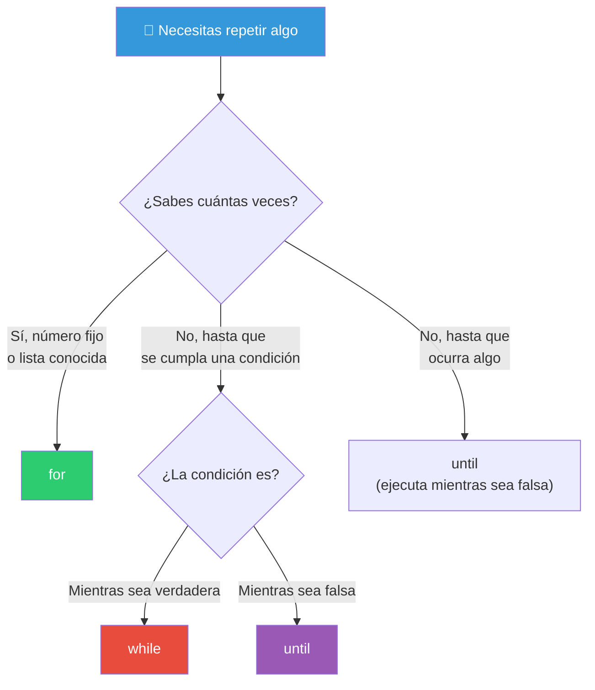
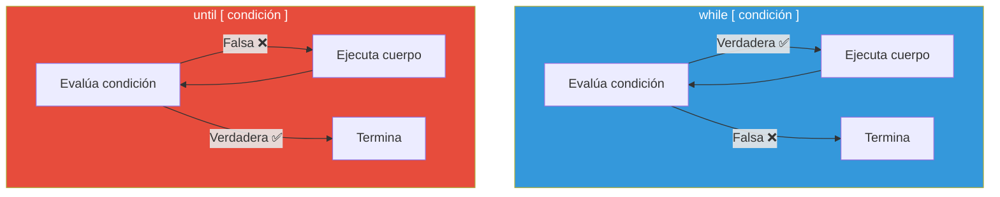

# Bucles

Los bucles permiten ejecutar un bloque de código múltiples veces. Bash ofrece tres tipos: `for`, `while` y `until`.

## Mapa de bucles



---

## `for` — Iterar sobre una lista

`for` recorre una lista de elementos. Es el bucle más usado en Bash.

### Sintaxis básica

```bash
for variable in lista; do
    comandos...
done
```

### Sobre listas explícitas

```bash
# Strings
for fruta in manzana pera uva; do
    echo "Me gusta la $fruta"
done

# Números
for i in 1 2 3 4 5; do
    echo "Iteración $i"
done

# Rangos con { }
for i in {1..10}; do
    echo "Número: $i"
done

# Rangos con saltos
for i in {0..20..2}; do
    echo "Par: $i"
done

# Letras
for letra in {a..z}; do
    echo "Letra: $letra"
done
```

### Sobre archivos (glob)

```bash
# Todos los .txt
for archivo in *.txt; do
    echo "Procesando: $archivo"
    wc -l "$archivo"
done

# Varios patrones
for img in *.jpg *.png *.gif; do
    echo "Imagen: $img"
done

# Archivos ocultos
for config in .*; do
    [[ -f "$config" ]] && echo "Config: $config"
done

# Con ruta
for script in /usr/bin/*; do
    echo "Ejecutable: $(basename "$script")"
done
```

### Sobre arrays

```bash
frutas=("manzana" "pera" "uva" "kiwi")

# Sobre valores
for fruta in "${frutas[@]}"; do
    echo "$fruta"
done

# Sobre índices
for i in "${!frutas[@]}"; do
    echo "frutas[$i] = ${frutas[$i]}"
done
```

### Estilo C (tres expresiones)

```bash
# Sintaxis al estilo C
for (( i = 0; i < 10; i++ )); do
    echo "i = $i"
done

# Con pasos personalizados
for (( i = 10; i > 0; i -= 2 )); do
    echo "i = $i"
done

# Variable múltiple
for (( i = 0, j = 10; i < j; i++, j-- )); do
    echo "i=$i, j=$j"
done
```

### Sobre comandos

```bash
# Salida de un comando
for usuario in $(cut -d: -f1 /etc/passwd); do
    echo "Usuario: $usuario"
done

# ⚠️ Peligroso si hay espacios en los nombres
# Mejor con while read
cut -d: -f1 /etc/passwd | while read -r usuario; do
    echo "Usuario: $usuario"
done
```

### Ejemplos prácticos

```bash
# Renombrar archivos .jpg a .jpg.bak
for archivo in *.jpg; do
    mv "$archivo" "${archivo}.bak"
    echo "Backup: $archivo → ${archivo}.bak"
done

# Renombrar con patrón (quitar espacios)
for archivo in *\ *; do
    mv "$archivo" "${archivo// /_}"
    echo "Renombrado: $archivo → ${archivo// /_}"
done

# Procesar argumentos del script
for arg in "$@"; do
    echo "Argumento: $arg"
done

# Sumar números
suma=0
for num in 10 20 30 40 50; do
    ((suma += num))
done
echo "Suma: $suma"
```

---

## `while` — Mientras sea verdadero

`while` ejecuta mientras la condición sea verdadera (código de salida 0).

### Sintaxis

```bash
while condición; do
    comandos...
done
```

### Contador

```bash
i=1
while [[ $i -le 5 ]]; do
    echo "Iteración $i"
    ((i++))
done

# Con operación aritmética directa
i=1
while (( i <= 5 )); do
    echo "Iteración $i"
    ((i++))
done
```

### Leer archivos línea por línea

```bash
# Estándar: while read
while IFS= read -r linea; do
    echo "Línea: $linea"
done < archivo.txt

# Con índice de línea
linea_num=0
while IFS= read -r linea; do
    ((linea_num++))
    echo "$linea_num: $linea"
done < archivo.txt

# Desde un comando (sin subshell)
while IFS= read -r linea; do
    echo "Archivo: $linea"
done < <(find . -name "*.txt")
```

### Leer la salida de un comando

```bash
# Con process substitution (evita subshell)
while IFS= read -r proceso; do
    echo "PID: $proceso"
done < <(ps aux | awk '{print $2}')

# Desde un pipe (crea subshell — cambios no persisten)
ps aux | awk '{print $2}' | while read -r proceso; do
    echo "PID: $proceso"
done
```

### Bucle infinito

```bash
# while true
while true; do
    echo "Ejecutando..."
    sleep 1
done

# while : (más corto, : siempre devuelve 0)
while :; do
    echo "Ejecutando..."
    sleep 1
done
```

### Bucle con entrada del usuario

```bash
while true; do
    read -p "Comando (exit para salir): " cmd
    [[ "$cmd" == "exit" ]] && break
    eval "$cmd"
done

# O usando entrada vacía:
while read -p "> " cmd && [[ -n "$cmd" ]]; do
    eval "$cmd"
done
```

### Procesar argumentos con shift

```bash
# Procesar argumentos hasta agotarlos
while [[ $# -gt 0 ]]; do
    echo "Procesando: $1"
    shift
done
```

---

## `until` — Hasta que sea verdadero

`until` es el inverso de `while`: ejecuta **mientras la condición sea falsa**. Cuando se vuelve verdadera, termina.

### Sintaxis

```bash
until condición; do
    comandos...
done
```

### Ejemplos

```bash
# Contador (while vs until)
echo "=== while ==="
i=1
while [[ $i -le 5 ]]; do
    echo $i
    ((i++))
done

echo "=== until ==="
i=1
until [[ $i -gt 5 ]]; do
    echo $i
    ((i++))
done

# Esperar a que un archivo exista
until [[ -f "/tmp/archivo_listo" ]]; do
    echo "Esperando archivo..."
    sleep 2
done
echo "¡Archivo listo!"

# Esperar a que un servicio esté disponible
until curl -s http://localhost:8080 > /dev/null; do
    echo "Esperando al servidor..."
    sleep 2
done
echo "Servidor listo"

# Esperar a que un proceso termine
until pgrep -x "actualizacion"; do
    echo "Proceso no encontrado, esperando..."
    sleep 1
done
echo "Proceso en ejecución"
```

### while vs until



| Situación | `while` | `until` |
|-----------|---------|---------|
| Mientras i ≤ 5 | `while (( i <= 5 ))` | `until (( i > 5 ))` |
| Mientras archivo no exista | `while [[ ! -f "$f" ]]` | `until [[ -f "$f" ]]` |
| Mientras servidor no responda | `while ! curl ...` | `until curl ...` |

---

## `break, continue` — Control de flujo

`break` sale del bucle. `continue` salta a la siguiente iteración.

### `break` — Salir del bucle

```bash
# Salir en una condición específica
for i in {1..10}; do
    if [[ $i -eq 5 ]]; then
        echo "Rompiendo en i=$i"
        break
    fi
    echo "i = $i"
done
# Salida: 1 2 3 4 "Rompiendo en i=5"

# Break con N (sale de N bucles anidados)
for i in {1..3}; do
    for j in {1..3}; do
        if [[ $i -eq 2 && $j -eq 2 ]]; then
            echo "break 2: sale de ambos bucles"
            break 2
        fi
        echo "i=$i, j=$j"
    done
done
```

### `continue` — Saltar iteración

```bash
# Saltar pares
for i in {1..10}; do
    if (( i % 2 == 0 )); then
        continue
    fi
    echo "Impar: $i"
done
# Salida: 1 3 5 7 9

# Continue con N (salta iteración del bucle N niveles arriba)
for i in {1..3}; do
    for j in {1..3}; do
        if (( j == 2 )); then
            echo "continue 2: salta en i=$i también"
            continue 2
        fi
        echo "i=$i, j=$j"
    done
done
# Solo imprime donde j=1
```

### Búsqueda con break

```bash
# Buscar un archivo y detenerse al encontrarlo
encontrado=""
for archivo in /etc/*; do
    if grep -q "root" "$archivo" 2>/dev/null; then
        encontrado="$archivo"
        break
    fi
done

if [[ -n "$encontrado" ]]; then
    echo "Primer archivo con 'root': $encontrado"
else
    echo "No se encontró 'root'"
fi
```

### Filtro con continue

```bash
# Procesar solo archivos grandes
for archivo in *; do
    [[ ! -f "$archivo" ]] && continue    # Saltar no archivos
    tamaño=$(stat -c%s "$archivo")
    (( tamaño < 1024 )) && continue      # Saltar archivos < 1KB
    echo "$archivo: $(numfmt --to=iec $tamaño)"
done
```

---

## Bucles anidados

```bash
# Tabla de multiplicar
for i in {1..5}; do
    for j in {1..5}; do
        printf "%3d " $((i * j))
    done
    echo
done

# Recorrer directorios y archivos
for dir in */; do
    echo "=== Directorio: $dir ==="
    for archivo in "$dir"*; do
        echo "  $archivo"
    done
done
```

---

## Buenas prácticas

| Práctica | Explicación |
|----------|-------------|
| `for` sobre lista conocida | Cuando sabes los elementos |
| `while read -r` para archivos | Maneja espacios y caracteres especiales |
| Evita `for $(cat archivo)` | Usa `while read` en su lugar |
| Cita las variables | `"$archivo"`, `"${array[@]}"` |
| `break N` en bucles anidados | Sale de N niveles |
| `continue N` en bucles anidados | Salta iteración de N niveles |
| Prefiere `for ((;;))` sobre `while` | Para contadores con inicio/fin/paso |
| `while true` para loops infinitos | Con `break` controlado |

> **🎯 Resumen**: `for` para recorrer listas y rangos. `while` para leer archivos y bucles condicionales. `until` para esperar condiciones. `break` para salir, `continue` para saltar. El patrón `while IFS= read -r linea; done < archivo` es el estándar para procesar archivos línea por línea.

## Relacionados:
- [[condicionales-bash]] #anterior 
- [[funciones-bash]] #siguiente 