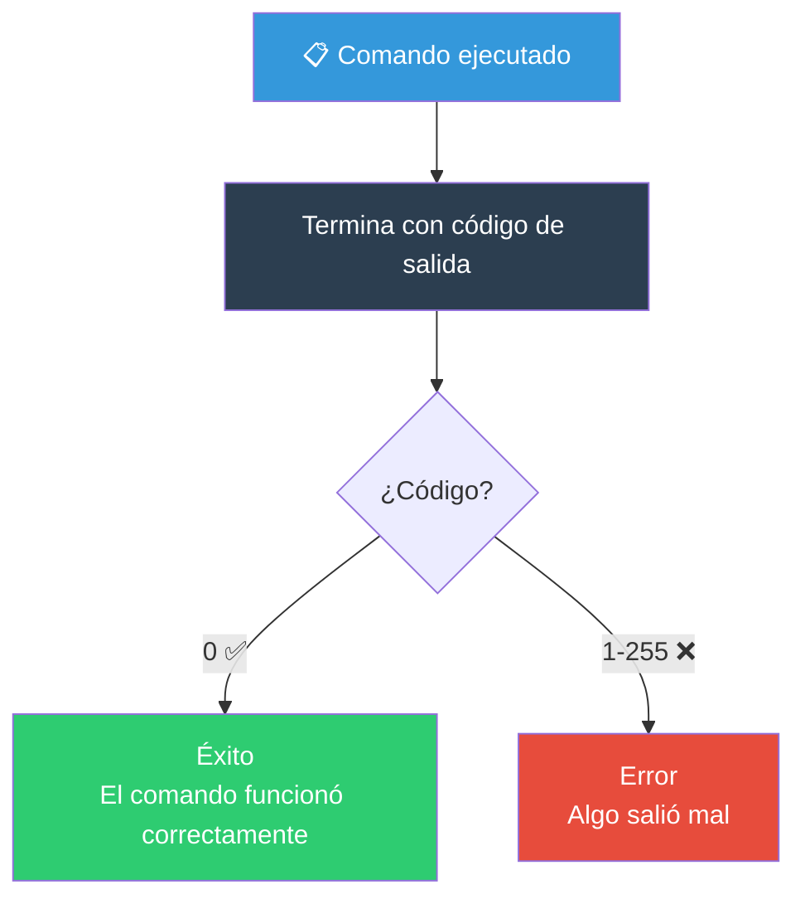
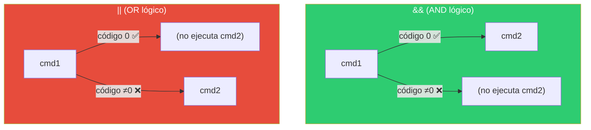
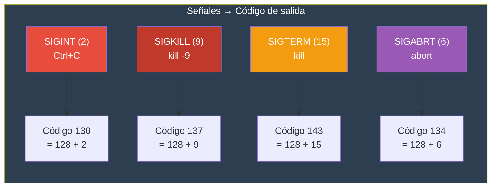

# Códigos de salida

Todo comando en Linux/Bash devuelve un **código de salida** (exit code) al terminar. Es un número entero entre 0 y 255 que indica si el comando tuvo éxito o falló.

## ¿Qué son los códigos de salida?



### Regla fundamental

```bash
# 0  = éxito
# ≠0 = error (1-255)
```

---

## `$?` — Último código de salida

La variable `$?` contiene el código de salida del **último comando ejecutado**.

```bash
ls /home
echo $?           # 0 (éxito)

ls /directorio_que_no_existe 2>/dev/null
echo $?           # 1 (error — el directorio no existe)

true
echo $?           # 0 (siempre éxito)

false
echo $?           # 1 (siempre error)
```

### Usar `$?` directamente

```bash
# ❌ Estilo verboso (innecesario)
ls /home
if [[ $? -eq 0 ]]; then
    echo "OK"
fi

# ✅ Estilo directo (mejor)
if ls /home; then
    echo "OK"
fi

# ❌ Error común: $? se sobreescribe
ls /home
echo "Entre medio..."    # ← Esto cambia $?
echo $?                   # Ya no es el código de ls, es el de echo

# ✅ Guardar $? inmediatamente
ls /home
codigo=$?                # Guardar antes de cualquier otro comando
echo "Entre medio..."
echo "Código de ls: $codigo"
```

---

## `exit` — Terminar script con código

El comando `exit` termina el script actual y devuelve un código de salida.

```bash
exit 0        # Éxito
exit 1        # Error genérico
exit 127      # Comando no encontrado
exit 130      # Interrumpido por Ctrl+C
exit          # Sale con el último código de $?
```

### Comportamiento de `exit`

```bash
# En un script
#!/bin/bash
echo "Esto se ejecuta"
exit 42
echo "Esto NO se ejecuta"   # Nunca llega aquí

# Sin exit, el script devuelve el código del último comando
#!/bin/bash
ls /home       # Último comando
# Código de salida del script = código de ls (0 si existe)
```

### `exit` en funciones

```bash
# exit dentro de una función TERMINA TODO EL SCRIPT
salir_rapido() {
    echo "Saliendo..."
    exit 1
}

echo "Antes"
salir_rapido
echo "Después"     # Nunca se ejecuta

# Para salir solo de la función, usa return
salir_funcion() {
    echo "Saliendo de la función..."
    return 1
}
```

### Códigos de salida comunes

| Código | Significado | Ejemplo |
|--------|-------------|---------|
| 0 | Éxito | Comando ejecutado correctamente |
| 1 | Error genérico | `rm archivo_que_no_existe` |
| 2 | Uso incorrecto | `ls --opcion_invalida` |
| 126 | No ejecutable | `./directorio` (no es ejecutable) |
| 127 | Comando no encontrado | `comando_inexistente` |
| 128 | Señal fatal (128 + señal) | — |
| 130 | Interrumpido (Ctrl+C) | `kill -2` o Ctrl+C (128 + 2) |
| 137 | Matado (kill -9) | `kill -9` (128 + 9) |
| 255 | Código inválido | `exit 256` (se trunca a 255) |

---

## Éxito vs Fallo

### En condicionales

```bash
# Los condicionales evalúan el código de salida directamente

# if = éxito (código 0)
if true; then
    echo "Siempre se ejecuta"
fi

# if not = error (código ≠ 0)
if false; then
    echo "Nunca se ejecuta"
fi

# Con comandos reales
if grep -q "error" log.txt; then
    echo "Se encontraron errores en el log"
fi

# Negación con !
if ! grep -q "error" log.txt; then
    echo "No hay errores en el log"
fi
```

### Encadenar comandos por código

```bash
# && (AND) — ejecuta si el anterior tuvo éxito (código 0)
mkdir directorio && cd directorio
# Equivale a:
# if mkdir directorio; then cd directorio; fi

# || (OR) — ejecuta si el anterior falló (código ≠ 0)
cd directorio || mkdir directorio
# Equivale a:
# if ! cd directorio; then mkdir directorio; fi

# ; (ejecuta siempre, sin importar código)
echo "uno"; echo "dos"   # siempre se ejecutan ambos

# Combinación típica
mkdir -p proyecto && cd proyecto && touch README.md || echo "Algo falló"
```

### Cortocircuitos lógicos



### En scripts: modo estricto

```bash
# Sin modo estricto: el script continúa aunque un comando falle
#!/bin/bash
comando_inexistente
echo "Esto se ejecuta aunque el comando anterior falló"

# Con set -e: el script DETIENE al primer error
#!/bin/bash
set -e
comando_inexistente           # ← El script termina aquí
echo "Esto no se ejecuta"

# Con set -euo pipefail (recomendado)
#!/bin/bash
set -euo pipefail
```

### Try/catch en Bash

```bash
# Simular try/catch
if comando_riesgoso; then
    echo "✅ Éxito"
else
    echo "❌ Falló con código: $?"
fi

# Para comandos que pueden fallar sin detener el script
set +e
comando_que_puede_fallar
codigo=$?
set -e

if [[ $codigo -ne 0 ]]; then
    echo "El comando falló con código $codigo, pero continuamos..."
fi
```

---

## Códigos de salida personalizados en scripts

### Convenciones

```bash
#!/bin/bash
# ============================================
# Usa códigos de salida con significado
# ============================================

EXITO=0
ERROR_GENERAL=1
ERROR_USO=2
ERROR_ARCHIVO=3
ERROR_PERMISOS=4
ERROR_RED=5

# Validar argumentos
if [[ $# -eq 0 ]]; then
    echo "Uso: $0 <archivo>" >&2
    exit $ERROR_USO
fi

# Validar archivo
if [[ ! -f "$1" ]]; then
    echo "Error: $1 no existe" >&2
    exit $ERROR_ARCHIVO
fi

# Validar permisos
if [[ ! -r "$1" ]]; then
    echo "Error: no tienes permiso de lectura" >&2
    exit $ERROR_PERMISOS
fi

# Lógica principal
if procesar "$1"; then
    echo "Procesamiento exitoso"
    exit $EXITO
else
    echo "Error al procesar" >&2
    exit $ERROR_GENERAL
fi
```

### Documentar códigos en el script

```bash
#!/bin/bash
# ============================================
# Script: backup.sh
# Códigos de salida:
#   0 = Backup exitoso
#   1 = Error de argumentos
#   2 = Directorio origen no existe
#   3 = Error de permisos
#   4 = Error de escritura en destino
#   5 = Error interno
# ============================================
```

---

## Diagnóstico con códigos de salida

```bash
# Cadena de causas
ls /noexiste
echo $?                          # 2 (ls específico)

comando_inexistente 2>/dev/null
echo $?                          # 127

# Averiguar qué falló en un pipeline
# Sin pipefail: solo el último código
false | true
echo $?                          # 0 (solo ve el true)

# Con pipefail: cualquier fallo en la cadena
set -o pipefail
false | true
echo $?                          # 1 (false falló)

# Depurar scripts largos
set -e
comando1
echo "Llegamos a comando2..."   # ← Si no ves esto, comando1 falló
comando2
```

---

## Tabla de señales y códigos



```bash
# Si un proceso muere por una señal N, el código de salida es 128 + N
# Ctrl+C → SIGINT (2) → código 128 + 2 = 130
# kill -9 → SIGKILL (9) → código 128 + 9 = 137
```

---

## Buenas prácticas

| Práctica | Explicación |
|----------|-------------|
| `exit 0` al final de scripts exitosos | Explícito > implícito |
| Códigos de error con nombre | `readonly ERROR_PERMISOS=3` |
| Validar argumentos al inicio | Falla rápido con `exit 2` (uso incorrecto) |
| Usar `set -euo pipefail` | No dejes que errores pasen desapercibidos |
| No usar `$?` innecesariamente | Usa `if cmd; then` directamente |
| Documentar códigos | En el encabezado del script |
| `exit` sin argumento sale con `$?` | Útil en `trap` y cleanup |

> **🎯 Resumen**: 0 = éxito, ≠0 = error. Usa `$?` inmediatamente después del comando o guárdalo en variable. `exit N` termina con código explícito. `set -euo pipefail` en todo script de producción. `if cmd; then` es más limpio que `cmd; if [[ $? -eq 0 ]]; then`.

## Relacionados:
- [[manipulacion-de-strings-bash]] #anterior 
- [[argumento-de-scripts]] #siguiente 