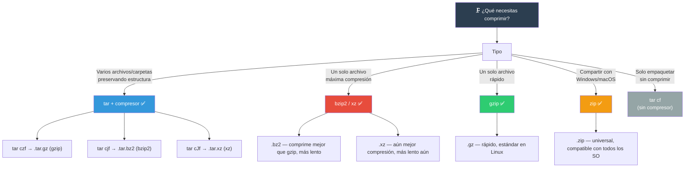
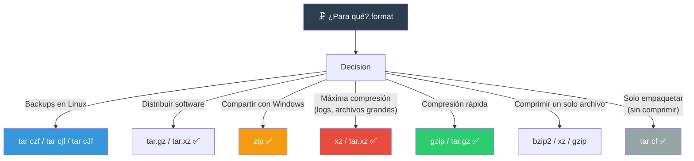

# Compresión de archivos

Comprimir archivos ahorra espacio en disco y ancho de banda. Linux ofrece múltiples herramientas, cada una con su propio balance entre velocidad y tasa de compresión.

## ¿Cuál usar?



---

## `tar` — Empaquetador universal

`tar` (Tape ARchive) agrupa archivos en un solo archivo. Solo **no comprime** por sí mismo — se combina con gzip, bzip2, xz.

### Sintaxis básica

```bash
tar -f archivo.tar [opciones] [archivos...]
```

### Crear (empaquetar)

```bash
# Sin compresión (solo empaquetar)
tar cf proyecto.tar src/ docs/ README.md

# Con compresión gzip (.tar.gz o .tgz)
tar czf proyecto.tar.gz src/ docs/
tar czf proyecto.tgz src/ docs/

# Con compresión bzip2 (.tar.bz2)
tar cjf proyecto.tar.bz2 src/ docs/

# Con compresión xz (.tar.xz)
tar cJf proyecto.tar.xz src/ docs/

# Mostrar archivos mientras se añaden (verbose)
tar czvf proyecto.tar.gz src/ docs/
```

### Extraer

```bash
# Extraer en el directorio actual
tar xf proyecto.tar.gz

# Extraer en un directorio específico
tar xf proyecto.tar.gz -C /tmp/extraido

# Extraer archivo específico
tar xf proyecto.tar.gz src/main.sh

# Listar contenido sin extraer
tar tf proyecto.tar.gz
tar tvf proyecto.tar.gz          # Con detalles
```

### Flags principales

| Flag | Significado |
|------|-------------|
| `c` | Crear archivo (create) |
| `x` | Extraer (extract) |
| `t` | Listar contenido (list) |
| `f` | Archivo (file) — **debe ser el último flag** |
| `v` | Verboso (verbose) |
| `z` | Comprimir/descomprimir con gzip |
| `j` | Comprimir/descomprimir con bzip2 |
| `J` | Comprimir/descomprimir con xz |
| `C` | Cambiar directorio antes de extraer |
| `--exclude` | Excluir archivos/patrones |
| `--strip-components=N` | Eliminar N componentes de la ruta |

### Ejemplos avanzados

```bash
# Excluir archivos
tar czf proyecto.tar.gz src/ --exclude='*.log' --exclude='node_modules'

# Strip components (eliminar directorio raíz al extraer)
tar xf proyecto.tar.gz --strip-components=1

# Añadir archivos a un archivo existente
tar rf proyecto.tar nuevo.txt

# Diferencia entre archivo y sistema de archivos
tar df proyecto.tar src/main.sh

# Actualizar solo archivos más recientes
tar uf proyecto.tar src/nuevo.sh

# Comprimir con un nivel específico de gzip
GZIP=-9 tar czf proyecto.tar.gz src/   # Máxima compresión (-1 a -9)
```

### Comparación de formatos tar

| Formato | Extensión | Compresión | Velocidad | Tamaño relativo |
|---------|-----------|------------|-----------|-----------------|
| Solo tar | `.tar` | Ninguna | Instantáneo | 100% |
| tar + gzip | `.tar.gz` / `.tgz` | Media | Rápida | ~30-40% |
| tar + bzip2 | `.tar.bz2` | Alta | Media | ~20-30% |
| tar + xz | `.tar.xz` | Máxima | Lenta | ~15-25% |

---

## `gzip`, `gunzip` — Compresión rápida

`gzip` comprime un **archivo individual** (no empaqueta directorios). Usado típicamente con `tar`.

### Comandos

```bash
# Comprimir (reemplaza el original por .gz)
gzip archivo.txt                  # → archivo.txt.gz
gzip -k archivo.txt               # Conservar original (keep)
gzip -9 archivo.txt               # Máxima compresión (1-9, 6 por defecto)
gzip -1 archivo.txt               # Más rápido (peor compresión)

# Descomprimir
gunzip archivo.txt.gz             # → archivo.txt
gunzip -k archivo.txt.gz          # Conservar .gz
gzip -d archivo.txt.gz            # Alternativa: gzip -d

# Ver contenido sin descomprimir
zcat archivo.txt.gz               # Mostrar en stdout
zless archivo.txt.gz              # Paginar
zgrep "error" archivo.txt.gz      # Buscar dentro de .gz
zdiff archivo1.txt.gz archivo2.txt.gz  # Diferencias
```

### Flags de gzip

```bash
-c    # Salida a stdout (no modifica archivo)
-d    # Descomprimir (como gunzip)
-f    # Forzar (sobrescribe)
-k    # Conservar archivo original
-l    # Mostrar información del .gz
-r    # Recursivo (directorios)
-t    # Verificar integridad
-1..9 # Nivel de compresión (1=rápido, 9=máximo)
```

### Ejemplos

```bash
# Comprimir recursivamente todos los .log
gzip -r /var/log/*.log

# Tubería: comprimir en vuelo
tar cf - src/ | gzip -9 > proyecto.tar.gz

# Ver información del archivo
gzip -l archivo.txt.gz
#         compressed        uncompressed  ratio uncompressed_name
#               1024                2048  50.0% archivo.txt
```

---

## `bzip2`, `xz` — Compresión alta

### `bzip2`

Mejor compresión que gzip, pero más lento.

```bash
# Comprimir
bzip2 archivo.txt                 # → archivo.txt.bz2
bzip2 -k archivo.txt              # Conservar original
bzip2 -9 archivo.txt              # Máxima compresión (1-9)

# Descomprimir
bunzip2 archivo.txt.bz2           # → archivo.txt
bzip2 -d archivo.txt.bz2          # Alternativa

# Ver contenido
bzcat archivo.txt.bz2             # Mostrar en stdout
bzgrep "error" archivo.txt.bz2    # Buscar
bzless archivo.txt.bz2            # Paginar
```

### `xz`

Compresión máxima — más lento aún, pero los archivos más pequeños.

```bash
# Comprimir
xz archivo.txt                    # → archivo.txt.xz
xz -k archivo.txt                 # Conservar original
xz -9 archivo.txt                 # Máxima compresión
xz -T 0 archivo.txt               # Usar todos los núcleos (paralelo)

# Descomprimir
unxz archivo.txt.xz               # → archivo.txt
xz -d archivo.txt.xz              # Alternativa

# Ver contenido
xzcat archivo.txt.xz              # Mostrar en stdout
xzgrep "error" archivo.txt.xz     # Buscar
xzless archivo.txt.xz             # Paginar
```

### Comparativa de compresores

```bash
# Benchmark típico con un archivo de texto de 100 MB
                    Tamaño   Tiempo comp.   Tiempo descomp.
gzip -6             33 MB    2.0 seg        0.5 seg
bzip2 -9            25 MB    10.0 seg       2.5 seg
xz -6               18 MB    30.0 seg       1.5 seg
xz -9               15 MB    120.0 seg      1.5 seg
xz -T0 -9           15 MB    20.0 seg       1.5 seg   # Paralelo
```

---

## `zip`, `unzip` — Formato universal

`zip` es el estándar multiplataforma — funciona en Windows, macOS y Linux.

### Comprimir

```bash
# Crear archivo zip
zip archivo.zip archivo.txt
zip archivo.zip archivo1.txt archivo2.txt imagen.jpg

# Comprimir directorio recursivamente
zip -r proyecto.zip src/ docs/

# Con contraseña
zip -e proyecto.zip src/          # Pide contraseña interactiva

# Máxima compresión
zip -9 -r proyecto.zip src/

# Excluir archivos
zip -r proyecto.zip src/ -x '*.log' 'node_modules/*'

# Almacenar sin comprimir
zip -0 -r proyecto.zip src/       # Solo empaquetar
```

### Descomprimir

```bash
# Extraer en directorio actual
unzip proyecto.zip

# Extraer en directorio específico
unzip proyecto.zip -d /tmp/extraido

# Listar contenido sin extraer
unzip -l proyecto.zip

# Probar integridad
unzip -t proyecto.zip

# Extraer archivo específico
unzip proyecto.zip src/main.sh

# Extraer sin sobrescribir
unzip -n proyecto.zip

# Extraer sobrescribiendo sin preguntar
unzip -o proyecto.zip
```

### Flags de zip y unzip

```bash
# zip
-r    # Recursivo (directorios)
-9    # Máxima compresión (0=almacenar, 1-9)
-e    # Encriptar con contraseña
-x    # Excluir patrones
-q    # Modo silencioso
-m    # Mover archivos (eliminar originales)

# unzip
-l    # Listar contenido
-t    # Probar integridad
-d    # Directorio de destino
-o    # Sobrescribir sin preguntar
-n    # No sobrescribir existentes
-q    # Modo silencioso
```

### zip con contraseña

```bash
# Encriptar (método ZipCrypto, débil)
zip -e secreto.zip documento.pdf
# Enter password: ****
# Verify password: ****

# Encriptar con AES-256 (más seguro)
zip -e --encryption-method=AES-256 secreto.zip documento.pdf

# Descomprimir (pide contraseña)
unzip secreto.zip
```

---

## Comparativa de formatos



### Tabla resumen

| Herramienta | Extensión | ¿Empaqueta? | Compresión | Velocidad | Universal |
|-------------|-----------|-------------|------------|-----------|-----------|
| `tar` | `.tar` | ✅ | Ninguna | ✅ Instantáneo | Linux/Unix |
| `gzip` | `.gz` | ❌ | Media | ✅ Rápida | Linux/Unix |
| `bzip2` | `.bz2` | ❌ | Alta | 🟡 Media | Linux/Unix |
| `xz` | `.xz` | ❌ | Máxima | ❌ Lenta | Linux/Unix |
| `zip` | `.zip` | ✅ | Media | 🟡 Media | ✅ Todos |

> **🎯 Resumen**: `tar czf` para backups Linux (rápido), `tar cJf` para máxima compresión (lento), `zip -r` para compartir con Windows/macOS. Usa siempre `gzip -9` o `bzip2 -9` si el tiempo no importa. Para logs antiguos, `xz` te da el archivo más pequeño. Verifica integridad con `gzip -t`, `unzip -t`, `tar df`.

## Relacionados:
- [[manejo-de-paqueteria-linux]] #anterior 
- [[networking-teminal]] #siguiente 