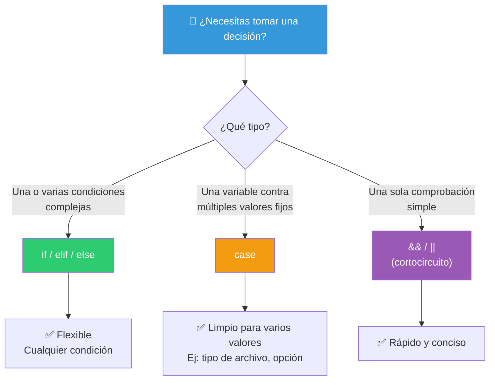
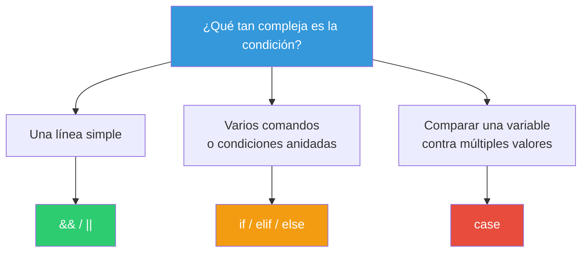

# Condicionales

Los condicionales permiten que un script tome decisiones según condiciones. En Bash hay tres formas principales: `if`, `case` y los operadores de cortocircuito `&&` / `||`.

## Mapa de condicionales



---

## `if` — Condicional general

### Sintaxis básica

```bash
if condición; then
    comandos...
fi
```

### `if` / `else`

```bash
if condición; then
    comandos_si_verdadero
else
    comandos_si_falso
fi
```

### `if` / `elif` / `else`

```bash
if condición1; then
    comandos1
elif condición2; then
    comandos2
elif condición3; then
    comandos3
else
    comandos_por_defecto
fi
```

### Formas de escribir la condición

```bash
# Con [[ ]] (recomendado para Bash)
if [[ "$edad" -ge 18 ]]; then
    echo "Mayor de edad"
fi

# Con (( )) para aritmética
if (( edad >= 18 )); then
    echo "Mayor de edad"
fi

# Con [ ] (POSIX, portátil pero limitado)
if [ "$edad" -ge 18 ]; then
    echo "Mayor de edad"
fi

# Con un comando directamente
if grep -q "error" log.txt; then
    echo "Se encontraron errores"
fi
```

### Condiciones múltiples

```bash
# AND: todas deben cumplirse
if [[ "$edad" -ge 18 && "$tiene_permiso" == "si" ]]; then
    echo "Acceso concedido"
fi

# OR: al menos una debe cumplirse
if [[ "$rol" == "admin" || "$rol" == "superadmin" ]]; then
    echo "Acceso de administrador"
fi

# AND + OR combinados (con paréntesis para claridad)
if [[ ("$edad" -ge 18 && "$tiene_id" == "si") || "$rol" == "admin" ]]; then
    echo "Puede entrar"
fi

# Negación
if [[ ! -f "$archivo" ]]; then
    echo "El archivo no existe"
fi
```

### `if` con `$?`

```bash
# ❌ Innecesario (pero funciona)
ls /home
if [[ $? -eq 0 ]]; then
    echo "OK"
fi

# ✅ Directo y limpio
if ls /home; then
    echo "OK"
fi
```

### Ejemplos prácticos

```bash
#!/bin/bash
# ============================================
# Validaciones con if
# ============================================

# Validar argumentos
if [[ $# -eq 0 ]]; then
    echo "Uso: $0 <archivo>" >&2
    exit 1
fi

# Validar existencia de archivo
if [[ ! -f "$1" ]]; then
    echo "Error: $1 no existe" >&2
    exit 2
fi

# Validar permisos
if [[ ! -r "$1" ]]; then
    echo "Error: no tienes permiso de lectura" >&2
    exit 3
fi

# Rango numérico
if (( edad >= 13 && edad <= 17 )); then
    echo "Eres adolescente"
elif (( edad >= 18 && edad <= 64 )); then
    echo "Eres adulto"
elif (( edad >= 65 )); then
    echo "Eres adulto mayor"
else
    echo "Eres niño o edad inválida"
fi

# Comparación de strings
if [[ "$nombre" == "Ana" ]]; then
    echo "Hola Ana"
elif [[ -n "$nombre" ]]; then
    echo "Hola $nombre"
else
    echo "Hola desconocido"
fi
```

---

## `case` — Selección por valor

`case` compara una variable contra múltiples patrones. Es más limpio que una cadena de `elif`.

### Sintaxis

```bash
case expresión in
    patrón1)
        comandos1
        ;;
    patrón2)
        comandos2
        ;;
    *)
        comandos_por_defecto
        ;;
esac
```

### Reglas importantes

- Cada patrón termina con `)` 
- Los comandos terminan con `;;` (doble punto y coma)
- `*)` es el comodín (default)
- Puedes agrupar patrones con `|`

### Ejemplos básicos

```bash
read -p "Ingresa una letra: " letra

case $letra in
    a|e|i|o|u)
        echo "Es una vocal"
        ;;
    b|c|d|f|g)
        echo "Es una consonante"
        ;;
    *)
        echo "No es una letra reconocida"
        ;;
esac
```

```bash
read -p "¿Qué día es hoy? " dia

case ${dia,,} in          # ${dia,,} = a minúsculas
    lunes|martes|miércoles|jueves|viernes)
        echo "Es día laboral"
        ;;
    sábado|domingo)
        echo "Es fin de semana 🎉"
        ;;
    *)
        echo "No reconozco ese día"
        ;;
esac
```

### Patrones con comodines

```bash
archivo="foto.jpg"

case "$archivo" in
    *.jpg|*.jpeg|*.png)
        echo "Es una imagen"
        ;;
    *.mp3|*.wav|*.flac)
        echo "Es un audio"
        ;;
    *.mp4|*.avi)
        echo "Es un video"
        ;;
    *.txt|*.md)
        echo "Es un documento de texto"
        ;;
    *)
        echo "Tipo de archivo desconocido: $archivo"
        ;;
esac
```

### Rangos y clases

```bash
read -n 1 -p "Presiona una tecla: " tecla
echo

case "$tecla" in
    [[:upper:]])
        echo "Es una letra mayúscula"
        ;;
    [[:lower:]])
        echo "Es una letra minúscula"
        ;;
    [[:digit:]])
        echo "Es un dígito"
        ;;
    [[:punct:]])
        echo "Es un signo de puntuación"
        ;;
    [[:space:]])
        echo "Es un espacio"
        ;;
    "")
        echo "Es Enter / nueva línea"
        ;;
    *)
        echo "Tecla desconocida"
        ;;
esac
```

### Case con caída (fallthrough) — `;&` y `;;&`

Bash 4+ permite patrones que caen al siguiente sin parar.

```bash
# ;& (fallthrough): ejecuta también el siguiente bloque
case "$1" in
    start)
        echo "Iniciando..."
        ;&   # ← cae al siguiente caso
    restart)
        echo "Reiniciando..."
        ;;
    stop)
        echo "Deteniendo..."
        ;;
esac

# ;;& (continuar): sigue evaluando patrones
case "$num" in
    1)
        echo "Uno"
        ;;&   # ← sigue evaluando
    2)
        echo "Dos"
        ;;&
    1|3|5)
        echo "Es impar"
        ;;
esac
```

### Case en init scripts (patrón clásico)

```bash
#!/bin/bash
# Script de servicio

case "$1" in
    start)
        echo "Iniciando servicio..."
        /usr/bin/mi-app --daemon
        ;;
    stop)
        echo "Deteniendo servicio..."
        kill $(cat /var/run/mi-app.pid)
        ;;
    restart)
        $0 stop
        $0 start
        ;;
    status)
        if pgrep mi-app; then
            echo "Servicio en ejecución"
        else
            echo "Servicio detenido"
        fi
        ;;
    *)
        echo "Uso: $0 {start|stop|restart|status}"
        exit 2
        ;;
esac
```

---

## `&&` y `||` — Cortocircuitos

Para condiciones simples, los operadores `&&` y `||` son más concisos que `if`.

```bash
# AND: ejecuta si el anterior tuvo éxito
[[ -f "$archivo" ]] && echo "El archivo existe"
# Equivale a: if [[ -f "$archivo" ]]; then echo "El archivo existe"; fi

# OR: ejecuta si el anterior falló
[[ -d "$directorio" ]] || mkdir -p "$directorio"
# Equivale a: if [[ ! -d "$directorio" ]]; then mkdir -p "$directorio"; fi

# Combinación
[[ -f "$archivo" ]] && echo "Existe" || echo "No existe"

# ⚠️ Cuidado: esta combinación no es exactamente if/else
# porque si el echo falla, se ejecuta el OR
```

### Cuándo usar cada uno



---

## `if` vs `case` vs `&& ||`

```bash
# Misma lógica con diferentes estilos

# 1. Con if
read -p "Color (rojo/verde/azul): " color
if [[ "$color" == "rojo" ]]; then
    echo "Elegiste rojo"
elif [[ "$color" == "verde" ]]; then
    echo "Elegiste verde"
elif [[ "$color" == "azul" ]]; then
    echo "Elegiste azul"
else
    echo "Color desconocido"
fi

# 2. Con case (más limpio para este caso)
case "$color" in
    rojo)  echo "Elegiste rojo" ;;
    verde) echo "Elegiste verde" ;;
    azul)  echo "Elegiste azul" ;;
    *)     echo "Color desconocido" ;;
esac

# 3. Con cortocircuito (solo para acciones simples)
[[ "$color" == "rojo" ]] && echo "Elegiste rojo"
[[ "$color" == "verde" ]] && echo "Elegiste verde"
```

---

## Buenas prácticas

| Práctica | Explicación |
|----------|-------------|
| Usa `[[ ]]` en vez de `[ ]` | Más potente, menos bugs |
| Usa `(( ))` para números | Más legible que `-gt`, `-eq` |
| Prefiere `case` sobre `elif` largos | Más legible y rápido |
| `if comando; then` sobre `$?` | Más limpio |
| Cita variables en condiciones | `[[ "$var" == "x" ]]` evita errores |
| `exit` con código en `else`/`*)` | Falla rápido con mensaje claro |
| Un solo `;;` por bloque en `case` | Olvidarlo causa fallthrough involuntario |

> **🎯 Resumen**: `if` para condiciones generales, `case` para comparar una variable contra múltiples valores, `&&`/`||` para decisiones simples de una línea. `[[ ]]` para strings y archivos, `(( ))` para números. Siempre cita las variables y falla rápido con mensajes claros.

## Relacionados:
- [[permiso-de-archivos-terminal]] #anterior 
- [[bucles-bash]] #siguiente 