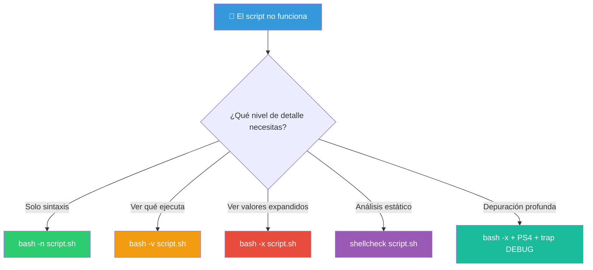
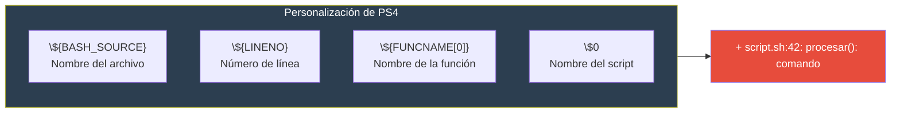

# Debugging

Los errores en Bash pueden ser difíciles de encontrar. Afortunadamente hay varias herramientas y técnicas para depurar scripts.

## Niveles de debugging



---

## `set -x` — Modo trace (rastreo)

`set -x` (**xtrace**) muestra cada comando antes de ejecutarlo, con las variables ya expandidas.

### Activación

```bash
# Desde la línea de comandos
bash -x script.sh

# Desde dentro del script
#!/bin/bash
set -x            # Activar trace desde aquí
...
set +x            # Desactivar trace

# En una sección específica
echo "Antes del trace"
set -x
comando_que_quiero_ver
set +x
echo "Después del trace"
```

### Ejemplo

```bash
$ bash -x script.sh
+ echo 'Hola, mundo'
Hola, mundo
+ nombre=Ana
+ echo 'Hola, Ana'
Hola, Ana
+ ls -la
total 12
drwxr-xr-x ...
```

### Personalizar el formato con `PS4`

`PS4` controla el prefijo del trace. Por defecto es `+ `.

```bash
# Formato personalizado
export PS4='+ ${BASH_SOURCE}:${LINENO}: ${FUNCNAME[0]:-main}()> '

# Ejemplo de salida:
# + script.sh:5: main> nombre=Ana
# + script.sh:6: main> echo 'Hola, Ana'
# + script.sh:3: saludar()> ...

# Con colores
export PS4='+\033[0;33m${BASH_SOURCE}:${LINENO}\033[0m> '
```



---

## `bash -n` — Verificar sintaxis

`bash -n` (**noexec**) verifica la sintaxis del script **sin ejecutarlo**.

```bash
# Verificar sintaxis
bash -n script.sh

# Si no hay salida, la sintaxis es correcta
# Si hay error, muestra dónde:

bash -n script.sh
# script.sh: line 10: syntax error: unexpected end of file
```

### Casos de uso

```bash
# Verificar antes de ejecutar en producción
if bash -n script.sh 2>/dev/null; then
    echo "Sintaxis correcta ✅"
    ./script.sh
else
    echo "Error de sintaxis ❌"
    exit 1
fi

# Verificar varios scripts
for script in *.sh; do
    if bash -n "$script" 2>/dev/null; then
        echo "✅ $script"
    else
        echo "❌ $script"
    fi
done
```

## `bash -v` — Modo verbose

`bash -v` muestra cada línea del script **antes** de procesarla (sin expandir variables).

```bash
$ bash -v script.sh
#!/bin/bash
echo "Hola, mundo"
Hola, mundo
nombre="Ana"
echo "Hola, $nombre"
Hola, Ana
```

### Combinar con `-x`

```bash
# Verbose + trace: muestra línea original y expandida
bash -vx script.sh

# Equivale a poner al inicio del script:
set -vx
```

---

## ShellCheck — Análisis estático

**ShellCheck** es una herramienta que analiza scripts de Bash y encuentra errores, malas prácticas y posibles bugs **sin ejecutar el script**.

### Instalación

```bash
# Debian/Ubuntu
sudo apt install shellcheck

# Fedora
sudo dnf install shellcheck

# macOS
brew install shellcheck

# Desde el navegador
# https://www.shellcheck.net/
```

### Uso básico

```bash
shellcheck script.sh

# Con severity específico
shellcheck --severity=warning script.sh

# Ignorar ciertos checks
shellcheck --exclude=SC2086,SC2155 script.sh

# Formato de salida
shellcheck -f gcc script.sh        # Formato GCC
shellcheck -f checkstyle script.sh  # XML
shellcheck -f json script.sh       # JSON
```

### Ejemplo

```bash
$ cat bug.sh
#!/bin/bash
name=$1
if [ $name = "Ana" ]
then
    echo "Hola"
fi

$ shellcheck bug.sh

# Line 2:
# name=$1
# ^---^ SC2034: name appears unused. Verify it or export it.
# 
# Line 3:
# if [ $name = "Ana" ]
#      ^---^ SC2086: Double quote to prevent globbing
#            and word splitting.
# 
# Line 3:
# if [ $name = "Ana" ]
#          ^-- SC2050: This expression is constant.
```

### Errores comunes que detecta ShellCheck

| Código | Problema | Solución |
|--------|----------|----------|
| SC2086 | Variable sin comillas | `"$var"` |
| SC2002 | `cat archivo \| cmd` inútil | `cmd < archivo` |
| SC2046 | Falta comillas en `$(cmd)` | `"$(cmd)"` |
| SC2162 | `read` sin `-r` | `read -r` |
| SC2155 | `local` en `declare` | `local var="$(cmd)"` |
| SC2034 | Variable no usada | Revisar si es necesaria |
| SC2068 | Array sin `"${arr[@]}"` | `"${arr[@]}"` |

### Integración continua

```bash
# En CI: fallar si hay errores de cierto nivel
shellcheck --severity=error script.sh

# En pre-commit hook
#!/bin/bash
for file in "$@"; do
    if ! shellcheck "$file" 2>/dev/null; then
        echo "ShellCheck encontró problemas en $file"
        exit 1
    fi
done
```

---

## `trap DEBUG` — Depuración paso a paso

```bash
#!/bin/bash

# Ejecuta un comando antes de cada línea del script
trap 'echo "DEBUG: Ejecutando en línea $LINENO"' DEBUG

# También puedes crear un depurador interactivo
depurador() {
    local linea=$1
    local comando=$2
    read -p "🐞 Línea $linea: $comando [Enter para continuar, q para salir]: " resp
    [[ "$resp" == "q" ]] && exit 130
}

trap 'depurador $LINENO "$BASH_COMMAND"' DEBUG
```

---

## Errores comunes y cómo debuggearlos

### "Unbound variable"

```bash
# Error: script.sh: line 5: VAR: unbound variable
# Causa: set -u + variable no definida
# Solución:
set -u
VAR="${1:-}"     # Valor por defecto (puede ser vacío)

# O verificar antes de usar
if [[ -z "${VAR:-}" ]]; then
    echo "VAR no está definida"
fi
```

### "Permission denied"

```bash
# Error: line 3: ./script.sh: Permission denied
# Causa: el script no tiene permiso de ejecución
# Solución:
chmod +x script.sh
```

### "command not found"

```bash
# Error: line 3: micomando: command not found
# Causas posibles:
#   1. El comando no está instalado
#   2. El comando no está en PATH
#   3. Error tipográfico
# Solución:
which comando    # Verificar si existe
# PATH en script
export PATH="$PATH:/ruta/adicional"
```

### "Unexpected end of file"

```bash
# Error: syntax error: unexpected end of file
# Causa: falta un fi, done, esac, o una comilla sin cerrar
# Solución:
# Revisar con:
bash -n script.sh

# Buscar estructuras sin cerrar
grep -n "if\|for\|while\|case\|{" script.sh
grep -n "fi\|done\|esac\|}" script.sh
```

### Bucle infinito

```bash
# Ctrl+C para salir del bucle
# Después, revisar:
while true; do       # ← ¿Hay un break?
    ...
done

for ((i=0; ; i++))    # ← ¿Falta condición?
```

---

## Técnicas de depuración

### Echo debugging

```bash
# La técnica más simple: imprimir valores
echo "DEBUG: variable=$variable"

# Con prefijo para identificar
echo "=== DEBUG ===" >&2
echo "Args: $@" >&2
echo "PWD: $PWD" >&2
echo "=============" >&2

# En funciones
procesar() {
    echo "DEBUG: procesar($1, $2)" >&2
    ...
}
```

### Imprimir el comando antes de ejecutar

```bash
# Usar echo + eval para ver qué se ejecutará
cmd="rm -rf $directorio"
echo "Ejecutando: $cmd"
eval "$cmd"
```

### Guardar el trace en un archivo

```bash
# Redirigir el trace a un archivo
exec 5> debug.log
BASH_XTRACEFD="5"
set -x

# Ahora el trace va a debug.log, la salida normal a la terminal
```

### Verificar códigos de salida

```bash
# En pipelines
set -o pipefail
comando1 | comando2
echo "Pipe exit code: $?"

# En subshells
(
    comando_que_falla
    echo "Subshell exit: $?"
)
echo "Overall exit: $?"
```

---

## Hoja de referencia

```bash
# Sintaxis (sin ejecutar)
bash -n script.sh

# Verbose (ver líneas)
bash -v script.sh

# Trace (ver expansión)
bash -x script.sh

# Trace con formato personalizado
export PS4='+ $BASH_SOURCE:$LINENO: '
bash -x script.sh

# Trace a archivo
exec 5> debug.log
BASH_XTRACEFD=5
set -x

# Depuración con trampa
trap 'echo "LINE: $LINENO CMD: $BASH_COMMAND"' DEBUG

# Análisis estático
shellcheck script.sh

# Secciones con trace selectivo
set -x
# ... código a depurar ...
set +x

# Ver tipo de variable
declare -p variable
```

---

## Script de depuración

```bash
#!/bin/bash
# ============================================
# Script con debugging incorporado
# ============================================

DEBUG="${DEBUG:-false}"
[[ "$DEBUG" == "true" ]] && set -x

# O activar con flag
while [[ $# -gt 0 ]]; do
    case "$1" in
        --debug)
            set -x
            PS4='+ ${BASH_SOURCE}:${LINENO}: '
            shift
            ;;
        --shellcheck)
            # Auto-verificar con shellcheck
            shellcheck "$0"
            exit $?
            ;;
        *)
            break
            ;;
    esac
done

# Lógica del script
nombre="${1:-Mundo}"
echo "Hola, $nombre!"
```

> **🎯 Resumen**: `bash -n` para sintaxis, `bash -x` para trace, `shellcheck` para análisis estático. Personaliza `PS4` para traces más informativos. Usa `trap DEBUG` para depuración paso a paso. `set -x` / `set +x` para trace selectivo. ShellCheck es la herramienta más valiosa — úsala siempre.

## Relacionados:
- [[manejo-de-errores-bash]] #anterior 
- [[expresiones-regulares-bash]] #siguiente 