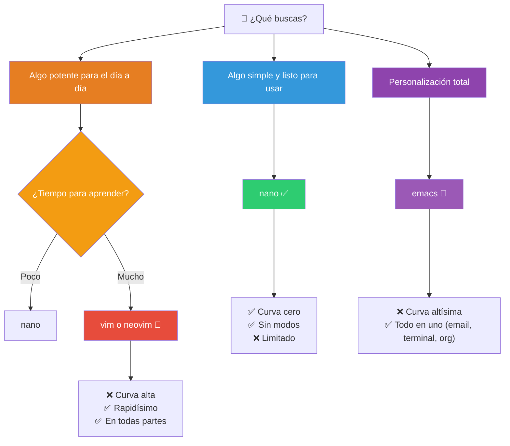
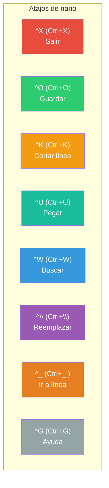
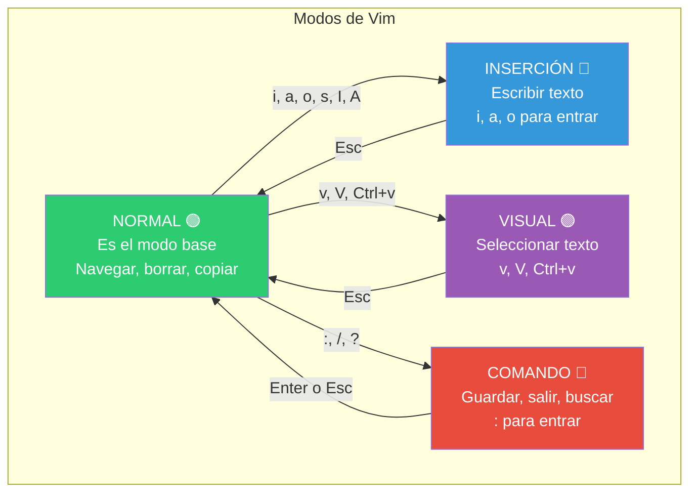
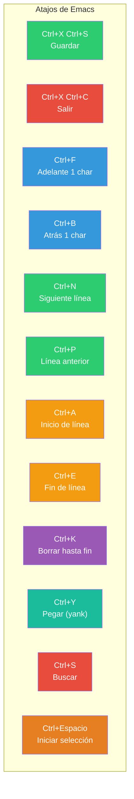
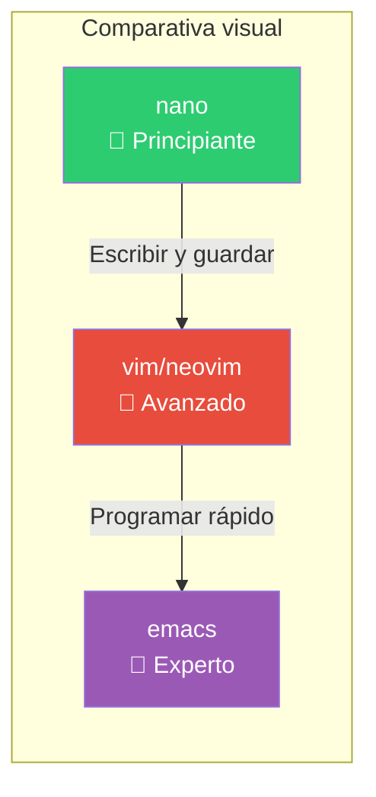

# Editores de texto

En la terminal no puedes usar VS Code ni Sublime Text. Necesitas un **editor de terminal**. Aquí están los principales.

## ¿Cuál elegir?



---

## `nano` — El editor simple

**Curva de aprendizaje**: mínima. Todos los comandos se ven en pantalla.

### Inicio

```bash
nano archivo.txt          # Abre o crea archivo
nano +10 archivo.txt      # Abre en la línea 10
nano -l archivo.txt       # Con números de línea
nano -w archivo.txt       # Sin wrapping de líneas largas
```

### Atajos principales

Todos los atajos usan `Ctrl` (^) o `Alt` (M-). Se muestran en la parte inferior de la pantalla.



| Atajo | Acción |
|-------|--------|
| `Ctrl+X` | Salir (pregunta si guardar) |
| `Ctrl+O` | Guardar (WriteOut) |
| `Ctrl+W` | Buscar texto |
| `Ctrl+\` | Buscar y reemplazar |
| `Ctrl+K` | Cortar línea entera |
| `Ctrl+U` | Pegar línea |
| `Ctrl+J` | Justificar párrafo |
| `Ctrl+T` | Revisar ortografía |
| `Ctrl+C` | Mostrar posición del cursor |
| `Ctrl+_` | Ir a línea y columna |
| `Alt+A` | Iniciar selección (marcar texto) |
| `Alt+6` | Copiar selección |
| `Alt+U` | Deshacer |
| `Alt+E` | Rehacer |
| `Alt+G` | Ir a línea |
| `Alt+N` | Mostrar números de línea |

### Ejemplo de uso

```bash
# Editar configuración
sudo nano /etc/ssh/sshd_config

# Editar script
nano -l ~/miscript.sh
# Ctrl+K para cortar una línea
# Ctrl+U para pegarla
# Ctrl+O para guardar
# Ctrl+X para salir
```

### Pros y contras

| ✅ Ventajas | ❌ Desventajas |
|-------------|----------------|
| Curva de aprendizaje cero | Limitado para archivos grandes |
| Todos los atajos visibles | Sin resaltado de sintaxis avanzado |
| Ideal para ediciones rápidas | Sin plugins/extensiones |
| Viene preinstalado en casi todo | Sin múltiples modos (para bien y para mal) |

---

## `vi` y `vim` — El editor modal

`vi` es el editor clásico de UNIX. `vim` (Vi Improved) es su sucesor moderno.

```bash
vim archivo.txt           # Abre archivo
vi archivo.txt            # Versión clásica (en muchos sistemas es vim)
```

### Los modos de Vim



### Cómo empezar

```bash
vim archivo.txt
# Estás en modo NORMAL
# Presiona i para entrar en modo INSERCIÓN y empezar a escribir
# Presiona Esc para volver al modo NORMAL
# Escribe :wq y Enter para guardar y salir
```

### Modo NORMAL: navegación

```bash
h j k l       ← ↓ ↑ →        # Movimiento básico
w b           Una palabra adelante/atrás
0 ^ $         Inicio / primer carácter / fin de línea
gg G          Inicio / fin del archivo
{ }           Párrafo anterior/siguiente
Ctrl+D Ctrl+U     Media página abajo/arriba
zz zt zb      Centrar/top/bottom la pantalla en el cursor
```

### Modo NORMAL: edición

```bash
x             Borrar carácter bajo cursor
dd            Borrar línea entera
3dd           Borrar 3 líneas
dw d$         Borrar palabra / hasta fin de línea
yy            Copiar (yank) línea
3yy           Copiar 3 líneas
p P           Pegar después / antes del cursor
u             Deshacer (undo)
Ctrl+R        Rehacer (redo)
.             Repetir último cambio
```

### Modo INSERCIÓN: entrar

| Comando | Entra en inserción... |
|---------|----------------------|
| `i` | En la posición actual |
| `a` | Después del cursor (append) |
| `I` | Al inicio de la línea |
| `A` | Al final de la línea |
| `o` | Nueva línea debajo |
| `O` | Nueva línea encima |
| `s` | Borra carácter y entra en inserción |
| `S` | Borra línea y entra en inserción |
| `C` | Borra desde cursor hasta fin de línea |

### Modo COMANDO: guardar y salir

| Comando | Acción |
|---------|--------|
| `:w` | Guardar (write) |
| `:wq` | Guardar y salir |
| `:q` | Salir (solo si no hay cambios) |
| `:q!` | Salir sin guardar |
| `:x` | Guardar y salir (como `:wq`) |
| `ZZ` | Guardar y salir (desde normal) |
| `ZQ` | Salir sin guardar (desde normal) |
| `:e!` | Recargar archivo original |
| `:w !sudo tee %` | Guardar archivo con sudo (no recuerdes, solo pégate esto) |

### Modo COMANDO: búsqueda y reemplazo

```bash
/patrón           # Buscar hacia adelante
?patrón           # Buscar hacia atrás
n N               # Siguiente / anterior coincidencia

# Buscar y reemplazar
:%s/antiguo/nuevo/g           # Reemplazar en todo el archivo
:%s/antiguo/nuevo/gc          # Reemplazar pidiendo confirmación
:3,10s/antiguo/nuevo/g        # Solo líneas 3 a 10
:%s/antiguo/nuevo/gi          # Ignorar mayúsculas
```

### Modo VISUAL

```bash
v               # Seleccionar caracteres
V               # Seleccionar líneas completas
Ctrl+v          # Selección en bloque (vertical)
```

Una vez seleccionado:
- `d` para borrar
- `y` para copiar
- `>` / `<` para indentar
- `~` para cambiar mayúsculas/minúsculas
- `:w archivo` para guardar la selección

### Consejos para sobrevivir

```bash
# Quedaste atascado en algún modo?
Esc Esc Esc     # Siempre vuelve a NORMAL
Ctrl+C          # También sale de cualquier modo

# Cerraste sin querer?
vim -r archivo.txt    # Recupera archivo del swap

# Tutorial integrado
vimtutor               # 30 minutos, te cambia la vida
```

### Vim vs Neovim

```bash
vim               # Clásico, viene con casi todo
nvim              # Neovim: fork moderno (Lua, async, plugins)
```

### Pros y contras

| ✅ Ventajas | ❌ Desventajas |
|-------------|----------------|
| Está **en todas partes** | Curva de aprendizaje pronunciada |
| Extremadamente rápido | Puedes frustrarte al inicio |
| Sin esfuerzo en las muñecas (sin ratón) | Adictivo — querrás vim en todos lados |
| Ecosistema de plugins gigante | |
| Editar cientos de archivos en segundos | |

### Trucos avanzados

```bash
.             # Repite el último cambio
* #           # Busca la palabra bajo el cursor
q{a-z}        # Graba una macro (q a, luego acciones, luego q)
@{a-z}        # Reproduce la macro
@@            # Reproduce última macro

# Editar múltiples archivos
vim archivo1.txt archivo2.txt
:next         # Siguiente archivo
:previous     # Archivo anterior
:args         # Lista de archivos
:windo diffthis    # Modo diff entre archivos
```

---

## `emacs` — El sistema operativo disfrazado de editor

Emacs es mucho más que un editor: es un **entorno completo** con su propio intérprete de Lisp.

```bash
emacs archivo.txt           # Abre en terminal
emacs -nw archivo.txt       # Fuerza modo terminal (sin ventana gráfica)
```

### Conceptos clave

- **No modos**: siempre estás escribiendo (como nano)
- **Combinaciones de teclas**: Ctrl+algo y Meta+algo (Alt)
- **Extensible en Lisp**: puedes modificar cualquier cosa
- **Ecosistema integrado**: email, terminal, navegador web, calendario...

### Atajos principales



| Atajo | Acción |
|-------|--------|
| `Ctrl+X Ctrl+S` | Guardar |
| `Ctrl+X Ctrl+C` | Salir |
| `Ctrl+X Ctrl+F` | Abrir archivo |
| `Ctrl+X Ctrl+B` | Lista de buffers |
| `Ctrl+X 3` | Dividir ventana vertical |
| `Ctrl+X 2` | Dividir ventana horizontal |
| `Ctrl+X 0` | Cerrar ventana |
| `Ctrl+X 1` | Dejar solo esta ventana |
| `Alt+X` | Ejecutar comando por nombre (M-x) |
| `Ctrl+G` | Cancelar comando actual |
| `Ctrl+H I` | Tutorial interactivo |

### Características únicas

- **Org-mode**: sistema de notas, agendas y TODO list
- **Magit**: el mejor cliente de Git que existe
- **TRAMP**: editar archivos remotos por SSH
- **Dired**: administrador de archivos
- **IELM**: REPL de Lisp integrado

```bash
# org-mode: archivos .org
* Título nivel 1
** Título nivel 2
*** Título nivel 3
- [ ] Tarea pendiente
- [X] Tarea hecha
```

### Pros y contras

| ✅ Ventajas | ❌ Desventajas |
|-------------|----------------|
| Todo en uno (editor, email, terminal) | Puede ser lento al iniciar |
| Org-mode es único | Atajos complejos (Ctrl+X Meta+X...) |
| Extremadamente extensible | Requiere Lisp para personalizar |
| TRAMP para archivos remotos | Poco común en servidores básicos |

---

## Comparativa final



| Aspecto | nano | vim | emacs |
|---------|------|-----|-------|
| **Curva de aprendizaje** | Inmediata | Empinada | Muy empinada |
| **Modos** | No | Sí (Normal/Inserción/Visual) | No |
| **Peso** | Mínimo | Ligero | Pesado |
| **Preinstalado** | Casi siempre | Frecuente (o vi) | Raramente |
| **Plugins** | No | Sí (Vimscript, Lua) | Sí (Lisp) |
| **Uso típico** | Editar configs rápido | Programar a diario | Entorno completo |
| **Atajos** | Visibles en pantalla | Ocultos (hay que saberlos) | Múltiples combinaciones |
| **Tutorial** | `^G` | `vimtutor` | `Ctrl+H I` |

### Recomendación

```bash
# Aprende nano primero — te salvará en servidores ajenos
nano /etc/config.cfg

# Luego invierte tiempo en vim — será tu herramienta principal
vimtutor               # 30 min
vim ~/miscript.sh      # Empieza a usarlo
```

> **💡 Regla práctica**: En un servidor que no es tuyo, usa `nano` (menos riesgo de daño). En tu máquina, usa `vim` o `neovim` si programas regularmente. Si te interesa el ecosistema Emacs (Org-mode, Magit), invierte tiempo; el retorno es enorme.

## Relacionados:
- [[trabajando-con-textos-en-bash]] #anterior 
- [[basic-editor-ops]] #siguiente 