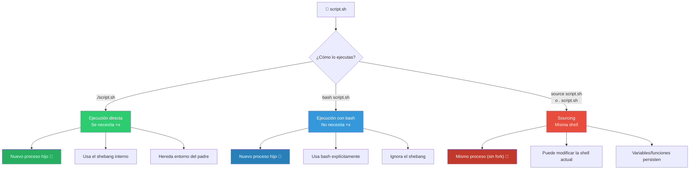
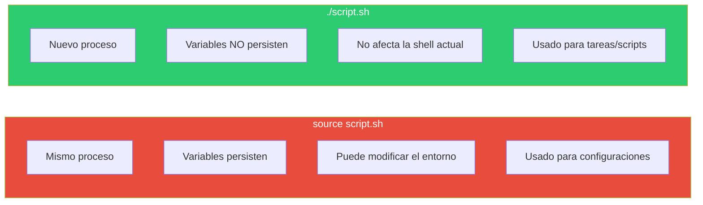
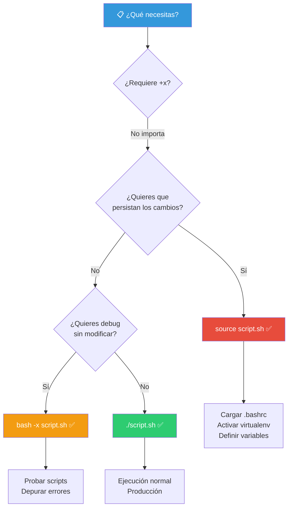

# Ejecución de Scripts de Bash

Hay varias formas de ejecutar un script de Bash. Cada una tiene implicaciones diferentes en cómo se comporta el script, qué shell lo ejecuta y qué variables de entorno están disponibles.

## Las tres formas principales



---

## Ejecución directa (`./script.sh`)

Es la forma más común. El sistema lee el **shebang** (`#!/bin/bash`) y ejecuta el intérprete indicado.

```bash
# Requiere permiso de ejecución
chmod +x script.sh
./script.sh
```

### Cómo funciona


### Permisos

```bash
# Dar permiso de ejecución
chmod +x script.sh         # Añade ejecución
chmod 755 script.sh        # rwxr-xr-x
chmod u+x script.sh        # Solo el propietario

# Ver permisos
ls -l script.sh
# -rwxr-xr-x 1 usuario grupo 123 May 30 10:00 script.sh

# Ejecutar desde cualquier lugar (si está en PATH)
export PATH="$PATH:$HOME/scripts"
script.sh                  # Ahora funciona sin ./
```

### Rutas relativas y absolutas

```bash
./script.sh                # Directorio actual (relativa)
/home/usuario/script.sh    # Ruta completa (absoluta)
~/scripts/script.sh        # Desde el home
```

### Limitaciones

```bash
# ❌ Esto NO funciona (el directorio actual no está en PATH por seguridad)
script.sh
# bash: script.sh: command not found

# ✅ Esto SÍ funciona
./script.sh
```

---

## Ejecución con Bash (`bash script.sh`)

Ejecuta el script pasándoselo como argumento al intérprete `bash` directamente.

```bash
bash script.sh
bash ruta/al/script.sh
bash -x script.sh          # Con debug
bash -n script.sh          # Solo verifica sintaxis (no ejecuta)
```

### Ventajas sobre la ejecución directa

| Aspecto | Ejecución directa | `bash script.sh` |
|---------|-------------------|------------------|
| Requiere `+x` | ✅ Sí | ❌ No |
| Usa el shebang | ✅ Siempre | ❌ Ignora (usa bash) |
| Útil para probar | ❌ | ✅ |
| Depuración | ❌ | ✅ (`-x`, `-n`, `-v`) |

```bash
# Útil para scripting: ejecutar sin permisos
bash script.sh

# Verificar sintaxis sin ejecutar
bash -n script.sh
# Si no hay salida, la sintaxis es correcta

# Debug paso a paso
bash -x script.sh
# + echo 'Hola, mundo'
# Hola, mundo
# + date
# Sat May 30 10:00:00 UTC 2026

# Modo verbose (muestra las líneas antes de ejecutar)
bash -v script.sh

# Combinar opciones
bash -nv script.sh       # Verificar sintaxis + verbose
bash -x script.sh arg1 arg2   # Debug con argumentos
```

### Otras shells

```bash
sh script.sh              # Bourne Shell
dash script.sh            # Debian Almquist Shell
zsh script.sh             # Z Shell
ksh script.sh             # KornShell

# Todos ignoran el shebang y usan su propio intérprete
```

---

## Ejecución con Source (`. script.sh` o `source script.sh`)

**No crea un nuevo proceso**. Ejecuta el script en la shell actual. Es la gran diferencia.

```bash
source script.sh
. script.sh               # Forma abreviada (POSIX)
```

### Cómo funciona



```mermaid
flowchart TB
    subgraph SinSource["Ejecución normal (fork)"]
        Terminal1["Shell actual"] --> Hijo["Proceso hijo 🧒"]
        Hijo --> Ejecuta1["Ejecuta script"]
        Ejecuta1 --> Muere["Hijo muere"]
        Muere --> Terminal2["Shell actual sigue igual"]
    end

    subgraph ConSource["Con source (sin fork)"]
        Terminal3["Shell actual 👤"] --> Misma["MISMO proceso"]
        Misma --> Ejecuta2["Ejecuta script<br/>en la shell actual"]
        Ejecuta2 --> Cambiada["Shell actual<br/>AHORA TIENE los cambios"]
    end

    style SinSource fill:#2C3E50,color:#fff
    style ConSource fill:#1A5276,color:#fff
    style Terminal1 fill:#3498DB,color:#fff
    style Terminal3 fill:#E74C3C,color:#fff
    style Hijo fill:#2ECC71,color:#fff
    style Misma fill:#F39C12,color:#fff
    style Cambiada fill:#1ABC9C,color:#fff
```

### Ejemplo práctico de la diferencia

```bash
# Contenido de: setenv.sh
export MI_VARIABLE="hola"
echo "Dentro del script: $MI_VARIABLE"
```

```bash
# 1. Ejecución normal (fork)
./setenv.sh
# Salida: Dentro del script: hola
echo $MI_VARIABLE
# (vacío) — la variable NO está disponible

# 2. Sourcing
source setenv.sh
# Salida: Dentro del script: hola
echo $MI_VARIABLE
# hola — la variable SÍ está disponible
```

### Usos comunes de `source`

```bash
# Recargar configuración
source ~/.bashrc
. ~/.bashrc

# Activar alias y funciones definidas en un script
source ~/scripts/mis_funciones.sh

# Activar un entorno virtual de Python
source venv/bin/activate

# Cargar variables de entorno desde un archivo
source .env
```

### Comparativa



---

## Tabla comparativa

| Aspecto | `./script.sh` | `bash script.sh` | `source script.sh` |
|---------|---------------|------------------|-------------------|
| Permiso +x | ✅ Requerido | ❌ No requerido | ❌ No requerido |
| Nuevo proceso | ✅ Sí (fork+exec) | ✅ Sí (fork+exec) | ❌ No (mismo proceso) |
| Shebang usado | ✅ Sí | ❌ No (usa bash) | ❌ No (shell actual) |
| Variables persisten | ❌ No | ❌ No | ✅ Sí |
| cd afecta la terminal | ❌ No | ❌ No | ✅ Sí |
| `exit` en el script | ❌ Solo mata el script | ❌ Solo mata el script | ✅ Cierra la terminal ⚠️ |
| Modo debug (`-x`) | ❌ (hay que editarlo) | ✅ | ✅ (si la shell lo tiene) |
| Verificar sintaxis (`-n`) | ❌ | ✅ | ❌ |
| Usos típicos | Ejecutar programas | Probar/depurar | Cargar configuración |

---

## Otras formas de ejecución

### Ejecución en segundo plano

```bash
./script.sh &              # Ejecuta en segundo plano
./script.sh > log.txt 2>&1 &  # En segundo plano, sin output en terminal
nohup ./script.sh &        # Sigue ejecutándose si cierras la terminal
```

### Ejecución con timeout

```bash
timeout 10 ./script.sh     # Mata el script si tarda más de 10 segundos
```

### Ejecución con `env`

```bash
#!/usr/bin/env bash        # Shebang portable
env bash script.sh         # Ejecuta con env
```

### Ejecución desde otro script

```bash
# Dentro de un script, llamar a otro:
./otro_script.sh           # Como subproceso (fork)
source otro_script.sh      # En el mismo proceso
bash otro_script.sh        # Especificando intérprete
```

### Redirección al ejecutar

```bash
./script.sh > salida.txt         # stdout a archivo
./script.sh 2> error.log         # stderr a archivo
./script.sh > salida.txt 2>&1    # ambos
./script.sh | tee salida.txt     # ver y guardar
./script.sh < entrada.txt        # redirigir stdin
```

---

## Depuración de scripts

```bash
# Desde la línea de comandos
bash -x script.sh          # Debug: muestra cada línea expandida
bash -v script.sh          # Verbose: muestra cada línea sin expandir
bash -n script.sh          # Verificar sintaxis

# Desde dentro del script
#!/bin/bash -x             # Debug desde el inicio

# O activarlo/desactivarlo en secciones
set -x                     # Activar debug
echo "Este comando se ve con detalle"
set +x                     # Desactivar debug
echo "Este no se ve con detalle"

# Traza personalizada
PS4='+ $BASH_SOURCE:$LINENO:'   # Formato del debug: + archivo.sh:42:comando
```

---

## Resumen visual



> **💡 Regla práctica**: Usa `./script.sh` para ejecutar. Usa `bash script.sh` para probar sin permisos. Usa `source script.sh` solo cuando quieras que el script modifique tu shell actual (cargar config, definir alias, activar entornos). Error común: hacer `source` a un script que tiene `exit` — eso cerrará tu terminal.

## Relacionados:
- [[anatomia-de-scripts-de-bash]] #anterior 
- [[variables-en-terminal]] #siguiente 
- [[05-comunicacion-entre-scripts]] #related 