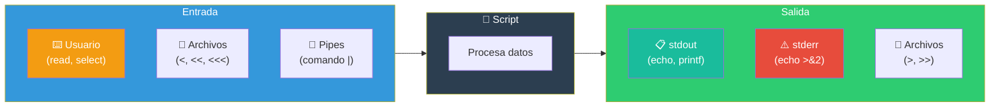
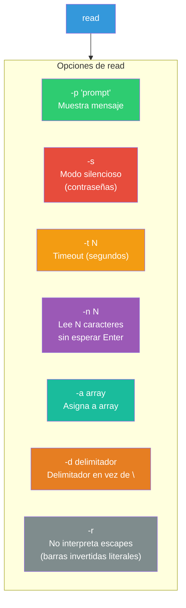

# Entradas / Salidas

Los scripts de Bash interactúan con el usuario y con otros programas a través de entradas y salidas. Este capítulo cubre cómo leer entrada del usuario, formatear salida y usar here documents/strings.

## Flujo de E/S en un script



---

## Leer la entrada del usuario

### `read` — Comando fundamental

Lee una línea desde la entrada estándar y la asigna a variables.

```bash
# Sintaxis básica
read nombre
echo "Hola, $nombre"

# Con prompt
read -p "Ingresa tu nombre: " nombre
echo "Hola, $nombre"

# Con timeout (segundos)
read -t 5 -p "Tienes 5 segundos: " respuesta
if [[ -z "$respuesta" ]]; then
    echo "⏰ Tiempo agotado"
fi
```

### Opciones de `read`



### Ejemplos de `read`

```bash
# Contraseña (modo silencioso)
read -s -p "Contraseña: " password
echo
echo "Contraseña ingresada (${#password} caracteres)"

# Un solo carácter (sin esperar Enter)
read -n 1 -p "¿Continuar? (s/n): " opcion
echo

# Leer múltiples valores
read -p "Nombre y edad: " nombre edad
echo "Te llamas $nombre y tienes $edad años"

# Con delimitador personalizado
read -d ':' -p "Ingresa valor (termina con :): " valor
echo "Valor: $valor"

# Array desde entrada
read -a numeros -p "Ingresa números separados por espacio: "
echo "Primero: ${numeros[0]}, Último: ${numeros[-1]}"

# Múltiples variables (última toma el resto)
read -p "Ciudad y país: " ciudad pais
echo "Ciudad: $ciudad, País: $pais"

# Leer archivo línea por línea
while IFS= read -r linea; do
    echo "Línea: $linea"
done < archivo.txt
```

### Validación con `read`

```bash
# Validar que no esté vacío
read -p "Nombre: " nombre
while [[ -z "$nombre" ]]; do
    read -p "El nombre no puede estar vacío. Intenta de nuevo: " nombre
done

# Validar número
read -p "Edad: " edad
while ! [[ "$edad" =~ ^[0-9]+$ ]]; do
    read -p "Debe ser un número. Edad: " edad
done

# Validar sí/no con respuesta por defecto
read -n 1 -p "¿Continuar? [Y/n]: " respuesta
respuesta="${respuesta:-Y}"
if [[ "$respuesta" =~ ^[YySs]$ ]]; then
    echo "Continuando..."
else
    echo "Abortando."
fi
```

### Menú interactivo con `select`

```bash
echo "Selecciona una opción:"
select opcion in "Listar archivos" "Mostrar fecha" "Salir"
do
    case $opcion in
        "Listar archivos")
            ls -la
            ;;
        "Mostrar fecha")
            date
            ;;
        "Salir")
            echo "Adiós"
            break
            ;;
        *)
            echo "Opción inválida"
            ;;
    esac
done
```

---

## Formateado de `printf`

`printf` da **control total** sobre el formato de salida, similar a C.

### Sintaxis

```bash
printf "formato" argumentos...
```

### Placeholders de formato

```bash
%s        # String
%d        # Entero decimal
%f        # Float/punto flotante
%x        # Hexadecimal (minúsculas)
%X        # Hexadecimal (mayúsculas)
%o        # Octal
%b        # String con escapes interpretados
%5s       # String con ancho mínimo 5
%-5s      # String alineado a la izquierda
%05d      # Entero con padding de ceros
%.2f      # Float con 2 decimales
%'d       # Entero con separador de miles (locale)
\n        # Nueva línea
\t        # Tabulador
\\        # Backslash literal
```

### Ejemplos básicos

```bash
printf "Hola, %s\n" "Ana"              # Hola, Ana
printf "Edad: %d años\n" 25            # Edad: 25 años
printf "PI ≈ %.4f\n" 3.14159265        # PI ≈ 3.1416

# Múltiples argumentos
printf "%s: %d\n" "Ana" 25 "Luis" 30
# Ana: 25
# Luis: 30
```

### Alineación y padding

```bash
# Alinear a la derecha
printf "|%10s|\n" "hola"               # |      hola|
printf "|%10d|\n" 42                   # |        42|

# Alinear a la izquierda
printf "|%-10s|\n" "hola"              # |hola      |
printf "|%-10d|\n" 42                  # |42        |

# Padding con ceros
printf "%05d\n" 7                       # 00007
printf "%5.2f\n" 3.1                   #  3.10
```

### Tablas formateadas

```bash
# Encabezados
printf "%-20s %10s %10s\n" "Nombre" "Edad" "Ciudad"
printf "%-20s %10d %10s\n" "Ana García" 25 "Madrid"
printf "%-20s %10d %10s\n" "Luis Pérez" 30 "Barcelona"
printf "%-20s %10d %10s\n" "Sara López" 28 "Valencia"

# Salida:
# Nombre                     Edad     Ciudad
# Ana García                  25      Madrid
# Luis Pérez                  30    Barcelona
# Sara López                  28     Valencia
```

### Colores con printf

```bash
# Códigos de color ANSI
VERDE='\033[0;32m'
ROJO='\033[0;31m'
AMARILLO='\033[0;33m'
AZUL='\033[0;34m'
RESET='\033[0m'

printf "${VERDE}✓${RESET} Operación exitosa\n"
printf "${ROJO}✗${RESET} Error crítico\n"
printf "${AMARILLO}⚠${RESET} Advertencia\n"
```

### `printf` vs `echo`

| Aspecto | `echo` | `printf` |
|---------|--------|----------|
| Portabilidad | Varía entre sistemas | Comportamiento consistente |
| Formato | Limitado | Control total |
| Escape (\n) | Requiere `-e` | Nativo |
| Tablas | Difícil | Fácil con alineación |
| Uso típico | Mensajes simples | Datos estructurados |

```bash
# echo es más simple para mensajes rápidos
echo "Hola, $nombre"

# printf es mejor para datos formateados
printf "%-8s %8s\n" "Usuario" "Uso"
printf "%-8s %8.2f\n" "$user" "$cpu"
```

---

## Here Documents

Un **here document** permite pasar múltiples líneas de entrada directamente en el script.

### Sintaxis básica

```bash
comando << DELIMITADOR
línea 1
línea 2
línea 3
DELIMITADOR
```

El delimitador puede ser cualquier palabra (por convención `EOF`, `END`, `FIN`).

### Ejemplos

```bash
# Escribir un archivo desde un script
cat << EOF > config.txt
nombre=Ana
edad=25
lenguaje=Bash
EOF

# Añadir a un archivo existente
cat << EOF >> ~/.bashrc
alias ll='ls -laF'
alias ..='cd ..'
EOF

# Pasar entrada a un comando
bc << CALC
scale=2
10 / 3
quit
CALC
# Salida: 3.33

# Enviar correo desde script
mail -s "Asunto" usuario@ejemplo.com << MENSAJE
Hola,
esto es el cuerpo del mensaje.
Atentamente,
El script
MENSAJE
```

### Sin expansión de variables

Si el delimitador está **entre comillas**, las variables NO se expanden:

```bash
# Con expansión
nombre="Ana"
cat << EOF
Hola, $nombre          # Hola, Ana
EOF

# Sin expansión
cat << 'EOF'
Hola, $nombre          # Hola, $nombre (literal)
EOF

# También funciona escapando el delimitador
cat << \EOF
Hola, $nombre          # Hola, $nombre (literal)
EOF
```

### Prefijo con tabulaciones (`<<-`)

Permite indentar el here document con tabulaciones:

```bash
if true; then
    cat <<- EOF
	Este texto está indentado
	con tabulaciones, pero se
	muestra sin la indentación
	EOF
fi
```

### Redirigir a stderr

```bash
cat << EOF >&2
Este mensaje va a stderr
EOF
```

---

## Here Strings

Un **here string** (`<<<`) pasa una cadena como entrada a un comando, como si fuera un archivo.

### Sintaxis

```bash
comando <<< "cadena"
```

### Ejemplos

```bash
# Contar palabras en una cadena
wc -w <<< "Hola mundo desde Bash"
# 4

# Buscar en una cadena
grep "error" <<< "todo ok\nhay un error\nfin"
# hay un error

# Operaciones matemáticas
bc <<< "scale=2; 10 / 3"
# 3.33

# Parsear cadenas
IFS=':' read -r usuario uid gid <<< "ana:1000:1000"
echo "Usuario: $usuario, UID: $uid"

# Comparar con pipe
# Pipe (crea subshell):
echo "Hola mundo" | read -r a b
echo "$a"   # Puede estar vacío (subshell)

# Here string (misma shell):
read -r a b <<< "Hola mundo"
echo "$a"   # Hola 👍
```

### Usos comunes

```bash
# Validación de entrada
es_numero() {
    [[ "$1" =~ ^[0-9]+$ ]]
}

es_email() {
    [[ "$1" =~ ^[a-z0-9._%+-]+@[a-z0-9.-]+\.[a-z]{2,}$ ]]
}

# Procesar string como si fuera archivo
tr '[:lower:]' '[:upper:]' <<< "hola mundo"
# HOLA MUNDO

sed 's/foo/bar/g' <<< "foo y foo y mas foo"
# bar y bar y mas bar

sort <<< "pera\nmanzana\uva"
# manzana
# pera
# uva
```

---

## Comparativa: pipes, here docs y here strings

```mermaid
flowchart TB
    subgraph Metodos["Métodos de entrada"]
        Pipe["echo \"texto\" \| comando<br/>PIPE<br/>Entrada: stdout de otro comando"]
        Heredoc["comando << EOF<br/>...<br/>EOF<br/>HERE DOC<br/>Entrada: múltiples líneas"]
        Herestring["comando <<< \"texto\"<br/>HERE STRING<br/>Entrada: una cadena"]
        Redir["comando < archivo<br/>REDIRECCIÓN<br/>Entrada: archivo"]
    end

    Metodos --> Script["📜 Procesa en el script"]

    style Pipe fill:#3498DB,color:#fff
    style Heredoc fill:#2ECC71,color:#fff
    style Herestring fill:#E74C3C,color:#fff
    style Redir fill:#F39C12,color:#fff
    style Script fill:#2C3E50,color:#fff
```

| Método | Sintaxis | Cuándo usarlo |
|--------|----------|---------------|
| Pipe | `echo \| cmd` | Salida de un comando a otro |
| Here document | `cmd << EOF` | Múltiples líneas de entrada |
| Here string | `cmd <<< "str"` | Una cadena como entrada |
| Redirección | `cmd < archivo` | Archivo como entrada |

---

## Script de ejemplo con E/S

```bash
#!/bin/bash
# ============================================
# Script: encuesta.sh
# Descripción: Ejemplo completo de E/S en Bash
# ============================================

set -euo pipefail

# --- Formato de salida con colores ---
VERDE='\033[0;32m'
ROJO='\033[0;31m'
AMARILLO='\033[0;33m'
AZUL='\033[0;34m'
RESET='\033[0m'

ok()   { printf "${VERDE}✓${RESET} %s\n" "$*"; }
warn() { printf "${AMARILLO}⚠${RESET} %s\n" "$*"; }
err()  { printf "${ROJO}✗${RESET} %s\n" "$*" >&2; }

# --- Entrada del usuario ---
printf "${AZUL}=== Encuesta de Programación ===${RESET}\n\n"

read -p "¿Cuál es tu nombre? " nombre
while [[ -z "$nombre" ]]; do
    err "El nombre no puede estar vacío"
    read -p "Nombre: " nombre
done
ok "Nombre ingresado: $nombre"

read -p "¿Cuántos años tienes? " edad
while ! [[ "$edad" =~ ^[0-9]+$ ]]; do
    err "Debes ingresar un número"
    read -p "Edad: " edad
done
ok "Edad: $edad años"

# --- Menú con select ---
echo "¿Cuál es tu lenguaje favorito?"
select lenguaje in "Bash" "Python" "JavaScript" "Rust" "Otro"; do
    if [[ -n "$lenguaje" ]]; then
        ok "Lenguaje seleccionado: $lenguaje"
        break
    else
        err "Selecciona una opción válida (1-5)"
    fi
done

# --- Salida formateada ---
printf "\n${AZUL}=== Resumen ===${RESET}\n"
printf "%-12s %s\n" "Nombre:" "$nombre"
printf "%-12s %s años\n" "Edad:" "$edad"
printf "%-12s %s\n" "Lenguaje:" "$lenguaje"

# --- Guardar con here document ---
cat << EOF > encuesta_resultado.txt
Nombre: $nombre
Edad: $edad
Lenguaje: $lenguaje
Fecha: $(date)
EOF

ok "Resultado guardado en encuesta_resultado.txt"

# --- Leer el archivo de vuelta ---
printf "\n${AZUL}Contenido del archivo:${RESET}\n"
while IFS= read -r linea; do
    printf "  %s\n" "$linea"
done < encuesta_resultado.txt
```

> **💡 Consejo**: Usa `read` para interacción con usuario, `printf` para salida formateada, here documents (`<<`) para bloques multilínea, y here strings (`<<<`) para cadenas cortas como entrada. La combinación `while IFS= read -r linea` es el estándar para leer archivos línea por línea.

## Relacionados:
- [[operadores-de-bash]] #anterior 
- [[trabajar-con-numericos-bash]] #siguiente 