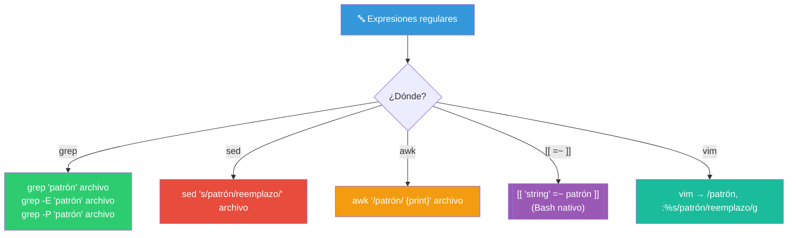
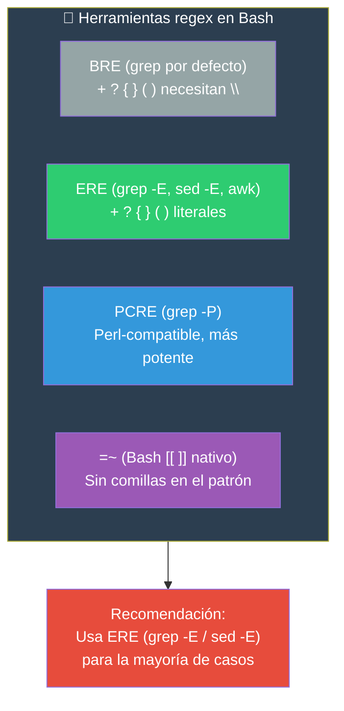

# Expresiones regulares

Las expresiones regulares (regex) son patrones para buscar y manipular texto. Bash soporta regex principalmente a través de `grep`, `sed`, `awk` y el operador `=~` en `[[ ]]`.

## ¿Dónde se usan regex en Bash?



---

## Sintaxis básica regex

### Metacaracteres fundamentales

```bash
.       # Cualquier carácter (uno)
^       # Inicio de línea
$       # Fin de línea
*       # Cero o más del carácter anterior
+       # Una o más del carácter anterior (ERE)
?       # Cero o una del carácter anterior (ERE)
|       # OR (alternancia)
[]      # Conjunto de caracteres
[^]     # Negación de conjunto
()      # Grupo de captura
\       # Escape
```

### Ejemplos básicos

```bash
# . (cualquier carácter)
grep "h.la" texto.txt          # hola, hila, hula...

# ^ (inicio de línea)
grep "^Error" log.txt          # Líneas que empiezan con "Error"

# $ (fin de línea)
grep "\.$" texto.txt           # Líneas que terminan con punto

# * (cero o más)
grep "ho*la" texto.txt         # hla, hola, hoola, hoooola...

# [] (conjunto)
grep "[Hh]ola" texto.txt       # Hola u hola
grep "[0-9]" texto.txt         # Cualquier dígito
grep "[a-zA-Z]" texto.txt      # Cualquier letra
grep "[^0-9]" texto.txt        # Cualquier carácter que NO sea dígito
```

### Clases de caracteres POSIX

```bash
[[:alnum:]]    # Alfanumérico [a-zA-Z0-9]
[[:alpha:]]    # Letras [a-zA-Z]
[[:digit:]]    # Dígitos [0-9]
[[:lower:]]    # Minúsculas [a-z]
[[:upper:]]    # Mayúsculas [A-Z]
[[:space:]]    # Espacios [ \t\n\r\f\v]
[[:blank:]]    # Espacio y tabulador [ \t]
[[:punct:]]    # Signos de puntuación
[[:print:]]    # Caracteres imprimibles
[[:graph:]]    # Caracteres imprimibles y visibles (no espacios)
```

```bash
# Ejemplos
grep "[[:upper:]]" texto.txt       # Líneas con mayúsculas
grep "[[:digit:]]" texto.txt       # Líneas con dígitos
grep "^[[:space:]]*#" archivo      # Líneas comentadas (con espacios opcionales)
```

---

## Regex básico vs extendido

### BRE (Basic Regular Expression) — `grep` por defecto

```bash
# Sin -E: BRE (básico)
# Algunos metacaracteres necesitan escape:
grep "a\+b" archivo      # + escapado para "una o más"
grep "a\{3\}" archivo    # { } escapado para "exactamente 3"
grep "\(ab\)\+" archivo  # ( ) escapado para grupos
```

### ERE (Extended Regular Expression) — `grep -E`

```bash
# Con -E: ERE (extendido)
# Los metacaracteres no necesitan escape:
grep -E "a+b" archivo        # + es literal
grep -E "a{3}" archivo       # { } literales
grep -E "(ab)+" archivo      # ( ) literales
grep -E "error|fail|crit" archivo  # | OR literal
```

### Tabla comparativa

| Metacaracter | BRE (`grep`) | ERE (`grep -E`) |
|-------------|--------------|-----------------|
| `+` (1 o más) | `\+` | `+` |
| `?` (0 o 1) | `\?` | `?` |
| `{n,m}` (cuantificador) | `\{n,m\}` | `{n,m}` |
| `( )` (grupo) | `\( \)` | `( )` |
| `\|` (alternancia) | `\|` | `\|` (literal) |
| `\1` (backreference) | `\1` | `\1` |

### Cuantificadores

```bash
*       # Cero o más: a*  → "", a, aa, aaa...
+       # Una o más: a+  → a, aa, aaa... (ERE)
?       # Cero o una: a?  → "", a (ERE)
{n}     # Exactamente n: a{3} → aaa
{n,}    # n o más: a{2,} → aa, aaa...
{n,m}   # Entre n y m: a{2,4} → aa, aaa, aaaa
```

---

## Regex en `[[ =~ ]]` (Bash nativo)

Bash soporta regex nativamente con el operador `=~` dentro de `[[ ]]`.

```bash
# Sintaxis
[[ "$texto" =~ ^patrón$ ]]
```

### Ejemplos

```bash
# Validar email
email="usuario@ejemplo.com"
if [[ "$email" =~ ^[a-z0-9._%+-]+@[a-z0-9.-]+\.[a-z]{2,}$ ]]; then
    echo "Email válido"
fi

# Validar IP
ip="192.168.1.1"
if [[ "$ip" =~ ^[0-9]{1,3}\.[0-9]{1,3}\.[0-9]{1,3}\.[0-9]{1,3}$ ]]; then
    echo "IP válida"
fi

# Validar solo números
entrada="123"
if [[ "$entrada" =~ ^[0-9]+$ ]]; then
    echo "Solo dígitos"
fi

# Validar número con decimales
precio="19.99"
if [[ "$precio" =~ ^[0-9]+(\.[0-9]{1,2})?$ ]]; then
    echo "Precio válido"
fi

# Validar UUID
uuid="550e8400-e29b-41d4-a716-446655440000"
if [[ "$uuid" =~ ^[0-9a-f]{8}-[0-9a-f]{4}-[0-9a-f]{4}-[0-9a-f]{4}-[0-9a-f]{12}$ ]]; then
    echo "UUID válido"
fi
```

### Grupos de captura con `=~`

```bash
[[ "$texto" =~ ^([a-z]+)\.([a-z]{3})$ ]]

# BASH_REMATCH[0] = todo el match
# BASH_REMATCH[1] = primer grupo
# BASH_REMATCH[2] = segundo grupo
# ...etc
```

```bash
# Extraer componentes de un email
email="usuario@ejemplo.com"
if [[ "$email" =~ ^([a-z0-9._%+-]+)@([a-z0-9.-]+)\.([a-z]{2,})$ ]]; then
    echo "Usuario: ${BASH_REMATCH[1]}"
    echo "Dominio: ${BASH_REMATCH[2]}"
    echo "TLD:    ${BASH_REMATCH[3]}"
fi

# Extraer número y texto de "Error 42: algo falló"
mensaje="Error 42: algo falló"
if [[ "$mensaje" =~ ^Error\ ([0-9]+):\ (.+)$ ]]; then
    codigo="${BASH_REMATCH[1]}"
    descripcion="${BASH_REMATCH[2]}"
    echo "Código: $codigo, Descripción: $descripcion"
fi
```

### ⚠️ Nota importante

```bash
# ❌ NO usar comillas en el patrón de =~
# Las comillas hacen que el patrón sea tratado como literal
[[ "$texto" =~ "^[0-9]+$" ]]    # ❌ Busca literal "^[0-9]+$"

# ✅ Sin comillas
[[ "$texto" =~ ^[0-9]+$ ]]      # ✅ Patrón regex

# Si el patrón está en una variable, tampoco se cita
patron="^[0-9]+$"
[[ "$texto" =~ $patron ]]        # ✅ Variable sin comillas
```

### Función de validación con regex

```bash
#!/bin/bash

validar() {
    local valor="$1"
    local patron="$2"
    local nombre="${3:-Valor}"

    if [[ "$valor" =~ $patron ]]; then
        echo "✅ $nombre válido: $valor"
        return 0
    else
        echo "❌ $nombre inválido: $valor" >&2
        return 1
    fi
}

# Uso
email_regex='^[a-z0-9._%+-]+@[a-z0-9.-]+\.[a-z]{2,}$'
ip_regex='^[0-9]{1,3}\.[0-9]{1,3}\.[0-9]{1,3}\.[0-9]{1,3}$'
fecha_regex='^[0-9]{4}-[0-9]{2}-[0-9]{2}$'

validar "user@example.com" "$email_regex"   "Email"
validar "192.168.1.1" "$ip_regex"           "IP"
validar "2026-05-30" "$fecha_regex"         "Fecha"
```

---

## Regex en `grep` / `sed` / `awk`

### `grep`

```bash
# BRE (básico) — por defecto
grep "^Error" log.txt
grep "[0-9]\{3\}" archivo    # {3} escapado

# ERE (extendido) — con -E
grep -E "^Error|^Fatal" log.txt
grep -E "[0-9]{3}" archivo
grep -E "https?://" urls.txt  # http:// o https://

# Perl-compatible — con -P (si está disponible)
grep -P "\d{3}-\d{3}-\d{4}" telefonos.txt   # 123-456-7890

# Con contexto y opciones
grep -Po '"id": "\K[^"]+' datos.json        # Extrae valores de id
grep -oP '[\w.+-]+@[\w-]+\.[\w.]+' emails.txt  # Extrae emails
```

### `sed`

```bash
# BRE por defecto (necesita escapes)
sed 's/\(error\)/\1 CRITICO/' archivo   # Grupo \1
sed 's/[0-9]\{3\}/***/' archivo         # {3} escapado
sed -E 's/(error)/\1 CRITICO/' archivo  # ERE sin escapes

# Ejemplos prácticos
sed -E 's/^[[:space:]]+//' archivo               # Trim inicio
sed -E 's/[[:space:]]+$//' archivo               # Trim final
sed -E 's/^[[:space:]]+|[[:space:]]+$//g' archivo  # Trim ambos
sed -E 's/[0-9]{4}-[0-9]{2}-[0-9]{2}//' archivo    # Eliminar fecha ISO
sed -E 's/Usuario: ([a-z]+)/Usuario: \1 (validado)/' archivo  # Reemplazo con grupo
```

### `awk`

```bash
# Match en una línea
awk '/^Error/' log.txt
awk '/[0-9]{3}/' archivo

# Match en un campo específico
awk -F: '$1 ~ /^a[a-z]+$/' /etc/passwd    # Usuarios que empiezan con a
awk '$3 ~ /^[0-9]+$/ {print $1, $3}' datos.txt   # Campo 3 solo numérico

# Extraer con match()
awk 'match($0, /[0-9]+\.[0-9]+\.[0-9]+\.[0-9]+/) {print substr($0, RSTART, RLENGTH)}' archivo
```

---

## Ejemplos de patrones comunes

```bash
# === Generales ===

# Email
^[a-z0-9._%+-]+@[a-z0-9.-]+\.[a-z]{2,}$

# URL
^https?://[a-z0-9.-]+(/[a-z0-9./_-]*)?$

# IP v4 (básica)
^[0-9]{1,3}\.[0-9]{1,3}\.[0-9]{1,3}\.[0-9]{1,3}$

# IP v4 (estricta — cada octeto 0-255)
^((25[0-5]|2[0-4][0-9]|1[0-9]{2}|[1-9]?[0-9])\.){3}(25[0-5]|2[0-4][0-9]|1[0-9]{2}|[1-9]?[0-9])$

# Fecha ISO
^[0-9]{4}-[0-9]{2}-[0-9]{2}$

# Hora
^[0-9]{2}:[0-9]{2}:[0-9]{2}$

# Teléfono (formato gringo)
^[0-9]{3}-[0-9]{3}-[0-9]{4}$

# === Programación ===

# Identificador válido (letras, dígitos, _)
^[a-zA-Z_][a-zA-Z0-9_]*$

# Versión semántica
^[0-9]+\.[0-9]+\.[0-9]+(-[a-z0-9.]+)?$

# UUID
^[0-9a-f]{8}-[0-9a-f]{4}-[0-9a-f]{4}-[0-9a-f]{4}-[0-9a-f]{12}$

# === Archivos ===

# Extensión .txt o .md
\.(txt|md)$

# Ruta UNIX (absoluta)
^(/[a-zA-Z0-9._-]+)+/?$

# Nombre de archivo seguro
^[a-zA-Z0-9._-]+$

# === Logs ===

# Línea con timestamp ISO
^[0-9]{4}-[0-9]{2}-[0-9]{2}T[0-9]{2}:[0-9]{2}:[0-9]{2}

# Error codes (E123)
[Ee]ror\s+#?[0-9]+
```

---

## Tabla resumen



> **🎯 Resumen**: ERE (`grep -E`, `sed -E`) es el punto óptimo entre potencia y portabilidad. El operador `=~` de Bash es ideal para validaciones en scripts. Los grupos de captura con `BASH_REMATCH` permiten extraer partes del texto. PCRE (`grep -P`) es más potente pero no siempre está disponible (especialmente en macOS).

## Relacionados:
- [[debugging-bash]] #anterior 
- [[administracion-de-procesos]] #siguiente 
- [[grep]] #related 
- [[awk]] #related 