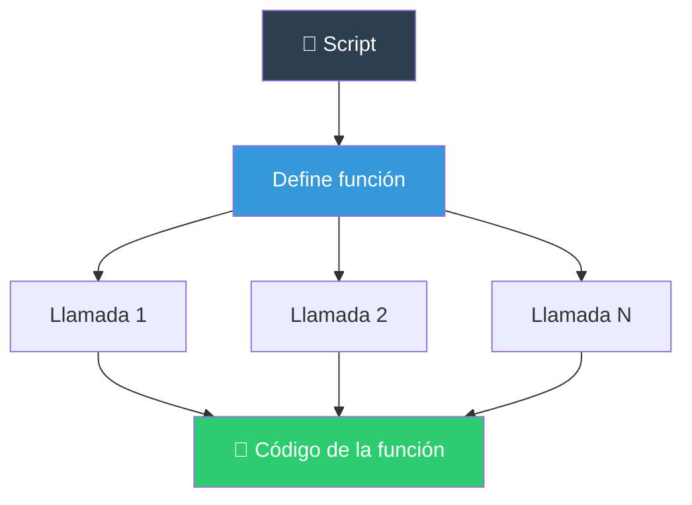
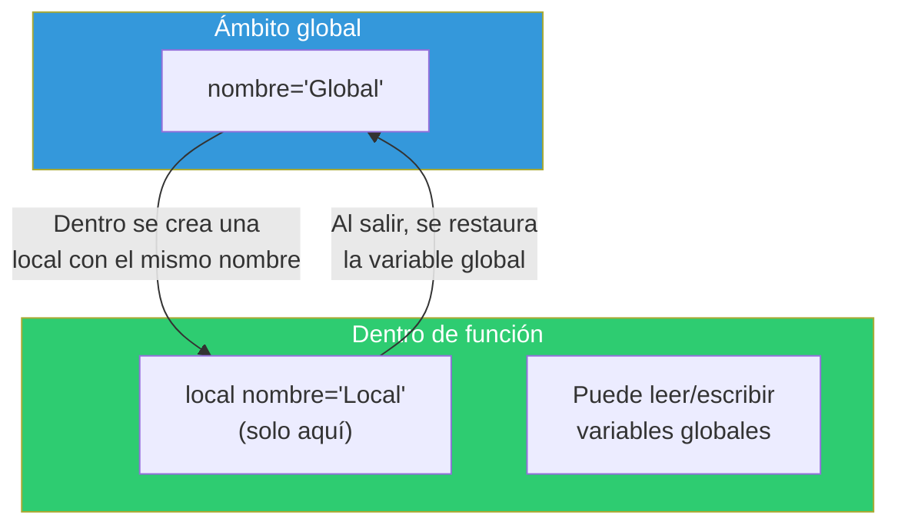

# Funciones

Las funciones permiten agrupar código reutilizable, darle un nombre y llamarlo cuando sea necesario.

## ¿Qué es una función?



### Sintaxis

```bash
# Forma 1: function nombre (recomendada)
nombre() {
    comandos...
}

# Forma 2: con palabra function
function nombre {
    comandos...
}

# Forma 3: combinación
function nombre() {
    comandos...
}
```

### Función simple

```bash
#!/bin/bash

# Definición
saludar() {
    echo "¡Hola, mundo!"
}

# Llamada
saludar     # ¡Hola, mundo!
```

### Función con argumentos

Dentro de la función, los argumentos se acceden con `$1`, `$2`, etc. (no confundir con los argumentos del script).

```bash
saludar() {
    local nombre="$1"
    local edad="${2:-0}"
    echo "Hola, $nombre. Tienes $edad años."
}

saludar "Ana" 25          # Hola, Ana. Tienes 25 años.
saludar "Luis"            # Hola, Luis. Tienes 0 años.
```

### Valor de retorno

Las funciones devuelven un **código de salida** (0 = éxito, ≠0 = error). Usa `return` para esto.

```bash
# Retornar código de salida
es_par() {
    local num=$1
    return $(( num % 2 ))
}

if es_par 4; then
    echo "Es par"     # ← Esto se ejecuta
fi

if es_par 3; then
    echo "Es par"
else
    echo "Es impar"   # ← Esto se ejecuta
fi
```

Para **devolver un valor**, usa `echo` y captura con `$()`:

```bash
sumar() {
    local a=$1 b=$2
    echo $((a + b))
}

resultado=$(sumar 5 3)
echo "La suma es: $resultado"    # La suma es: 8
```

---

## Alcance de funciones

### Variables locales vs globales

```bash
#!/bin/bash

# Variable global
nombre="Global"

mi_funcion() {
    # Variable local: solo existe dentro de la función
    local nombre="Local"
    echo "Dentro: $nombre"        # Local
}

mi_funcion
echo "Fuera: $nombre"             # Global
```



### Reglas de ámbito

```bash
# 1. Las variables son globales por defecto
funcion() {
    x=10          # ❌ Modifica la variable global 'x'
}
x=5
funcion
echo "$x"         # 10 (sobreescrita!)

# 2. Usa 'local' para evitar contaminar
funcion() {
    local x=10    # ✅ Solo existe dentro
}
x=5
funcion
echo "$x"         # 5 (intacta)

# 3. Las variables locales se heredan a sub-funciones
exterior() {
    local x=10
    interior() {
        echo "x = $x"    # 10 (hereda de exterior)
    }
    interior
}
exterior

# 4. declare dentro de función también necesita local
funcion() {
    declare -i y=5        # ❌ Global (sin 'local')
    local -i z=5          # ✅ Local
}

# 5. Arrays y local
funcion() {
    local -a arr=("a" "b")     # Array local
    local -A dict=([k]="v")    # Array asociativo local
}
```

### Variables especiales dentro de funciones

```bash
funcion() {
    echo "Nombre de la función: ${FUNCNAME[0]}"
    echo "Número de args: $#"
    echo "Arg 1: $1"

    # FUNCNAME es un array con la pila de llamadas
    # ${FUNCNAME[0]} = esta función
    # ${FUNCNAME[1]} = quien llamó
    # ${FUNCNAME[2]} = quien llamó al que llamó
}

funcion "argumento"
```

---

## Funciones recursivas

Bash soporta recursión (una función que se llama a sí misma).

### Factorial

```bash
factorial() {
    local n=$1

    if (( n <= 1 )); then
        echo 1
    else
        local prev=$(factorial $((n - 1)))
        echo $((n * prev))
    fi
}

echo $(factorial 5)    # 120
echo $(factorial 10)   # 3628800
```

### Fibonacci

```bash
fibonacci() {
    local n=$1
    if (( n <= 1 )); then
        echo "$n"
    else
        local a=$(fibonacci $((n - 1)))
        local b=$(fibonacci $((n - 2)))
        echo $((a + b))
    fi
}

for i in {0..10}; do
    echo -n "$(fibonacci $i) "
done
echo
# 0 1 1 2 3 5 8 13 21 34 55
```

### Recorrer directorios recursivamente

```bash
listar_dir() {
    local dir="$1"
    local indent="${2:-}"

    for item in "$dir"/*; do
        if [[ -d "$item" ]]; then
            echo "${indent}📁 $(basename "$item")/"
            listar_dir "$item" "  $indent"
        else
            echo "${indent}📄 $(basename "$item")"
        fi
    done
}

listar_dir "/home/usuario/documentos"
```

### ⚠️ Límite de recursión

```bash
# Bash tiene un límite de recursión (generalmente 1000+ llamadas)
# Puedes verificarlo:
funcion() {
    (( i++ ))
    funcion
}

i=0
funcion 2>/dev/null || echo "Máxima recursión: $i"
```

---

## Funciones como comandos

### Exportar funciones

Las funciones se pueden exportar a sub-shells (Bash 4+):

```bash
# Exportar función (disponible en sub-procesos)
mi_funcion() {
    echo "Ejecutando en subshell: $BASH_SUBSHELL"
}
export -f mi_funcion

bash -c 'mi_funcion'    # Funciona porque está exportada
```

### Funciones en archivos separados

Puedes organizar funciones en archivos y cargarlos:

```bash
# ~/lib/mis_funciones.sh
log() { echo "[$(date +%H:%M:%S)] $*"; }
error() { echo "[ERROR] $*" >&2; }

# En ~/.bashrc o en un script
source ~/lib/mis_funciones.sh

log "Iniciando proceso"   # [14:30:00] Iniciando proceso
```

### Hook de funciones

Bash permite ejecutar funciones automáticamente en ciertos eventos:

```bash
# DEBUG: se ejecuta antes de cada comando
trap 'echo "DEBUG: Ejecutando: $BASH_COMMAND"' DEBUG

# RETURN: se ejecuta cuando una función termina
trap 'echo "Saliendo de función"' RETURN

# ERR: se ejecuta cuando un comando falla (con set -e)
trap 'echo "Error en línea $LINENO"' ERR
```

---

## Buenas prácticas

```bash
# ✅ Nombres descriptivos en snake_case
calcular_promedio() { ... }
validar_email() { ... }
leer_configuracion() { ... }

# ✅ Un solo propósito
# ❌ crear_usuario_y_enviar_email() { ... }
# ✅ crear_usuario() { ... }
# ✅ enviar_email() { ... }

# ✅ Documentación básica
# Suma dos números y devuelve el resultado
# Uso: resultado=$(sumar a b)
sumar() {
    local a=$1 b=$2
    echo $((a + b))
}

# ✅ Validar argumentos al inicio
procesar_archivo() {
    local archivo="$1"
    if [[ -z "$archivo" ]]; then
        echo "Error: archivo requerido" >&2
        return 1
    fi
    if [[ ! -f "$archivo" ]]; then
        echo "Error: $archivo no existe" >&2
        return 2
    fi
    # Lógica principal...
}

# ✅ Valores por defecto
configurar() {
    local host="${1:-localhost}"
    local puerto="${2:-8080}"
    echo "Conectando a $host:$puerto"
}
```

### Cuándo usar función vs script

| Característica | Función | Script separado |
|---------------|---------|-----------------|
| Definición | En el mismo archivo | Archivo aparte |
| Llamada | `nombre` | `./nombre.sh` |
| Variables | Comparte ámbito (si no es local) | Nuevo proceso |
| Velocidad | Rápida (builtin) | Lenta (fork+exec) |
| Reutilización | Solo dentro del script | En cualquier script |
| `exit` | Cierra TODO el shell | Solo mata el script |

### Plantilla de función robusta

```bash
# ============================================
# Función: procesar_archivo
# Descripción: Procesa un archivo de entrada
# Argumentos:
#   $1 - Ruta al archivo (obligatorio)
#   $2 - Opciones de procesamiento (opcional)
# Retorna:
#   0 - Éxito
#   1 - Error de argumento
#   2 - Archivo no encontrado
# ============================================
procesar_archivo() {
    local archivo="${1:?Falta archivo}"
    local opciones="${2:-}"

    if [[ ! -f "$archivo" ]]; then
        echo "Error: archivo '$archivo' no existe" >&2
        return 2
    fi

    # Lógica del procesamiento
    echo "Procesando: $archivo"
    [[ -n "$opciones" ]] && echo "Opciones: $opciones"

    return 0
}
```

---

## Script de ejemplo

```bash
#!/bin/bash
# ============================================
# Script: gestor.sh
# Descripción: Funciones de gestión de archivos
# ============================================

set -euo pipefail

# --- Funciones de logging ---
log() {
    local nivel="${1:-INFO}"
    shift
    echo "[$(date '+%H:%M:%S')] [$nivel] $*"
}

info()  { log "INFO" "$@"; }
warn()  { log "WARN" "$@" >&2; }
error() { log "ERROR" "$@" >&2; }

# --- Funciones de archivos ---
backup() {
    local archivo="${1:?Archivo requerido}"
    if [[ ! -f "$archivo" ]]; then
        error "Archivo no existe: $archivo"
        return 1
    fi
    local backup="${archivo}.bak.$(date +%Y%m%d)"
    cp "$archivo" "$backup"
    info "Backup creado: $backup"
}

sanear_nombre() {
    local nombre="$1"
    nombre="${nombre// /_}"
    nombre="${nombre//[^a-zA-Z0-9._-]/}"
    echo "${nombre,,}"
}

# --- Menú interactivo ---
mostrar_menu() {
    echo "1) Hacer backup de archivo"
    echo "2) Sanear nombre de archivo"
    echo "3) Salir"
}

while true; do
    mostrar_menu
    read -p "Selecciona: " opcion
    case $opcion in
        1)
            read -p "Archivo: " archivo
            backup "$archivo"
            ;;
        2)
            read -p "Nombre feo: " nombre
            echo "Nombre saneado: $(sanear_nombre "$nombre")"
            ;;
        3)
            info "Adiós"
            break
            ;;
        *)
            error "Opción inválida"
            ;;
    esac
    echo
done
```

> **🎯 Resumen**: Las funciones organizan el código, evitan repetición y permiten reutilizar lógica. Usa `local` para no contaminar variables globales. `return` para códigos de error, `echo` para devolver valores, `$()` para capturarlos. Las funciones exportadas con `export -f` pueden usarse en subprocesos. La recursión es posible pero con límite.

## Relacionados:
- [[bucles-bash]] #anterior 
- [[manejo-de-errores-bash]] #siguiente 