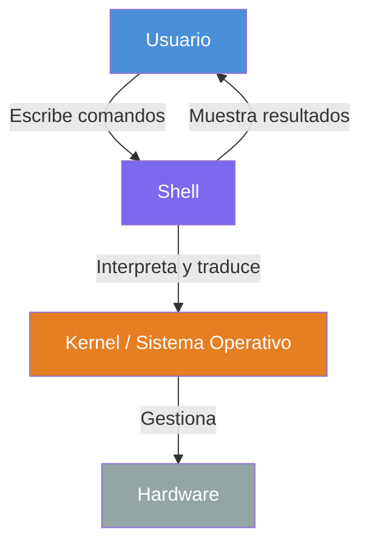
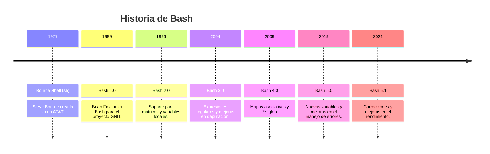
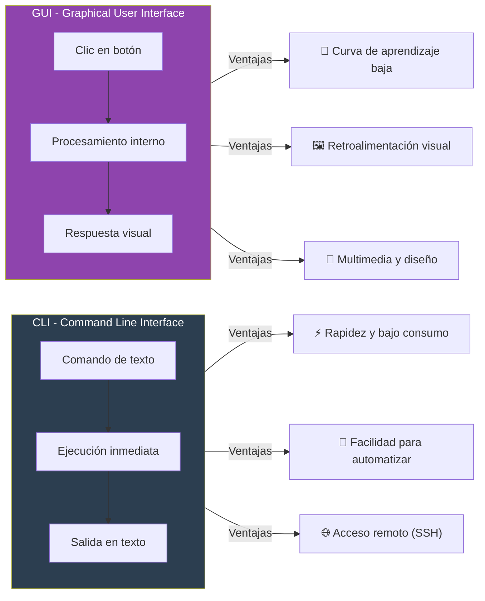
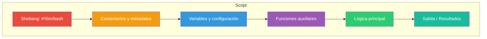
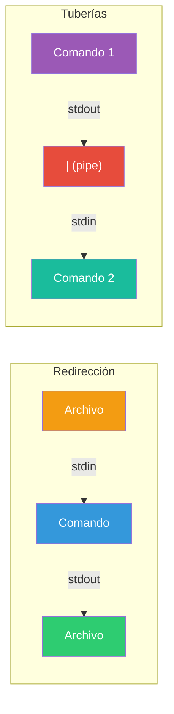
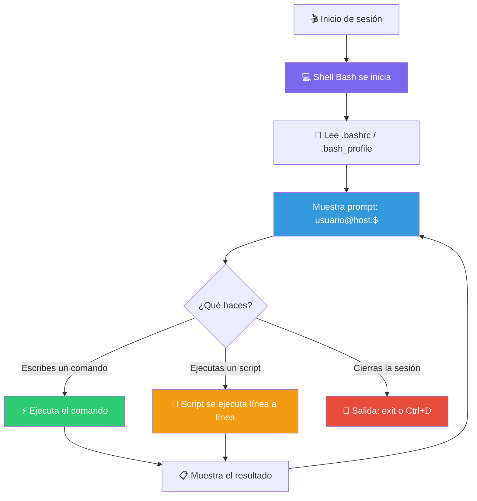

# Introducción a Shell y Bash

## ¿Qué es una Shell?

La **shell** es un programa que actúa como intérprete entre el usuario y el sistema operativo. Recibe comandos, los interpreta y se comunica con el **kernel** (núcleo del SO) para ejecutarlos.



Existen muchas shells. Las más conocidas son:

| Shell | Nombre completo | Característica principal |
|-------|-----------------|--------------------------|
| **bash** | Bourne Again Shell | La más usada en Linux. Estándar de facto. |
| **sh** | Bourne Shell | La original. Minimalista. |
| **zsh** | Z Shell | Bash con mejoras interactivas. |
| **fish** | Friendly Interactive Shell | Autosugerencias y colores por defecto. |
| **powershell** | PowerShell | Shell de Microsoft, orientada a objetos. |

---

## ¿Qué es Bash?

**Bash** (_Bourne Again Shell_) fue creada por **Brian Fox** en 1989 como reemplazo libre de la shell Bourne (sh). Es la shell predeterminada en la mayoría de distribuciones Linux y en macOS.



### Características principales de Bash

- **Historial de comandos** (`history`)
- **Autocompletado** con TAB
- **Alias** para acortar comandos
- **Redirección** de entrada/salida (`>`, `<`, `|`)
- **Expansión de variables** y **globbing** (`*.txt`)
- **Programabilidad**: scripts con condicionales, bucles y funciones

### Cómo saber qué shell estás usando

```bash
echo $SHELL      # Ruta de la shell por defecto
echo $0          # Nombre de la shell actual
ps -p $$         # Proceso de la shell actual
```

---

## CLI vs GUI



| Aspecto | CLI | GUI |
|---------|-----|-----|
| **Entrada** | Comandos de texto | Clics, gestos, teclas |
| **Salida** | Texto estructurado | Gráficos, ventanas, iconos |
| **Velocidad** | Alta (sin sobrecarga gráfica) | Media (requiere renderizado) |
| **Automatización** | **Excelente** (scripts, pipes) | Limitada (grabación de macros) |
| **Acceso remoto** | Nativo (SSH, sin ancho de banda extra) | Pesado (VNC, RDP) |
| **Curva de aprendizaje** | Empinada al inicio | Suave |
| **Uso ideal** | Servidores, automatización, desarrollo | Usuarios finales, diseño, multimedia |

### ¿Cuándo usar cada una?

**Usa CLI cuando:**
- Necesites automatizar tareas repetitivas
- Administres servidores remotos
- Proceses grandes volúmenes de datos
- Quieras mayor control y precisión

**Usa GUI cuando:**
- Estés empezando
- Necesites editar imágenes, video o diseño
- Prefieras explorar visualmente
- La tarea sea puntual y no repetitiva

---

## ¿Qué es Scripting?

**Scripting** es la práctica de escribir secuencias de comandos en un archivo (llamado _script_) para que la shell los ejecute de forma automática, sin intervención manual paso a paso.


### Ejemplo de un script básico

Crea un archivo llamado `hola.sh`:

```bash
#!/bin/bash
# Este es mi primer script

nombre="Mundo"
echo "¡Hola, $nombre!"

fecha=$(date +%d/%m/%Y)
echo "Hoy es $fecha"
```

Para ejecutarlo:

```bash
chmod +x hola.sh    # Dar permiso de ejecución
./hola.sh           # Ejecutar el script
```

**Salida:**
```
¡Hola, Mundo!
Hoy es 30/05/2026
```

### Estructura típica de un script



### Componentes del shebang (`#!/bin/bash`)

El **shebang** es la primera línea de un script. Indica al sistema qué intérprete debe usar:

```bash
#!/bin/bash      # Usa Bash
#!/bin/sh        # Usa Bourne Shell
#!/usr/bin/python3  # Usa Python 3
#!/usr/bin/env node  # Usa Node.js (buscando en PATH)
```

### Buenas prácticas de scripting

1. **Siempre incluye el shebang** como primera línea.
2. **Usa nombres descriptivos** para variables y funciones.
3. **Comenta el código** para explicar la lógica.
4. **Maneja errores** con `set -e` o verificando códigos de salida.
5. **Sangría consistente** (2 espacios es lo habitual).
6. **Prefiere `$(comando)`** sobre las comillas invertidas `` `comando` ``.

---

## Redirección y Tuberías (Pipes)

Uno de los conceptos más poderosos de la shell es poder redirigir la entrada y salida de los comandos.



| Símbolo | Nombre | Función | Ejemplo |
|---------|--------|---------|---------|
| `>` | Redirección de salida | Guarda stdout en archivo (sobrescribe) | `ls > archivos.txt` |
| `>>` | Redirección append | Añade stdout al final del archivo | `echo "nuevo" >> log.txt` |
| `<` | Redirección de entrada | Usa archivo como stdin | `sort < datos.txt` |
| `2>` | Redirección de errores | Guarda stderr en archivo | `comando 2> error.log` |
| `2>&1` | Fusión de streams | Une stderr con stdout | `comando > salida.txt 2>&1` |
| `\|` | Pipe / Tubería | Pasa stdout de un comando a otro | `ls -l \| grep ".txt"` |

### Ejemplos prácticos de pipes

```bash
# Listar archivos y filtrar por extensión
ls -l | grep ".md"

# Contar procesos del sistema
ps aux | wc -l

# Buscar una palabra en un archivo y contar ocurrencias
grep "error" log.txt | wc -l

# Encadenar múltiples pipes
cat datos.csv | cut -d',' -f1 | sort | uniq -c | sort -rn
```

---

## Variables en Bash

Las variables en Bash se asignan sin espacios alrededor del `=` y se accede con `$`:

```bash
nombre="Ana"              # Asignación
echo $nombre               # Acceso: Ana
echo "Hola, ${nombre}!"    # Con llaves (recomendado)

# Variables especiales
echo $HOME                 # Directorio personal
echo $PATH                 # Rutas de búsqueda de ejecutables
echo $USER                 # Usuario actual
echo $PWD                  # Directorio actual
echo $?                    # Código de salida del último comando
```

| Tipo | Sintaxis | Ejemplo |
|------|----------|---------|
| Variable simple | `var=valor` | `nombre="Ana"` |
| Variable de entorno | `export var=valor` | `export PATH=$PATH:/nuevo` |
| Variable readonly | `readonly var=valor` | `readonly PI=3.1416` |
| Capturar salida | `var=$(comando)` | `fecha=$(date)` |
| Variable por defecto | `${var:-default}` | `echo ${nombre:-Invitado}` |

---

## Comandos básicos de navegación

```bash
pwd              # Muestra el directorio actual
ls               # Lista archivos y carpetas
ls -la           # Lista detallado incluyendo ocultos
cd directorio    # Cambia al directorio especificado
cd ..            # Sube un nivel
cd ~             # Va al directorio personal
mkdir carpeta    # Crea una carpeta
rm archivo       # Elimina un archivo
rm -rf carpeta   # Elimina carpeta y su contenido
cp origen destino     # Copia archivos
mv origen destino     # Mueve o renombra
cat archivo      # Muestra contenido de un archivo
less archivo     # Muestra contenido con paginación
```

---

## Resumen visual del flujo de trabajo en Bash



---

## Para aprender más

```bash
man bash         # Manual completo de Bash (presiona q para salir)
help             # Ayuda integrada para comandos internos
help set         # Ayuda sobre opciones de la shell
type comando     # Muestra el tipo de un comando
which comando    # Muestra la ruta de un ejecutable
```

---

> **Recuerda**: La shell es tu aliada. Al principio puede parecer críptica, pero con la práctica se vuelve la herramienta más poderosa de un desarrollador. **¡Automátiza todo lo que hagas más de una vez!** 🚀

## Relacionados:
- [[shells-populares]] #siguiente 
- [[web-comandos-linux]] #related 
- [[fundamentos-del-shell-en-linux]] #related 