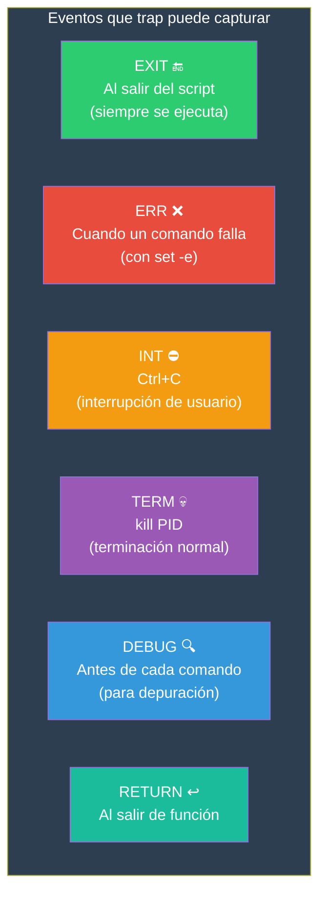

# Manejo de errores

Los scripts de Bash pueden fallar de muchas formas. Un buen manejo de errores detecta problemas temprano, da mensajes claros y limpia los recursos antes de salir.

## Estrategia de manejo de errores


---

## `set -e` — Exit on error

`set -e` hace que el script termine inmediatamente cuando un comando devuelve un código de salida distinto de cero.

```bash
#!/bin/bash
set -e

echo "Esto se ejecuta"
comando_que_no_existe   # ← El script termina aquí
echo "Esto NO se ejecuta"
```

### Excepciones

`set -e` **no** detiene el script en estos casos:

```bash
# 1. En condiciones de if/while/until
if comando_que_falla; then    # No detiene
    echo "OK"
fi

while comando_que_falla; do   # No detiene
    break
done

# 2. En cortocircuito || (después de &&)
comando_que_falla && true     # Detiene (&&)
comando_que_falla || true     # No detiene (||)

# 3. En el último comando de una función o script
funcion() {
    false     # No detiene si es el último comando de la función
}
```

### `set +e` / `set -e` dinámico

```bash
#!/bin/bash
set -e

# Comandos que DEBEN tener éxito
echo "Paso crítico 1..."
comando_seguro

# Comando que PUEDE fallar
set +e
comando_riesgoso
codigo=$?
set -e

if [[ $codigo -ne 0 ]]; then
    echo "⚠️  El comando riesgoso falló con código $codigo, pero continuamos"
fi

echo "Paso crítico 2..."
otro_comando_seguro
```

---

## `set -o pipefail` — Error en pipelines

Sin `pipefail`, solo el último comando del pipeline determina el código de salida.

```bash
# Sin pipefail: solo importa el último
set +o pipefail
false | true
echo $?     # 0 (solo ve el true, ignora false)

# Con pipefail: cualquier fallo en el pipeline
set -o pipefail
false | true
echo $?     # 1 (el false falló)
```

### Pipefail en acción

```bash
#!/bin/bash
set -e -o pipefail

# ❌ Sin pipefail, este error pasaría desapercibido:
# grep lanza error si no encuentra el patrón, pero head devuelve 0
grep "inexistente" archivo.txt 2>/dev/null | head -n 5
# → Con pipefail: el script se detiene porque grep falló
# → Sin pipefail: head devuelve 0, el script continúa
```

---

## `set -u` — Error en variables indefinidas

`set -u` hace que el script termine si se usa una variable que no está definida.

```bash
#!/bin/bash
set -u

echo "El usuario es: $USUARIO"   # ← Error: variable no definida
# script: línea X: USUARIO: unbound variable
```

### Valores por defecto con `set -u`

```bash
#!/bin/bash
set -u

# ✅ Con valor por defecto (no genera error)
nombre="${1:-Invitado}"

# ❌ Sin valor por defecto (error si no hay argumento)
nombre="$1"

# ✅ Asignación condicional segura
if [[ -z "${MI_VAR:-}" ]]; then
    MI_VAR="default"
fi

# ⚠️ En arrays, hay que inicializar primero
declare -a FRUTAS=()
echo "${FRUTAS[@]}"    # OK
```

---

## `trap` — Capturar señales y eventos

`trap` ejecuta comandos cuando ocurre un evento (señal, error, salida).

### Sintaxis

```bash
trap 'comandos' EVENTO
trap 'comandos' SEÑAL
```

### Eventos útiles

```bash
trap 'comandos' EXIT      # Al salir del script (siempre)
trap 'comandos' ERR       # Cuando un comando falla (con set -e)
trap 'comandos' DEBUG     # Antes de cada comando
trap 'comandos' RETURN    # Al salir de una función
trap 'comandos' INT       # Ctrl+C
trap 'comandos' TERM      # kill PID
```

### Cleanup básico

```bash
#!/bin/bash
set -euo pipefail

TEMP_DIR=$(mktemp -d)

cleanup() {
    echo "🧹 Limpiando..."
    rm -rf "$TEMP_DIR"
    echo "Adiós"
}

trap cleanup EXIT    # Siempre se ejecuta al salir

# Lógica del script
echo "Usando $TEMP_DIR"
# ... si algo falla acá, cleanup se ejecuta igual
```

### Múltiples traps

```bash
#!/bin/bash

cleanup() {
    echo "Limpiando..."
    rm -f /tmp/mi_archivo_temporal
}

ctrl_c() {
    echo "Interrumpido por usuario"
    exit 130
}

error_handler() {
    local linea=$1
    local comando=$2
    echo "Error en línea $linea: $comando" >&2
}

trap cleanup EXIT
trap ctrl_c INT
trap 'error_handler $LINENO $BASH_COMMAND' ERR
```

### Trap con argumentos

```bash
trap_handler() {
    local signal=$1
    local line=$2
    echo "Recibida señal $signal en línea $line"
}

trap 'trap_handler SIGINT $LINENO' INT
trap 'trap_handler SIGTERM $LINENO' TERM
trap 'trap_handler EXIT $LINENO' EXIT
```

### Ignorar señales

```bash
# Ignorar Ctrl+C
trap '' INT

# Restaurar comportamiento por defecto
trap - INT
```

### Mapa de señales y traps



---

## Error logging

### Funciones de logging

```bash
#!/bin/bash

# Niveles de log
LOG_LEVEL="${LOG_LEVEL:-INFO}"
LOG_FILE="${LOG_FILE:-/tmp/script.log}"

log() {
    local nivel="$1"
    shift
    local mensaje="$*"
    local timestamp=$(date '+%Y-%m-%d %H:%M:%S')

    # Niveles: DEBUG < INFO < WARN < ERROR
    case "$nivel" in
        DEBUG) [[ "$LOG_LEVEL" =~ ^(DEBUG)$ ]] || return ;;
        INFO)  [[ "$LOG_LEVEL" =~ ^(DEBUG|INFO)$ ]] || return ;;
        WARN)  [[ "$LOG_LEVEL" =~ ^(DEBUG|INFO|WARN)$ ]] || return ;;
        ERROR) : ;;  # Siempre se muestra
    esac

    # A pantalla
    case "$nivel" in
        ERROR) echo -e "\033[0;31m[$timestamp] [$nivel] $mensaje\033[0m" >&2 ;;
        WARN)  echo -e "\033[0;33m[$timestamp] [$nivel] $mensaje\033[0m" >&2 ;;
        INFO)  echo -e "\033[0;32m[$timestamp] [$nivel] $mensaje\033[0m" ;;
        DEBUG) echo -e "\033[0;90m[$timestamp] [$nivel] $mensaje\033[0m" ;;
    esac

    # A archivo
    echo "[$timestamp] [$nivel] $mensaje" >> "$LOG_FILE"
}

# Wrappers
debug() { log "DEBUG" "$@"; }
info()  { log "INFO" "$@"; }
warn()  { log "WARN" "$@"; }
error() { log "ERROR" "$@"; }
```

### Error handling completo

```bash
#!/bin/bash
# ============================================
# Script: procesar.sh
# Descripción: Ejemplo completo de manejo de errores
# ============================================

set -euo pipefail

# --- Configuración de errores ---
LOG_FILE="/tmp/procesar.log"
ERROR_COUNT=0

# --- Funciones de logging ---
error() {
    local msg="$*"
    echo "[$(date '+%H:%M:%S')] ERROR: $msg" | tee -a "$LOG_FILE" >&2
    ((ERROR_COUNT++))
}

warn() {
    local msg="$*"
    echo "[$(date '+%H:%M:%S')] WARN: $msg" | tee -a "$LOG_FILE"
}

info() {
    local msg="$*"
    echo "[$(date '+%H:%M:%S')] INFO: $msg" >> "$LOG_FILE"
}

# --- Cleanup ---
cleanup() {
    local exit_code=$?
    echo "[$(date '+%H:%M:%S')] Script finalizado (código: $exit_code)" >> "$LOG_FILE"
    if [[ -d "$TEMP_DIR" ]]; then
        rm -rf "$TEMP_DIR"
        info "Directorio temporal eliminado: $TEMP_DIR"
    fi
}
trap cleanup EXIT

# --- Manejador de errores ---
error_handler() {
    local linea=$1
    local comando=$2
    local codigo=$3
    error "Fallo en línea $linea: '$comando' (código: $codigo)"
}
trap 'error_handler $LINENO "$BASH_COMMAND" $?' ERR

# --- Variables ---
TEMP_DIR=$(mktemp -d)
ARCHIVO="${1:-}"
ARCHIVO_SALIDA="${2:-salida.txt}"

# --- Validaciones ---
if [[ -z "$ARCHIVO" ]]; then
    error "Uso: $0 <archivo_entrada> [archivo_salida]"
    exit 2
fi

if [[ ! -f "$ARCHIVO" ]]; then
    error "Archivo no encontrado: $ARCHIVO"
    exit 2
fi

if [[ ! -r "$ARCHIVO" ]]; then
    error "Sin permiso de lectura: $ARCHIVO"
    exit 3
fi

# --- Lógica principal (con manejo de errores selectivo) ---
info "Iniciando procesamiento de $ARCHIVO"

# Comando que PUEDE fallar (no detenemos el script)
set +e
grep "patrón" "$ARCHIVO" > /tmp/grep_result.txt 2>/dev/null
grep_exit=$?
set -e

if [[ $grep_exit -eq 0 ]]; then
    info "Patrón encontrado en $ARCHIVO"
elif [[ $grep_exit -eq 1 ]]; then
    warn "Patrón no encontrado (no es necesariamente un error)"
else
    error "Error al buscar patrón en $ARCHIVO"
fi

info "Procesamiento completado"
echo "Finalizado con $ERROR_COUNT errores"
exit $ERROR_COUNT
```

---

## Resumen: modo estricto completo

```bash
#!/bin/bash
# ============================================
# Plantilla: script con manejo de errores completo
# ============================================

# === 1. Modo estricto ===
set -euo pipefail
IFS=$'\n\t'    # IFS más seguro (solo nueva línea y tab)

# === 2. Variables de configuración ===
LOG_FILE="/var/log/mi-script.log"
TEMP_DIR=""
readonly LOG_FILE

# === 3. Funciones de ayuda ===
error()   { echo "[ERROR] $*" >&2; }
warn()    { echo "[WARN] $*"; }
info()    { echo "[INFO] $*"; }
debug()   { echo "[DEBUG] $*"; }

# === 4. Cleanup ===
cleanup() {
    local exit_code=$?
    if [[ -n "$TEMP_DIR" && -d "$TEMP_DIR" ]]; then
        rm -rf "$TEMP_DIR"
    fi
    [[ $exit_code -eq 0 ]] && info "OK" || error "Falló con código $exit_code"
}
trap cleanup EXIT

# === 5. Manejador de errores (opcional) ===
err_handler() {
    error "Línea $1: '$2' (código: $3)"
}
trap 'err_handler $LINENO "$BASH_COMMAND" $?' ERR

# === 6. Validación de argumentos ===
if [[ $# -eq 0 ]]; then
    echo "Uso: $0 <argumento>" >&2
    exit 2
fi

# === 7. Lógica principal ===
TEMP_DIR=$(mktemp -d)
info "Iniciando..."
# ... lógica del script ...
info "Completado"
```

---

## Buenas prácticas

| Práctica | Explicación |
|----------|-------------|
| `set -euo pipefail` | Siempre al inicio de scripts de producción |
| `trap cleanup EXIT` | Limpia recursos aunque falle |
| Mensajes de error a stderr | `echo "error" >&2` |
| `local` en funciones | No contaminar variables globales |
| Validar argumentos al inicio | Fallar rápido con mensaje claro |
| Códigos de salida con nombre | `readonly ERROR_USO=2` |
| Logging con timestamp | Facilita diagnóstico |
| No silenciar errores a ciegas | `2>/dev/null` solo cuando sabes lo que haces |
| Usar `set +e` para comandos que pueden fallar | Desactivar/reactivar selectivamente |

> **🎯 Resumen**: `set -euo pipefail` es el escudo básico. `trap EXIT` es la red de seguridad que limpia siempre. Mensajes claros a `stderr` para errores, a `stdout` para información. Validación temprana de argumentos y archivos. Logging con timestamp para diagnóstico post-mortem.

## Relacionados:
- [[funciones-bash]] #anterior 
- [[debugging-bash]] #siguiente 