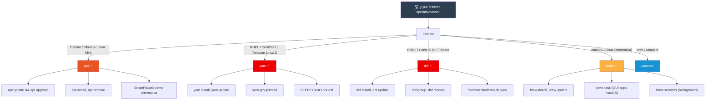
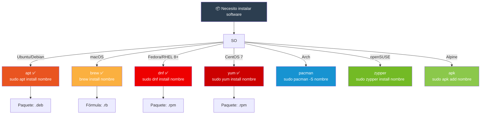

# Manejo de paquetería

Los gestores de paquetes automatizan la instalación, actualización y eliminación de software. Cada distribución Linux y macOS tiene su propio ecosistema.

## Mapa de gestores



---

## `apt` — Advanced Package Tool (Debian/Ubuntu)

Estándar en Debian, Ubuntu y derivados. Maneja paquetes `.deb`.

### Comandos esenciales

```bash
# Actualizar lista de paquetes
sudo apt update

# Actualizar todos los paquetes instalados
sudo apt upgrade

# Actualizar (incluye cambios de dependencias)
sudo apt full-upgrade

# Instalar un paquete
sudo apt install nginx
sudo apt install -y nginx          # Sin confirmación

# Reinstalar
sudo apt install --reinstall nginx

# Eliminar (deja archivos de configuración)
sudo apt remove nginx

# Eliminar completamente (incluye config)
sudo apt purge nginx

# Eliminar dependencias no necesarias
sudo apt autoremove

# Buscar paquetes
apt search servidor web
apt search ^nginx

# Información de un paquete
apt show nginx

# Listar paquetes instalados
apt list --installed
apt list --installed | grep nginx

# Ver archivos de un paquete
dpkg -L nginx

# A qué paquete pertenece un archivo
dpkg -S /etc/nginx/nginx.conf
```

### apt vs apt-get

```bash
# Antiguo (apt-get, apt-cache) vs moderno (apt)
apt-get update          → apt update
apt-get install         → apt install
apt-get remove          → apt remove
apt-cache search        → apt search
apt-cache show          → apt show

# apt unifica apt-get + apt-cache + progreso visual
```

### Snap y Flatpak

```bash
# Snap (Canonical, sandboxeado)
snap install spotify
snap list
snap remove spotify

# Flatpak (RHEL/Fedora, sandboxeado)
flatpak install flathub org.gimp.GIMP
flatpak list
flatpak uninstall org.gimp.GIMP
```

### Archivos de configuración

```bash
/etc/apt/sources.list              # Repositorios del sistema
/etc/apt/sources.list.d/           # Repositorios adicionales
```

---

## `brew` — Homebrew (macOS / Linux)

Gestor de paquetes originalmente para macOS, ahora también para Linux (Linuxbrew).

### Comandos esenciales

```bash
# Instalar
brew install git
brew install python@3.11

# Buscar
brew search python
brew search /^py/

# Información
brew info git

# Listar instalados
brew list

# Actualizar lista de fórmulas
brew update

# Actualizar todos los paquetes
brew upgrade
brew upgrade git            # Solo un paquete

# Eliminar
brew uninstall git

# Limpiar versiones viejas
brew cleanup
brew cleanup -n             # Simular (dry run)

# Ver dependencias
brew deps --tree git
brew uses --installed git   # Qué depende de git
```

### Homebrew Cask (aplicaciones GUI en macOS)

```bash
# Instalar apps GUI
brew install --cask firefox
brew install --cask visual-studio-code
brew install --cask docker

# Listar casks instalados
brew list --cask

# Actualizar casks
brew upgrade --cask
```

### Homebrew Services (servicios en segundo plano)

```bash
# Iniciar servicio (ej. MySQL, PostgreSQL)
brew services start mysql
brew services start postgresql@16

# Detener
brew services stop mysql

# Reiniciar
brew services restart mysql

# Listar servicios
brew services list
```

### Fórmulas útiles

```bash
# CLI esenciales
brew install htop
brew install tmux
brew install tree
brew install bat                # cat con colores
brew install fzf                # fuzzy finder
brew install jq                 # JSON processor
brew install ripgrep            # grep moderno
brew install fd                 # find moderno
brew install lazygit            # TUI para git
```

---

## `yum` — Yellowdog Updater Modified (RHEL/CentOS 7)

Gestor tradicional de Red Hat/CentOS 7. Maneja paquetes `.rpm`. **Deprecado** en favor de `dnf`.

### Comandos esenciales

```bash
# Instalar
sudo yum install nginx
sudo yum install -y nginx       # Sin confirmación

# Actualizar lista de paquetes
sudo yum check-update

# Actualizar paquetes
sudo yum update
sudo yum update nginx            # Solo un paquete

# Eliminar
sudo yum remove nginx

# Buscar
yum search nginx
yum search all nginx

# Información
yum info nginx

# Listar instalados
yum list installed
yum list installed | grep nginx

# Grupos de paquetes
yum group list
yum group install "Development Tools"
yum group remove "Development Tools"

# Repositorios
yum repolist
yum repolist all
yum-config-manager --enable epel
```

### EPEL (Extra Packages for Enterprise Linux)

```bash
# Habilitar EPEL (paquetes extra para RHEL/CentOS)
sudo yum install epel-release
sudo yum update
```

### Archivos de configuración

```bash
/etc/yum.repos.d/                # Repositorios (.repo)
/etc/yum.conf                    # Configuración global
```

---

## `dnf` — Dandified YUM (RHEL/CentOS 8+, Fedora)

Sucesor moderno de `yum`. Compatible con la sintaxis de `yum` pero con mejor rendimiento y resolución de dependencias.

### Comandos esenciales

```bash
# Instalar
sudo dnf install nginx
sudo dnf install -y nginx

# Actualizar
sudo dnf check-update
sudo dnf update
sudo dnf upgrade                 # Sinónimo de update

# Eliminar
sudo dnf remove nginx

# Buscar
dnf search nginx
dnf provides /usr/bin/nginx      # Qué paquete da este binario

# Información
dnf info nginx

# Listar
dnf list installed
dnf list available
dnf list --upgrades

# Grupos
dnf group list
dnf group install "Web Server"

# Módulos (streams de versiones)
dnf module list
dnf module enable nodejs:18
dnf module install nodejs:18

# Historial
dnf history
dnf history info 5               # Detalle de la transacción #5
sudo dnf history undo 5          # Revertir transacción #5

# Repositorios
dnf repolist
dnf config-manager --add-repo https://...
```

### dnf vs yum

| Característica | `yum` | `dnf` |
|---------------|-------|-------|
| Motor | Python 2 | Python 3 / C++ (libsolv) |
| Rendimiento | Más lento | 2-3× más rápido |
| Resolución de dependencias | SAT solver básico | libsolv (moderno) |
| Módulos (streams) | ❌ | ✅ `dnf module` |
| Historial con undo | ❌ | ✅ `dnf history undo` |
| Estado | Deprecado | Activo |

### Migrar de yum a dnf

```bash
# En CentOS 8+ / Fedora, dnf es el predeterminado
# RedHat provee yum como alias simbólico → dnf
alias yum=dnf                    # Ya existe en sistemas modernos
```

---

## Comparativa entre gestores



### Tabla comparativa

| Operación | `apt` | `brew` | `dnf` | `yum` |
|-----------|-------|--------|-------|-------|
| Instalar | `apt install pkg` | `brew install pkg` | `dnf install pkg` | `yum install pkg` |
| Eliminar | `apt remove pkg` | `brew uninstall pkg` | `dnf remove pkg` | `yum remove pkg` |
| Buscar | `apt search term` | `brew search term` | `dnf search term` | `yum search term` |
| Info | `apt show pkg` | `brew info pkg` | `dnf info pkg` | `yum info pkg` |
| Actualizar lista | `apt update` | `brew update` | `dnf check-update` | `yum check-update` |
| Actualizar todo | `apt upgrade` | `brew upgrade` | `dnf upgrade` | `yum update` |
| Listar instalados | `apt list --installed` | `brew list` | `dnf list installed` | `yum list installed` |
| ¿Requiere sudo? | Generalmente sí | No (por defecto) | Sí | Sí |

> **🎯 Resumen**: `apt` en Debian/Ubuntu, `brew` en macOS, `dnf` (o su alias `yum`) en RHEL/Fedora modernos. La sintaxis es consistente: `install`, `remove`, `update`, `search`. En Ubuntu, `apt` reúne lo mejor de `apt-get` y `apt-cache`. En RHEL 8+, usa `dnf`.

## Relacionados:
- [[task-scheduling]] #anterior 
- [[compresion-archivos-terminal]] #siguiente 