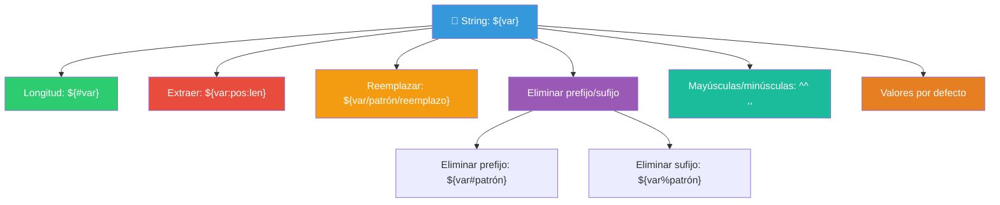

# Manipulación de Strings

Bash proporciona operaciones nativas para manipular strings sin necesidad de herramientas externas. Son las llamadas **expansiones de parámetros**.

## Mapa de operaciones



### String de prueba

Usaremos este string en todos los ejemplos:

```bash
texto="Hola Mundo desde Bash"
archivo="fondo.png"
ruta="/home/usuario/documentos/informe.pdf"
email="usuario@ejemplo.com"
```

---

## String length — Longitud

```bash
echo "${#texto}"          # 22
echo "${#archivo}"        # 9
echo "${#ruta}"           # 40
echo "${#email}"          # 19

# Útil para validaciones
read -p "Nombre: " nombre
if [[ ${#nombre} -lt 3 ]]; then
    echo "El nombre debe tener al menos 3 caracteres"
fi

# Caracteres especiales (unicode)
texto_unicode="Hólá Mündo"
echo "${#texto_unicode}"  # 11 (cuenta bytes, no caracteres)
# Para contar caracteres reales: wc -m
echo "$texto_unicode" | wc -m   # 11 (depende del encoding)
```

---

## Extracción substring

### Sintaxis básica

```bash
${var:inicio}         # Desde "inicio" hasta el final
${var:inicio:longitud} # Desde "inicio", "longitud" caracteres
${var: -n}           # Últimos n caracteres (espacio antes de -)
```

### Ejemplos

```bash
echo "${texto:0:4}"       # "Hola" (pos 0, 4 caracteres)
echo "${texto:5:5}"       # "Mundo"
echo "${texto:5}"         # "Mundo desde Bash" (pos 5 hasta el final)
echo "${texto: -4}"       # "Bash" (últimos 4 caracteres)
echo "${texto: -5:4}"     # "Bas" (últimos 5, pero solo 4 caracteres)
echo "${texto: :5}"       # "Hola " (desde inicio, 5 caracteres)
```

### Casos de uso reales

```bash
# Extraer extensión de archivo
echo "${archivo: -4}"     # ".png" — pero mejor usar ${archivo#*.}

# Extraer nombre sin extensión
echo "${archivo:0:-4}"    # "fondo" (desde inicio, quitando 4 del final)
# O mejor: ${archivo%.*}

# Extraer el nombre del archivo de una ruta
ruta="/home/usuario/documentos/informe.pdf"
echo "${ruta##*/}"        # "informe.pdf" (elimina todo hasta el último /)

# Extraer el directorio de una ruta
echo "${ruta%/*}"         # "/home/usuario/documentos"
```

### Con variables (posición dinámica)

```bash
pos=5
len=5
echo "${texto:$pos:$len}"     # "Mundo"
pos=0
echo "${texto:$pos:4}"        # "Hola"
```

---

## Reemplazo de patrones

### Sintaxis

```bash
${var/patrón/reemplazo}       # Primera ocurrencia
${var//patrón/reemplazo}      # Todas las ocurrencias
${var/#patrón/reemplazo}      # Solo al inicio de la línea
${var/%patrón/reemplazo}      # Solo al final de la línea
```

### Ejemplos

```bash
# Reemplazar primera ocurrencia
echo "${texto/Hola/Chao}"     # "Chao Mundo desde Bash"

# Reemplazar todas las ocurrencias
texto2="foo bar foo baz foo"
echo "${texto2//foo/xxx}"     # "xxx bar xxx baz xxx"

# Al inicio
echo "${texto/#Hola/Chao}"    # "Chao Mundo desde Bash"
echo "${texto/#Mundo/..."}"   # "Hola Mundo desde Bash" (no cambia, no está al inicio)

# Al final
echo "${texto/%Bash/sh}"      # "Hola Mundo desde sh"
echo "${texto/%desde/sh}"     # "no cambia, no está al final"
```

### Patrones con comodines

```bash
# Usando * como comodín en el patrón
echo "${texto/Hola */Chao}"   # "Chao" (reemplaza "Hola " + todo hasta fin)
echo "${texto/*desde*/<..."}' # "<...>" (reemplaza todo el string)
```

### Casos de uso reales

```bash
# Sanear nombres de archivo (reemplazar espacios por _)
nombre="Mi archivo importante.txt"
saneado="${nombre// /_}"
echo "$saneado"               # "Mi_archivo_importante.txt"

# Reemplazar extensión
archivo="fondo.png"
echo "${archivo/.png/.jpg}"   # "fondo.jpg"

# Quitar caracteres no deseados
texto_sucio="Hola, mundo!  "
limpio="${texto_sucio//[!, ]}"  # Elimina !, y espacios
echo "$limpio"                # "Holamundo"

# Enmascarar email
email="usuario@ejemplo.com"
echo "${email/@*/@...}"       # "usuario@..."
```

---

## Eliminación de prefijos y sufijos

### Sintaxis

```bash
${var#patrón}         # Elimina el prefijo MÁS CORTO (non-greedy)
${var##patrón}        # Elimina el prefijo MÁS LARGO (greedy)
${var%patrón}         # Elimina el sufijo MÁS CORTO (non-greedy)
${var%%patrón}        # Elimina el sufijo MÁS LARGO (greedy)
```


### Eliminar prefijo

```bash
# Corto: elimina hasta el primer espacio
echo "${texto#* }"           # "Mundo desde Bash" (elimina "Hola ")

# Largo: elimina hasta el último espacio
echo "${texto##* }"          # "Bash" (elimina "Hola Mundo desde ")
```

### Eliminar sufijo

```bash
# Corto: elimina desde el último espacio
echo "${texto% *}"           # "Hola Mundo desde" (elimina " Bash")

# Largo: elimina desde el primer espacio
echo "${texto%% *}"          # "Hola" (elimina " Mundo desde Bash")
```

### Casos de uso reales

```bash
# === Archivos ===

# Obtener extensión (parte después del último .)
echo "${archivo#*.}"          # "png" (non-greedy: primer .)
echo "${archivo##*.}"         # "png" (greedy: último . — igual aquí)

# Archivo con múltiples puntos
archivo2="backup.tar.gz"
echo "${archivo2#*.}"         # "tar.gz" (primer .)
echo "${archivo2##*.}"        # "gz" (último .)

# Obtener nombre sin extensión
echo "${archivo%.*}"          # "fondo" (elimina el último .*)
echo "${archivo%%.*}"         # "fondo" (elimina el primer .*)

# === Rutas ===

# Obtener nombre del archivo (último componente)
echo "${ruta##*/}"           # "informe.pdf"

# Obtener directorio (todo menos el último componente)
echo "${ruta%/*}"            # "/home/usuario/documentos"

# === URLs ===

url="https://ejemplo.com:8080/ruta/archivo.html?q=1"
echo "${url#*://}"           # "ejemplo.com:8080/ruta/archivo.html?q=1"
echo "${url##*/}"            # "archivo.html?q=1"
echo "${url%%\?*}"           # "https://ejemplo.com:8080/ruta/archivo.html"
echo "${url##*:}"            # "8080/ruta/archivo.html?q=1"
```

### Referencia rápida `#` vs `%`

| Operador | Busca desde | Coincidencia | Ejemplo con `ruta="/a/b/c.txt"` |
|----------|-------------|--------------|----------------------------------|
| `#` | Inicio | Corta (non-greedy) | `"${rute#*/}"` → `"a/b/c.txt"` |
| `##` | Inicio | Larga (greedy) | `"${rute##*/}"` → `"c.txt"` |
| `%` | Final | Corta (non-greedy) | `"${rute%/*}"` → `"/a/b"` |
| `%%` | Final | Larga (greedy) | `"${rute%%/*}"` → `""` (vacío) |

---

## Conversión de casos

Disponible desde **Bash 4+**.

### Sintaxis

```bash
${var^}         # Primera letra a mayúscula
${var^^}        # Todas las letras a mayúsculas
${var,}         # Primera letra a minúscula
${var,,}        # Todas las letras a minúsculas
${var~}         # Invierte caso de la primera letra
${var~~}        # Invierte caso de todas las letras
```

### Ejemplos

```bash
nombre="ana garcía"
echo "${nombre^}"            # "Ana garcía"
echo "${nombre^^}"           # "ANA GARCÍA"
echo "${nombre,}"            # "ana garcía"
echo "${nombre,,}"           # "ana garcía"

# Invertir caso
echo "${nombre~~}"           # "ANA GARCÍA"

# Con patrón: solo ciertos caracteres
echo "${nombre^^[ag]}"       # "AnA GArcíA" (solo a y g a mayúscula)
```

### Casos de uso reales

```bash
# Normalizar a mayúsculas para comparación
read -p "¿Continuar? (s/n): " resp
if [[ "${resp,,}" = "s" ]]; then
    echo "Continuando..."
fi

# Capitalizar nombre propio
nombre="juan pérez"
echo "${nombre^}"            # "Juan pérez" — solo la primera

# Convertir a mayúsculas constantes
declare -u ENTORNO="produccion"
echo "$ENTORNO"              # "PRODUCCION"

# Convertir a minúsculas tags
tag="ERROR"
echo "${tag,,}"              # "error"
```

---

## Valores por defecto

### Sintaxis

```bash
${var:-valor}       # Usa "valor" si var no está definida o vacía
${var-valor}        # Usa "valor" solo si var no está definida (NO vacía)
${var:=valor}       # Asigna "valor" a var si está indefinida o vacía
${var:?mensaje}     # Error con "mensaje" si var está indefinida o vacía
${var:+alternativo} # Usa "alternativo" si var está definida y no vacía
```

### Ejemplos

```bash
# Valor por defecto (no modifica la variable)
echo "${nombre:-Invitado}"     # "Invitado" si nombre no existe

# Asignar valor por defecto (sí modifica la variable)
: "${nombre:=Invitado}"        # nombre ahora vale "Invitado" si no tenía valor
echo "$nombre"                 # "Invitado"

# Error si no está definida
echo "${nombre:?'nombre' es obligatorio}"  # Sale con error si no existe

# Alternativo
echo "${nombre:+el nombre está definido}"  # Muestra el texto si nombre existe
```

---

## Tabla resumen de operaciones

| Operación | Sintaxis | Ejemplo con `texto="Hola Mundo"` | Resultado |
|-----------|----------|----------------------------------|-----------|
| Longitud | `${#var}` | `echo ${#texto}` | 10 |
| Substring | `${var:pos:len}` | `echo ${texto:0:4}` | Hola |
| Substring hasta fin | `${var:pos}` | `echo ${texto:5}` | Mundo |
| Últimos N | `${var: -N}` | `echo ${texto: -4}` | undo |
| Reemplazar primero | `${var/pat/rpl}` | `echo ${texto/Hola/Chao}` | Chao Mundo |
| Reemplazar todos | `${var//pat/rpl}` | `echo ${texto//o/x}` | Hxla Mundx |
| Reemplazar inicio | `${var/#pat/rpl}` | `echo ${texto/#Hola/Chao}` | Chao Mundo |
| Reemplazar final | `${var/%pat/rpl}` | `echo ${texto/%Mundo/Planeta}` | Hola Planeta |
| Eliminar prefijo corto | `${var#pat}` | `echo ${texto#* }` | Mundo |
| Eliminar prefijo largo | `${var##pat}` | `echo ${texto##* }` | Mundo |
| Eliminar sufijo corto | `${var%pat}` | `echo ${texto% *}` | Hola |
| Eliminar sufijo largo | `${var%%pat}` | `echo ${texto%% *}` | Hola |
| Mayúscula 1ª letra | `${var^}` | `echo ${texto^}` | Hola Mundo |
| Todo mayúsculas | `${var^^}` | `echo ${texto^^}` | HOLA MUNDO |
| Minúscula 1ª letra | `${var,}` | `echo ${texto,}` | hola Mundo |
| Todo minúsculas | `${var,,}` | `echo ${texto,,}` | hola mundo |
| Defecto (usar) | `${var:-val}` | `echo ${noexiste:-X}` | X |
| Defecto (asignar) | `${var:=val}` | `: ${var:=X}` | (asigna X) |
| Error si vacío | `${var:?msg}` | `echo ${noexiste:?error}` | (error) |
| Alternativa | `${var:+alt}` | `echo ${texto:+existe}` | existe |

---

## Script de ejemplo

```bash
#!/bin/bash
# ============================================
# Script: procesar_archivos.sh
# Descripción: Manipulación de strings con archivos
# ============================================

set -euo pipefail

# Función para limpiar nombre de archivo
sanear_nombre() {
    local nombre="$1"
    # Reemplazar espacios por _
    local saneado="${nombre// /_}"
    # Eliminar caracteres no alfanuméricos excepto -._ 
    saneado="${saneado//[^a-zA-Z0-9._-]/}"
    # Pasar a minúsculas
    echo "${saneado,,}"
}

# Función para obtener extensión
obtener_extension() {
    local archivo="$1"
    echo "${archivo##*.}"
}

# Función para obtener nombre sin extensión
obtener_base() {
    local archivo="$1"
    echo "${archivo%.*}"
}

# Procesar archivo y crear backup
procesar_archivo() {
    local ruta="$1"
    local nombre="${ruta##*/}"
    local dir="${ruta%/*}"
    local base="${nombre%.*}"
    local ext="${nombre##*.}"
    local fecha=$(date +%Y%m%d)

    echo "Procesando: $ruta"
    echo "  Directorio: ${dir:-/}"
    echo "  Nombre:     $nombre"
    echo "  Base:       $base"
    echo "  Extensión:  $ext"

    # Crear backup con fecha
    local backup="${dir}/${base}_${fecha}.${ext}"
    echo "  Backup:     $backup"
    cp "$ruta" "$backup"
}

# Sanear nombre de archivo
read -p "Nombre de archivo (feo): " nombre_feo
nombre_lindo=$(sanear_nombre "$nombre_feo")
echo "Nombre saneado: $nombre_lindo"

# Extraer información de una URL
url="https://ejemplo.com:8080/api/v2/usuarios?page=1&limit=10"
echo ""
echo "=== Analizando URL ==="
echo "URL completa: $url"
echo "Protocolo:   ${url%%://*}"
sin_proto="${url#*://}"
echo "Host+puerto: ${sin_proto%%/*}"
host="${sin_proto%%:*}"
echo "Host:        $host"
puerto="${sin_proto#*:}"
puerto="${puerto%%/*}"
echo "Puerto:      $puerto"
ruta_url="${sin_proto#*/}"
echo "Ruta:        ${ruta_url%%\?*}"
query="${ruta_url#*\?}"
echo "Query:       $query"
```

> **📌 Clave**: Las expansiones `${#}`, `${:}`, `${/}`, `${#}`, `${%}`, `${^^}` son **builtins de Bash** — no crean procesos hijos, son rapidísimas. Apréndelas de memoria porque las usarás en casi todos los scripts. Las más útiles: `${var:-default}`, `${var#prefijo}`, `${var%sufijo}`, `${var//pat/rep}`, `${var^^}`.

## Relacionados:
- [[trabajar-con-numericos-bash]] #anterior 
- [[codigos-de-salida]] #siguiente 