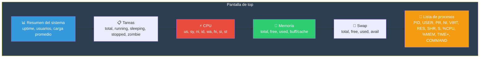

# Monitoreo del sistema

Linux proporciona herramientas para monitorear el estado del sistema: procesos, memoria, disco, CPU y más.

## Mapa de herramientas

```mermaid
flowchart TB
    Monitoreo["📊 ¿Qué quieres monitorear?"] --> Procesos["📋 Procesos"]
    Monitoreo --> Memoria["💾 Memoria"]
    Monitoreo --> Disco["💿 Disco"]
    Monitoreo --> CPU["⚡ CPU y carga"]
    Monitoreo --> Red["🌐 Red"]
    Monitoreo --> General["📈 General"]

    Procesos --> P1["ps — instantánea"]
    Procesos --> P2["top/htop — tiempo real"]

    Memoria --> M1["free — RAM+swap"]
    Memoria --> M2["vmstat — estadísticas detalladas"]

    Disco --> D1["df — espacio en discos"]
    Disco --> D2["du — uso por directorio"]
    Disco --> D3["iostat — E/S de disco"]

    CPU --> C1["uptime — carga promedio"]
    CPU --> C2["mpstat — por CPU"]
    CPU --> C3["top/htop — por proceso"]

    Red --> R1["netstat/ss — conexiones"]
    Red --> R2["iftop/nethogs — tráfico"]

    General --> G1["dmesg — mensajes del kernel"]
    General --> G2["journalctl — logs del sistema"]

    style Monitoreo fill:#2C3E50,color:#fff
    style Procesos fill:#3498DB,color:#fff
    style Memoria fill:#2ECC71,color:#fff
    style Disco fill:#E74C3C,color:#fff
    style CPU fill:#F39C12,color:#fff
    style Red fill:#9B59B6,color:#fff
    style General fill:#1ABC9C,color:#fff
```



---

## `ps` — Instantánea de procesos

`ps` muestra una **foto fija** de los procesos en el momento de ejecutarlo.

```bash
# Formatos básicos
ps                    # Procesos de la terminal actual
ps aux                # Formato BSD: todos los procesos
ps -ef                # Formato estándar: todos los procesos

# Columnas comunes (formato BSD: aux)
# a  = todos los usuarios
# u  = formato orientado al usuario
# x  = incluye procesos sin terminal
```

### Formato personalizado

```bash
# Seleccionar columnas con -o
ps -eo pid,ppid,user,%cpu,%mem,comm --sort=-%cpu | head
ps -eo pid,user,%mem,comm --sort=-%mem | head -10

# Columnas útiles
pid         # ID del proceso
ppid        # ID del proceso padre
user        # Usuario propietario
%cpu        # Uso de CPU (%)
%mem        # Uso de memoria (%)
vsz         # Memoria virtual (KB)
rss         # Memoria residente (KB)
stat        # Estado (R=ejecutando, S=durmiendo, Z=zombie)
comm        # Nombre del comando
cmd         # Línea de comandos completa
etime       # Tiempo transcurrido desde inicio
lstart      # Fecha y hora de inicio
```

### Filtros comunes

```bash
# Por usuario
ps -u ana

# Por terminal
ps -t pts/0

# Por PID
ps -p 1234,5678
ps --pid 1234

# Por nombre (pgrep es mejor)
ps aux | grep firefox
pgrep -a firefox

# Árbol de procesos
ps -ejH            # Formato jerárquico
ps auxf            # Con árbol ASCII
pstree             # Árbol visual (más legible)
```

### Estados de un proceso (`stat`)

```bash
R    # Running: ejecutándose o en cola de ejecución
S    # Sleeping: durmiendo, interrumpible
D    # Uninterruptible sleep: durmiendo, NO interrumpible (I/O)
T    # Stopped: detenido (Ctrl+Z)
Z    # Zombie: terminado, esperando que el padre lo recoja
<    # Prioridad negativa (mayor prioridad)
N    # Prioridad positiva (menor prioridad)
l    # Proceso multi-thread
+    # En primer plano
s    # Líder de sesión (session leader)
```

---

## `top`, `htop` — Monitoreo en tiempo real

### `top`

```bash
top                 # Monitor interactivo por defecto
top -u ana          # Solo procesos de un usuario
top -p 1234,5678    # Solo procesos específicos
top -b -n 1         # Modo batch, una iteración (para scripts)
top -b -n 5 -d 2    # Batch, 5 iteraciones, cada 2 segundos
```



#### Atajos en `top`

```bash
# Ordenar
P     # Por CPU (por defecto)
M     # Por memoria
T     # Por tiempo de ejecución
N     # Por PID
R     # Invertir orden

# Control
k     # Matar proceso (pide PID)
r     # Renice (cambiar prioridad)
u     # Filtrar por usuario
1     # Ver CPUs individuales
H     # Hilos en vez de procesos
c     # Mostrar línea de comandos completa
W     # Guardar configuración

# Salir
q     # Salir de top
```

### `htop`

Versión moderna y mejorada de `top`:

```bash
htop                # Monitor interactivo mejorado
htop -u ana         # Procesos de un usuario
htop -p 1234        # Procesos específicos
htop -t             # Vista en árbol (tree)
```

**Ventajas sobre top:**
- Navegación con flechas y mouse
- Colores para uso de CPU/memoria
- Barras de progreso visuales
- Matar procesos con F9 sin saber el PID
- Vista en árbol con F5
- Búsqueda con F3

---

## `free` — Memoria

Muestra el uso de memoria RAM y swap.

```bash
free                    # En bytes
free -h                 # Formato humano (GB/MB/KB)
free -m                 # En MB
free -g                 # En GB
free -s 2               # Actualizar cada 2 segundos
free -s 5 -c 3          # 3 iteraciones, cada 5 segundos
```

### Salida explicada

```bash
$ free -h
               total        used        free      shared  buff/cache   available
Mem:            7.6G        3.2G        1.8G        256M        2.6G        3.9G
Swap:           2.0G        0.0G        2.0G
```

| Columna | Significado |
|---------|-------------|
| `total` | Memoria física total instalada |
| `used` | Memoria actualmente en uso |
| `free` | Memoria no usada en absoluto |
| `shared` | Memoria compartida (tmpfs) |
| `buff/cache` | Memoria usada como buffer/cache por el kernel |
| `available` | Memoria disponible para nuevos procesos (estimación) |

> **📌 Nota**: `available` ≈ `free + buff/cache` recuperable. Linux usa memoria libre como cache, pero la libera cuando un proceso la necesita. No te alarmes si ves `free` bajo.

### Script de alerta

```bash
#!/bin/bash
# Alertar si la memoria libre es menor al 10%

MEM_TOTAL=$(free -m | awk '/^Mem:/ {print $2}')
MEM_AVAIL=$(free -m | awk '/^Mem:/ {print $7}')
PORCENTAJE=$(( (MEM_AVAIL * 100) / MEM_TOTAL ))

echo "Memoria disponible: $MEM_AVAIL MB de $MEM_TOTAL MB ($PORCENTAJE%)"

if (( PORCENTAJE < 10 )); then
    echo "⚠️  ALERTA: Memoria baja ($PORCENTAJE%)" >&2
    exit 1
fi
```

---

## `df`, `du` — Disco

### `df` — Espacio en sistemas de archivos

```bash
df                      # En bloques de 1K
df -h                   # Formato humano (GB/MB)
df -T                   # Incluye tipo de sistema de archivos
df -a                   # Todos, incluyendo pseudo-fs
df -x tmpfs             # Excluye tmpfs
df -h /home             # Solo el sistema de archivos de /home
df -h --total           # Muestra total al final
```

```bash
$ df -h
Filesystem      Size  Used Avail Use% Mounted on
/dev/sda1        98G   45G   53G  46% /
/dev/sdb1       458G  200G  258G  44% /home
tmpfs           3.8G  256M  3.5G   7% /tmp
```

### `du` — Uso de disco por directorio

```bash
du -h directorio            # Tamaño de directorio y subdirectorios
du -sh directorio           # Solo el total (summary)
du -h --max-depth=1         # Un nivel de profundidad
du -h directorio | sort -h  # Ordenado por tamaño
du -ah                     # Incluye archivos individuales
du -csh /var/log/*          # Suma total al final

# Ejemplos prácticos
du -sh ~                    # Tamaño total del home
du -sh /var/log             # Tamaño de logs
du -h --max-depth=1 / | sort -rh | head   # Directorios más grandes en /
du -ah /var | sort -rh | head -10         # Archivos más grandes en /var
```

### Encontrar archivos grandes

```bash
# Encontrar archivos > 100 MB
find / -type f -size +100M -exec ls -lh {} \; 2>/dev/null | sort -k5 -rh

# Directorios más grandes (primer nivel)
du -h --max-depth=1 /home | sort -rh

# Top 10 archivos más grandes en un directorio
find /var -type f -exec ls -lh {} \; 2>/dev/null | sort -k5 -rh | head -10
```

---

## `uptime` — Carga del sistema

```bash
uptime
# 10:30:00 up 3 days,  2:15,  3 users,  load average: 0.45, 0.60, 0.55
```

### Significado

```bash
# 10:30:00              → Hora actual
# up 3 days, 2:15       → Tiempo desde el último arranque
# 3 users               → Usuarios conectados
# load average: 0.45... → Carga promedio: 1 min, 5 min, 15 min
```

### Interpretación de load average

```bash
# load average: 1 min, 5 min, 15 min
# El número representa procesos en cola de ejecución
# < Núcleos → sistema desahogado
# ≈ Núcleos → sistema a capacidad
# > Núcleos → sistema sobrecargado

# Ejemplo con CPU de 4 núcleos:
# load: 0.50 → 0.50/4 = 12.5% de uso — desahogado
# load: 4.00 → 4.00/4 = 100%  — a plena capacidad
# load: 8.00 → 8.00/4 = 200%  — sobrecargado
```

```bash
# Ver número de CPUs
nproc               # 4
grep -c ^processor /proc/cpuinfo   # 4 (alternativa)

# w muestra uptime + usuarios conectados
w
```

---

## `iostat`, `vmstat` — Estadísticas de I/O y VM

### `iostat` — Entrada/Salida de disco

```bash
iostat              # CPU y disco desde el arranque
iostat -x           # Estadísticas extendidas
iostat 2            # Actualizar cada 2 segundos
iostat -x 2 5       # Extendido, cada 2 segundos, 5 iteraciones
iostat -p sda       # Solo dispositivo sda
```

```bash
$ iostat -x 2
Device  r/s   w/s  rkB/s  wkB/s  await  svctm  %util
sda     5.2   3.1  256.0  128.0   12.5    2.1   1.8
```

| Columna | Significado |
|---------|-------------|
| `r/s`, `w/s` | Lecturas/escrituras por segundo |
| `rkB/s`, `wkB/s` | KB leídos/escritos por segundo |
| `await` | Tiempo promedio de respuesta (ms) |
| `svctm` | Tiempo de servicio promedio (ms) |
| `%util` | Porcentaje de uso del dispositivo |

> Si `%util` está cerca de 100% y `await` es alto, el disco es un cuello de botella.

### `vmstat` — Estadísticas de memoria virtual

```bash
vmstat              # Resumen desde el arranque
vmstat 2            # Actualizar cada 2 segundos
vmstat 2 5          # Cada 2 segundos, 5 iteraciones
vmstat -s           # Estadísticas detalladas de memoria
vmstat -d           | Estadísticas de disco
```

```bash
$ vmstat 2
procs -----------memory---------- ---swap-- -----io---- -system-- ------cpu-----
 r  b   swpd   free   buff  cache   si   so    bi    bo   in   cs us sy id wa st
 2  0      0  1.8G  256M  2.4G    0    0    10    20   50  100  5  3 91  1  0
```

| Columna | Significado |
|---------|-------------|
| `r` | Procesos en cola de ejecución (CPU-bound) |
| `b` | Procesos bloqueados (I/O) |
| `swpd` | Swap usado |
| `free` | Memoria libre |
| `si`, `so` | Swap in/out (si > 0, falta RAM) |
| `bi`, `bo` | Bloques recibidos/enviados por disco |
| `us` | CPU en usuario |
| `sy` | CPU en sistema (kernel) |
| `id` | CPU ociosa |
| `wa` | CPU esperando I/O |

---

## Otras herramientas útiles

### `lscpu` — Información de CPU

```bash
lscpu               # Detalles de CPU
# Arquitectura, modelo, núcleos, hilos...
```

### `lsblk` — Dispositivos de bloque

```bash
lsblk               # Árbol de discos y particiones
lsblk -f            # Con sistemas de archivos
lsblk -o NAME,SIZE,TYPE,MOUNTPOINT   # Columnas específicas
```

### `dmesg` — Mensajes del kernel

```bash
dmesg | tail -20             # Últimos mensajes
dmesg -T | tail              # Con timestamp legible
dmesg -w                     # Modo follow (como tail -f)
dmesg | grep -i error        # Errores del kernel
```

### `journalctl` — Logs del sistema (systemd)

```bash
journalctl -e                # Últimas líneas
journalctl -f                # Modo follow
journalctl -u nginx          # Logs de un servicio
journalctl --since "1 hour ago"  # Última hora
journalctl -p err            # Solo errores
```

---

## Script de monitoreo rápido

```bash
#!/bin/bash
# ============================================
# Script: status.sh
# Descripción: Resumen rápido del sistema
# ============================================

echo "=== 📊 ESTADO DEL SISTEMA ==="
echo

echo "📈 UPTIME Y CARGA"
uptime
echo

echo "🧠 MEMORIA"
free -h
echo

echo "💿 DISCO"
df -h / /home 2>/dev/null || df -h /
echo

echo "🔥 TOP 5 PROCESOS POR CPU"
ps aux --sort=-%cpu | head -6
echo

echo "🔥 TOP 5 PROCESOS POR MEMORIA"
ps aux --sort=-%mem | head -6
echo

echo "🌐 CONEXIONES DE RED"
ss -tuln | head -10
echo

echo "⏱️  Tiempo de actividad: $(uptime -p)"
```

> **🎯 Resumen**: `ps aux` para instantánea, `top`/`htop` para tiempo real, `free -h` para memoria, `df -h` para disco, `du -sh *` para uso por directorio, `uptime` para carga, `iostat`/`vmstat` para rendimiento. Combínalas con scripts para alertas automáticas.

## Relacionados:
- [[administracion-de-procesos]] #anterior 
- [[task-scheduling]] #siguiente 