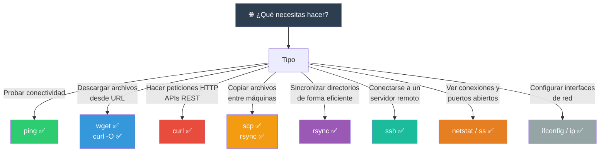

# Networking

Herramientas de red desde la terminal: diagnóstico, transferencia de archivos, conexión remota y configuración.

## Mapa de herramientas



---

## `ping` — Probar conectividad

Envía paquetes ICMP ECHO_REQUEST a un host y mide el tiempo de ida y vuelta (RTT).

```bash
ping google.com                  # Ping continuo (Ctrl+C para detener)
ping -c 5 google.com             # 5 paquetes
ping -c 5 -i 0.5 google.com      # Intervalo de 0.5 segundos
ping -c 5 -s 1000 google.com     # Paquetes de 1000 bytes
ping -c 5 -W 3 google.com        # Timeout de 3 segundos por paquete
ping -4 google.com               # Forzar IPv4
ping -6 google.com               # Forzar IPv6
```

### Interpretación de resultados

```bash
$ ping -c 5 google.com
PING google.com (142.250.80.46) 56(84) bytes of data.
64 bytes from 142.250.80.46: icmp_seq=1 ttl=118 time=12.5 ms
64 bytes from 142.250.80.46: icmp_seq=2 ttl=118 time=11.8 ms
64 bytes from 142.250.80.46: icmp_seq=3 ttl=118 time=13.2 ms
64 bytes from 142.250.80.46: icmp_seq=4 ttl=118 time=12.0 ms
64 bytes from 142.250.80.46: icmp_seq=5 ttl=118 time=11.5 ms

--- google.com ping statistics ---
5 packets transmitted, 5 received, 0% packet loss, time 4010ms
rtt min/avg/max/mdev = 11.500/12.200/13.200/0.647 ms
```

| Indicador | Significado |
|-----------|-------------|
| `icmp_seq` | Número de secuencia (si hay saltos → pérdida) |
| `ttl` | Time To Live (se decrementa en cada salto) |
| `time` | RTT en milisegundos |
| `packet loss` | Porcentaje de paquetes perdidos |
| `min/avg/max/mdev` | RTT mínimo, promedio, máximo, desviación |

> `packet loss > 0%` indica problemas de red. `time > 100ms` en redes locales es anormal.

---

## `curl` — Transferencia de datos con URL

Herramienta versátil para interactuar con servidores vía HTTP, HTTPS, FTP, etc.

### Peticiones HTTP

```bash
# GET (por defecto)
curl https://api.github.com/users/octocat
curl -L https://google.com               # Seguir redirecciones

# POST
curl -X POST https://api.ejemplo.com/data \
  -H "Content-Type: application/json" \
  -d '{"nombre":"Ana","edad":30}'

# PUT
curl -X PUT https://api.ejemplo.com/data/1 \
  -H "Content-Type: application/json" \
  -d '{"nombre":"Ana","edad":31}'

# DELETE
curl -X DELETE https://api.ejemplo.com/data/1

# HEAD (solo cabeceras)
curl -I https://google.com
```

### Descargar archivos

```bash
# Descargar y guardar con nombre original
curl -O https://ejemplo.com/archivo.zip
curl -o miarchivo.zip https://ejemplo.com/archivo.zip   # Con nombre personalizado

# Reanudar descarga parcial
curl -C - -O https://ejemplo.com/grande.zip

# Límite de velocidad
curl --limit-rate 500K -O https://ejemplo.com/grande.zip
```

### Verbosidad y depuración

```bash
curl -v https://ejemplo.com              # Verboso (cabeceras + cuerpo)
curl -i https://ejemplo.com              # Incluir cabeceras en salida
curl -s https://ejemplo.com              # Silencioso (sin progreso)
curl -w "\n%{http_code}\n" https://ejemplo.com  # Mostrar solo código HTTP
```

### Cabeceras y autenticación

```bash
# Cabeceras personalizadas
curl -H "Authorization: Bearer token123" https://api.ejemplo.com
curl -H "User-Agent: MiCliente/1.0" https://ejemplo.com

# Autenticación básica
curl -u usuario:contraseña https://ejemplo.com/protegido

# Cookies
curl -c cookies.txt https://ejemplo.com/login   # Guardar cookies
curl -b cookies.txt https://ejemplo.com/dashboard  # Enviar cookies
```

### curl vs wget

| Característica | `curl` | `wget` |
|---------------|--------|--------|
| Protocolos | HTTP, HTTPS, FTP, SFTP, SCP, IMAP, SMTP... | HTTP, HTTPS, FTP |
| Soporte HTTPS | ✅ | ✅ |
| Subida de archivos | ✅ (-F, -T, -d) | ❌ (limitado) |
| Descarga recursiva | ❌ (no nativo) | ✅ (-r) |
| Reanudar descarga | ✅ (-C -) | ✅ (-c) |
| Salida por defecto | stdout | Archivo |
| APIs REST | ✅ Excelente | ❌ |

---

## `wget` — Descarga no interactiva

```bash
# Descarga básica (guarda con nombre original)
wget https://ejemplo.com/archivo.zip

# Con nombre personalizado
wget -O miarchivo.zip https://ejemplo.com/archivo.zip

# Reanudar descarga parcial
wget -c https://ejemplo.com/grande.zip

# Descarga recursiva (sitio completo)
wget -r -l 2 https://ejemplo.com    # 2 niveles de profundidad

# Espejo de un sitio
wget -m https://ejemplo.com

# Limitar velocidad
wget --limit-rate=500K https://ejemplo.com/grande.zip

# Descargar desde archivo con URLs
wget -i urls.txt

# Background
wget -b https://ejemplo.com/grande.zip
tail -f wget-log
```

---

## `scp` — Copia segura sobre SSH

Transfiere archivos entre máquinas usando el protocolo SSH.

```bash
# Local → Remoto
scp archivo.txt usuario@servidor:/home/usuario/
scp archivo.txt usuario@192.168.1.100:/home/usuario/

# Remoto → Local
scp usuario@servidor:/home/usuario/archivo.txt .

# Directorio recursivo
scp -r proyecto/ usuario@servidor:/home/usuario/

# Puerto personalizado
scp -P 2222 archivo.txt usuario@servidor:/home/usuario/

# Comprimir durante transferencia
scp -C archivo_grande.txt usuario@servidor:/home/usuario/

# Limitar ancho de banda (Kbit/s)
scp -l 1000 archivo.txt usuario@servidor:/home/usuario/
```

### Flags de scp

```bash
-P PORT    # Puerto SSH (mayúscula, diferente a ssh)
-p          # Preservar tiempos de modificación
-r          # Recursivo (directorios)
-C          # Comprimir datos durante transferencia
-l LIMIT    # Límite de ancho de banda (Kbit/s)
-q          # Modo silencioso
-v          # Verboso (depuración)
-3          # Copiar entre dos hosts remotos (vía local)
```

---

## `ssh` — Shell seguro remoto

```bash
# Conexión básica
ssh usuario@servidor
ssh usuario@192.168.1.100
ssh usuario@servidor.ejemplo.com

# Puerto personalizado
ssh -p 2222 usuario@servidor

# Ejecutar comando remoto (sin shell interactivo)
ssh usuario@servidor "ls -la /var/log"
ssh usuario@servidor "sudo systemctl restart nginx"

# Reenviar puerto local → remoto (tunnel)
ssh -L 8080:localhost:80 usuario@servidor
# Ahora http://localhost:8080 apunta a :80 en el servidor

# Reenviar puerto remoto → local
ssh -R 8080:localhost:3000 usuario@servidor
# El servidor puede acceder a localhost:3000 de la máquina local

# Proxy SOCKS (túnel dinámico)
ssh -D 1080 usuario@servidor
# Configurar proxy SOCKS5 en localhost:1080

# Reenviar X11 (aplicaciones GUI remotas)
ssh -X usuario@servidor
# Luego ejecutar: firefox, gedit, etc.
```

### Autenticación por llaves

```bash
# Generar par de llaves (ed25519 recomendado)
ssh-keygen -t ed25519 -C "mi@email.com"

# Copiar llave pública al servidor
ssh-copy-id usuario@servidor

# También manualmente:
cat ~/.ssh/id_ed25519.pub | ssh usuario@servidor "mkdir -p ~/.ssh && cat >> ~/.ssh/authorized_keys"
```

### Archivos de configuración (~/.ssh/config)

```bash
Host servidor
    HostName 192.168.1.100
    Port 2222
    User ana
    IdentityFile ~/.ssh/servidor_key
    ForwardAgent yes

Host github.com
    HostName github.com
    User git
    IdentityFile ~/.ssh/github_key

# Uso:
ssh servidor                    # Equivalente a ssh -p 2222 ana@192.168.1.100
```

### Flags de ssh

```bash
-p PORT      # Puerto
-i KEY       # Archivo de llave privada
-L           # Reenvío local → remoto
-R           # Reenvío remoto → local
-D PORT      # Proxy SOCKS dinámico
-X           # Reenvío X11
-J host      # Host bastión (Jump host)
-N           # No ejecutar comandos (solo reenvío)
-f           # Segundo plano
-v           # Verboso (v, vv, vvv para más detalle)
-t           # Forzar pseudo-terminal
```

---

## `rsync` — Sincronización eficiente

Sincroniza archivos entre directorios (locales o remotos) transfiriendo solo las diferencias.

```bash
# Local → local (backup)
rsync -av src/ /backup/src/

# Local → remoto
rsync -av src/ usuario@servidor:/home/usuario/backup/

# Remoto → local
rsync -av usuario@servidor:/home/usuario/backup/ src/

# Con compresión (-z) y progreso
rsync -avz --progress src/ usuario@servidor:/destino/

# Eliminar archivos en destino que no existen en origen
rsync -av --delete src/ /backup/src/

# Excluir archivos
rsync -av --exclude='*.log' --exclude='node_modules/' src/ /backup/src/

# Incluir solo ciertos patrones
rsync -av --include='*.sh' --exclude='*' src/ /backup/src/

# Simular (dry run) — no transfiere nada
rsync -av --dry-run src/ /backup/src/
```

### Flags principales de rsync

```bash
-a      # Archivo (archive): -rlptgoD (recursivo + preserva permisos, tiempos, dueño)
-v      # Verboso
-z      # Comprimir durante transferencia
-P      # Progress + partial (reanudar)
-h      # Números legibles para humanos
-n      # Dry run (simular)
--delete  # Eliminar archivos en destino que no están en origen
--exclude # Excluir patrón
--link-dest  # Hard links para backups incrementales
```

### rsync sobre SSH

```bash
# Por defecto usa SSH
rsync -avz src/ servidor:/destino/

# Puerto personalizado
rsync -avz -e "ssh -p 2222" src/ servidor:/destino/

# Límite de ancho de banda
rsync -avz --bwlimit=500 src/ servidor:/destino/
```

### scp vs rsync

| Característica | `scp` | `rsync` |
|---------------|-------|---------|
| Transferencia diferencial | ❌ (todo el archivo) | ✅ (solo diferencias) |
| Reanudar transferencia | ❌ | ✅ (-P) |
| Velocidad en segunda ejecución | Igual | Mucho más rápido |
| Preservar permisos/times | ✅ (-p) | ✅ (-a) |
| Compresión | ✅ (-C) | ✅ (-z) |
| Eliminar en destino | ❌ | ✅ (--delete) |
| Excluir patrones | ❌ | ✅ (--exclude) |

> Usa `rsync` para copias recurrentes/backups. Usa `scp` para copias únicas rápidas.

---

## `netstat`, `ss` — Conexiones de red

### `ss` (moderno, reemplaza netstat)

```bash
# Todas las conexiones
ss                         # Similar a netstat sin opciones
ss -tuln                   # Puertos escuchando (TCP + UDP)

# Solo TCP
ss -t                      # Conexiones TCP
ss -ta                     # Todas (incluyendo listening)
ss -tuln                   # t=TCP, u=UDP, l=Listening, n=Numérico

# Conexiones establecidas
ss -tn state established

# Por puerto
ss -tuln sport = :80       # Conexiones en puerto 80
ss -tuln dport = :443      # Conexiones a puerto 443

# Por IP
ss src 192.168.1.100
ss dst 10.0.0.1

# Estadísticas
ss -s                      # Resumen de conexiones

# Procesos asociados
ss -tulnp                  # p = mostrar proceso
```

### `netstat` (legacy, puede requerir instalación)

```bash
netstat -tuln              # Puertos escuchando
netstat -tulnp             # Con PID/programa
netstat -an                # Todas las conexiones
netstat -i                 # Estadísticas de interfaces
netstat -r                 # Tabla de enrutamiento
netstat -s                 # Estadísticas por protocolo
```

### netstat vs ss

| Característica | `netstat` | `ss` |
|---------------|-----------|------|
| Velocidad | Lenta (lee /proc) | Rápida (netlink) |
| Información | Básica | Detallada (TCP states, etc.) |
| Disponibilidad | Deprecado, puede no estar | ✅ Incluido en iproute2 |
| Estadísticas | ✅ | ✅ |
| Por proceso | ✅ | ✅ (-p) |
| Enrutamiento | ✅ (-r) | ❌ (usar `ip route`) |

---

## `ifconfig`, `ip` — Configuración de red

### `ip` (moderno, iproute2)

```bash
# Interfaces de red
ip addr                     # Mostrar todas las interfaces (como ifconfig)
ip addr show eth0           # Interfaz específica
ip -4 addr                  # Solo IPv4
ip -6 addr                  # Solo IPv6

# Activar/desactivar interfaz
ip link set eth0 up         # Activar
ip link set eth0 down       # Desactivar

# Asignar IP
ip addr add 192.168.1.100/24 dev eth0
ip addr del 192.168.1.100/24 dev eth0

# Tabla de enrutamiento
ip route                    # Mostrar rutas (como netstat -r)
ip route show default       # Ruta por defecto
ip route add default via 192.168.1.1
ip route del default

# Vecinos ARP
ip neigh                    # Tabla ARP (como arp -a)
```

### `ifconfig` (legacy, net-tools)

```bash
ifconfig                    # Todas las interfaces
ifconfig eth0               # Interfaz específica
ifconfig eth0 up            # Activar
ifconfig eth0 down          # Desactivar
ifconfig eth0 192.168.1.100 netmask 255.255.255.0

# route para enrutamiento
route -n                    # Tabla de enrutamiento
route add default gw 192.168.1.1
```

### ifconfig vs ip

| Característica | `ifconfig` | `ip` |
|---------------|------------|------|
| Estado | Deprecado | Activo |
| Paquete | net-tools | iproute2 |
| IPv6 | Limitado | ✅ Completo |
| Enrutamiento | `route` separado | `ip route` integrado |
| ARP | `arp` separado | `ip neigh` integrado |
| Salida | Formato libre (difícil de parsear) | Formato estructurado |

> Todas las distribuciones modernas recomiendan `ip` sobre `ifconfig`.

---

## Otras herramientas útiles

### `nslookup`, `dig` — Resolución DNS

```bash
# nslookup
nslookup google.com
nslookup google.com 8.8.8.8          # Usar servidor DNS específico

# dig (más detallado, recomendado)
dig google.com
dig google.com A                      # Solo registros A
dig google.com MX                     # Registros MX
dig -x 8.8.8.8                        # Reverso (IP → nombre)
dig google.com +short                 # Solo respuesta breve
```

### `traceroute`, `mtr` — Ruta de paquetes

```bash
# traceroute
traceroute google.com
traceroute -n google.com             # Sin resolución DNS
traceroute -I google.com             # Usar ICMP (evita firewalls)

# mtr (combina ping + traceroute, continuo)
mtr google.com
mtr -n google.com                    # Sin DNS
mtr -r -c 10 google.com              # Reporte (10 pings por salto)
```

### `nmap` — Escaneo de puertos

```bash
nmap -sn 192.168.1.0/24             # Descubrir hosts en la red (ping sweep)
nmap -p 80,443 servidor              # Puertos específicos
nmap -p- servidor                    # Todos los puertos (65535)
nmap -sV servidor                    # Detectar versiones de servicios
nmap -O servidor                     # Detectar SO
```

---

## Script de diagnóstico rápido

```bash
#!/bin/bash
# ============================================
# Script: net-diag.sh
# Descripción: Diagnóstico rápido de red
# ============================================

echo "=== 🌐 DIAGNÓSTICO DE RED ==="
echo

echo "📡 INTERFACES"
ip -br addr 2>/dev/null || ifconfig
echo

echo "📋 TABLA DE ENRUTAMIENTO"
ip route 2>/dev/null || route -n
echo

echo "🔄 CONEXIONES ACTIVAS (puertos escuchando)"
ss -tuln 2>/dev/null || netstat -tuln
echo

echo "📊 ESTADÍSTICAS DE CONEXIONES"
ss -s 2>/dev/null
echo

echo "🌐 RESOLUCIÓN DNS"
dig +short google.com 2>/dev/null || nslookup google.com
echo

echo "🏓 PING A GOOGLE (3 paquetes)"
ping -c 3 google.com
```

> **🎯 Resumen**: `ping` para conectividad, `curl` para APIs/descargas, `wget` descargas simples, `scp`/`rsync` transferencia de archivos (rsync gana en recurrencia), `ssh` para acceso remoto, `ss` para conexiones, `ip` para configuración. `dig` para DNS, `mtr` para ruta de paquetes.

## Relacionados:
- [[compresion-archivos-terminal]] #anterior 
- [[comandos-de-red-en-linux]] #related 
- [[iptables]] #related 