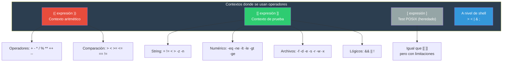
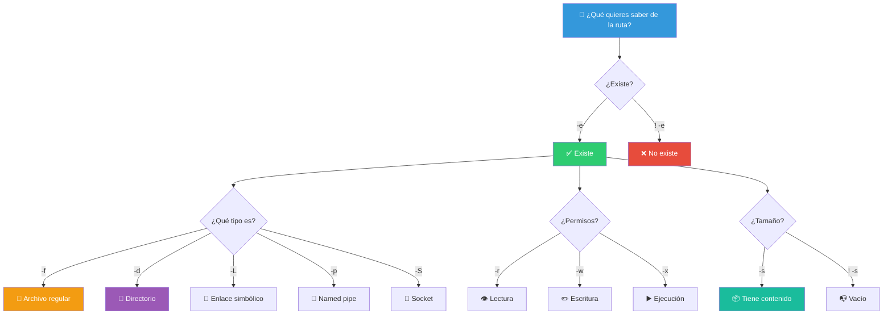
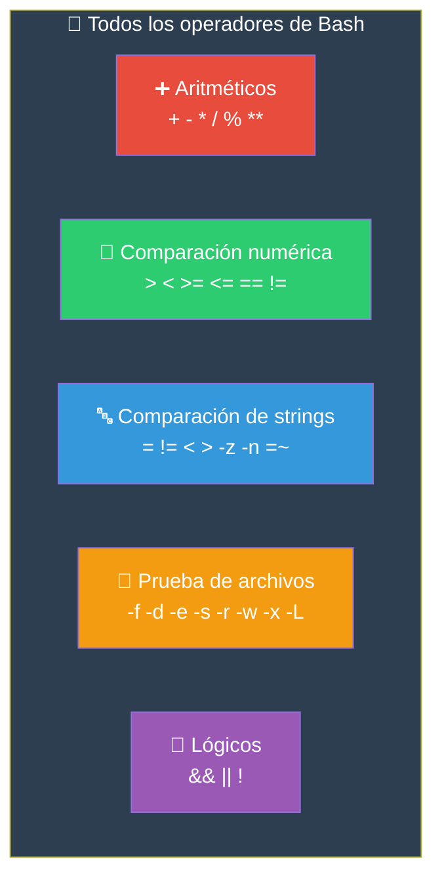

# Operadores de Bash

Los operadores en Bash se dividen en varias categorías. Algunos se usan con `[[ ]]`, otros con `(( ))`, y otros con `[ ]`. Esta guía los organiza por tipo y contexto.

## Contextos de operadores



---

## Aritméticos

Se usan dentro de `(( ))` o `$(( ))`.

### Operadores básicos

```bash
echo $((2 + 3))          # 5   Suma
echo $((10 - 4))         # 6   Resta
echo $((3 * 4))          # 12  Multiplicación
echo $((20 / 6))         # 3   División entera
echo $((20 % 6))         # 2   Módulo (resto de la división)
echo $((2 ** 10))        # 1024 Potencia
```

### Asignación compuesta

```bash
x=10
((x += 5))              # x = 15  (x = x + 5)
((x -= 3))              # x = 12  (x = x - 3)
((x *= 2))              # x = 24  (x = x * 2)
((x /= 4))              # x = 6   (x = x / 4)
((x %= 4))              # x = 2   (x = x % 4)
```

### Incremento y decremento

```bash
i=5
echo $((i++))            # 5 (post-incremento: usa el valor y luego incrementa)
echo $i                  # 6
echo $((++i))            # 7 (pre-incremento: incrementa y luego usa)
echo $((i--))            # 7 (post-decremento)
echo $i                  # 6
```

### Bitwise

```bash
echo $((5 & 3))          # 1   AND bitwise  (101 & 011 = 001)
echo $((5 | 3))          # 7   OR bitwise   (101 | 011 = 111)
echo $((5 ^ 3))          # 6   XOR bitwise  (101 ^ 011 = 110)
echo $((~5))             # -6  NOT bitwise  (complemento a 2)
echo $((5 << 1))         # 10  Shift izquierdo (5 * 2)
echo $((5 >> 1))         # 2   Shift derecho  (5 / 2)
```

### Tabla de operadores aritméticos

| Operador | Significado | Ejemplo | Resultado |
|----------|-------------|---------|-----------|
| `+` | Suma | `$((5 + 3))` | 8 |
| `-` | Resta | `$((5 - 3))` | 2 |
| `*` | Multiplicación | `$((5 * 3))` | 15 |
| `/` | División entera | `$((7 / 3))` | 2 |
| `%` | Módulo | `$((7 % 3))` | 1 |
| `**` | Potencia | `$((2 ** 3))` | 8 |
| `++` | Incremento | `((i++))` | i + 1 |
| `--` | Decremento | `((i--))` | i - 1 |

---

## Comparación

Bash tiene **tres formas** de comparar, cada una con su propia sintaxis:

### `(( ))` — Comparación numérica (Bash 3+)

```bash
x=10
y=5

(( x > y ))   && echo "x > y"    # Mayor que
(( x >= y ))  && echo "x >= y"   # Mayor o igual
(( x < y ))   && echo "x < y"    # Menor que
(( x <= y ))  && echo "x <= y"   # Menor o igual
(( x == y ))  && echo "x == y"   # Igual
(( x != y ))  && echo "x != y"   # Distinto
```

### `[[ ]]` — Comparación con operadores (Bash 3+)

```bash
# Numéricos (con operadores de [ ])
[[ "$x" -gt "$y" ]]   && echo "x > y"    # Greater than
[[ "$x" -ge "$y" ]]   && echo "x >= y"   # Greater or equal
[[ "$x" -lt "$y" ]]   && echo "x < y"    # Less than
[[ "$x" -le "$y" ]]   && echo "x <= y"   # Less or equal
[[ "$x" -eq "$y" ]]   && echo "x == y"   # Equal
[[ "$x" -ne "$y" ]]   && echo "x != y"   # Not equal

# Comparación mixta (numérica en [[ ]])
# [[ ]] usa operadores de string para string y -eq para números
```

### `[ ]` — Comparación POSIX (heredada)

```bash
# Idéntico a [[ ]] pero más limitado
[ "$x" -gt "$y" ]
[ "$x" -eq "$y" ]
```

```mermaid
flowchart TB
    Pregunta["¿Qué comparas?"] --> Tipo

    Tipo -->|"Números"| Num{"¿Qué shell?"}
    Num -->|"Bash moderno"| DobleParen["(( x > y ))<br/>✅ Recomendado"]
    Num -->|"POSIX / portátil"| DashGT["[ \"$x\" -gt \"$y\" ]"]

    Tipo -->|"Strings"| String
    String -->|"Bash"| DobleBracket["[[ \"$a\" = \"$b\" ]]<br/>✅ Recomendado"]
    String -->|"POSIX"| Bracket["[ \"$a\" = \"$b\" ]"]

    style Pregunta fill:#3498DB,color:#fff
    style DobleParen fill:#2ECC71,color:#fff
    style DobleBracket fill:#2ECC71,color:#fff
    style DashGT fill:#F39C12,color:#fff
    style Bracket fill:#F39C12,color:#fff
```

### Tabla de operadores de comparación

| Propósito | `(( ))` | `[[ ]]` / `[ ]` | Notas |
|-----------|---------|-----------------|-------|
| Igual | `==` | `-eq` (nums) / `=` (str) | `=` y `==` son equivalentes en `[[ ]]` |
| Distinto | `!=` | `-ne` (nums) / `!=` (str) | |
| Mayor | `>` | `-gt` | |
| Mayor o igual | `>=` | `-ge` | |
| Menor | `<` | `-lt` | |
| Menor o igual | `<=` | `-le` | |

---

## Operadores de Strings

Se usan dentro de `[[ ]]` o `[ ]`.

### Comparación

```bash
a="hola"
b="mundo"
c="hola"

[[ "$a" = "$c" ]]          # true (igualdad)
[[ "$a" == "$c" ]]         # true (sinónimo de =)
[[ "$a" != "$b" ]]         # true (distinto)

# Orden alfabético
[[ "$a" < "$b" ]]          # true (hola < mundo alfabéticamente)
[[ "$a" > "$b" ]]          # false

# En [ ] solo = y !=, no < >
[ "$a" = "$c" ]            # true
```

### Patrones (solo en `[[ ]]`)

```bash
[[ "$archivo" == *.txt ]]      # true si termina en .txt
[[ "$archivo" == foto* ]]      # true si empieza con foto
[[ "$archivo" == ?ata* ]]      # true si empieza con un carácter + ata
[[ "$archivo" == [a-z]* ]]     # true si empieza con minúscula
```

### Expresiones regulares (solo en `[[ ]]`)

```bash
[[ "$email" =~ ^[a-z]+@[a-z]+\.[a-z]{2,}$ ]] && echo "Email válido"
[[ "$ip" =~ ^[0-9]{1,3}\.[0-9]{1,3}\.[0-9]{1,3}\.[0-9]{1,3}$ ]] && echo "IP válida"
[[ "$fecha" =~ ^[0-9]{4}-[0-9]{2}-[0-9]{2}$ ]] && echo "Formato ISO"
```

### Estado del string

```bash
[[ -z "$var" ]]          # true si var está vacía (longitud 0)
[[ -n "$var" ]]          # true si var NO está vacía (longitud > 0)

# Útil para validar argumentos
if [[ -z "$1" ]]; then
    echo "Se requiere un argumento"
    exit 1
fi
```

### Tabla de operadores de strings

| Operador | Contexto | Verdadero si... |
|----------|----------|-----------------|
| `=` | `[[ ]]`, `[ ]` | Strings iguales |
| `==` | `[[ ]]` | Strings iguales (en `[ ]` no existe) |
| `!=` | `[[ ]]`, `[ ]` | Strings distintos |
| `<` | `[[ ]]` | `a` es alfabéticamente menor que `b` |
| `>` | `[[ ]]` | `a` es alfabéticamente mayor que `b` |
| `-z` | `[[ ]]`, `[ ]` | String vacío |
| `-n` | `[[ ]]`, `[ ]` | String no vacío |
| `=~` | `[[ ]]` | Coincide con regex |

---

## Lógicos

Combinan o niegan condiciones.

### `&&` — AND (y)

```bash
[[ "$edad" -ge 18 ]] && [[ "$tiene_permiso" = "si" ]]
# Ambas deben ser true

# También funciona en [[ ]] con && interno:
[[ "$edad" -ge 18 && "$tiene_permiso" = "si" ]]

# En (( )):
(( x > 5 && y < 10 ))

# Cortocircuito fuera de [[ ]]:
[[ -f "$archivo" ]] && echo "El archivo existe"   # Solo imprime si es true
```

### `||` — OR (o)

```bash
[[ "$rol" = "admin" || "$rol" = "superadmin" ]]
# Al menos una debe ser true

# Cortocircuito:
[[ -f "$archivo" ]] || echo "El archivo NO existe"
```

### `!` — NOT (negación)

```bash
[[ ! -f "$archivo" ]]               # true si archivo NO existe
[[ ! "$nombre" = "Ana" ]]           # true si NO es "Ana"
[[ ! ( "$x" -gt 5 && "$y" -lt 10) ]] # niega la expresión completa
```

### Prioridad lógica


```bash
# Sin paréntesis: && se evalúa antes que ||
[[ "$x" -gt 5 && "$y" -lt 10 || "$z" -eq 0 ]]
# Se lee como: ((x > 5 AND y < 10) OR (z == 0))

# Con paréntesis para claridad
[[ ( "$x" -gt 5 && "$y" -lt 10 ) || "$z" -eq 0 ]]
```

### Tabla de verdad

| A | B | `A && B` | `A \|\| B` | `!A` |
|---|----|----------|-------------|------|
| true | true | true | true | false |
| true | false | false | true | false |
| false | true | false | true | true |
| false | false | false | false | true |

---

## Prueba de Archivos

Se usan dentro de `[[ ]]` o `[ ]` para probar propiedades de archivos.

```bash
# Existencia y tipo
[[ -e "$ruta" ]]     # Existe (archivo o directorio)
[[ -f "$ruta" ]]     # Existe y es archivo regular
[[ -d "$ruta" ]]     # Existe y es directorio
[[ -L "$ruta" ]]     # Existe y es enlace simbólico
[[ -b "$ruta" ]]     # Es dispositivo de bloques
[[ -c "$ruta" ]]     # Es dispositivo de caracteres
[[ -p "$ruta" ]]     # Es un named pipe (FIFO)
[[ -S "$ruta" ]]     # Es un socket

# Permisos
[[ -r "$ruta" ]]     # Tiene permiso de lectura
[[ -w "$ruta" ]]     # Tiene permiso de escritura
[[ -x "$ruta" ]]     # Tiene permiso de ejecución
[[ -u "$ruta" ]]     # Tiene setuid activado
[[ -g "$ruta" ]]     # Tiene setgid activado
[[ -k "$ruta" ]]     # Tiene sticky bit activado

# Tamaño y contenido
[[ -s "$ruta" ]]     # Existe y NO está vacío (tamaño > 0)
[[ -N "$ruta" ]]     # Fue modificado desde la última lectura

# Comparación entre archivos
[[ "$a" -nt "$b" ]]  # a es más nuevo que b (newer than)
[[ "$a" -ot "$b" ]]  # a es más antiguo que b (older than)
[[ "$a" -ef "$b" ]]  # a y b son el mismo archivo (mismo inode)
```

### Mapa de operadores de archivo



### Ejemplos prácticos

```bash
# Validar que un archivo existe antes de procesarlo
if [[ ! -f "$archivo" ]]; then
    echo "Error: $archivo no existe" >&2
    exit 1
fi

# Validar permisos
if [[ ! -r "$archivo" ]]; then
    echo "No tengo permiso de lectura"
fi

# Backup si el archivo no está vacío
if [[ -s "$archivo" ]]; then
    cp "$archivo" "$archivo.bak"
fi

# Crear directorio si no existe
if [[ ! -d "$directorio" ]]; then
    mkdir -p "$directorio"
fi

# Verificar escritura en directorio temporal
if [[ ! -w /tmp ]]; then
    echo "/tmp no es escribible" >&2
    exit 1
fi
```

---

## Tabla resumen general



> **💡 Recomendación**: Usa `(( ))` para aritmética y comparación numérica. Usa `[[ ]]` para strings, archivos y lógica. Evita `[ ]` a menos que necesites compatibilidad POSIX estricta. `[[ ]]` es más potente (regex, patrones) y menos propenso a errores que `[ ]`.

## Relacionados:
- [[tipos-de-datos-bash]] #anterior 
- [[entradas-salidas-script-bash]] #siguiente 