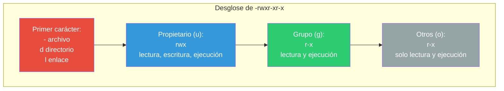
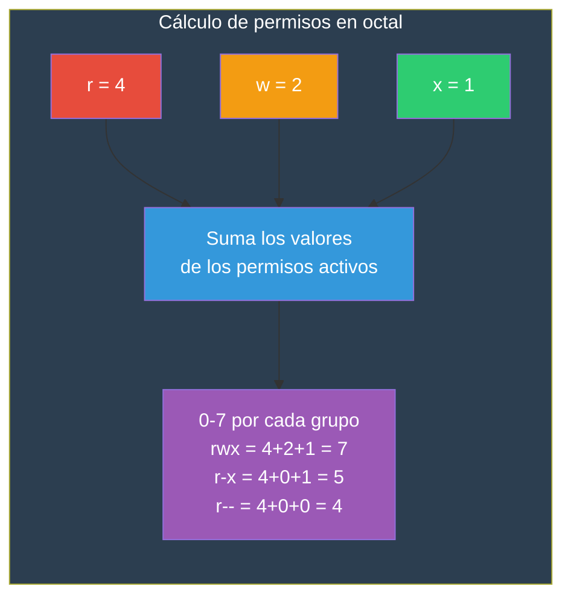
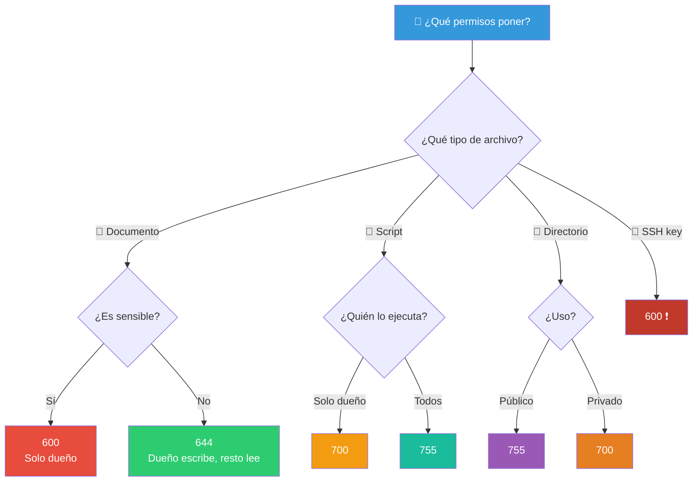
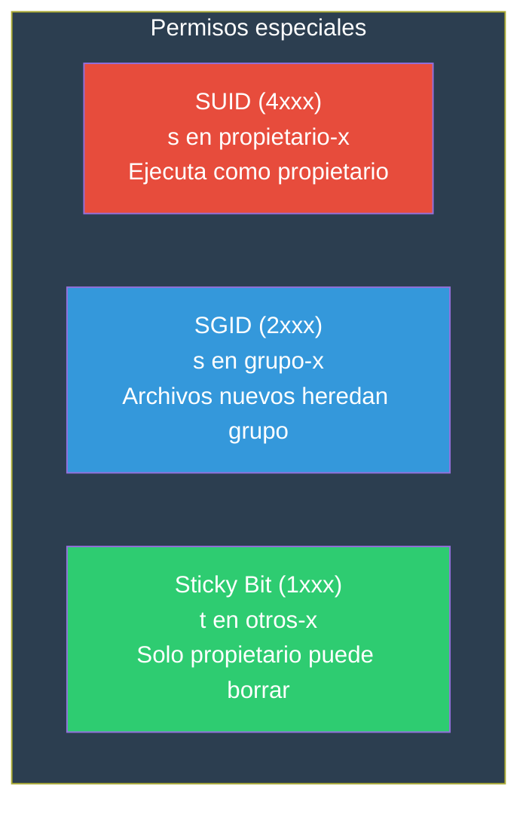

# Permiso de Archivos

Linux es un sistema multiusuario. Los permisos controlan quién puede leer, escribir o ejecutar cada archivo y directorio.

## ¿Cómo se ven los permisos?

```bash
$ ls -l
-rwxr-xr-x  1 ana  developers  4096 May 30 10:00 script.sh
drwxr-xr-x  2 ana  developers  4096 May 30 09:00 documentos/
```



---

## `rwx` — Los tres permisos

### Para archivos

| Permiso | Letra | Efecto |
|---------|-------|--------|
| **r** (read) | `r` | Ver el contenido del archivo |
| **w** (write) | `w` | Modificar el contenido del archivo |
| **x** (execute) | `x` | Ejecutar el archivo (si es un programa/script) |

### Para directorios

| Permiso | Letra | Efecto |
|---------|-------|--------|
| **r** (read) | `r` | Listar el contenido (`ls`) |
| **w** (write) | `w` | Crear, renombrar o eliminar archivos dentro |
| **x** (execute) | `x` | Entrar al directorio (`cd`), acceder a archivos |

> **⚠️ Importante**: En directorios, `r` sin `x` permite listar pero no acceder a los archivos. `x` sin `r` permite acceder si sabes el nombre exacto pero no listar.

### Combinaciones típicas en directorios

```bash
r-x   # Puedes entrar y listar, pero no crear/borrar archivos
rwx   # Control total sobre el directorio
r--   # Puedes listar pero no entrar (inútil solo)
--x   # Puedes entrar si conoces el nombre, pero no listar
```

---

## `chmod` — Change Mode

Cambia los permisos de archivos y directorios.

### Modo simbólico

```bash
# Sintaxis: chmod [quién][operador][permiso] archivo

# Quién
u    # propietario (user)
g    # grupo (group)
o    # otros (others)
a    # todos (all) — equivale a ugo

# Operador
+    # añade permiso
-    # quita permiso
=    # asigna exactamente estos permisos

# Permiso
r    # lectura
w    # escritura
x    # ejecución
```

```bash
# Ejemplos
chmod u+x script.sh          # Añade ejecución al propietario
chmod go-w archivo.txt       # Quita escritura a grupo y otros
chmod a+r documento.pdf      # Todos pueden leer
chmod u=rw,go=r archivo.txt  # Prop: rw, Grupo: r, Otros: r
chmod u+x,go-wx script.sh    # Prop: +x, Grupo y otros: -wx
chmod -R u+rx directorio/    # Recursivo: todos dentro del directorio
```

### Modo octal (numérico)



| Octal | Binario | rwx | Significado |
|-------|---------|-----|-------------|
| 0 | 000 | `---` | Ningún permiso |
| 1 | 001 | `--x` | Solo ejecución |
| 2 | 010 | `-w-` | Solo escritura |
| 3 | 011 | `-wx` | Escritura y ejecución |
| 4 | 100 | `r--` | Solo lectura |
| 5 | 101 | `r-x` | Lectura y ejecución |
| 6 | 110 | `rw-` | Lectura y escritura |
| 7 | 111 | `rwx` | Todos los permisos |

```bash
# Ejemplos con octal
chmod 755 script.sh          # rwxr-xr-x (prop: todo, grupo: rx, otros: rx)
chmod 644 documento.txt      # rw-r--r-- (prop: rw, grupo: r, otros: r)
chmod 700 secreto.sh         # rwx------ (solo propietario)
chmod 600 password.txt       # rw------- (solo propietario)
chmod 777 publico.txt        # rwxrwxrwx ⚠️ (todos pueden todo — inseguro)
chmod 400 clave.pem          # r-------- (solo lectura propietario)
chmod 755 directorio/        # Para directorios
```

### Permisos comunes y su uso

```bash
# Scripts
chmod 755 script.sh          # ✅ Ejecutable para todos
chmod 700 script.sh          # ✅ Ejecutable solo para el dueño

# Archivos de texto
chmod 644 README.md          # ✅ Lectura para todos, escritura para dueño

# SSH keys (deben ser 600 o 400)
chmod 600 ~/.ssh/id_rsa      # ✅ Obligatorio para claves privadas
chmod 644 ~/.ssh/id_rsa.pub  # ✅ Clave pública

# Directorios (deben tener +x para permitir acceso)
chmod 755 ~/public_html/     # ✅ Directorio web accesible
chmod 700 ~/privado/         # ✅ Solo el dueño

# Archivos sensibles
chmod 600 .env               # ✅ Variables de entorno
chmod 600 .pgpass            # ✅ Contraseñas de PostgreSQL
```

### Mapa de decisión



---

## `chown` — Change Owner

Cambia el **propietario** (y opcionalmente el grupo) de un archivo o directorio.

```bash
# Sintaxis
chown usuario archivo              # Cambia propietario
chown usuario:grupo archivo        # Cambia propietario y grupo
chown :grupo archivo               # Cambia solo el grupo
chown -R usuario directorio/       # Recursivo
```

```bash
# Ejemplos
sudo chown ana documento.txt       # ana pasa a ser propietaria
sudo chown ana:developers app/      # ana y grupo developers
sudo chown -R www-data:www-data /var/www/   # Todo el directorio web

# Solo root puede chown (por seguridad)
# Si eres root, también puedes transferir propiedad a otros
```

---

## `chgrp` — Change Group

Cambia solo el **grupo** de un archivo o directorio.

```bash
# Sintaxis
chgrp grupo archivo              # Cambia el grupo
chgrp -R grupo directorio/       # Recursivo
chgrp -R --reference=ref.txt archivo  # Copia el grupo de ref.txt
```

```bash
# Ejemplos
chgrp developers script.sh       # El grupo ahora es developers
chgrp -R www-data /var/www/      # Grupo www-data recursivo
chgrp staff *.txt                # Todos los txt al grupo staff

# Si eres propietario, puedes cambiar el grupo a cualquiera del que seas miembro
```

---

## Permisos especiales

### SUID, SGID, Sticky Bit



```bash
# SUID — el archivo se ejecuta con los permisos del propietario
chmod u+s programa       # rwsr-xr-x
chmod 4755 programa      # En octal

# SGID — los archivos creados heredan el grupo del directorio
chmod g+s directorio/    # rwxr-sr-x
chmod 2755 directorio/   # En octal

# Sticky Bit — solo el propietario puede borrar (como /tmp)
chmod +t directorio/     # rwxrwxrwt
chmod 1777 /tmp          # En octal

# Usos reales
# SUID: /usr/bin/passwd (usuario normal cambia su password)
# SGID: directorios compartidos donde los archivos deben heredar el grupo
# Sticky: /tmp — todos pueden crear archivos, pero no borrar los de otros
```

---

## Ver permisos

```bash
# Ver permisos
ls -l archivo                    # Formato detallado
ls -la                           # Incluye archivos ocultos
stat archivo                     # Información completa
stat -c "%a %A %U %G" archivo   # Formato personalizado: octal, simbólico, usuario, grupo

# Buscar archivos por permisos
find . -perm 600                 # Archivos con permisos exactos
find . -perm /600                # Archivos con al menos esos permisos
find . -perm -600                # Archivos que tienen esos permisos (y posiblemente más)
find . -type f -perm /o=w       # Archivos que otros pueden escribir
find . -type f ! -perm 644      # Archivos que NO tienen permisos 644
```

---

## Resolución de problemas comunes

```bash
# "Permission denied" al ejecutar script
chmod +x script.sh          # Falta permiso de ejecución

# "Permission denied" al leer archivo
chmod +r archivo.txt        # Falta permiso de lectura
sudo chown tu_usuario: archivo.txt  # O cambia el propietario

# "Permission denied" al entrar a directorio
chmod +x directorio/        # Falta permiso de ejecución en el directorio

# "Operation not permitted" al cambiar permisos
sudo chmod ...              # Necesitas ser root o el propietario

# SSH: "Permissions 0777 for 'id_rsa' are too open"
chmod 600 ~/.ssh/id_rsa     # Las claves privadas deben ser 600

# Todos los archivos de un directorio deben ser legibles
chmod -R a+r ~/public/      # Recursivo: lectura para todos
chmod -R a+X ~/public/      # +X (mayúscula): +x solo para directorios
```

---

## Tabla resumen de permisos

```bash
# Notación octal
  0  ---     4  r--
  1  --x     5  r-x
  2  -w-     6  rw-
  3  -wx     7  rwx

# Combinaciones típicas
chmod 600  # rw-------   Solo propietario (archivos sensibles)
chmod 644  # rw-r--r--   Documentos públicos
chmod 700  # rwx------   Solo propietario (scripts/dirs privados)
chmod 755  # rwxr-xr-x   Scripts y directorios públicos
chmod 777  # rwxrwxrwx   ⚠️ Inseguro, evitar

# Comandos clave
chmod 755 archivo    # Permisos en octal
chmod u+x archivo    # Añadir ejecución al propietario
chown ana archivo    # Cambiar propietario
chgrp dev archivo    # Cambiar grupo
```

> **🔐 Regla de oro**: Da el **mínimo permiso necesario** para que cada archivo funcione. Los scripts van en 755 como máximo. Los datos van en 644. Las claves SSH van en 600. Los directorios compartidos usan SGID. `chmod -R a+X` pone +x solo en directorios (útil para arreglar permisos recursivamente sin marcar archivos como ejecutables).

## Relacionados:
- [[argumento-de-scripts]] #anterior 
- [[condicionales-bash]] #siguiente 