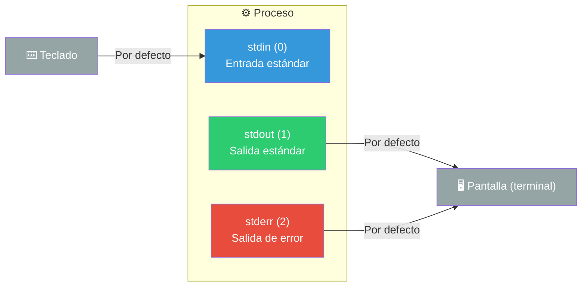
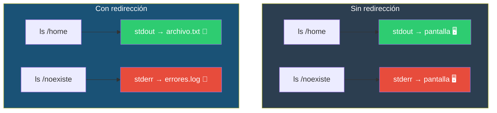
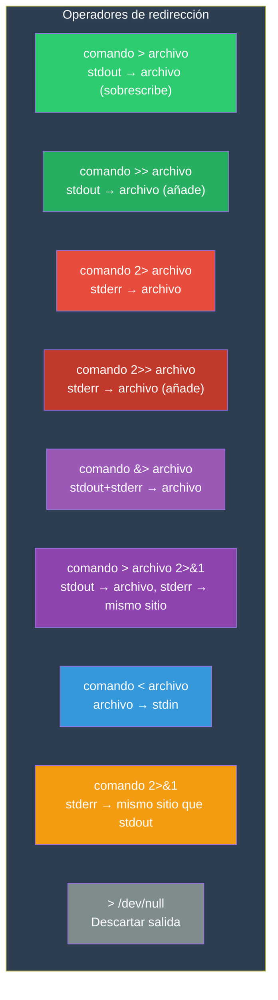
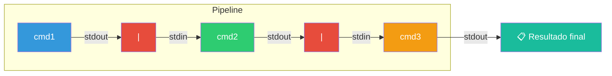
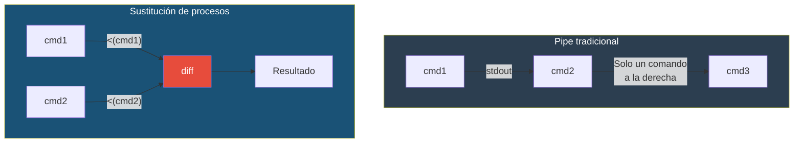

# Redirección y Pipelines

La redirección y los pipelines (tuberías) son el corazón de la filosofía UNIX: programas pequeños que hacen una cosa bien y se comunican entre sí.

## `stdin, stdout, stderr`

Cada proceso en Linux tiene tres flujos de datos estándar:



| Flujo | Número (FD) | Propósito | Por defecto |
|-------|-------------|-----------|-------------|
| `stdin` | 0 | Entrada estándar | Teclado |
| `stdout` | 1 | Salida estándar | Terminal (pantalla) |
| `stderr` | 2 | Salida de error | Terminal (pantalla) |

Los **descriptores de archivo** (FD) son números que identifican cada flujo. La redirección consiste en cambiar el destino u origen de estos flujos.

### Ejemplo

```bash
# Sin redirección: todo va a la pantalla
ls /home
# stdout → pantalla, se ve el listado

ls /directorio_inexistente
# stderr → pantalla: ls: cannot access '/directorio_inexistente': No such file or directory
```



---

## Redirección de salida

Redirige **stdout** (descriptor 1) a un archivo.

### `>` — Sobrescribir

```bash
# Sintaxis: comando > archivo
ls -la > listado.txt          # Guarda la salida de ls en listado.txt
echo "Hola mundo" > saludo.txt  # Crea/escribe saludo.txt
date > fecha.txt              # Guarda la fecha actual
```

**⚠️ Atención**: `>` **sobrescribe** el archivo si existe. Para no perder contenido accidentalmente, usa `>` en combinación con `set -o noclobber`:

```bash
set -o noclobber    # Evita sobrescribir con >
echo "texto" > archivo.txt  # Error: cannot overwrite existing file
echo "texto" >| archivo.txt # Fuerza sobrescritura (>| omite noclobber)
```

### `>>` — Añadir (append)

```bash
# Sintaxis: comando >> archivo
echo "nueva línea" >> log.txt   # Añade al final del archivo
date >> historial.log           # Agrega la fecha sin borrar lo anterior
```

### Ejemplo combinado

```bash
echo "=== Inicio ===" > bitacora.txt      # Crea el archivo
date >> bitacora.txt                      # Añade fecha
ls -la >> bitacora.txt                    # Añade listado
echo "=== Fin ===" >> bitacora.txt        # Añade fin
```

---

## Redirección de entrada

Redirige **stdin** (descriptor 0) desde un archivo.

### `<` — Leer desde archivo

```bash
# Sintaxis: comando < archivo
sort < palabras.txt           # Ordena el contenido de palabras.txt
wc -l < datos.txt             # Cuenta líneas de datos.txt
grep "error" < log.txt        # Busca "error" en log.txt

# Equivalencia (pero con archivo como argumento):
sort palabras.txt             # sort abre el archivo directamente
sort < palabras.txt           # la shell abre el archivo y se lo pasa a sort
```

### `<<` — Here Document

Permite escribir entrada directamente en el script, sin archivo externo.

```bash
# Sintaxis: comando << DELIMITADOR
#           líneas de entrada
#           DELIMITADOR

cat << EOF
Este es un texto
que ocupa varias líneas
y termina con el delimitador
EOF

# Con variables expandidas:
nombre="Ana"
cat << EOF
Hola, $nombre
Hoy es $(date)
EOF

# Sin expandir variables (con comillas en el delimitador):
cat << 'EOF'
$HOME no se expande
$(date) no se ejecuta
EOF
```

### `<<<` — Here String (Bash 3+)

Pasa una cadena como entrada a un comando.

```bash
# Sintaxis: comando <<< "cadena"
grep "error" <<< "todo ok\nhay un error\nfin"
# Salida: hay un error

bc <<< "2 + 3 * 4"
# Salida: 14

# Útil para evitar pipes innecesarios:
echo "2 + 3 * 4" | bc   # Alternativa con pipe
bc <<< "2 + 3 * 4"      # Más limpio
```

---

## Redirección de errores

Redirige **stderr** (descriptor 2). Por defecto, los errores se mezclan con la salida normal en la pantalla.

### `2>` — Redirigir errores solos

```bash
# Sintaxis: comando 2> archivo
ls /existe /noexiste 2> errores.log
# stdout → pantalla: listado de /existe
# stderr → errores.log: el error de /noexiste

# Silenciar errores
grep -r "root" /etc/ 2>/dev/null
# /dev/null es el "agujero negro" de Linux: todo lo que se envía allí se descarta
```

### `&>` — Redirigir stdout y stderr (Bash 4+)

```bash
# Sintaxis: comando &> archivo
ls /existe /noexiste &> todo.log
# Tanto stdout como stderr van a todo.log

# También funciona:
ls /existe /noexiste > todo.log 2>&1
```

### Redirigir stderr a stdout

```bash
# Sintaxis: comando 2>&1
ls /existe /noexiste > salida.log 2>&1
# 1. > salida.log → redirige stdout a salida.log
# 2. 2>&1 → redirige stderr al mismo sitio que stdout (salida.log)

# En Bash 4+ también:
ls /existe /noexiste &> salida.log   # Equivalente, más simple
```

### Combinaciones útiles

```bash
# Descartar todo
comando &>/dev/null
comando >/dev/null 2>&1

# Guardar salida, descartar errores
comando > salida.txt 2>/dev/null

# Guardar errores, descartar salida
comando 2> error.log >/dev/null

# Guardar en dos archivos separados
comando > salida.txt 2> error.log
```

### Tabla de operadores



---

## Pipes (tuberías)

Un **pipe** (`|`) conecta el stdout de un comando con el stdin del siguiente. Es la herramienta más poderosa de la shell.



### Sintaxis

```bash
comando1 | comando2 | comando3 | ...
```

### Ejemplos básicos

```bash
# Pasar salida a otro comando
ls -la | less                 # Listado paginado
ls -la | wc -l                # Contar archivos
cat archivo.txt | grep "error"  # Buscar en archivo
ps aux | grep bash            # Buscar proceso bash

# Múltiples pipes
cat log.txt | grep "ERROR" | head -n 10
# 1. Lee log.txt
# 2. Filtra líneas con "ERROR"
# 3. Muestra solo las primeras 10

ls -la | sort -k5 -n | tail -n 5
# 1. Lista archivos
# 2. Ordena por tamaño (columna 5, numérico)
# 3. Muestra los 5 más grandes
```

### Patrones comunes con pipes

```bash
# Buscar y contar
grep "error" app.log | wc -l         # ¿Cuántos errores hay?

# Buscar y ordenar
cat palabras.txt | sort | uniq       # Ordenar y eliminar duplicados
cat palabras.txt | sort | uniq -c | sort -rn   # Frecuencia de palabras

# Encadenar procesamiento
ps aux | grep python | grep -v grep | awk '{print $2}'
# Procesos python, quitando el propio grep, mostrando solo PIDs

# Estadísticas
cat ventas.csv | cut -d',' -f3 | sort | uniq -c | sort -rn | head
# Top de productos más vendidos desde un CSV
```

### Redirigir errores en un pipeline

Por defecto, el pipe solo conecta **stdout**. El **stderr** sigue yendo a la pantalla:

```bash
# stderr no pasa por el pipe
ls /existe /noexiste | grep "error"       # stderr se ve en pantalla

# Para capturar también errores en el pipe:
ls /existe /noexiste 2>&1 | grep "error"  # stderr se une a stdout
ls /existe /noexiste |& grep "error"      # Equivalente (Bash 4+)
```

### Tuberías con nombre (named pipes)

Los pipes que hemos visto son **anónimos** (solo viven mientras dura el comando). También existen **named pipes** (FIFO) que persisten como archivos:

```bash
# Crear un named pipe
mkfifo mi_pipe

# Usarlo
cat archivo.txt > mi_pipe &  # Escribe al pipe (en segundo plano)
grep "error" < mi_pipe        # Lee del pipe

# Es útil para comunicación entre procesos
ls -la > mi_pipe &
sort -k5 -n < mi_pipe
```

---

## Sustitución de comandos

La **sustitución de comandos** permite usar la salida de un comando como argumento o parte de otro comando.

### Sintaxis

```bash
# Sintaxis moderna (recomendada)
$(comando)

# Sintaxis antigua (obsoleta, evitar)
`comando`
```

### Ejemplos

```bash
# Guardar la salida en una variable
fecha=$(date +%d/%m/%Y)
echo "Hoy es $fecha"

# Usar como argumento
echo "Estás en: $(pwd)"
echo "Hay $(ls | wc -l) archivos aquí"

# Anidación (anidar $() es más fácil que ``)
dir=$(dirname $(which bash))
echo "Bash está en: $dir"

# Ejemplos prácticos
kill -9 $(pgrep firefox)         # Mata todos los procesos firefox
cd $(mktemp -d)                  # Crea y entra en un directorio temporal
diff $(which bash) $(which zsh)  # Compara dos ejecutables
tar -czf backup-$(date +%Y%m%d).tar.gz ~/documentos
```

### `$(())` — Sustitución aritmética

```bash
echo $((2 + 3))                  # 5
echo $(( (10 + 5) * 2 ))         # 30
x=5; echo $((x * 2))             # 10
echo $((2**10))                   # 1024 (potencia)
```

---

## Procesar sustitución (Process Substitution)

La **sustitución de procesos** permite tratar la salida de un comando como si fuera un archivo. Disponible en Bash, zsh, ksh.

### Sintaxis

```bash
<(comando)   # Trata la salida como archivo (para lectura)
>(comando)   # Trata la entrada como archivo (para escritura)
```

### ¿Para qué sirve?

Algunos comandos esperan archivos como argumentos (no aceptan pipes). Con process substitution puedes pasarles la salida de otros comandos:

```bash
# diff espera dos archivos, no acepta pipes
diff <(ls dir1) <(ls dir2)
# Compara el contenido de dos directorios sin crear archivos temporales

# Otros ejemplos
diff <(grep "foo" file1) <(grep "foo" file2)
comm <(sort lista1.txt) <(sort lista2.txt)
paste <(cut -d',' -f1 datos.csv) <(cut -d',' -f3 datos.csv)
```

### Process substitution vs pipe



### Ejemplo con escritura (`>`)

```bash
# Redirigir a múltiples destinos simultáneamente
tee >(gzip > archivo.gz) >(bzip2 > archivo.bz2) < archivo.txt
# tee envía el contenido de archivo.txt a dos procesos en paralelo
```

---

## Tabla resumen de operadores

| Operador | Función | Ejemplo |
|----------|---------|---------|
| `>` | Redirige stdout, sobrescribe | `ls > archivos.txt` |
| `>>` | Redirige stdout, añade | `echo "nuevo" >> log.txt` |
| `<` | Redirige stdin desde archivo | `sort < datos.txt` |
| `2>` | Redirige stderr | `cmd 2> error.log` |
| `2>>` | Redirige stderr, añade | `cmd 2>> error.log` |
| `&>` | Redirige stdout+stderr | `cmd &> todo.log` |
| `2>&1` | stderr al mismo sitio que stdout | `cmd > log 2>&1` |
| `\|` | Pipe: stdout → stdin del siguiente | `ls \| grep txt` |
| `\|&` | Pipe con stdout+stderr | `cmd \|& grep error` |
| `$(cmd)` | Sustitución de comando | `echo $(date)` |
| `$((expr))` | Sustitución aritmética | `echo $((2+2))` |
| `<(cmd)` | Procesar sustitución (lectura) | `diff <(ls a) <(ls b)` |
| `>(cmd)` | Procesar sustitución (escritura) | `tee >(gzip) < archivo` |
| `<< EOF` | Here document | `cat << EOF > archivo` |
| `<<< "str"` | Here string | `grep foo <<< "texto"` |

---

## Ejemplo integrador

```bash
# Pipeline completo: análisis de logs
#
# Objetivo: Encontrar las 5 IPs que más requests
# han hecho en un archivo de log de Apache

cat access.log |          # 1. Lee el archivo de log
  grep " 200 " |          # 2. Solo peticiones exitosas
  awk '{print $1}' |      # 3. Extrae la IP (primer campo)
  sort |                   # 4. Ordena
  uniq -c |                # 5. Cuenta ocurrencias por IP
  sort -rn |               # 6. Ordena numéricamente descendente
  head -5                  # 7. Top 5
```

> **📐 Filosofía UNIX**: Cada comando hace una cosa y la hace bien. Los pipes son los que permiten combinarlos para crear procesamientos complejos. Cuando te encuentres haciendo una tarea repetitiva, pregúntate: ¿puedo resolverla con un pipeline de comandos existentes?

## Relacionados:
- [[acciones-comunes-shells]] #anterior 
- [[trabajando-con-textos-en-bash]] #siguiente 
- [[07-redirecciones-y-manejo-de-errores]] #related