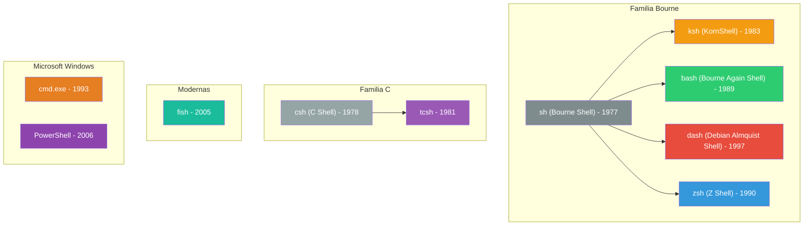
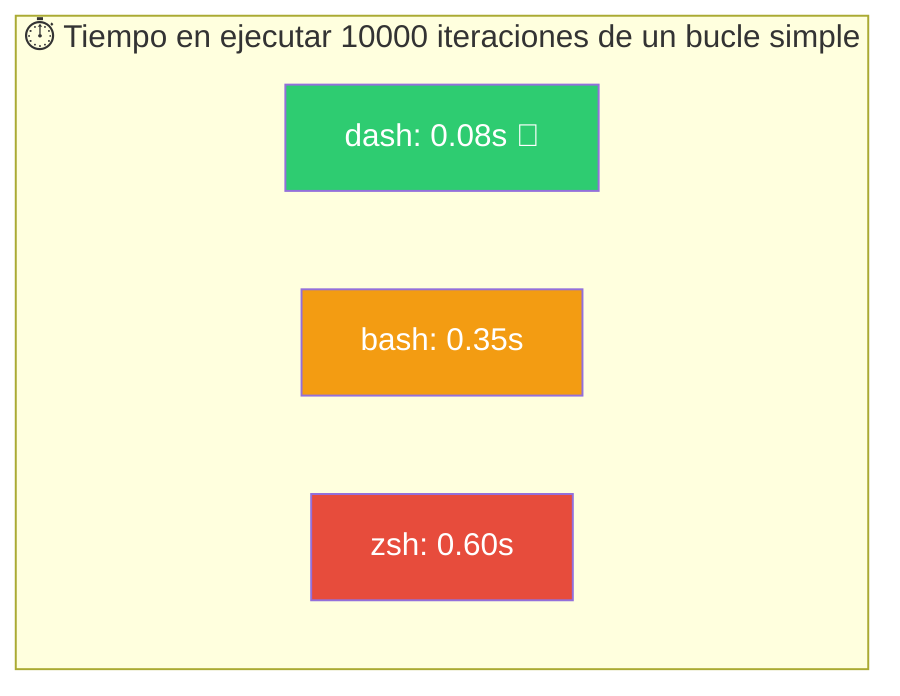
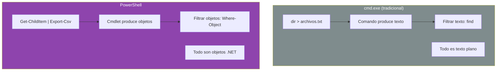
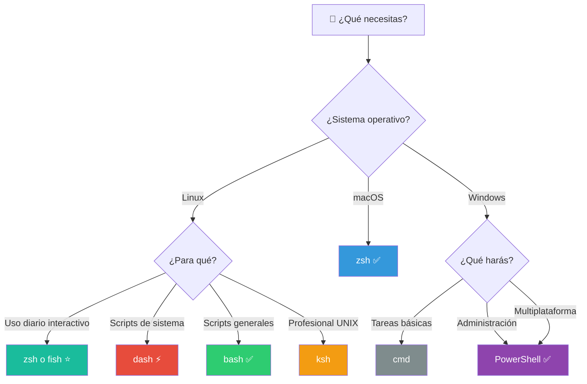

# Shells populares

Una **shell** es un intérprete de comandos. Cada shell tiene su propia sintaxis, características y filosofía. Esta guía compara las más populares.

## Árbol genealógico de las shells



## Comparativa rápida

```mermaid
flowchart LR
    subgraph Linux[/Linux/]
        bash2[bash<br/>⭐⭐⭐⭐⭐]
        dash2[dash<br/>⭐⭐⭐]
        zsh2[zsh<br/>⭐⭐⭐⭐]
        fish2[fish<br/>⭐⭐⭐]
    end

    subgraph macOS[/macOS/]
        bash3[bash<br/>⭐⭐⭐⭐]
        zsh3[zsh<br/>⭐⭐⭐⭐⭐]
    end

    subgraph Windows[/Windows/]
        cmd2[cmd<br/>⭐⭐⭐]
        ps2[PowerShell<br/>⭐⭐⭐⭐⭐]
    end

    style Linux fill:#2C3E50,color:#fff
    style macOS fill:#8E44AD,color:#fff
    style Windows fill:#2980B9,color:#fff
```

---

## `bash` — Bourne Again Shell

| Aspecto | Detalle |
|---------|---------|
| **Creador** | Brian Fox (GNU Project) |
| **Año** | 1989 |
| **Inspirada en** | sh (Bourne Shell), ksh, csh |
| **Predeterminada en** | La mayoría de distribuciones Linux, macOS (hasta Catalina) |
| **Licencia** | GPL |

### Características

- **Compatibilidad hacia atrás** con scripts sh
- **Autocompletado** programable con `complete`
- **Matrices** unidimensionales y asociativas (Bash 4+)
- **Expansión de llaves**: `{a,b,c}.txt` → `a.txt b.txt c.txt`
- **Alias**, historial, `source`/`.`, funciones
- **Expresiones del estilo `[[ ]]`** con operadores avanzados

### Ejemplo típico

```bash
#!/bin/bash
# Script Bash con array y loop

frutas=("manzana" "pera" "uva")
for fruta in "${frutas[@]}"; do
    echo "Me gusta la $fruta"
done
```

### ¿Cuándo usarla?

- **Por defecto** en cualquier sistema Linux
- Scripts que necesiten portabilidad entre distribuciones
- Cuando necesites funciones avanzadas como `[[ ]]`, `(( ))`, arrays

---

## `dash` — Debian Almquist Shell

| Aspecto | Detalle |
|---------|---------|
| **Creador** | Herbert Xu |
| **Año** | 1997 |
| **Inspirada en** | NetBSD's ash (Almquist Shell) |
| **Predeterminada en** | Debian y Ubuntu (`/bin/sh`) |
| **Licencia** | BSD |

### Características

- **Extremadamente ligera** y rápida
- **Sin características interactivas** (sin historial, sin autocompletado)
- **POSIX puro**: solo implementa lo que el estándar POSIX requiere
- Ideal para **entornos embebidos** y scripts de inicio del sistema (`init`)

### Comparativa de velocidad



### ¿Cuándo usarla?

- Scripts de arranque del sistema (`/etc/init.d/`)
- Scripts de instalación (`debconf`, `dpkg`)
- Cuando la velocidad de ejecución importa
- Como `/bin/sh` para garantizar compatibilidad POSIX

---

## `zsh` — Z Shell

| Aspecto | Detalle |
|---------|---------|
| **Creador** | Paul Falstad |
| **Año** | 1990 |
| **Inspirada en** | sh, ksh, tcsh |
| **Predeterminada en** | macOS (desde Catalina), Kali Linux |
| **Licencia** | MIT |

### Características

- **Corrección ortográfica** automática de comandos y rutas
- **Temas y prompts** personalizables (Oh My Zsh, Powerlevel10k)
- **Autocompletado interactivo** con menús (`TAB` → navegación con flechas)
- **Globbing avanzado**: `**/*.txt` (recursivo), `^archivo` (negación)
- **Expansión de rutas** y variables sobreescribibles
- **Módulos cargables**

### Ejemplo de configuración (`.zshrc`)

```zsh
# Prompt personalizado
PROMPT='%F{green}%n@%m%f:%F{blue}%~%f$ '

# Autocompletado mejorado
autoload -Uz compinit && compinit

# Corrección ortográfica
setopt CORRECT
```

### ¿Cuándo usarla?

- **Uso interactivo diario** (mejor experiencia que bash)
- Usuarios que quieran un prompt vistoso y autocompletado potente
- macOS (es la shell por defecto desde 2019)

---

## `fish` — Friendly Interactive SHell

| Aspecto | Detalle |
|---------|---------|
| **Creador** | Axel Liljencrantz |
| **Año** | 2005 |
| **Inspirada en** | Diseño propio |
| **Predeterminada en** | Ninguna (instalación manual) |
| **Licencia** | GPL |

### Características

- **Sugerencias mientras escribes**: muestra en gris comandos anteriores
- **Resaltado de sintaxis** en tiempo real
- **Configuración vía web**: `fish_config` abre un panel en el navegador
- **Sintaxis limpia**: `if`, `end` sin `then`, `fi`, etc.
- **Nada de `.bashrc`**: la configuración es mediante funciones (`fish_config`, `funced`)
- **Man pages como ayuda**: escribe un comando y presiona `Alt+h`

### Ejemplo en fish

```fish
# Sin export, sin asignaciones raras
set -gx PATH $PATH ~/bin

# Bucles sin "do" ni "done"
for file in *.txt
    echo "Procesando $file"
end

# Funciones sin "function" opcional
function hello
    echo "Hola $argv"
end
```

### ¿Cuándo usarla?

- Usuarios novatos que vienen de GUI y quieren algo amigable
- Quienes busquen una experiencia interactiva pulida
- Cuando no necesites compatibilidad POSIX estricta

---

## `tcsh` — TENEX C Shell

| Aspecto | Detalle |
|---------|---------|
| **Creador** | Ken Greer (Carnegie Mellon) |
| **Año** | 1981 |
| **Inspirada en** | csh (C Shell) |
| **Predeterminada en** | FreeBSD (root shell) |
| **Licencia** | BSD |

### Características

- **Sintaxis al estilo C**: `if (expr) then`, `while (expr)`...
- **Autocompletado** y edición de línea
- **Historial** con búsqueda (`Ctrl+R`)
- **Alias** con argumentos posicionales

### Ejemplo en tcsh

```tcsh
#!/bin/tcsh
# Sintaxis similar a C

set nombre = "Mundo"
echo "Hola, $nombre"

@ i = 0
while ($i < 5)
    echo "Iteración $i"
    @ i++
end
```

### ¿Cuándo usarla?

- En sistemas BSD que la usan por defecto
- Usuarios acostumbrados a la sintaxis de C
- Mantenimiento de scripts csh/tcsh heredados

---

## `ksh` — KornShell

| Aspecto | Detalle |
|---------|---------|
| **Creador** | David Korn (AT&T Bell Labs) |
| **Año** | 1983 |
| **Inspirada en** | sh, csh |
| **Predeterminada en** | Sistemas UNIX tradicionales (AIX, Solaris) |
| **Licencia** | Eclipse Public License (ksh93) |

### Características

- **Compatibilidad con sh** + mejoras: arrays, tipos de datos
- **Co-procesos** para comunicación entre procesos
- **Expresiones aritméticas** con `(( ))` y `$(( ))`
- **Menús integrados** con `select`
- **Códigos de salida** detallados y trazabilidad

### Ejemplo en ksh

```ksh
#!/bin/ksh
# Menú interactivo con select

select opcion in "Listar" "Salir"
do
    case $opcion in
        "Listar") ls -la ;;
        "Salir")  break ;;
    esac
done
```

### ¿Cuándo usarla?

- Scripts profesionales que requieran características avanzadas
- Entornos UNIX empresariales (AIX, Solaris)
- Cuando se necesita máxima estabilidad y rendimiento en producción

---

## `cmd` — Símbolo del sistema (Windows)

| Aspecto | Detalle |
|---------|---------|
| **Creador** | Microsoft |
| **Año** | 1993 (Windows NT) |
| **Inspirada en** | COMMAND.COM (MS-DOS) |
| **Predeterminada en** | Windows (hasta Windows 10 como principal) |
| **Licencia** | Propietaria |

### Características

- **Sintaxis de DOS**: `dir`, `copy`, `del`, `cd`
- **Archivos por lotes** (`.bat`, `.cmd`)
- Limitada: sin tuberías avanzadas, sin funciones complejas
- **Comandos externos** (ping, ipconfig, systeminfo)

### Ejemplo en batch

```batch
@echo off
REM Script batch de Windows

set nombre=Mundo
echo Hola, %nombre%

for %%f in (*.txt) do (
    echo Archivo: %%f
)
```

### ¿Cuándo usarla?

- Mantenimiento de scripts batch heredados
- Entornos Windows donde no se puede instalar PowerShell
- Tareas de administración muy básicas

---

## `PowerShell`

| Aspecto | Detalle |
|---------|---------|
| **Creador** | Microsoft (Jeffrey Snover) |
| **Año** | 2006 |
| **Inspirada en** | .NET, Perl, Python, ksh |
| **Predeterminada en** | Windows (desde Win7), multiplataforma (desde 2016) |
| **Licencia** | MIT (desde 2018) |

### Características clave

- **Orientada a objetos**: todo es un objeto .NET (nada de texto plano)
- **Pipeline de objetos**: `Get-Process | Where-Object {$_.CPU -gt 100} | Export-Csv`
- **Cmdlets** con nomenclatura Verbo-Sustantivo: `Get-ChildItem`, `Set-Location`
- **Consola y lenguaje de scripting integrados**
- **Multiplataforma** desde PowerShell Core 6.0

### Ejemplo en PowerShell

```powershell
# PowerShell - orientado a objetos
$procesos = Get-Process | Where-Object { $_.CPU -gt 50 }
$procesos | Select-Object Name, CPU | Export-Csv -Path "procesos.csv"

# Trabajar con objetos (no texto)
Get-Service | Where-Object { $_.Status -eq "Stopped" } | Start-Service
```

### PowerShell vs cmd



### ¿Cuándo usarla?

- **Administración de Windows**: servicios, procesos, eventos
- Automatización de tareas en entornos Microsoft (AD, Exchange, Azure)
- Procesamiento de datos estructurados (CSV, JSON, XML, SQL)
- Trabajo multiplataforma con PowerShell Core

---

## Resumen: ¿Cuál elegir?



### Tabla de popularidad (aproximada)

```mermaid
gantt
    title Popularidad relativa de shells en sistemas actuales
    dateFormat  X
    axisFormat %d

    section bash
    Linux, WSL, macOS legacy   : 0, 85
    section zsh
    macOS default, oh-my-zsh   : 0, 75
    section PowerShell
    Windows, Azure, DevOps     : 0, 65
    section fish
    Usuarios entusiastas       : 0, 30
    section dash
    /bin/sh en Debian/Ubuntu   : 0, 25
    section ksh
    UNIX empresarial           : 0, 15
    section cmd
    Windows legacy             : 0, 20
    section tcsh
    BSD, legado                : 0, 5
```



> **💡 Consejo**: Conoce al menos dos shells a fondo — **bash** para portabilidad y **zsh** (o fish) para uso interactivo. En Windows, **PowerShell** es indispensable. El resto son herramientas de nicho que dominarás cuando las necesites.

## Relacionados:
- [[introducción-shell-bash]] #anterior 
- [[ajustando-bash]] #siguiente 