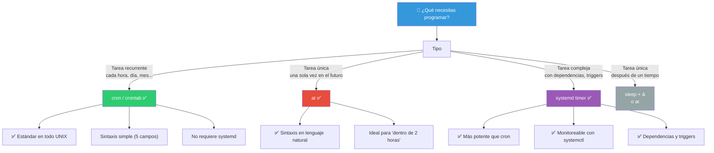
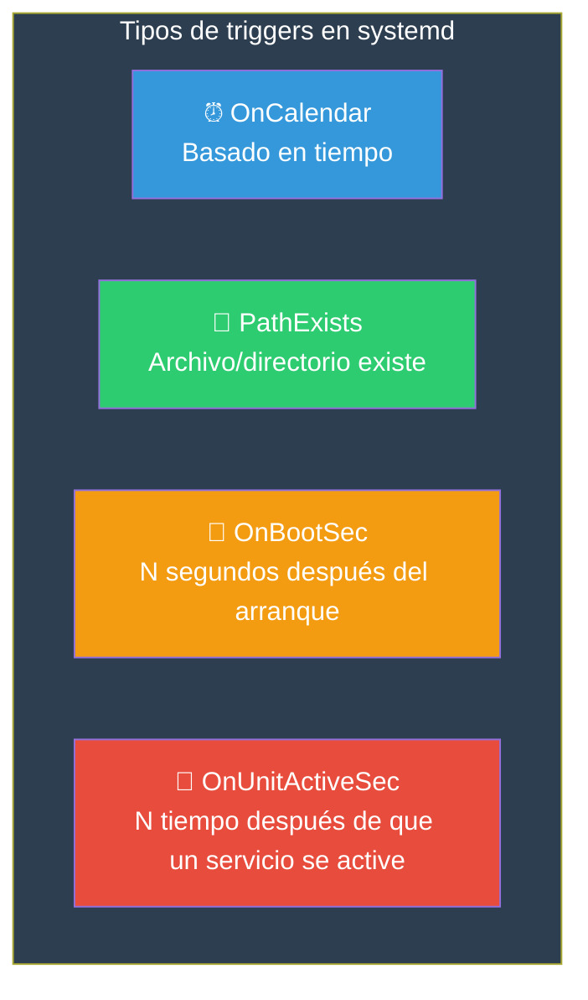
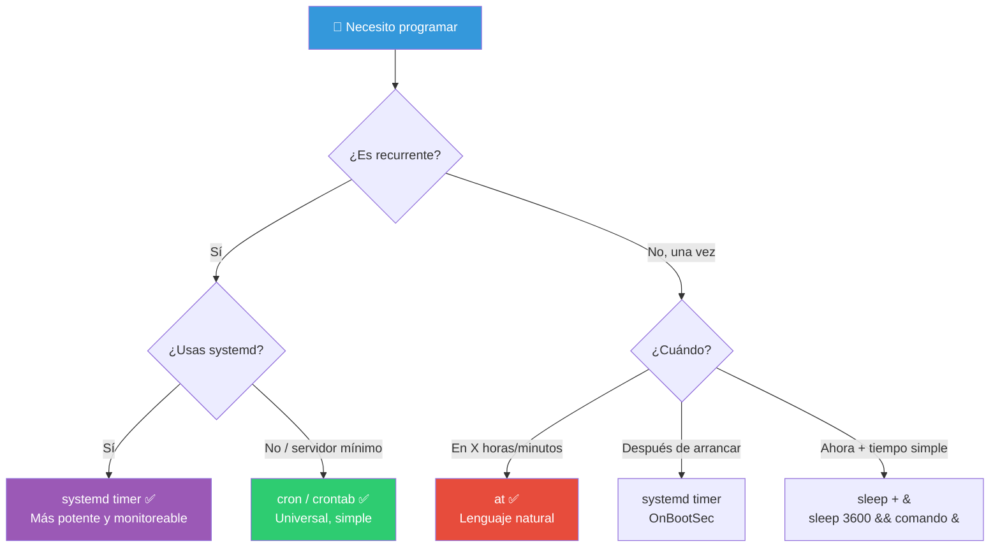

# Task Scheduling

Linux permite programar tareas para ejecutarse automáticamente en momentos específicos o bajo ciertas condiciones. Las herramientas principales son `cron`, `at` y los timers de `systemd`.

## ¿Cuál usar?



---

## `cron`, `crontab` — Tareas recurrentes

`cron` es el servicio que ejecuta tareas programadas. `crontab` es el comando para gestionarlas.

### Sintaxis de crontab

```bash
# Cada línea es una tarea:
MIN HOUR DOM MON DOW COMANDO
```

| Campo | Rango | Significado |
|-------|-------|-------------|
| `MIN` | 0-59 | Minuto |
| `HOUR` | 0-23 | Hora |
| `DOM` | 1-31 | Día del mes (Day Of Month) |
| `MON` | 1-12 | Mes |
| `DOW` | 0-7 | Día de la semana (0=domingo, 7=domingo) |
| `COMANDO` | — | Comando a ejecutar (ruta absoluta) |

### Operadores especiales

```bash
*       # Todos los valores
*/N     # Cada N (cada 5 minutos = */5)
N,M     # Lista de valores (1,3,5)
N-M     # Rango (1-5 = de lunes a viernes)
```

### Ejemplos

```bash
# min  hora  día  mes  día_sem  comando
  30    2     *    *    *        /usr/bin/backup.sh        # Todos los días a las 2:30 AM
  0     5     *    *    1-5      /usr/bin/limpiar.sh       # Lun-Vie a las 5:00 AM
  */15  *     *    *    *        /usr/bin/chequeo.sh       # Cada 15 minutos
  0     0     1    *    *        /usr/bin/reporte_mensual  # 1er día de cada mes
  0     0     *    *    0        /usr/bin/mantenimiento    # Domingo a media noche
  0     9-17  *    *    *        /usr/bin/aviso.sh         # Cada hora 9 AM - 5 PM
  */30  8-18  *    *    1-5      /usr/bin/check.sh         # Lun-Vie cada 30 min 8-18
```

### Atajos especiales (algunos sistemas)

```bash
@reboot         # Al iniciar el sistema
@hourly         # Cada hora (0 * * * *)
@daily          # Cada día (0 0 * * *)
@weekly         # Cada semana (0 0 * * 0)
@monthly        # Cada mes (0 0 1 * *)
@yearly         # Cada año (0 0 1 1 *)
```

### Comandos crontab

```bash
crontab -l              # Listar tareas del usuario actual
crontab -e              # Editar tareas (abre $EDITOR)
crontab -r              # Eliminar todas las tareas
crontab -u ana -l       # Ver tareas de otro usuario (solo root)
crontab -u ana -e       # Editar tareas de otro usuario

# Instalar desde archivo
crontab mis_tareas.txt

# Backup de crontab
crontab -l > ~/crontab_backup.txt
```

### Buenas prácticas

```bash
# Usar rutas absolutas (cron tiene PATH limitado)
* * * * * /usr/bin/python3 /home/ana/scripts/procesar.py

# Redirigir salida (por defecto cron envía por email)
* * * * * /home/ana/script.sh > /dev/null 2>&1
* * * * * /home/ana/script.sh >> /var/log/miscript.log 2>&1

# Variables de entorno al inicio del crontab
PATH=/usr/local/bin:/usr/bin:/bin
SHELL=/bin/bash
MAILTO=ana@ejemplo.com
LOG=/var/log/miscript.log

* * * * * /home/ana/script.sh >> $LOG 2>&1
```

### Ver logs de cron

```bash
# Log de cron (syslog)
grep CRON /var/log/syslog
grep "miscript" /var/log/syslog

# journalctl (systemd)
journalctl -u cron -f
journalctl -u cron --since "1 hour ago"
```

### Ejemplo de crontab completo

```bash
# ┌─────────────────── MIN (0-59)
# │ ┌────────────────── HOUR (0-23)
# │ │ ┌────────────────── DOM (1-31)
# │ │ │ ┌────────────────── MON (1-12)
# │ │ │ │ ┌────────────────── DOW (0-7, 0=dom)
# │ │ │ │ │
# * * * * * comando

# Respaldo diario a las 2 AM
0 2 * * * /usr/local/bin/backup.sh > /var/log/backup.log 2>&1

# Limpieza de logs cada 6 horas
0 */6 * * * /usr/local/bin/limpiar_logs.sh

# Chequeo de disco cada lunes a las 8 AM
0 8 * * 1 df -h | mail -s "Estado del disco" admin@ejemplo.com

# Actualización de paquetes (solo apt)
0 4 * * 0 apt update && apt upgrade -y > /var/log/apt-upgrade.log 2>&1

# Script manual que prueba con timeout
30 9 * * 1-5 timeout 300 /home/ana/tareas/diarias.sh
```

---

## `at` — Tareas únicas

`at` ejecuta un comando **una sola vez** en un momento específico.

### Sintaxis

```bash
at HH:MM                  # A una hora específica
at HH:MM YYYY-MM-DD      # En una fecha específica
at now + N minutes/hours/days/weeks  # Relativo
at teatime                # A las 4 PM (16:00)
at noon                   # A las 12:00 PM
at midnight               # A las 12:00 AM
```

### Ejemplos

```bash
at 14:30
at> /home/ana/script.sh
at> /home/ana/otro_script.sh
at> Ctrl+D                # Termina la entrada

# En una línea
echo "/home/ana/script.sh" | at 14:30

# Relativo
at now + 2 hours          # Dentro de 2 horas
at now + 30 minutes       # En 30 minutos
at now + 1 week           # En 1 semana
at 10:00 + 3 days         # A las 10 AM de dentro de 3 días

# Fecha específica
at 15:00 2026-06-15

# Con redirección
echo "echo 'Hola a las 5 PM' > /tmp/mensaje.txt" | at 17:00
```

### Gestión de tareas at

```bash
atq                   # Listar tareas pendientes (AT Queue)
atq -q a              # Filtrar por cola

atrm 5                # Eliminar tarea #5
atrm 2 4 6            # Eliminar varias

# Ver qué hará una tarea
at -c 5               # Muestra el comando de la tarea #5

# Permisos
/etc/at.allow         # Usuarios permitidos (uno por línea)
/etc/at.deny          # Usuarios denegados
```

### at vs cron

| Característica | `at` | `cron` |
|---------------|------|--------|
| Tipo | Una vez | Recurrente |
| Sintaxis | Lenguaje natural | 5 campos + comando |
| Gestión | `at`, `atq`, `atrm` | `crontab -e/-l/-r` |
| Persistencia | Se borra al ejecutar | Persiste hasta eliminar |
| PATH | Más permisivo | Limitado |
| Ideal para | "Ejecuta esto en 2 horas" | "Ejecuta esto cada día" |

---

## `systemd timers` — Temporizadores modernos

Los timers de systemd son la alternativa moderna a cron. Más potentes, pero más complejos de configurar.

### Estructura

Cada timer necesita **dos archivos**:

```bash
/etc/systemd/system/mi-tarea.timer      # Configuración del temporizador
/etc/systemd/system/mi-tarea.service    # Tarea a ejecutar
```

### Ejemplo: backup diario

**`/etc/systemd/system/backup.service`**

```ini
[Unit]
Description=Backup diario del sistema

[Service]
Type=oneshot
ExecStart=/usr/local/bin/backup.sh
StandardOutput=journal
StandardError=journal
```

**`/etc/systemd/system/backup.timer`**

```ini
[Unit]
Description=Ejecuta backup cada día a las 2 AM

[Timer]
OnCalendar=daily
OnCalendar=02:00:00
Persistent=true

[Install]
WantedBy=timers.target
```

### Sintaxis `OnCalendar`

```bash
OnCalendar=daily               # Cada día a las 00:00
OnCalendar=hourly              # Cada hora
OnCalendar=weekly              # Cada lunes a las 00:00
OnCalendar=monthly             # Cada 1° del mes

OnCalendar=*-*-* 02:00:00      # Cada día a las 2 AM
OnCalendar=Mon *-*-* 09:00:00  # Cada lunes a las 9 AM
OnCalendar=*-*-01 00:00:00     # Primer día de cada mes
OnCalendar=*:0/15              # Cada 15 minutos

# Especificaciones completas
OnCalendar=2026-*-*            # Todo el año 2026
OnCalendar=*-*-* 9..17:00      # Cada hora entre 9 AM y 5 PM
```

### Gestión de timers

```bash
# Activar timer
sudo systemctl enable backup.timer
sudo systemctl start backup.timer

# Ver estado
systemctl status backup.timer
systemctl list-timers                    # Todos los timers activos
systemctl list-timers --all              # Todos (incluyendo inactivos)

# Ver en tiempo real
watch systemctl list-timers

# Logs del servicio asociado
journalctl -u backup.service
journalctl -u backup.service --since "1 hour ago"

# Desactivar
sudo systemctl disable backup.timer
sudo systemctl stop backup.timer

# Recargar cambios
sudo systemctl daemon-reload
```

### systemd timer vs cron

| Característica | systemd timer | cron |
|---------------|---------------|------|
| Dependencias | ✅ Puede esperar a que otro servicio esté listo | ❌ No |
| Monitoreo | ✅ `systemctl list-timers`, `journalctl` | ❌ Solo logs |
| Triggers | ✅ Por tiempo, evento, path cambiado | ❌ Solo tiempo |
| Persistencia | ✅ `Persistent=true` (ejecuta si el sistema estaba apagado) | ❌ Se salta si el sistema estaba apagado |
| Aislamiento | ✅ Cada tarea en su propio cgroup | ❌ |
| Configuración | Dos archivos .service + .timer | Un archivo crontab |
| Curva | Media | Baja |

### Ejemplo avanzado: timer con retardo aleatorio

```bash
[Timer]
OnCalendar=*-*-* 02:00:00
RandomizedDelaySec=30m    # Retardo aleatorio de hasta 30 min
Persistent=true
FixedRandom=yes           # Mismo retardo cada día (determinístico)
```

### Temporizador basado en evento (path)



---

## Comparativa final



> **🎯 Resumen**: `cron` si necesitas universalidad y simplicidad — está en todos lados. `at` para tareas únicas con sintaxis en lenguaje natural. `systemd timer` si estás en un sistema moderno con systemd y necesitas monitoreo, dependencias, persistencia o retardo aleatorio. Para tareas simples, `sleep` + `&` + `disown` puede ser suficiente.

## Relacionados:
- [[monitoreo-del-sistema]] #anterior 
- [[manejo-de-paqueteria-linux]] #siguiente 