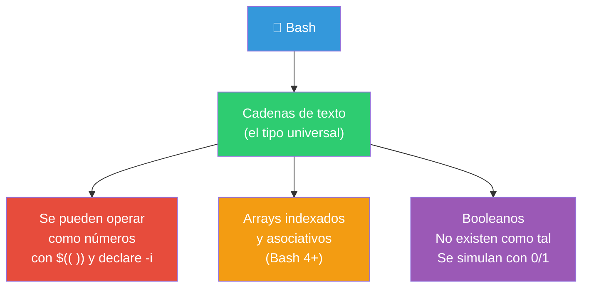

# Tipos de datos

En Bash **todo es texto**. No hay tipos en el sentido de C, Java o Python. Sin embargo, Bash proporciona operaciones y atributos que permiten tratar los datos como strings, números o arrays según convenga.

## Sistema de tipos de Bash



```bash
# Todo es string, incluso los números
x="42"
y="10"
echo $x + $y          # 42 + 10 (concatenación, no suma)
echo $((x + y))       # 52 (conversión implícita en contexto aritmético)
```

---

## Strings

Los strings son el tipo de dato fundamental en Bash. Todo lo que escribes es un string.

### Creación

```bash
# Comillas dobles: expanden variables
nombre="Ana"
saludo="Hola, $nombre"
echo "$saludo"        # Hola, Ana

# Comillas simples: literales (sin expansión)
literal='Hola, $nombre'
echo "$literal"       # Hola, $nombre

# Sin comillas: posible pero peligroso con espacios
string=hola            # ✅ funciona
string=hola mundo      # ❌ error (dos palabras)
string="hola mundo"    # ✅ correcto
```

### Escape de caracteres

```bash
# Con backslash
echo "Hola \"mundo\""    # Hola "mundo"
echo "Línea 1\nLínea 2"  # Línea 1\nLínea 2 (sin -e no interpreta)
echo -e "Línea 1\nLínea 2"  # Línea 1
                           # Línea 2

# Caracteres de escape comunes
\n    # Nueva línea
\t    # Tabulador
\\    # Backslash literal
\"    # Comilla doble literal
\$    # Signo $ literal (evita expansión de variable)
```

### Operaciones con strings

```bash
texto="Hola Mundo desde Bash"

# Longitud
echo "${#texto}"              # 22

# Substring (posición, longitud)
echo "${texto:0:4}"           # "Hola" (posición 0, 4 caracteres)
echo "${texto:5:5}"           # "Mundo"
echo "${texto:5}"             # "Mundo desde Bash" (posición 5 hasta el final)
echo "${texto: -4}"           # "Bash" (últimos 4 caracteres)

# Dividir en palabras (por IFS)
palabras=($texto)             # Crea array con las palabras
echo "${palabras[0]}"         # "Hola"
echo "${palabras[2]}"         # "desde"
```

### Reemplazo en strings

```bash
texto="Hola Mundo Hola"

# Reemplazar
echo "${texto/Hola/Chao}"         # "Chao Mundo Hola" (primera ocurrencia)
echo "${texto//Hola/Chao}"        # "Chao Mundo Chao" (todas)
echo "${texto/#Hola/Chao}"        # "Chao Mundo Hola" (solo al inicio)
echo "${texto/%Hola/Chao}"        # "Hola Mundo Chao" (solo al final)

# Eliminar patrones
archivo="fondo.png"
echo "${archivo%.png}"            # "fondo" (elimina .png del final)
echo "${archivo%.*}"              # "fondo" (elimina la extensión)
echo "${archivo%%.*}"             # "fondo" (elimina extensión más larga)
echo "${archivo#fondo}"           # ".png" (elimina "fondo" del inicio)
echo "${archivo#*.}"              # "png" (elimina todo hasta el primer .)
echo "${archivo##*.}"             # "png" (elimina hasta el último .)
```

### Mayúsculas y minúsculas (Bash 4+)

```bash
texto="hola mundo"
echo "${texto^}"        # "Hola mundo" (primera letra a mayúscula)
echo "${texto^^}"       # "HOLA MUNDO" (todo mayúsculas)
echo "${texto,}"        # "hola mundo" (primera letra a minúscula)
echo "${texto,,}"       # "hola mundo" (todo minúsculas)

# Por palabra
echo "${texto^^[hm]}"   # "Hola Mundo" (solo h y m)
```

### Comparación de strings

```bash
# Con [[ ]] (recomendado)
[[ "$a" = "$b" ]]        # Iguales
[[ "$a" != "$b" ]]       # Distintos
[[ "$a" < "$b" ]]        # Menor (alfabético)
[[ "$a" > "$b" ]]        # Mayor (alfabético)
[[ -z "$a" ]]            # String vacío
[[ -n "$a" ]]            # String no vacío

# Con [ ] (POSIX)
[ "$a" = "$b" ]          # Iguales
[ "$a" != "$b" ]         # Distintos
[ -z "$a" ]              # Vacío
[ -n "$a" ]              # No vacío
```

### Concatenación

```bash
# Simple: poner las variables juntas
nombre="Ana"
edad=30
echo "$nombre tiene $edad años"   # Ana tiene 30 años

# Concatenar explícitamente
a="Hola "
b="Mundo"
c="$a$b"             # "Hola Mundo"
c+=" desde Bash"     # "Hola Mundo desde Bash"
echo "$c"
```

### Here Documents y Here Strings

```bash
# Here document (entrada multilínea)
cat << EOF
Línea 1
Línea 2
$HOME se expande
EOF

# Here string (string como entrada)
grep "error" <<< "todo ok\nerror crítico\nfin"
# Salida: error crítico

# Procesar string como si fuera un archivo
wc -w <<< "Hola mundo desde Bash"
# 4
```

---

## Numéricos

Bash solo maneja **enteros**. No soporta punto flotante nativamente.

### Aritmética entera

```bash
# Sintaxis: $(( expresión ))

echo $((2 + 3))          # 5
echo $((10 - 4))         # 6
echo $((3 * 4))          # 12
echo $((20 / 6))         # 3 (división entera, trunca)
echo $((20 % 6))         # 2 (módulo/resto)
echo $((2 ** 10))        # 1024 (potencia)

# Con variables
x=5
y=3
echo $((x + y))          # 8
echo $((x * y))          # 15
echo $((x ** y))         # 125 (5^3)
```

### Operadores aritméticos

| Operador | Significado |
|----------|-------------|
| `+` | Suma |
| `-` | Resta |
| `*` | Multiplicación |
| `/` | División entera |
| `%` | Módulo (resto) |
| `**` | Potencia (Bash 3+) |
| `++` | Incremento |
| `--` | Decremento |
| `+=` | Suma y asigna |
| `-=` | Resta y asigna |
| `*=` | Multiplica y asigna |
| `/=` | Divide y asigna |

### Declaración entera

```bash
declare -i x=5 y=10
x=x+y                 # No necesita $ ni $(( ))
echo $x               # 15

# Sin declare -i:
x=5
y=10
x=$x+$y               # "5+10" (string, no suma!)
echo $x               # 5+10
```

### Otras bases numéricas

```bash
echo $((2#1010))      # 10 (binario a decimal)
echo $((8#77))        # 63 (octal a decimal)
echo $((16#FF))       # 255 (hexadecimal a decimal)
echo $((36#zz))       # 1295 (base 36)

# Asignar en otras bases
declare -i x=2#1010
echo $x               # 10
```

### Punto flotante (workaround)

Bash no tiene punto flotante. Usa herramientas externas:

```bash
# Con bc
echo "scale=2; 10 / 3" | bc    # 3.33
echo "scale=4; 10 / 3" | bc    # 3.3333

# Con python3
python3 -c "print(10 / 3)"     # 3.3333333333333335
python3 -c "print(round(10 / 3, 2))"  # 3.33

# Con awk
awk "BEGIN {print 10/3}"       # 3.33333
```

### Comparación numérica

```bash
# Con [[ ]] y (( )) (recomendado)
(( x > 10 ))           # Mayor que
(( x >= 10 ))          # Mayor o igual
(( x < 10 ))           # Menor que
(( x <= 10 ))          # Menor o igual
(( x == 10 ))          # Igual
(( x != 10 ))          # Distinto

# Con [ ] (POSIX)
[ "$x" -gt 10 ]        # Greater than
[ "$x" -ge 10 ]        # Greater or equal
[ "$x" -lt 10 ]        # Less than
[ "$x" -le 10 ]        # Less or equal
[ "$x" -eq 10 ]        # Equal
[ "$x" -ne 10 ]        # Not equal
```

```bash
# Ejemplo práctico
for i in {1..10}; do
    if (( i % 2 == 0 )); then
        echo "$i es par"
    else
        echo "$i es impar"
    fi
done
```

---

## Comentarios

Los comentarios comienzan con `#` y se extienden hasta el final de la línea.

```bash
# Esto es un comentario

echo "Hola"    # Comentario al final de una línea

# No hay comentarios multilínea en Bash.
# Cada línea necesita su propio #.

# Para "comentar" bloques grandes, usa : '...'
: '
Este es un bloque
de comentarios de varias
líneas (here document a null command)
'
```

### Cuándo comentar

```bash
# ✅ Bueno: explicar el POR QUÉ (no el qué)
# Usamos --hard porque necesitamos rescribir el historial remoto
git push --force-with-lease

# ❌ Malo: explicar lo obvio
# Suma 1 a la variable i  ← el código ya dice eso
((i++))
```

---

## Arrays

Los arrays indexados almacenan múltiples valores bajo un mismo nombre.

### Creación

```bash
# Declaración explícita
declare -a frutas

# Asignación directa
frutas=("manzana" "pera" "uva" "mango")

# Por índices
numeros=([0]=10 [1]=20 [2]=30)

# A partir de una cadena
texto="uno dos tres"
palabras=($texto)         # Divide por IFS

# Desde salida de comando
archivos=($(ls *.txt))    # ⚠️ Peligroso si hay espacios en nombres
```

### Acceso

```bash
echo "${frutas[0]}"        # manzana
echo "${frutas[1]}"        # pera
echo "${frutas[-1]}"       # mango (último elemento)
echo "${frutas[@]}"        # manzana pera uva mango (todos)
echo "${frutas[*]}"        # manzana pera uva mango (como string)
echo "${#frutas[@]}"       # 4 (longitud)
echo "${!frutas[@]}"       # 0 1 2 3 (índices)
```

### Modificación

```bash
frutas[1]="mandarina"      # Cambia pera → mandarina
frutas+=("kiwi")           # Añade al final
frutas+=("papaya" "coco")  # Añade varios al final
unset 'frutas[0]'          # Elimina el primer elemento
unset 'frutas[-1]'         # Elimina el último

# Reemplazar todo el array
frutas=("naranja" "limón")

# Vaciar el array
frutas=()
```

### Iteración

```bash
for fruta in "${frutas[@]}"; do
    echo "Me gusta la $fruta"
done

# Con índices
for i in "${!frutas[@]}"; do
    echo "frutas[$i] = ${frutas[$i]}"
done

# Slice del array
echo "${frutas[@]:0:2}"     # Primeros 2 elementos
echo "${frutas[@]:1:2}"     # Elementos 1 y 2
```

---

## Arrays Asociativos

Disponibles desde **Bash 4**. Funcionan como diccionarios (clave → valor).

```bash
# Declaración (obligatoria)
declare -A capitales

# Asignación
capitales[Chile]="Santiago"
capitales[Peru]="Lima"
capitales[Argentina]="Buenos Aires"

# Declarar e inicializar
declare -A edades=(
    ["Ana"]=25
    ["Luis"]=30
    ["Sara"]=28
)
```

### Acceso

```bash
echo "${capitales[Chile]}"       # Santiago
echo "${capitales[@]}"           # Santiago Lima Buenos Aires (valores)
echo "${!capitales[@]}"          # Chile Peru Argentina (claves)
echo "${#capitales[@]}"          # 3 (número de pares)
```

### Iteración

```bash
# Sobre valores
for capital in "${capitales[@]}"; do
    echo "Capital: $capital"
done

# Sobre claves
for pais in "${!capitales[@]}"; do
    echo "La capital de $pais es ${capitales[$pais]}"
done
```

### Modificación

```bash
capitales[Chile]="Valparaíso"      # Actualizar
unset "capitales[Peru]"            # Eliminar par
capitales+=([Bolivia]="La Paz")    # Añadir
unset capitales                    # Eliminar todo el array
```

### Comparativa: arrays indexados vs asociativos

| Operación | Indexado | Asociativo |
|-----------|----------|------------|
| Declarar | `declare -a a` (opcional) | `declare -A a` **(obligatorio)** |
| Claves | Números (0, 1, 2...) | Strings (cualquier texto) |
| Acceder | `a[0]` | `a["clave"]` |
| Todos los valores | `"${a[@]}"` | `"${a[@]}"` |
| Todas las claves | `"${!a[@]}"` | `"${!a[@]}"` |
| Longitud | `"${#a[@]}"` | `"${#a[@]}"` |
| Añadir | `a+=("nuevo")` | `a+=([clave]="valor")` |
| Eliminar | `unset 'a[0]'` | `unset 'a["clave"]'` |

---

## Tabla resumen

```mermaid
flowchart TB
    subgraph Tipos["Tipos de datos en Bash"]
        S["String<br/>Todo es texto"]
        N["Entero<br/>declare -i<br/>o $(( ))"]
        AI["Array Indexado<br/>declare -a"]
        AA["Array Asociativo<br/>declare -A ⭐ Bash 4+"]
    end

    S --> Ops["${#var}<br/>${var:0:3}<br/>${var//a/b}"]
    N --> OpsN["$((x + y))<br/>((x > 5))<br/>declare -i n=5"]
    AI --> OpsAI["frutas[0]<br/>frutas+=('nuevo')<br/>for f in \"\${frutas[@]}\""]
    AA --> OpsAA["dict[clave]<br/>for k in \"\${!dict[@]}\""]

    style Tipos fill:#2C3E50,color:#fff
    style S fill:#2ECC71,color:#fff
    style N fill:#E74C3C,color:#fff
    style AI fill:#F39C12,color:#fff
    style AA fill:#9B59B6,color:#fff
```

> **📌 Recordatorio**: Bash no tiene tipos de datos formales. Las comillas hacen que algo sea string, `$(( ))` lo trata como número, `declare -a` lo vuelve array, y `declare -A` lo vuelve diccionario. Domina las **operaciones sobre strings** y los **arrays asociativos** — son lo que más usarás en scripts reales.

## Relacionados:
- [[variables-en-terminal]] #anterior 
- [[operadores-de-bash]] #siguiente 