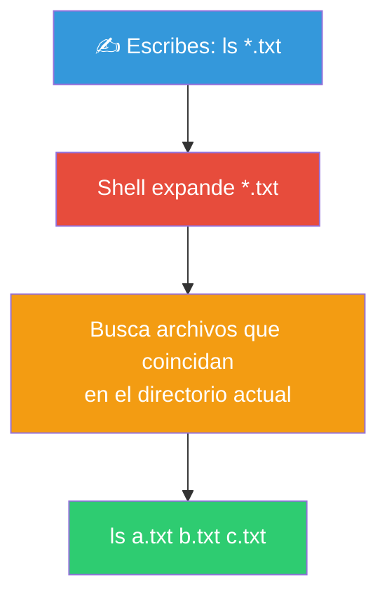
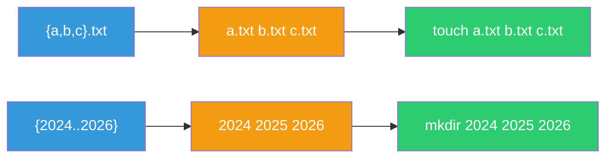
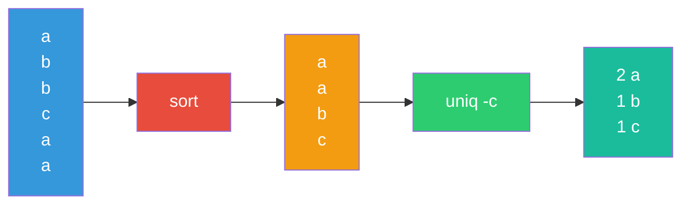
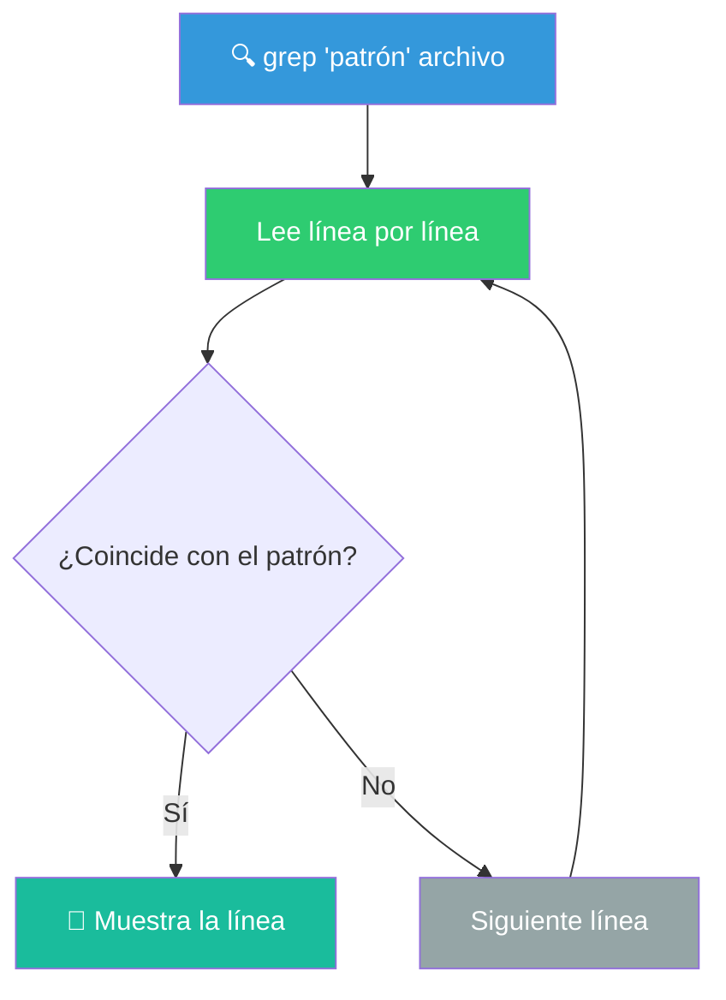
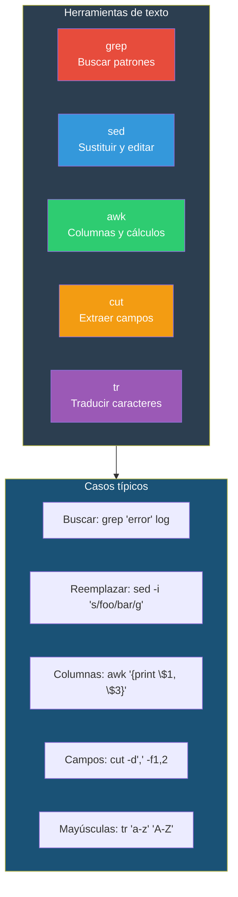

# Trabajando con textos

La shell es el entorno ideal para procesar texto. La mayoría de datos en UNIX (logs, configuraciones, CSVs) son texto plano, y las herramientas de Bash están diseñadas para manipularlo eficientemente.

## Comodines (Wildcards / Globbing)

Los comodines permiten referirse a múltiples archivos sin escribirlos uno por uno. Los expande la **shell** (no el comando) antes de ejecutarse.



### `*` — Cualquier secuencia de caracteres

Coincide con **cero o más caracteres** (excepto el punto inicial en archivos ocultos).

```bash
# Ejemplos
ls *.txt                    # Todos los .txt
ls *.py                     # Todos los .py
ls datos*                   # datos, datos.csv, datos_2026.txt
ls *                        # Todos los archivos no ocultos
ls .*                       # Todos los archivos ocultos
ls ~/.*                     # Archivos ocultos en el home
```

```bash
# Usos comunes
rm *.tmp                    # Elimina todos los .tmp
cp *.jpg fotos/             # Copia todas las fotos
echo *.txt                  # Lista los .txt
for f in *.md; do echo "$f"; done   # Itera sobre archivos .md
```

### `?` — Un solo carácter

Coincide con **exactamente un carácter**.

```bash
# Ejemplos
ls archivo.?                # archivo.a, archivo.b, archivo.1
ls ?.txt                    # a.txt, b.txt, 1.txt (pero no ab.txt)
ls dato???                  # dato123, datoABC (pero no dato12)
```

### `[...]` — Conjunto de caracteres

Coincide con **un carácter del conjunto indicado**.

```bash
ls archivo[0-9].txt         # archivo0.txt ... archivo9.txt
ls [abc]*                   # Archivos que empiezan con a, b o c
ls [a-z]*                   # Archivos que empiezan con minúscula
ls [A-Z]*                   # Archivos que empiezan con mayúscula
ls [0-9]*                   # Archivos que empiezan con dígito
ls [a-zA-Z]*                # Archivos que empiezan con letra
ls [!0-9]*                  # Archivos que NO empiezan con dígito
ls [^0-9]*                  # Igual: NO empiezan con dígito
```

### Clases de caracteres POSIX

| Clase | Significa | Equivale a |
|-------|-----------|------------|
| `[:alnum:]` | Letras y dígitos | `[a-zA-Z0-9]` |
| `[:alpha:]` | Letras | `[a-zA-Z]` |
| `[:digit:]` | Dígitos | `[0-9]` |
| `[:lower:]` | Minúsculas | `[a-z]` |
| `[:upper:]` | Mayúsculas | `[A-Z]` |
| `[:space:]` | Espacios en blanco | `[ \t\n\r\f\v]` |
| `[:blank:]` | Espacio y tabulador | `[ \t]` |
| `[:punct:]` | Signos de puntuación | `[.,!?;:]` |

```bash
ls [[:upper:]]*             # Archivos que empiezan con mayúscula
ls *[[:digit:]]*            # Archivos con algún dígito en el nombre
```

### `{...}` — Expansión de llaves (Brace Expansion)

Genera **múltiples cadenas** a partir de un patrón. Se expande **antes** que los comodines.

```bash
# Crear varios archivos/carpetas a la vez
mkdir {2024,2025,2026}      # Crea: 2024, 2025, 2026
touch {a,b,c}.txt           # Crea: a.txt, b.txt, c.txt

# Rangos
echo {1..10}                # 1 2 3 4 5 6 7 8 9 10
echo {01..10}               # 01 02 03 ... 10
echo {a..z}                 # a b c ... z
echo {1..10..2}             # 1 3 5 7 9 (saltos de 2)

# Anidación
cp archivo.{txt,bak}        # cp archivo.txt archivo.bak
mv archivo.{py,old}         # mv archivo.py archivo.old

# Combinación
echo {A,B}{1,2}             # A1 A2 B1 B2
```



### Tabla de comodines

| Patrón | Coincide con | No coincide con |
|--------|-------------|-----------------|
| `*` | `abc.txt`, `dato.csv`, `a` | (todos los no ocultos) |
| `.*` | `.bashrc`, `.gitignore` | `archivo.txt` |
| `*.txt` | `a.txt`, `notas.txt` | `a.csv`, `a.txt.bak` |
| `?.txt` | `a.txt`, `b.txt` | `ab.txt`, `.txt` |
| `[0-9]*` | `1.txt`, `99.csv` | `a1.txt` |
| `[!0-9]*` | `archivo.txt` | `1.txt` |
| `{a,b}.txt` | `a.txt`, `b.txt` | `c.txt` |

### `shopt -s extglob` — Patrones avanzados

Con `extglob` habilitado, Bash soporta patrones adicionales:

```bash
shopt -s extglob

?(patrón)   # Cero o una ocurrencia
*(patrón)   # Cero o más ocurrencias
+(patrón)   # Una o más ocurrencias
@(patrón)   # Exactamente una ocurrencia
!(patrón)   # Negación

# Ejemplos
ls !(*.txt)         # Archivos que NO son .txt
ls +(ab)*           # Archivos que empiezan con "ab" una o más veces
```

---

## Análisis

### `wc` — Word Count

Cuenta líneas, palabras y caracteres.

```bash
wc archivo.txt               # líneas / palabras / caracteres
wc -l archivo.txt           # Solo líneas
wc -w archivo.txt           # Solo palabras
wc -c archivo.txt           # Solo bytes
wc -m archivo.txt           # Solo caracteres (unicode)
wc -L archivo.txt           # Longitud de la línea más larga
```

```bash
# Usos comunes
wc -l *.csv                 # Líneas de todos los CSVs
cat log.txt | wc -l         # Contar líneas desde pipe
ls -1 | wc -l               # Contar archivos en el directorio
wc -w <<< "Hola mundo"      # 2 palabras
```

### `sort` — Ordenar líneas

Ordena las líneas de texto alfabética o numéricamente.

```bash
sort archivo.txt             # Orden alfabético ascendente
sort -r archivo.txt          # Orden alfabético descendente
sort -n archivo.txt          # Orden numérico
sort -nr archivo.txt         # Orden numérico descendente
sort -k2 archivo.txt         # Ordena por columna 2
sort -t',' -k3 -n datos.csv # CSV: ordena numéricamente por columna 3
sort -u archivo.txt          # Ordena y elimina duplicados
sort -f archivo.txt          # Ignora mayúsculas
```

```bash
# Ejemplos
sort -t: -k3 -n /etc/passwd         # Usuarios ordenados por UID
sort -k5 -n -r <(ls -la) | head     # Archivos más grandes
sort -u palabras.txt                # Lista ordenada sin duplicados

# Combinado con otros comandos
ps aux | sort -k4 -n -r | head     # Procesos usando más memoria
```

### `uniq` — Líneas únicas

Elimina (o cuenta) líneas duplicadas **consecutivas**. Normalmente se usa después de `sort`.

```bash
uniq archivo.txt             # Elimina duplicados consecutivos
uniq -c archivo.txt          # Cuenta ocurrencias de cada línea
uniq -d archivo.txt          # Solo muestra líneas duplicadas
uniq -u archivo.txt          # Solo muestra líneas únicas
uniq -i archivo.txt          # Ignora mayúsculas
```



```bash
# Patrón clásico: frecuencia de palabras
cat archivo.txt | sort | uniq -c | sort -rn | head -10
# Cuenta frecuencias, ordena por frecuencia descendente, top 10

# IPs más frecuentes en un log
cat access.log | awk '{print $1}' | sort | uniq -c | sort -rn | head -5
```

### `nl` — Number Lines

Numera las líneas de un archivo (como `cat -n` pero con más opciones).

```bash
nl archivo.txt               # Numera las líneas
nl -b a archivo.txt          # Numera todas las líneas (incluyendo vacías)
nl -s ". " archivo.txt       # Separador personalizado
nl -w 3 archivo.txt          # Ancho del número
nl -n rz archivo.txt         # Rellenar con ceros: 001, 002...
```

```bash
# Comparación
cat -n archivo.txt           # Simple
nl -b a -s ". " -w 4 archivo.txt   # Con formato: "   1. línea"

# Útil para referenciar líneas en scripts
nl -ba -s ": " -w 3 config.txt
```

---

## Vista y búsquedas

### `grep` — Global Regular Expression Print

Busca patrones en archivos o entrada estándar. Herramienta fundamental.

```bash
grep "patrón" archivo              # Búsqueda básica
grep -i "error" log.txt            # Ignora mayúsculas
grep -r "TODO" src/                # Recursiva en directorio
grep -v "DEBUG" log.txt            # Invertir: líneas que NO contienen
grep -c "error" log.txt            # Contar coincidencias
grep -n "error" log.txt            # Mostrar número de línea
grep -l "root" /etc/*              # Solo nombres de archivo que coinciden
grep -w "root" /etc/passwd         # Palabra completa (no subcadena)
grep -o "id=[0-9]*" archivo        # Solo la parte que coincide (captura)
grep -A2 "ERROR" log.txt           # 2 líneas después
grep -B2 "ERROR" log.txt           # 2 líneas antes
grep -C3 "ERROR" log.txt           # 3 líneas antes y después (contexto)
grep -E "error|fail|crit" log.txt  # Expresiones regulares extendidas
```



#### Flags importantes

| Flag | Significado |
|------|------------|
| `-i` | Ignora mayúsculas/minúsculas |
| `-r` | Recursivo (subdirectorios) |
| `-v` | Invertir selección |
| `-c` | Contar (no mostrar líneas) |
| `-n` | Numerar líneas |
| `-l` | Solo nombres de archivo |
| `-w` | Palabra completa |
| `-o` | Solo el texto que coincide |
| `-E` | Regex extendida (egrep) |
| `-P` | Regex Perl (si está disponible) |
| `-A N` | N líneas **after** después |
| `-B N` | N líneas **before** antes |
| `-C N` | N líneas de **contexto** |

```bash
# Ejemplos prácticos
ps aux | grep -i python                   # Procesos python
grep -r --include="*.py" "def main" .     # Buscar en archivos .py
grep -rl "class" src/ | wc -l             # Archivos con "class"
dmesg | grep -i "error\|fail" | tail -20  # Errores del kernel
grep -v "^#" /etc/ssh/sshd_config | grep -v "^$"   # Config sin comentarios
```

### `less`, `more` — Paginación

Para archivos largos. `more` es el histórico, `less` es moderno y más potente.

```bash
less archivo.txt             # Paginador (el más usado)
more archivo.txt             # Paginador básico
```

```bash
# Navegación en less
# (recordatorio de acciones-comunes-shells.md)
q           # Salir
Espacio     # Página siguiente
b           # Página anterior
/patrón     # Buscar hacia adelante
?patrón     # Buscar hacia atrás
g           # Ir al inicio
G           # Ir al final
Nn          # Siguiente resultado de búsqueda
h           # Ayuda

# less directamente desde pipe
dmesg | less
grep -r "TODO" . | less
history | less
```

### `find` — Buscar archivos

Ya lo vimos en *Archivos y Directorios*. Aquí un recordatorio breve con énfasis en texto:

```bash
# Buscar archivos por contenido (alternativa lenta pero segura)
find . -name "*.py" -exec grep -l "def main" {} \;

# Buscar archivos que contengan un patrón (más rápido con grep -r)
grep -rl "function" --include="*.js" .

# Buscar archivos por nombre y contenido
find . -name "*.log" -mtime -7 -exec grep -l "ERROR" {} \;
```

---

## Transformación de texto

### `cut` — Extraer columnas

Corta secciones de cada línea.

```bash
cut -c1-10 archivo.txt       # Caracteres 1 al 10 de cada línea
cut -d',' -f1 datos.csv      # Primer campo (delimitado por coma)
cut -d':' -f1,3 /etc/passwd  # Usuario y UID
cut -d' ' -f2- archivo.txt   # Desde campo 2 hasta el final
cut -f1,3 archivo.txt        # Sin -d, el delimitador es TAB
```

```bash
# Ejemplos
who | cut -d' ' -f1 | sort -u         # Usuarios conectados
ps aux | tr -s ' ' | cut -d' ' -f1,2  # Usuario y PID
cut -d: -f1 /etc/passwd | head        # Solo nombres de usuario
```

### `paste` — Unir columnas

Combina líneas de varios archivos, separadas por TAB.

```bash
paste archivo1.txt archivo2.txt        # Línea a línea, separado por TAB
paste -d',' archivo1.txt archivo2.txt  # Con delimitador personalizado
paste -s archivo.txt                   # Fusiona todas las líneas en una
paste - - < archivo.txt                # Cada dos líneas (usa - para stdin)
```

```bash
# Ejemplo: unir nombres y correos
paste -d';' nombres.txt correos.txt > contactos.csv
```

### `join` — Unir por campo común

Une líneas de dos archivos basándose en un campo común (como SQL JOIN).

```bash
join archivo1.txt archivo2.txt          # Une por primer campo
join -t',' -1 2 -2 1 a.csv b.csv       # Delimitador coma, campo 2 en a, campo 1 en b
join -a 1 a.txt b.txt                   # Left outer join
join -v 2 a.txt b.txt                   # Muestra solo líneas sin match en b
```

```bash
# Archivos deben estar ordenados por el campo de unión
sort usuarios.txt > usuarios_sorted.txt
sort pagos.txt > pagos_sorted.txt
join -t',' usuarios_sorted.txt pagos_sorted.txt
```

### `split` — Dividir archivos

Parte un archivo grande en archivos más pequeños.

```bash
split archivo.txt parte_              # Cada parte: parte_aa, parte_ab...
split -l 100 archivo.txt parte_       # 100 líneas por parte
split -b 10M archivo.log parte_       # 10 MB por parte
split -n 5 archivo.txt parte_         # 5 partes iguales
```

```bash
# Ejemplo: dividir un log grande
split -l 1000 access.log log_parte_
# Crea: log_parte_aa, log_parte_ab, log_parte_ac...

# Recombinar
cat log_parte_* > access_recuperado.log
```

### `tr` — Translate characters

Sustituye o elimina caracteres. Trabaja sobre stdin, no acepta archivos como argumento.

```bash
# Minúsculas ↔ Mayúsculas
cat archivo.txt | tr 'a-z' 'A-Z'        # A mayúsculas
cat archivo.txt | tr '[:lower:]' '[:upper:]'

# Eliminar caracteres
cat archivo.txt | tr -d 'aeiou'          # Elimina vocales
cat archivo.txt | tr -d '\n'             # Elimina saltos de línea (todo en una línea)
cat archivo.txt | tr -d '[:space:]'      # Elimina todos los espacios

# Sustituir caracteres
cat archivo.txt | tr ',' '\t'            # Convierte comas a tabs
cat archivo.txt | tr ' ' '\n'            # Cada palabra en una línea
cat archivo.txt | tr -s ' '              # Comprime espacios múltiples a uno

# Complemento
cat archivo.txt | tr -cd '[:print:]'     # Solo caracteres imprimibles
cat archivo.txt | tr -c 'a-zA-Z' '\n'    # Solo palabras, una por línea
```

```bash
# Casos de uso reales
echo "hola mundo" | tr 'a-z' 'A-Z'     # HOLA MUNDO
cat archivo.txt | tr -s '\n' '\n'       # Elimina líneas en blanco duplicadas
ps aux | tr -s ' ' | cut -d' ' -f11-   # Comandos ejecutándose
```

---

## `sed` — Stream Editor

`sed` es un editor de flujo. Aplica transformaciones línea por línea. Es extremadamente potente.

### Sintaxis básica

```bash
sed 'acción' archivo.txt          # Aplica acción y muestra en stdout
sed 'acción' archivo.txt > nuevo  # Guarda en nuevo archivo
sed -i 'acción' archivo.txt       # Edita el archivo en el lugar (in-place)
sed -n 'acción' archivo.txt       # No imprime automáticamente (modo silencioso)
```

### Sustitución (`s`)

```bash
# Sintaxis: sed 's/patrón/reemplazo/flags'

sed 's/antiguo/nuevo/' archivo           # Reemplaza primera ocurrencia en cada línea
sed 's/antiguo/nuevo/g' archivo          # Reemplaza todas las ocurrencias (global)
sed 's/antiguo/nuevo/2' archivo          # Reemplaza la segunda ocurrencia en cada línea
sed 's/antiguo/nuevo/gi' archivo         # Global + ignorar mayúsculas
sed 's/antiguo/nuevo/' archivo > nuevo   # Guarda en nuevo archivo
sed -i 's/antiguo/nuevo/' archivo        # Edita el archivo original
sed -i.bak 's/antiguo/nuevo/' archivo    # Edita y crea backup .bak
```

### Direccionamiento (líneas específicas)

```bash
sed '3s/foo/bar/' archivo               # Solo en la línea 3
sed '3,10s/foo/bar/' archivo            # Líneas 3 a 10
sed '5,$s/foo/bar/' archivo             # Línea 5 hasta el final
sed '/patrón/s/foo/bar/' archivo         # Líneas que contienen "patrón"
sed '/^#/s/foo/bar/' archivo            # Líneas que empiezan con #
```

### Operaciones adicionales

```bash
sed -n '3p' archivo                 # Imprime solo la línea 3
sed -n '3,10p' archivo              # Imprime líneas 3 a 10
sed '3d' archivo                    # Elimina la línea 3
sed '/^#/d' archivo                 # Elimina líneas que empiezan con #
sed '/^$/d' archivo                 # Elimina líneas vacías
sed '3a\nueva línea' archivo        # Añade después de línea 3
sed '3i\nueva línea' archivo        # Inserta antes de línea 3
sed '3c\Reemplazo' archivo          # Reemplaza la línea 3
```

```bash
# Ejemplos prácticos
sed -i 's/\r$//' script.sh         # Elimina saltos de línea Windows (CRLF)
sed -i '/^$/d' archivo.txt         # Elimina líneas vacías
sed -i 's/  */ /g' archivo.txt     # Comprime espacios múltiples
sed 's/^[[:space:]]*//' archivo    # Elimina espacios al inicio
sed 's/[[:space:]]*$//' archivo    # Elimina espacios al final (trim)
sed -n '/ERROR/,/^$/p' log.txt     # Bloques desde ERROR hasta línea vacía
```

### Múltiples comandos

```bash
sed -e 's/foo/bar/' -e 's/123/456/' archivo   # Dos sustituciones
sed 's/foo/bar/; s/123/456/' archivo           # Mismo, con ;
```

---

## `awk` — Procesador de texto por columnas

`awk` es un lenguaje de procesamiento de texto orientado a registros y campos. Ideal para datos tabulares.

### Sintaxis básica

```bash
awk 'patrón { acción }' archivo
```

### Campos

```bash
awk '{print $1}' archivo              # Primer campo
awk '{print $1, $3}' archivo          # Campos 1 y 3
awk '{print $0}' archivo              # Línea completa
awk '{print NF}' archivo              # Número de campos por línea
awk '{print $NF}' archivo             # Último campo
awk -F',' '{print $2}' datos.csv      # Delimitador personalizado (coma)
awk -F: '{print $1, $3}' /etc/passwd  # Delimitador dos puntos
```

### Patrones

```bash
awk '/error/ {print}' log.txt         # Líneas que contienen "error"
awk 'NR==3 {print}' archivo           # Línea 3 (NR = Number of Record)
awk 'NR>1 && NR<10 {print}' archivo   # Líneas 2 a 9
awk 'length > 80 {print}' archivo     # Líneas de más de 80 caracteres
awk '$3 > 100 {print}' datos.txt      # Líneas donde campo 3 > 100
```

### BEGIN y END

```bash
awk 'BEGIN {print "Inicio"} {print $1} END {print "Fin"}' archivo
# BEGIN: antes de procesar
# END: después de procesar
# {print $1}: por cada línea

awk 'BEGIN {sum=0} {sum+=$3} END {print "Total:", sum}' datos.txt
# Suma el campo 3 de todas las líneas
```

### Variables internas

```bash
awk '{print NR, $0}' archivo          # Línea numerada (como cat -n)
awk '{print NF, $0}' archivo          # Muestra número de campos por línea
awk 'NR%2==0 {print}' archivo         # Líneas pares
awk 'NR%2==1 {print}' archivo         # Líneas impares
```

```bash
# Ejemplos prácticos

# Promedio de un campo
awk '{sum+=$1} END {print sum/NR}' numeros.txt

# Usuarios del sistema
awk -F: '{print $1}' /etc/passwd

# Archivos más grandes en un directorio
ls -la | awk '{print $5, $9}' | sort -rn | head

# Procesos por usuario
ps aux | awk '{print $1}' | sort | uniq -c | sort -rn

# Filtro + formateo
awk -F: '$3 > 1000 {print "Usuario:", $1, "UID:", $3}' /etc/passwd
```

### Comparativa rápida



---

## Flujo completo de procesamiento


### Ejemplo real

```bash
# Objetivo: Top 5 IPs que generan más tráfico HTTP 404
grep " 404 " access.log |       # 1. Filtrar líneas con 404
  awk '{print $1}' |            # 2. Extraer la IP (primer campo)
  sort |                        # 3. Ordenar IPs
  uniq -c |                     # 4. Contar ocurrencias por IP
  sort -rn |                    # 5. Ordenar por frecuencia
  head -5                       # 6. Top 5
```

> **🧠 Filosofía**: No recuerdes todos los flags de memoria. Recuerda **qué herramienta** usar para cada problema: `grep` para buscar, `sed` para reemplazar, `awk` para columnas, `tr` para caracteres, `sort`/`uniq` para ordenar/contar. Usa `man herramienta` cuando necesites el flag exacto.

## Relacionados:
- [[redirecciones-y-pipelines]] #anterior 
- [[editores-de-texto-en-terminal]] #siguiente 
- [[awk]] #related 
- [[grep]] #related 