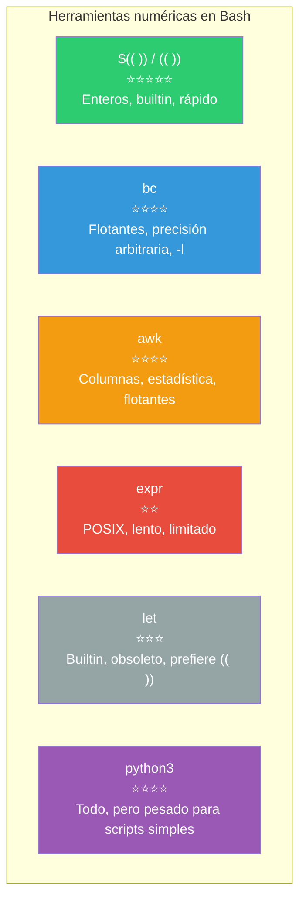

# Trabajar con numéricos

Bash maneja **enteros** de forma nativa. Para punto flotante, matemática avanzada o bases complejas, necesitas herramientas externas.

## ¿Qué herramienta usar?

```mermaid
flowchart TB
    Pregunta[📊 ¿Qué necesitas hacer con números?"] --> Entero{"¿Solo enteros?"}

    Entero -->|Sí, simple| Aritmetica["$(( expresión ))<br/>Recomendado"]
    Entero -->|Sí, asignar| Let["let expresión"]
    Entero -->|Sí, POSIX| Expr["expr expresión"]

    Entero -->|No, necesito decimales| Float{"¿Qué precisión?"}
    Float -->|"Punto flotante<br/>operaciones básicas"| BC["bc<br/>scale=N"]
    Float -->|"Matemática compleja<br/>estadística, matrices"| Awk["awk"]
    Float -->|"Cualquier cosa"| Python["python3"]

    style Pregunta fill:#3498DB,color:#fff
    style Aritmetica fill:#2ECC71,color:#fff
    style Let fill:#F39C12,color:#fff
    style Expr fill:#95A5A6,color:#fff
    style BC fill:#E74C3C,color:#fff
    style Awk fill:#9B59B6,color:#fff
    style Python fill:#1ABC9C,color:#fff
```

---

## Expresión aritmética `$(( ))` y `(( ))`

Es la forma **moderna y recomendada** para aritmética de enteros en Bash.

### `$(( ))` — Devuelve el resultado

```bash
echo $((2 + 3))          # 5
echo $((10 / 3))         # 3 (división entera)
echo $((2 ** 10))        # 1024 (potencia)

# Asignar a variable
resultado=$(( (10 + 5) * 2 ))
echo $resultado           # 30

# Con variables
x=5
y=3
echo $((x * y + 1))       # 16
```

### `(( ))` — Para condiciones y efectos secundarios

No produce salida, pero devuelve código de salida (0 = true, 1 = false).

```bash
# Evaluar condición
x=10
(( x > 5 )) && echo "x es mayor que 5"

# Incrementar
i=0
((i++))
echo $i                   # 1

# Asignación compuesta
((x += 5))                # x = x + 5
echo $x                   # 15
```

### Operaciones disponibles

```bash
echo $(( 5 + 3 ))        # 8   Suma
echo $(( 5 - 3 ))        # 2   Resta
echo $(( 5 * 3 ))        # 15  Multiplicación
echo $(( 7 / 3 ))        # 2   División entera
echo $(( 7 % 3 ))        # 1   Módulo
echo $(( 2 ** 10 ))      # 1024 Potencia
echo $(( 5 & 3 ))        # 1   AND bitwise
echo $(( 5 | 3 ))        # 7   OR bitwise
echo $(( 5 ^ 3 ))        # 6   XOR bitwise
echo $(( ~5 ))           # -6  NOT bitwise
echo $(( 5 << 1 ))       # 10  Shift izquierdo
echo $(( 5 >> 1 ))       # 2   Shift derecho
```

### Bases numéricas

```bash
echo $(( 2#1010 ))       # 10 (binario → decimal)
echo $(( 8#77 ))         # 63 (octal → decimal)
echo $(( 16#FF ))        # 255 (hexadecimal → decimal)
echo $(( 36#zz ))        # 1295 (base 36)
```

### Precedencia de operadores


---

## `expr` — Expression (POSIX)

Herramienta heredada de UNIX original. **No recomendada** para scripts modernos, pero la encontrarás en scripts muy antiguos.

### Sintaxis

```bash
expr 2 + 3               # 5 (requiere espacios entre operandos y operador)
expr 10 / 3              # 3 (división entera)
expr 7 % 3               # 1 (módulo)
expr 5 \* 3              # 15 (requiere escapar *)
```

### Limitaciones

```bash
# ❌ Espacios obligatorios
expr 2+3                # Error: 2+3 no es una operación válida

# ❌ Hay que escapar *
expr 5 * 3              # Error (expande glob)
expr 5 \* 3             # ✅ 15

# ❌ Sin potencia, sin bitwise, sin lógica

# ❌ Sintaxis verbosa e inconsistente
x=5
y=3
resultado=$(expr $x + $y)  # 8
echo $resultado
```

### Comparativa

| Operación | `$(( ))` | `expr` |
|-----------|----------|--------|
| Suma | `$((2 + 3))` | `expr 2 + 3` |
| Multiplicación | `$((5 * 3))` | `expr 5 \* 3` |
| Variable | `$((x + y))` | `$(expr $x + $y)` |
| Velocidad | Rápido (builtin) | Lento (proceso externo) |
| Potencia `**` | ✅ Sí | ❌ No |
| Bitwise | ✅ Sí | ❌ No |

---

## `bc` — Basic Calculator

Calculadora de precisión arbitraria. Soporta punto flotante, bases, funciones matemáticas.

### Uso básico

```bash
# Operación simple
echo "10 / 3" | bc              # 3 (entero por defecto)

# Con escala decimal
echo "scale=2; 10 / 3" | bc     # 3.33
echo "scale=4; 10 / 3" | bc     # 3.3333

# Con here string
bc <<< "scale=2; 10 / 3"        # 3.33

# Con here document
bc << CALC
scale=4
(10 + 5) * 2
sqrt(144)
quit
CALC
```

### Operaciones con bc

```bash
# Aritmética básica
bc <<< "scale=2; (10.5 + 3.7) * 2"     # 28.40

# Potencia
bc <<< "2 ^ 10"                         # 1024

# Raíz cuadrada
bc <<< "scale=4; sqrt(2)"               # 1.4142

# Seno, coseno, logaritmo (con -l)
bc -l <<< "s(3.14159 / 2)"              # 1.0000 (seno)
bc -l <<< "c(0)"                        # 1.0000 (coseno)
bc -l <<< "l(100)"                      # 4.6051 (log natural)
bc -l <<< "e(1)"                        # 2.7182 (exponencial)
```

### Cambio de bases

```bash
# obase = base de salida, ibase = base de entrada
bc <<< "obase=2; 42"               # 101010 (decimal → binario)
bc <<< "obase=16; 255"             # FF (decimal → hex)
bc <<< "ibase=2; 101010"           # 42 (binario → decimal)
bc <<< "ibase=16; FF"              # 255 (hex → decimal)
bc <<< "obase=8; 42"               # 52 (decimal → octal)
```

### Variables y lógica en bc

```bash
bc << '
x = 10
y = 20
if (x > y) x else y
'
# 20 (devuelve el mayor)

# Factorial (definiendo función)
bc << '
define factorial(n) {
    if (n <= 1) return 1
    return n * factorial(n - 1)
}
factorial(5)
'
# 120
```

---

## `let` — Asignación aritmética (builtin)

`let` es un builtin de Bash para realizar operaciones aritméticas y asignar el resultado a variables. Es similar a `(( ))` pero con sintaxis de comando.

### Sintaxis

```bash
let x=2+3               # x = 5
let x++                 # x = 6
let x+=5                # x = 11
let "x = 2 + 3"         # Con comillas si hay espacios
let "x = (10 + 5) * 2"   # 30
```

### Reglas

```bash
# Sin espacios alrededor de = (sin comillas)
let x=5+3               # ✅
let x = 5 + 3           # ❌ (espacios)

# Con espacios, usar comillas
let "x = 5 + 3"         # ✅

# No necesita $ en variables
let "x = y + z"         # ✅ (y, z son variables)
```

### `let` vs `(( ))`

```bash
# Son equivalentes:
let "x = x + 1"
((x = x + 1))
((x++))
let x++

# Pero (( )) es más legible y es el estándar moderno
```

---

## `awk` — Procesamiento numérico avanzado

`awk` es un lenguaje completo que maneja punto flotante de forma nativa.

### Aritmética con awk

```bash
# Operaciones básicas
awk "BEGIN {print 10/3}"              # 3.33333
awk "BEGIN {print 10/3 + 1}"          # 4.33333

# Con formato
awk "BEGIN {printf \"%.2f\n\", 10/3}" # 3.33
awk "BEGIN {printf \"%8.2f\n\", 10/3}" #     3.33

# Variables
awk -v x=10 -v y=3 'BEGIN {print x / y}'

# Flujo desde pipe
echo "10 3" | awk '{print $1 / $2}'   # 3.33333
```

### Funciones matemáticas en awk

```bash
awk "BEGIN {print sqrt(144)}"          # 12
awk "BEGIN {print sin(3.14/2)}"        # 0.999 (seno)
awk "BEGIN {print cos(0)}"             # 1
awk "BEGIN {print log(100)}"           # 4.60517
awk "BEGIN {print exp(1)}"             # 2.71828
awk "BEGIN {print int(3.7)}"           # 3 (parte entera)
awk "BEGIN {print rand()}"             # 0.xxx (aleatorio entre 0 y 1)
```

### Procesar columnas numéricas

```bash
# Sumar columna
echo -e "10\n20\n30" | awk '{sum += $1} END {print sum}'
# 60

# Promedio
echo -e "10\n20\n30" | awk '{sum += $1; count++} END {print sum / count}'
# 20

# Mínimo, máximo
echo -e "10\n20\n5\n30" | awk 'BEGIN {min=9999; max=0}
    {if ($1 < min) min=$1; if ($1 > max) max=$1}
    END {print "Min:", min, "Max:", max}'
```

---

## Comparativa general



| Herramienta | Enteros | Flotantes | Builtin | Velocidad | Uso recomendado |
|------------|---------|-----------|---------|-----------|-----------------|
| `$(( ))` | ✅ Sí | ❌ No | ✅ Sí | ⚡ Rápida | Operaciones con enteros |
| `bc` | ✅ Sí | ✅ Sí | ❌ No | 🐢 Lento | Decimales, bases, funciones |
| `awk` | ✅ Sí | ✅ Sí | ❌ No | 🏃 Medio | Columnas, estadísticas |
| `let` | ✅ Sí | ❌ No | ✅ Sí | ⚡ Rápido | Legado, reemplazar por `(( ))` |
| `expr` | ✅ Sí | ❌ No | ❌ No | 🐢 Lento | Scripts POSIX antiguos |
| `python3` | ✅ Sí | ✅ Sí | ❌ No | 🐢 Lento | Matemática compleja |

---

## Ejemplos prácticos

### Calcular promedio de notas

```bash
#!/bin/bash
notas=(85 92 78 95 88)
suma=0

for nota in "${notas[@]}"; do
    ((suma += nota))
done

promedio=$(bc <<< "scale=2; $suma / ${#notas[@]}")
echo "Promedio: $promedio"
```

### Conversión de unidades

```bash
#!/bin/bash
read -p "Grados Celsius: " celsius
fahrenheit=$(bc <<< "scale=2; $celsius * 9 / 5 + 32")
echo "$celsius°C = $fahrenheit°F"
```

### Estadísticas rápidas con awk

```bash
#!/bin/bash
# Calcular estadísticas de una columna numérica
datos=(12 45 23 67 34 89 15)
echo "${datos[@]}" | tr ' ' '\n' | awk '
BEGIN {
    min = 9999999
    max = -9999999
}
{
    sum  += $1
    sumsq += $1 * $1
    count++
    if ($1 < min) min = $1
    if ($1 > max) max = $1
}
END {
    avg = sum / count
    printf "Count: %d\n", count
    printf "Sum:   %.2f\n", sum
    printf "Avg:   %.2f\n", avg
    printf "Min:   %.2f\n", min
    printf "Max:   %.2f\n", max
    printf "Std:   %.2f\n", sqrt(sumsq/count - avg*avg)
}'
```

### Validar que un valor sea numérico

```bash
es_numero() {
    [[ "$1" =~ ^-?[0-9]+$ ]] && return 0 || return 1
}

es_decimal() {
    [[ "$1" =~ ^-?[0-9]+(\.[0-9]+)?$ ]] && return 0 || return 1
}

read -p "Ingresa un número: " valor
if es_decimal "$valor"; then
    resultado=$(bc <<< "scale=2; $valor * 2")
    echo "El doble es: $resultado"
else
    echo "No es un número válido" >&2
    exit 1
fi
```

---

> **💡 Regla práctica**: Para el 90% de los casos (contadores, índices, sumas), usa `$(( ))`. Para el 9% (decimales, conversiones), usa `bc`. Para el 1% (estadística, procesamiento de columnas), usa `awk`. `expr` y `let` son solo para entender código legacy.

## Relacionados:
- [[entradas-salidas-script-bash]] #anterior 
- [[manipulacion-de-strings-bash]] #siguiente 