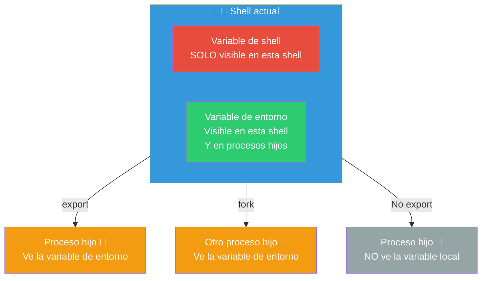
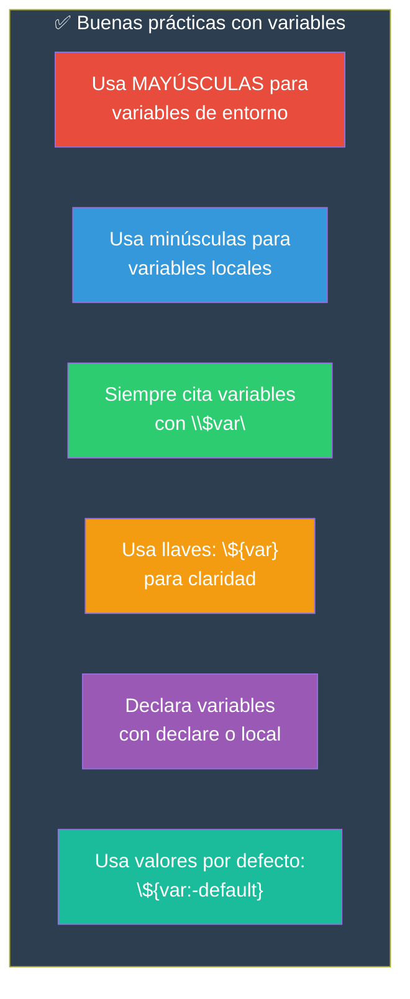

# Variables

Las variables son la base para almacenar y manipular datos en la shell. Bash tiene reglas específicas sobre cómo crearlas, usarlas y su alcance.

## Reglas básicas

```bash
# Asignación: SIN espacios alrededor del =
nombre="Ana"
edad=30
ruta="/home/usuario"

# Acceso: con $ antes del nombre
echo $nombre       # Ana
echo "$nombre"     # Ana (con comillas dobles)
echo ${nombre}     # Ana (con llaves, recomendado)
echo "$edad"       # 30

# Error común: espacios
# ❌ nombre = "Ana"   ← Esto NO es una asignación, es un comando
#    Bash interpreta "nombre" como comando con argumentos = y "Ana"
```

### Comillas: diferencias

```bash
# Comillas dobles: expanden variables
nombre="Ana"
echo "Hola, $nombre"     # Hola, Ana
echo "Hoy es $(date)"    # Hoy es Sat May 30...

# Comillas simples: literales (no expanden)
echo 'Hola, $nombre'     # Hola, $nombre
echo 'Hoy es $(date)'    # Hoy es $(date)

# Sin comillas: expande pero con riesgo
echo $nombre             # Funciona, pero puede romperse con espacios
```

---

## Entorno vs Shell Vars



### Variable de shell (local)

Solo existe en la shell actual. No la heredan los procesos hijos.

```bash
# Crear variable de shell (local)
NOMBRE="Ana"
echo $NOMBRE           # Ana — visible aquí

# Ejecutar un script que intente usarla
bash -c 'echo $NOMBRE' # (vacío) — el hijo NO la ve
```

### Variable de entorno

La heredan todos los procesos hijos. Se crea con `export`.

```bash
# Crear variable de entorno
export NOMBRE="Ana"
# o en dos pasos:
NOMBRE="Ana"
export NOMBRE

# Ahora los hijos la ven
bash -c 'echo $NOMBRE' # Ana — el hijo SÍ la ve
```

### Ver todas las variables

```bash
set           # Todas las variables (shell + entorno)
env           # Solo variables de entorno
export -p     # Solo variables exportadas
printenv      # Solo variables de entorno (como env)
echo $HOME    # Una variable específica
```

### Eliminar variables

```bash
unset NOMBRE         # Elimina la variable
unset -v NOMBRE      # Elimina variable (verbose)
unset -f MI_FUNCION  # Elimina una función
```

---

## Ámbito de Variables

### Global vs Local

```bash
# Global (por defecto)
MI_VAR="global"

mi_funcion() {
    # Local: solo existe dentro de la función
    local MI_VAR="local"
    echo "Dentro: $MI_VAR"    # local
}

mi_funcion
echo "Fuera: $MI_VAR"          # global
```

### Subshells

Un subshell es un proceso hijo creado implícitamente. Las variables no persisten:

```bash
VAR="original"

# Entre paréntesis: crea un subshell
(
    VAR="modificada"
    echo "Dentro del subshell: $VAR"   # modificada
)

echo "Fuera del subshell: $VAR"        # original

# Lo mismo pasa en pipes:
VAR="original"
echo "hola" | while read -r linea; do
    VAR="modificada"
done
echo $VAR   # original — el while está en un subshell
```

### Exportación en un solo comando

```bash
# Exportar solo para un comando
VAR="valor" ./script.sh   # script.sh ve VAR como variable de entorno

# Pero fuera del comando:
echo $VAR                  # (vacío) — no persiste
```

---

## Variables especiales

Bash tiene variables predefinidas que contienen información sobre la shell y el script.

```bash
# === Posicionales ===
$0        # Nombre del script/programa
$1, $2... # Argumentos posicionales
$#        # Número de argumentos
$@        # Todos los argumentos (array)
$*        # Todos los argumentos (string)

# === Estado y proceso ===
$?        # Código de salida del último comando
$$        # PID de la shell actual
$!        # PID del último proceso en segundo plano
$-        # Opciones activas de la shell
$_        # Último argumento del último comando

# === Shell ===
$BASH       # Ruta de bash (/usr/bin/bash)
$BASH_VERSION   # Versión de Bash
$BASH_SOURCE    # Ruta del script actual
$LINENO     # Línea actual en el script
$FUNCNAME   # Nombre de la función actual
$BASHPID    # PID del proceso Bash actual
```

```bash
# Ejemplo de uso
echo "Script: $0"
echo "Argumentos: $#"
echo "PID: $$"
ls /noexiste 2>/dev/null
echo "Exit code: $?"    # 1 (porque falló)
echo "Último argumento: $_"   # /noexiste
```

### `$@` vs `$*`

```bash
# Diferencia crucial con comillas:

# script.sh
echo "Con \$@:"
for arg in "$@"; do
    echo "  [$arg]"
done

echo "Con \$*:"
for arg in "$*"; do
    echo "  [$arg]"
done
```

```bash
$ ./script.sh "hola mundo" foo bar
# Con $@:
#   [hola mundo]    ← "hola mundo" se preserva como un argumento
#   [foo]
#   [bar]
#
# Con $*:
#   [hola mundo foo bar]  ← todo es un solo string
```

---

## Variables de entorno del sistema

```bash
# Sistema
HOME         # /home/usuario — directorio personal
USER         # nombre del usuario actual
SHELL        # ruta de la shell (/bin/bash)
PWD          # directorio actual de trabajo
OLDPWD       # directorio anterior
PATH         # directorios donde buscar ejecutables
HOSTNAME     # nombre del host

# Configuración regional
LANG         # idioma/encoding (es_CL.UTF-8)
LC_ALL       # sobreescribe toda la configuración locale

# Terminal
TERM         # tipo de terminal (xterm-256color, linux)
DISPLAY      # display de X (para apps gráficas)
COLUMNS      # ancho de la terminal en caracteres
LINES        # alto de la terminal en líneas

# Editor y visualización
EDITOR       # editor por defecto (nano, vim)
VISUAL       # editor visual
PAGER        # paginador (less, more)

# Procesos
PS1          # prompt principal
PS2          # prompt secundario (continuación de línea)
PS4          # prompt de debug (con set -x)

# Historial
HISTSIZE     # comandos en memoria
HISTFILE     # archivo de historial (~/.bash_history)
HISTFILESIZE # líneas máximas en el archivo
```

### Modificar PATH

```bash
# Añadir al final
export PATH="$PATH:$HOME/bin"

# Añadir al inicio (prioridad)
export PATH="$HOME/bin:$PATH"

# Eliminar una ruta (no hay comando, hay que reconstruir)
export PATH=$(echo "$PATH" | tr ':' '\n' | grep -v "/ruta/no/querida" | tr '\n' ':')
```

---

## Expansión y manipulación de variables

### Valores por defecto

```bash
${var:-default}      # Si var no está definida o vacía, usa "default"
${var-default}       # Si var no está definida, usa "default"
${var:=default}      # Si var no está definida, asígna "default" y la usa
${var:?mensaje}      # Si var no está definida, muestra "mensaje" y sale
${var:+alternativo}  # Si var está definida, usa "alternativo"
```

```bash
# Ejemplos
echo "${NOMBRE:-Invitado}"       # "Invitado" si NOMBRE no está definido
: "${MI_VAR:=default}"           # Asigna "default" a MI_VAR si no existe
echo "${MI_VAR:?Variable requerida}"   # Sale con error si no existe
echo "${MI_VAR:+existe}"         # "existe" si MI_VAR está definida
```

### Substring y longitud

```bash
texto="Hola Mundo"
echo "${#texto}"           # 10 (longitud)
echo "${texto:0:4}"        # "Hola" (posición 0, 4 caracteres)
echo "${texto:5}"          # "Mundo" (desde posición 5 hasta el final)
echo "${texto: -5}"        # "Mundo" (últimos 5 caracteres)
```

### Reemplazo en variables

```bash
archivo="foto.jpg"
echo "${archivo%.jpg}"      # "foto" (elimina sufijo .jpg)
echo "${archivo%.*}"        # "foto" (elimina extensión más corta)
echo "${archivo%%.*}"       # "foto" (elimina extensión más larga)
echo "${archivo#foto}"      # ".jpg" (elimina prefijo "foto")
echo "${archivo#*.}"        # "jpg" (elimina prefijo hasta .)
echo "${archivo##*.}"       # "jpg" (elimina prefijo hasta la última .)

# Reemplazar
texto="Hola Mundo Hola"
echo "${texto/Hola/Adios}"       # "Adios Mundo Hola" (primera ocurrencia)
echo "${texto//Hola/Adios}"      # "Adios Mundo Adios" (todas)
echo "${texto/#Hola/Adios}"      # "Adios Mundo Hola" (inicio)
echo "${texto/%Hola/Adios}"      # "Hola Mundo Adios" (final)
```

### Mayúsculas/minúsculas (Bash 4+)

```bash
texto="hola mundo"
echo "${texto^}"        # "Hola mundo" (primera letra mayúscula)
echo "${texto^^}"       # "HOLA MUNDO" (todo mayúsculas)
echo "${texto,}"        # "hola mundo" (primera letra minúscula, ya lo está)
echo "${texto,,}"       # "hola mundo" (todo minúsculas)

nombre="ANA"
echo "${nombre^}"       # "ANA" (ya es mayúscula)
echo "${nombre,,}"      # "ana"
```

---

## Declaración con atributos

```bash
declare -i NUM=10       # Entero (operaciones aritméticas)
declare -r PI=3.1416    # Readonly (constante)
declare -l MIN="HOLA"   # Se almacena en minúsculas: "hola"
declare -u MAY="hola"   # Se almacena en mayúsculas: "HOLA"
declare -a ARRAY        # Array indexado
declare -A DICT         # Array asociativo (Bash 4+)
declare -x VAR="valor"  # Exportada (como export)
declare -f              # Lista funciones definidas
```

```bash
# Ejemplos
declare -i x=5 y=10
x=x+y
echo $x    # 15 (suma aritmética, no concatenación)

declare -r CONFIG_FILE="/etc/mi-app/config"
CONFIG_FILE="/otra/ruta"   # Error: readonly variable

declare -l minusculas="HOLA MUNDO"
echo $minusculas    # "hola mundo"
```

---

## Arrays

```bash
# Crear
frutas=("manzana" "pera" "uva")
numeros=({1..5})
mix=("texto" 42 "$HOME" $(date))

# Acceder
echo "${frutas[0]}"      # manzana
echo "${frutas[-1]}"     # uva (último elemento)
echo "${frutas[@]}"      # todos los elementos
echo "${#frutas[@]}"     # longitud: 3
echo "${!frutas[@]}"     # índices: 0 1 2

# Modificar
frutas[1]="mango"        # Cambia pera por mango
frutas+=("kiwi")         # Añade al final
unset 'frutas[0]'        # Elimina el primer elemento

# Iterar
for fruta in "${frutas[@]}"; do
    echo "$fruta"
done

# Arrays asociativos (Bash 4+)
declare -A capitales
capitales[Chile]="Santiago"
capitales[Peru]="Lima"
echo "${capitales[Chile]}"   # Santiago
echo "${!capitales[@]}"      # Chile Peru (claves)
```

---

## Buenas prácticas



### Lista de verificación

```bash
# ❌ Malas prácticas
nombre = "Ana"          # Espacios alrededor del =
echo $nombre            # Sin comillas (peligro con espacios)
export NOMBRE           # Exportar sin valor, hereda lo que sea
NOMBRE=$1               # Sin valor por defecto
${var}                  # Usar variable no inicializada (con set -u da error)

# ✅ Buenas prácticas
nombre="Ana"            # Sin espacios
echo "$nombre"          # Con comillas dobles
export NOMBRE="${NOMBRE:-default}"   # Exportar con valor por defecto
NOMBRE="${1:-default}"               # Argumento con valor por defecto
: "${var:=default}"                  # Inicializar con valor por defecto si no existe
readonly CONFIG="/etc/config"         # Constantes como readonly
local temp_var="valor"               # Variables locales en funciones
```

### Debug de variables

```bash
# Ver el valor de una variable
echo "$NOMBRE"
printf '%s\n' "$NOMBRE"     # Más fiable (muestra caracteres especiales)

# Ver tipos
declare -p NOMBRE           # declare -- NOMBRE="Ana"
declare -p PATH             # declare -x PATH="/usr/bin:..."
```

> **🎯 Resumen**: Las variables en Bash parecen simples, pero los detalles importan: las comillas dobles preservan espacios, `export` las pasa a hijos, `local` las limita a funciones, y las expansiones `${var:-}` evitan errores. Domina estos conceptos y tus scripts serán mucho más robustos.

## Relacionados:
- [[ejecucion-de-scripts-de-bash]] #anterior 
- [[tipos-de-datos-bash]] #siguiente 
- [[echo]] #related 
- [[01-variables-y-tipos-de-datos]] #related 