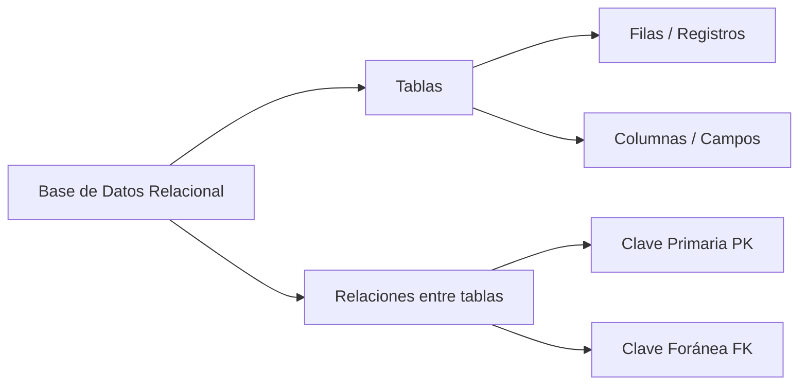
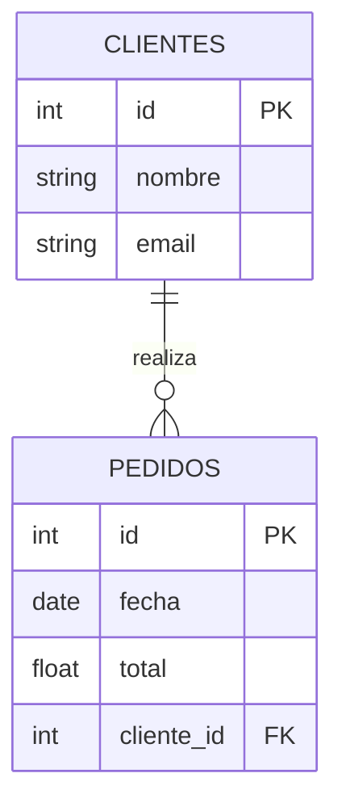
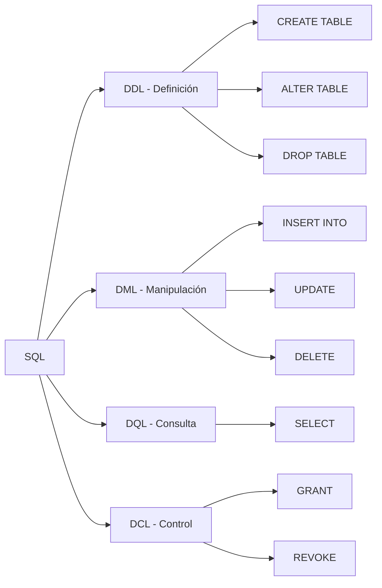
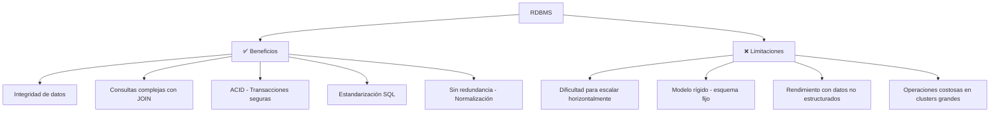
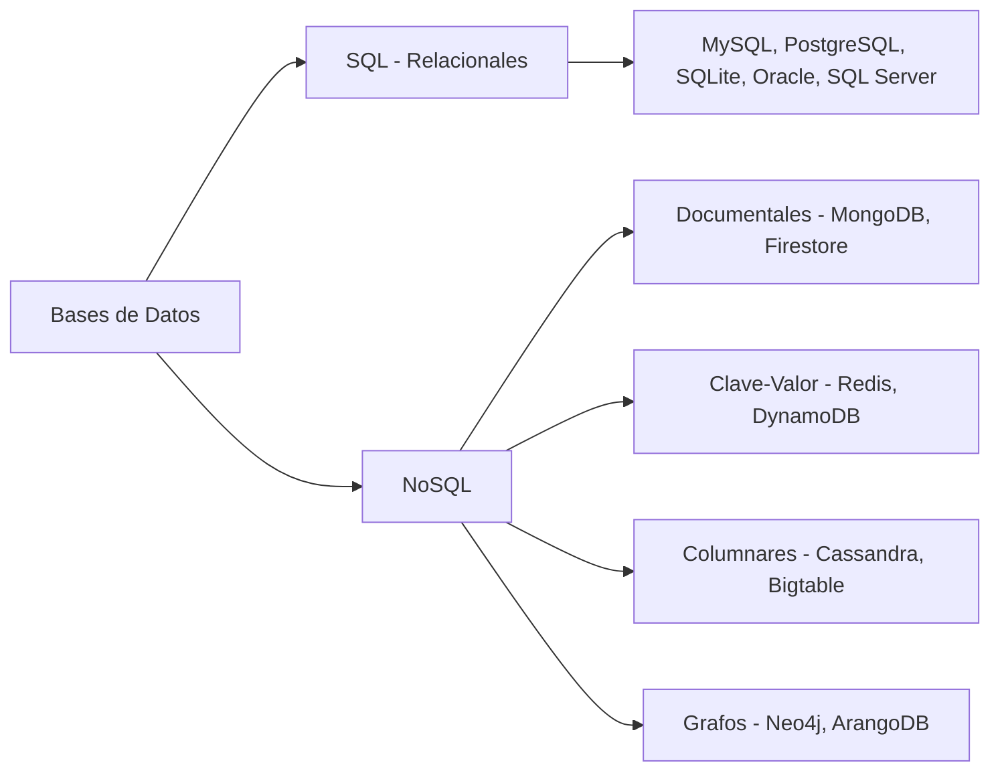
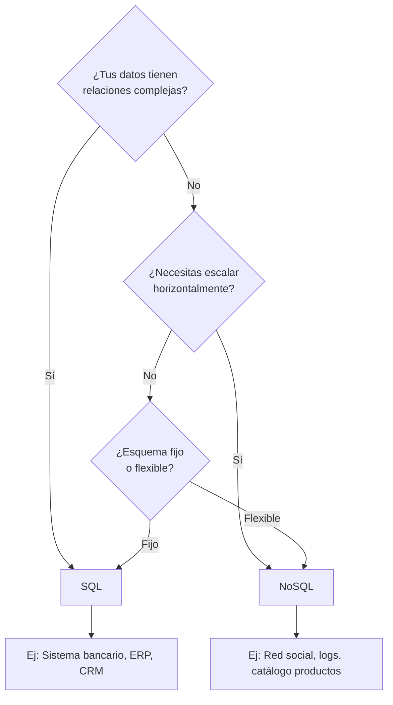
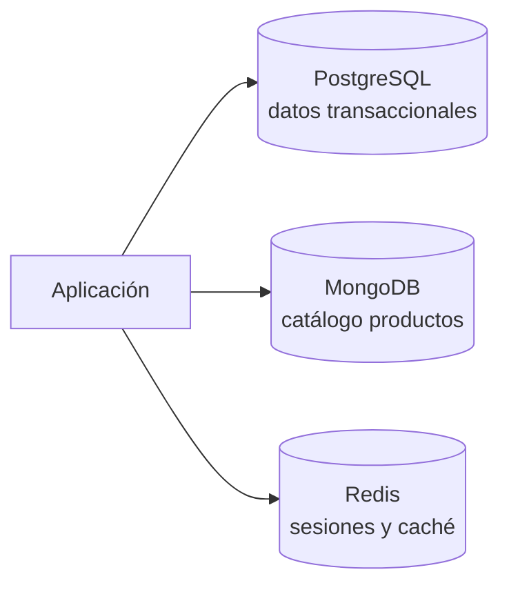
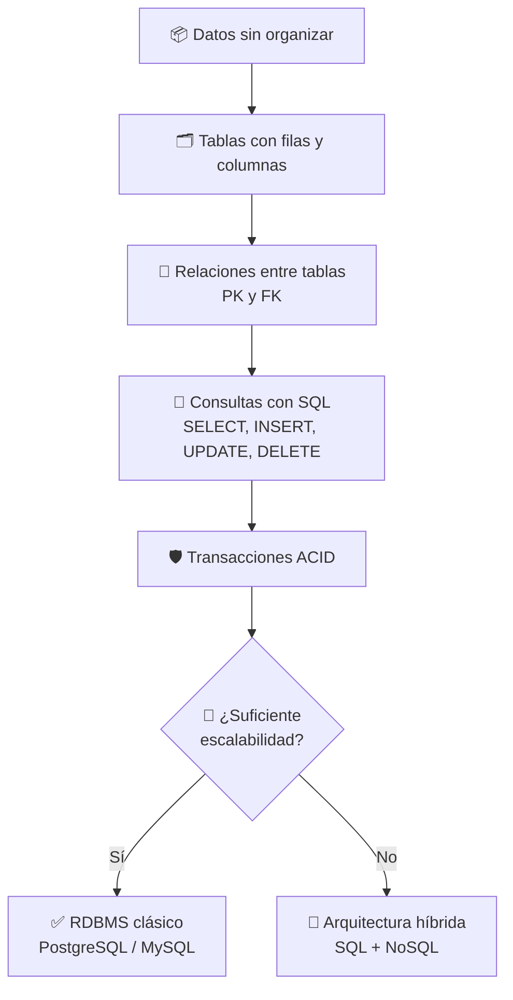

# Aprender las bases

## ¿Qué son bases de datos relacionales?

Una base de datos relacional es un tipo de base de datos que almacena y organiza los datos en **tablas** (relaciones) que se conectan entre sí mediante **claves** comunes.



### Conceptos clave

| Concepto | Definición | Ejemplo |
|---|---|---|
| **Tabla** | Colección de datos organizados en filas y columnas | `usuarios`, `pedidos` |
| **Fila / Registro** | Un elemento completo de datos | Un usuario con nombre, email, edad |
| **Columna / Campo** | Un atributo específico del dato | `nombre`, `email` |
| **Clave Primaria (PK)** | Identificador único de cada fila | `id INT PRIMARY KEY` |
| **Clave Foránea (FK)** | Campo que referencia la PK de otra tabla | `usuario_id` en `pedidos` → `id` en `usuarios` |
| **Índice** | Estructura que acelera las búsquedas | Índice sobre `email` para buscar rápido |

### Ejemplo visual de tablas relacionadas



**Lectura del diagrama:** Un cliente puede realizar **muchos** pedidos. Cada pedido pertenece a **un solo** cliente.

### Lenguaje SQL

Para trabajar con bases de datos relacionales usamos **SQL** (Structured Query Language). Sus operaciones principales son:



**Ejemplo básico:**
```sql
-- Crear tabla
CREATE TABLE clientes (
    id INT PRIMARY KEY AUTO_INCREMENT,
    nombre VARCHAR(100),
    email VARCHAR(100) UNIQUE
);

-- Insertar datos
INSERT INTO clientes (nombre, email) VALUES ('Ana', 'ana@email.com');

-- Consultar
SELECT * FROM clientes WHERE email = 'ana@email.com';
```

---

## Beneficios y limitaciones de RDBMS



### Beneficios detallados

| Beneficio | Explicación |
|---|---|
| **Integridad de datos** | Las restricciones (PK, FK, UNIQUE, CHECK) evitan datos inválidos |
| **Transacciones ACID** | Atomicidad, Consistencia, Aislamiento, Durabilidad — las operaciones se ejecutan de forma segura |
| **Sin redundancia** | La normalización elimina datos duplicados |
| **Consultas complejas** | Con JOINs puedes relacionar múltiples tablas en una sola consulta |
| **Madurez** | Tecnología con décadas de desarrollo, muy estable y documentada |

### Limitaciones detalladas

| Limitación | Explicación |
|---|---|
| **Escalabilidad horizontal** | Escalar añadiendo más servidores es complejo (vs. NoSQL que lo hace nativamente) |
| **Esquema rígido** | Cambiar la estructura de una tabla requiere migraciones (ALTER TABLE) |
| **Datos no estructurados** | JSON, documentos, imágenes no son el fuerte de las relacionales |
| **Costo en clusters** | En sistemas distribuidos grandes, mantener consistencia ACID es caro |

### Ejemplo de transacción ACID

```sql
-- Transferencia bancaria: ambas operaciones deben ocurrir o ninguna
START TRANSACTION;
UPDATE cuentas SET saldo = saldo - 100 WHERE id = 1;
UPDATE cuentas SET saldo = saldo + 100 WHERE id = 2;
COMMIT;
-- Si algo falla antes del COMMIT, hacemos ROLLBACK y nada cambia
```

---

## Bases de datos SQL vs NoSQL



### Comparativa directa

| Característica | SQL | NoSQL |
|---|---|---|
| **Modelo de datos** | Tablas, filas, columnas | Documentos, clave-valor, grafos, columnas |
| **Esquema** | Fijo (definido al crear la tabla) | Flexible (cada documento puede tener distintos campos) |
| **Escalabilidad** | Vertical (más potencia en un servidor) | Horizontal (más servidores) |
| **Transacciones** | ACID (fuerte consistencia) | BASE (disponibilidad y tolerancia partición) |
| **Consultas** | SQL potente con JOINs, subconsultas | Limitadas al modelo específico |
| **Casos de uso** | Finanzas, ERP, sistemas contables, apps tradicionales | Big data, redes sociales, IoT, tiempo real |
| **Ejemplos** | PostgreSQL, MySQL, Oracle | MongoDB, Redis, Cassandra, Neo4j |

### ¿Cuándo elegir cada uno?



### Ejemplo práctico: mismo dato en SQL vs NoSQL

**En SQL (PostgreSQL):**
```sql
CREATE TABLE usuarios (
    id SERIAL PRIMARY KEY,
    nombre VARCHAR(100),
    email VARCHAR(200),
    direccion VARCHAR(300),
    created_at TIMESTAMP DEFAULT NOW()
);

INSERT INTO usuarios (nombre, email, direccion)
VALUES ('Carlos', 'carlos@email.com', 'Calle 123');
```

**En NoSQL (MongoDB):**
```javascript
db.usuarios.insertOne({
    nombre: "Carlos",
    email: "carlos@email.com",
    direccion: "Calle 123",
    created_at: new Date(),
    // Podemos añadir campos distintos en cada documento
    telefono: "555-1234"  // Esto no afecta a otros documentos
});
```

### El mito de "SQL vs NoSQL" — convivencia

Hoy en día es común usar **ambos** en una misma aplicación (arquitectura **políglota**):



Cada tecnología se usa para lo que mejor sabe hacer.

---

## Resumen visual del viaje



## Recursos para practicar

- [SQLite Tutorial](https://www.sqlitetutorial.net/) — Base de datos ligera para practicar localmente
- [DB Fiddle](https://www.db-fiddle.com/) — Prueba SQL online sin instalar nada
- [PostgreSQL Exercises](https://pgexercises.com/) — Ejercicios prácticos de SQL

## Relacionados:
- [[sintaxis-basica-sql]] #siguiente 